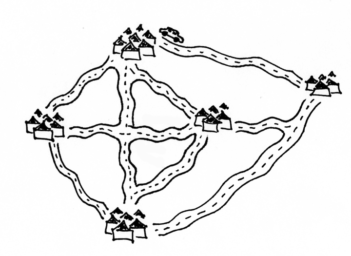
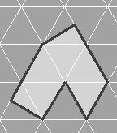

=======================================================
Intuityvios algoritmo bei algoritmo sudėtingumo sąvokos
=======================================================

Algoritmas
==========

  | *Languages come and go, but algorithms stand the test of time.*
  | *Programavimo kalbos atsiranda ir išnyksta, bet algoritmai išlieka ilgam.*
  | Donaldas Knutas (Donald Knuth)

Algoritmo sąvoka atsirado daugiau kaip prieš tūkstantį metų, o pats
žodis kilo iš IX a. persų matematiko Mohamedo ibn Musos al Chorezmio
(*Al-Khwarizmi*) vardo. **Algoritmu sutarta vadinti seką elementarių
veiksmų, pradinius duomenis paverčiančių rezultatais.** Algoritmas
yra teisingas, jei su visais pradiniais duomenimis baigia darbą ir
gaunami teisingi rezultatai.

Koks algoritmas yra geras? Į šį klausimą puikiai atsakyta jau klasika
tapusioje knygoje „Įvadas į algoritmus“ [CLR90]_:

  *Geras algoritmas – kaip aštrus peilis – atlieka tiksliai tai,
  ką turi atlikti, su minimaliomis pastangomis. Netinkamo algoritmo
  naudojimas problemai spręsti primena bandymą perpjauti kepsnį
  atsuktuvu: anksčiau ar vėliau gali pavykti pasiekti patenkinamą
  rezultatą, tačiau teks išnaudoti daug daugiau pastangų negu
  būtina, ir pats rezultatas nekels estetinio pasigėrėjimo.*

Geras algoritmas turi būti teisingas ir efektyvus laiko ir atminties
požiūriu. Jis taip pat turi būti lengvai realizuojamas, t. y.
užrašomas realia programavimo kalba. Dažniausiai visų tikslų
pasiekti nepavyksta ir tenka nusileisti iki kompromiso. Mokslininkai
teoretikai linkę skirti dėmesį teisingumui ir efektyvumui, nes jie
retai patys programuoja savo algoritmus. Tuo tarpu industrija renkasi
vadinamąjį *greitą ir purviną* (angl. *Quick and Dirty*) darbo
principą: bet kokia programa, kuri pateikia priimtinus rezultatus ir
pernelyg nesulėtina darbo, yra tinkama, nepaisant to, kad gali būti ir
geresnis algoritmas.

Atskirai paminėsime euristinius algoritmus. Ne visiems uždaviniams
spręsti sugalvoti efektyvūs algoritmai, o teisingi, bet neefektyvūs
algoritmai praktiškai nepritaikomi, nes jų vykdymas užtruktų per ilgai,
pavyzdžiui, kelis šimtmečius. Jei uždavinį vis dėlto reikia spręsti,
galvojami spartūs algoritmai, kurie nebūtinai suranda tikslų sprendinį,
tačiau rastasis sprendinys *dažniausiai* yra *artimas* ieškomajam. Tokie
optimizmu grįsti algoritmai vadinami **euristiniais algoritmais** arba
tiesiog **euristikomis**.

Iš tiesų skyrelio pradžioje pateiktas algoritmo apibrėžimas tėra
intuityvi ir matematiškai netiksli algoritmo
sąvoka [#f1]_. Tačiau mums jos pakaks.

Algoritmo sudėtingumas
======================

Kaip jau minėjome, yra uždavinių, kurių kompiuteris negali išspręsti per
priimtiną laiką, ir būtų neišmintinga viltis, kad kompiuteriai gali
greitai atlikti *bet kokius* skaičiavimus. Todėl svarbu mokėti įvertinti
**algoritmo sudėtingumą**, t. y. nustatyti, kiek laiko ir atminties
išteklių prireiks algoritmo vykdymui.

Kas gi yra spartus algoritmas? Kuo didesnis pradinių duomenų kiekis
(arba dydis), tuo ilgiau veikia programos, apdorojančios šiuos duomenis.
Taigi algoritmas yra spartus, jei ganėtinai greitai apdoroja *didelius
duomenų kiekius*. Negalime sakyti, kad vienas rikiavimo algoritmas
spartesnis už kitą, jei pirmasis 10 skaičių išrikiavo greičiau nei
antrasis. Kas kita, jei tenka rikiuoti labai daug skaičių. Apskritai
konkretūs laiko įverčiai dažniausiai neteikia naudos, kadangi priklauso
nuo daugybės veiksnių – techninių kompiuterio parametrų, algoritmo
realizacijos, kompiliatoriaus nustatymų ir pan.

Daug svarbiau žinoti, kaip algoritmo vykdymui reikalingi laiko ir
atminties ištekliai priklauso nuo pradinių duomenų kiekio. Žinodami, kad
rikiavimo algoritmo atliekamų veiksmų skaičius didėja proporcingai
rikiuojamos sekos ilgio kvadratui, galėsime nuspręsti, ar toks
efektyvumas priimtinas.

Algoritmo sudėtingumas **laiko atžvilgiu** vertinamas funkcija,
apibrėžiančia atliekamų veiksmų skaičiaus priklausomybę nuo pradinių
duomenų dydžio. Algoritmo sudėtingumas **atminties atžvilgiu**
vertinamas funkcija, apibrėžiančia reikalingos atminties kiekio
priklausomybę nuo pradinių duomenų dydžio.

Kas yra pradinių duomenų dydis? Tai priklauso nuo paties algoritmo.
Pavyzdžiui, dažnam rikiavimo algoritmui duomenų dydį apibrėžia
rikiuojamų skaičių kiekis, bet ne patys skaičiai. Tačiau yra rikiavimo
algoritmų, kurių efektyvumas priklauso ir nuo pačių rikiuojamų skaičių,
todėl šiuo atveju duomenų dydis papildomas ir maksimalia rikiuojamų
skaičių reikšme.

Kaip įvertinti algoritmo sudėtingumą
====================================

Natūralus būdas įvertinti algoritmo sudėtingumą – apskaičiuoti, kiek
elementarių veiksmų (aritmetinių operacijų, kreipimųsi į atmintį)
jis atlieka. Susitarsime, kad visi elementarūs veiksmai įvykdomi
vienodai greitai [#f2]_. Žinodami, kiek vidutiniškai elementarių
veiksmų per sekundę atlieka kompiuteris, galėsime įvertinti vykdymui
reikalingą laiką. Panagrinėkime programos fragmentą, randantį
kvadratinėje :math:`n \times n` lentelėje surašytų skaičių sumą,
ir suskaičiuokime atliekamų elementarių veiksmų skaičių.

.. tabs::

  .. tab:: Paskalis

    .. code-block:: unicode_pascal

      suma := 0;                      // atliekamas vieną kartą
      read(n);                        //            vieną kartą
      for i := 1 to n do              //            n kartų
          for j := 1 to n do begin    //            n*n kartų
              read(a);                //            n*n kartų
              suma := suma + a;       //            n*n kartų
                                      // (priskyrimas ir sumavimas)
          end;
      writeln(suma);                  // vieną kartą

  .. tab:: C++

    .. code-block:: cpp

      int suma = 0;                       // atliekamas vieną kartą
      cin >> n;                           //            vieną kartą
      for(int i = 1; i <= n; i++) {       //            n kartų
          for(int j = 1; j <= n; j++) {   //            n^2 kartų
              cin >> a;                   //            n^2 kartų
              suma += a;                  //            n^2 kartų
          }
      }
      cout << suma << endl;               //            vieną kartą

Elementarių veiksmų skaičius lygus
:math:`1 + 1 + n + n^2 + n^2 + 2n^2 + 1 = 4n^2 + n + 3`.
Jį nusako funkcija :math:`f(n) = 4n^2 + n + 3`. Tai ir yra šio
fragmento sudėtingumas laiko atžvilgiu.

Jei paimtumėte kurią nors savo programą ir pabandytumėte pakartoti
šiuos žingsnius, tikriausiai susiimtumėte už galvos! Kaip
skaičiuoti, jei programoje yra ciklas **while** ar naudojama rekursija,
jei priklausomai nuo įvairių sąlygų vieną kartą atliekami vieni, o
kitą – kiti veiksmai.

Panagrinėkime kurį nors rikiavimo algoritmą. Jei pradiniai duomenys
sudaro surikiuotą seką, tikriausiai bus atliekama mažiau veiksmų, negu
rikiuojant atsitiktinę seką. Tad atliekamų elementarių veiksmų skaičius
gali priklausyti ne tik nuo pradinių duomenų kiekio, bet ir nuo pačių
duomenų.

Dėl šių priežasčių dažnai skaičiuojama, kiek veiksmų bus atliekama
**blogiausiu atveju**, t. y. kiek *daugiausiai* elementarių veiksmų
gali tekti atlikti vykdant algoritmą.

Kiekvienos programos veikimą nusakys vis kitokia funkcija. Tiksliai
suskaičiuoti elementarių veiksmų kiekį didesnėms programoms būtų
sudėtinga. Laimei, to daryti neteks! Panagrinėkime, kaip didėjant
:math:`n` auga kiekvienas iš dėmenų. Kai :math:`n = 1`, dėmenys
lygūs :math:`4`, :math:`1` ir :math:`3`, kai :math:`n = 10`, jie
atitinkamai lygūs :math:`400`, :math:`10` ir :math:`3`, kai
:math:`n = 1000`, gauname :math:`4 000 000`, :math:`1000` ir
:math:`3`. Matome, kad didėjant :math:`n` labiausiai didėja tik
pirmasis dėmuo, o kiti dėmenys – labai nežymiai. Kadangi kiekvienas
dėmuo tiesiogiai reiškia elementarių veiksmų skaičių, du
mažesniuosius dėmenis galime atmesti. Laikas, sugaištas atlikti
:math:`1003` veiksmams, yra nereikšmingas palyginti su laiku,
reikalingu atlikti keturiems milijonams veiksmų.

Taigi, augant pradiniams duomenims :math:`(n)`, algoritmo atliekamų
elementarių veiksmų skaičius vis labiau priklausys nuo greičiausiai
augančio funkcijos dėmens, t.y. nuo :math:`4n^2`. Natūralu vietoj
funkcijos :math:`f(n) = 4n^2 + n + 3` toliau nagrinėti
paprastesnę funkciją :math:`g(n) = 4n^2`.

Tai dar ne viskas. Padidinus :math:`n` dešimt kartų, vykdymo laikas
padidės šimtąkart. Palyginus su tuo, vykdymo laiko padidėjimas
keturis kartus yra neesminis. Taigi galime atmesti konstantą prie
:math:`n^2` ir tarti, kad elementarių veiksmų skaičių pakankamai
gerai nusako dar paprastesnė funkcija :math:`h(n) = n^2`.

Mokslininkai rašytų, kad nagrinėto programos fragmento sudėtingumas yra
:math:`O(n^2)`. Mat visur, kur kalbama apie algoritmų sudėtingumą,
naudojamas *didžiosios O žymėjimas*.

Didžiosios O žymėjimas
======================

Formaliai **algoritmo sudėtingumas** apibrėžiamas taip:

Tarkime, pradinių duomenų dydis yra :math:`n`, o algoritmo atliekamų
elementarių veiksmų skaičius – :math:`g(n)`. Sakysime, jog algoritmo
sudėtingumas yra :math:`O(f(n))` (rašome :math:`g(n) = O(f(n))`),
jei egzistuoja tokie skaičiai :math:`c` ir :math:`n_0`, su kuriais visiems
:math:`n > n_0` galioja nelygybės: :math:`0 \le g(n) \le c \cdot f(n)`.

Geriau suprasti šį apibrėžimą padės :numref:`img-1-grafikai`
paveiksle pateikti funkcijų :math:`f` ir :math:`g` grafikai.

.. _img-1-grafikai:

.. figure:: images/leidinys1/1.png
  :width: 300px
  :align: center
  :alt: Funkcijų grafikas

  Funkcijų grafikai: :math:`g(n) = O(f(n))`

Šis formalus apibrėžimas reiškia, kad, augant :math:`n`, funkcija :math:`g(n)`
auga ne sparčiau nei funkcija :math:`f(n)`.

*Sutartiniu didžiosios O žymėjimu paprastai parodoma, kaip elgsis
algoritmas didėjant pradiniams duomenims, t. y. kaip augs algoritmui
reikalingos atminties dydis arba vykdymo laikas.*

Panagrinėkime dar keletą pavyzdžių:

* :math:`3n^2 + 2n + 20 = O(n^2)`,
* :math:`n + 10000 = O(n)`,
* :math:`n + 10000 = O(n^2)` (pagal apibrėžimą teisingas teiginys,
  tačiau parankesnė praeita lygybė),
* :math:`2^n + n^{10} = O(2^n)`.

Jei algoritmo sudėtingumas nepriklauso nuo duomenų kiekio (t. y. jis
pastovus, konstantinis), tai jį žymėsime :math:`O(1)`. Pavyzdžiui, atminties,
kurią naudoja nagrinėtas programos fragmentas, dydis lygus :math:`O(1)`.

Pradinių duomenų dydį gali nusakyti ne vienas, o keli kintamieji. Tokiu
atveju didžiosios O žymėjimas aprašo sudėtingumo augimą didėjant visiems
parametrams. Pavyzdžiui, galimi tokie algoritmo sudėtingumo variantai:
:math:`O(2^n + m)`, :math:`O(L^2 \cdot W + W^2 \cdot L)`.

Nusakant algoritmų sudėtingumą dažnai teks susidurti su šiomis
funkcijomis:

* :math:`O(1)` (konstantinis),
* :math:`O(\log{n})` (logaritminis [#f3]_),
* :math:`O(\sqrt{n})` (šakninis [#f4]_),
* :math:`O(n)` (tiesinis),
* :math:`O(n \cdot \log{n})`,
* :math:`O(n^2)` (kvadratinis),
* :math:`O(n^3)` (kubinis),
* :math:`O(2^n)` (eksponentinis),
* :math:`O(n!)` (faktorialinis [#f5]_).

Kaip tai pritaikyti olimpiadoje
===============================

Olimpiadose ribojamas programų veikimo laikas ir naudojamoji atmintis.
Taigi apmąstant įvairius sprendimo būdus reikia mokėti įvertinti, ar
programa bus pakankamai efektyvi (ar suspės įveikti uždavinį su visais
pradiniais duomenimis per leistiną laiką). Tačiau kiek gi veiksmų gali
atlikti kompiuteris per, pavyzdžiui, vieną sekundę? Tai priklauso nuo
daugelio dalykų: nuo procesoriaus, kompiliatoriaus, pačių veiksmų,
kuriuos programa atlieka. Atliekamų veiksmų skaičių mums padės įvertinti
paprasta programa:

.. tabs::

  .. tab:: Paskalis

    .. code-block:: unicode_pascal

      uses windows;
      var pradžia, veiksmųSk : longint;
      begin
          veiksmųSk := 0;
          pradžia := GetTickCount;
          while GetTickCount - pradžia < 1000 do
              inc(veiksmųSk);
          writeln(veiksmųSk);
      end.

  .. tab:: C++

    .. code-block:: cpp

      #include <chrono>
      #include <iostream>
      using namespace std;

      // Gauna laiką, praėjusį nuo 1970 m. sausio 1 d. milisekundėmis
      long long dabartinisLaikas() {
          return chrono::duration_cast<chrono::milliseconds>(chrono::system_clock::now().time_since_epoch()).count();
      }

      int main() {
          int veiksmųSk = 0;
          long long pradžia = dabartinisLaikas();
          while (dabartinisLaikas() - pradžia < 1000) {
              veiksmųSk++;
          }
          cout << veiksmųSk << endl;
          return 0;
      }

Ši programa suskaičiuoja, kiek elementarių veiksmų kompiuteris gali
atlikti per vieną sekundę (suprantama, jei programą pradėjote ir baigėte
vykdyti tą pačią parą). Be abejo, matavimai nėra visiškai tikslūs,
tačiau jų pakanka įvertinti kompiuterio spartai.

Taigi tarkime, kad duomenų dydis yra :math:`n`, :math:`O(f(n))` sudėtingumo
algoritmas atlieka lygiai :math:`f(n)` elementarių veiksmų, o atlikę
pateiktą programą įvertinome, kad kompiuteris per 1 sekundę atlieka
:math:`10^9` tokių veiksmų. Sudarykime lentelę, atspindinčią, kiek laiko
trunka įvairaus sudėtingumo algoritmų vykdymas su įvairiais pradiniais
duomenimis.

+-------------------------------+------------+-------------+-------------------------+-------------------------+--------------+------------------------+-------------------------+
| :math:`n`                     | :math:`10` | :math:`20`  | :math:`30`              | :math:`100`             | :math:`1000` | :math:`10^6`           | :math:`10^9`            |
+-------------------------------+------------+-------------+-------------------------+-------------------------+--------------+------------------------+-------------------------+
| :math:`O(1)`                  | ~0         | ~0          | ~0                      | ~0                      | ~0           | ~0                     | ~0                      |
+-------------------------------+------------+-------------+-------------------------+-------------------------+--------------+------------------------+-------------------------+
| :math:`O(\log_2{n})`          | ~0         | ~0          | ~0                      | ~0                      | ~0           | ~0                     | ~0                      |
+-------------------------------+------------+-------------+-------------------------+-------------------------+--------------+------------------------+-------------------------+
| :math:`O(\sqrt{n})`           | ~0         | ~0          | ~0                      | ~0                      | ~0           | ~0                     | ~0,03 ms                |
+-------------------------------+------------+-------------+-------------------------+-------------------------+--------------+------------------------+-------------------------+
| :math:`O(n)`                  | ~0         | ~0          | ~0                      | ~0                      | ~0           | ~1 ms                  | ~1 s                    |
+-------------------------------+------------+-------------+-------------------------+-------------------------+--------------+------------------------+-------------------------+
| :math:`O(n \cdot \log_2{n})`  | ~0         | ~0          | ~0                      | ~0                      | ~0           | ~20 ms                 | ~30 s                   |
+-------------------------------+------------+-------------+-------------------------+-------------------------+--------------+------------------------+-------------------------+
| :math:`O(n^2)`                | ~0         | ~0          | ~0                      | ~0                      | ~1 ms        | ~17 min                | ~32 metai               |
+-------------------------------+------------+-------------+-------------------------+-------------------------+--------------+------------------------+-------------------------+
| :math:`O(n^3)`                | ~0         | ~0          | ~0.03 ms                | ~1 ms                   | ~1 s         | ~32 metai              | ~32 * 10\ :sup:`9` metų |
+-------------------------------+------------+-------------+-------------------------+-------------------------+--------------+------------------------+-------------------------+
| :math:`O(2^n)`                | ~0         | ~1 ms       | ~1 s                    | ~4 * 10\ :sup:`13` metų | –            | –                      | –                       |
+-------------------------------+------------+-------------+-------------------------+-------------------------+--------------+------------------------+-------------------------+
| :math:`O(n!)`                 | ~4 ms      | ~77 metai   | ~8 * 10\ :sup:`15` metų | –                       | –            | –                      | –                       |
+-------------------------------+------------+-------------+-------------------------+-------------------------+--------------+------------------------+-------------------------+

Sunku patikėti, bet tai tiesa: naivus skaičių rikiavimo algoritmas,
kuris bando visus įmanomus skaičių išdėstymo būdus (tokių yra :math:`n!`), ir
tikrina, ar gautoji skaičių seka yra didėjanti, dvidešimt skaičių
„rikiuotų“ daug metų. Toks algoritmas, žinoma, yra neefektyvus.

Efektyviais laikomi **polinominio sudėtingumo algoritmai**, t. y. tokie,
kurių sudėtingumo funkcija yra polinomas – :math:`O(n^k)`. Pirmieji
septyni lentelėje pateikti sudėtingumai yra polinominiai, taigi laikomi
efektyviais. Algoritmai, kurių sudėtingumas nepolinominis, laikomi
neefektyviais. Tokie yra eksponentinio (pavyzdžiui, :math:`O(2^n)`) ir
faktorialinio (:math:`O(n!)`) sudėtingumo algoritmai.

Šią lentelę verta įsidėmėti. Olimpiados metu, sugalvoję uždavinio
sprendimą, galime įvertinti jo sudėtingumą ir patikrinti, ar to užteks
pradiniams duomenims įveikti per leistiną laiką. Įgijus patirties,
algoritmo sudėtingumą dažnai nesunku įvertinti pažvelgus į algoritmo
struktūrą: kokie jame yra ciklai, kokie rekursiniai kreipiniai ir pan.

Dar daugiau: matydami, jog uždavinio pradiniai duomenys labai maži,
žinome, kad pakaks ir neefektyvaus algoritmo uždaviniui spręsti. Ir
atvirkščiai: jei uždavinio pradiniai duomenys yra dideli, o leistinas
programos veikimo laikas – mažas, reikia ieškoti efektyvaus būdo, kaip
spręsti šį uždavinį.

Beje, beveik visose programose 90% laiko sugaištama vykdant 10% kodo. Ir
likusių 90% kodo optimizavimas, deja, neturės didelės įtakos programos
efektyvumui. Tad prieš imantis optimizuoti kurią nors algoritmo dalį
reikia įsitikinti, ar verta tai daryti.

Uždavinys *Posekio suma*
========================

Pabandykime pritaikyti įgytas žinias spręsdami konkretų uždavinį:

  Duotas sveikasis skaičius :math:`k` bei :math:`n` neneigiamų skaičių seka
  :math:`a_1, a_2, \ldots, a_n`.

  **Užduotis.** Reikia nustatyti, ar egzistuoja tokie indeksai :math:`i`
  ir :math:`j` (:math:`1 \le i \le j \le n`), kad sekos narių nuo
  :math:`a_i` iki :math:`a_j` suma būtų lygi skaičiui :math:`k`.

  Galioja ribojimai:
  :math:`1 \le k \le 100\ 000\ 000; 1 \le n \le 100\ 000; 0 \le a_i \le 1\ 000.`

  Vykdymo laikas: 1 s.

Aptarkime kelis galimus uždavinio sprendimo būdus bei jų sudėtingumą.
Pats paprasčiausias būdas – perrinkti visas galimas indeksų :math:`i` ir
:math:`j` poras, kiekvienąkart suskaičiuojant sekos narių nuo
:math:`i`-ojo iki :math:`j`-ojo sumą:

.. tabs::

  .. tab:: Paskalis

    .. code-block:: unicode_pascal

      rasta := false;
      i := 0;
      repeat
          j := i;
          i := i + 1;
          repeat
              j := j + 1;
              suma := 0;
              for l := i to j do
                  suma := suma + a[l];  { ši operacija vykdoma daugiausiai kartų }
              rasta := (suma = k);
          until (j = n) or rasta;
      until (i = n) or rasta;

  .. tab:: C++

    C++ kodas atitinkantis Pascal:

    .. code-block:: cpp

      bool rasta = false;
      int i = -1;
      do {
          int j = i;
          i++;
          do {
              j++;
              int suma = 0;
              for (int l = i; l <= j; l++) {
                  suma += a.at(l);
              }
              rasta = (suma == k);
          } while (j < n-1 && !rasta);
      } while (i < n-1 && !rasta);

  .. tab:: Idiomatinis C++

    Labiau idiomatinis C++ kodas:

    .. code-block:: cpp

      bool rasta = false;
      int atsPr, atsPab;
      for(int i = 0; i < n && !rasta; i++) {
          for(int j = i; j < n && !rasta; j++) {
              int suma = 0;
              for(int k = i; k <= j; k++) {
                  suma += a.at(k);
              }
              if (suma == K) {
                  atsPr = i;
                  atsPab = j;
                  rasta = true;
              }
          }
      }

Jei algoritmui baigus darbą kintamojo rasta reikšmė bus lygi true, tai
:math:`i` ir :math:`j` bus ieškomi indeksai. Suskaičiavę, kiek elementarių
veiksmų blogiausiu atveju atlieka algoritmas, pamatytume, kad greičiausiai
augantis gautojo reiškinio dėmuo yra :math:`n^3/6`, taigi šio
algoritmo sudėtingumas – :math:`O(n^3)`. Tai atsispindi ir algoritmo
struktūroje: jį sudaro trys ciklai, įdėti vienas į kitą, ir kiekvieno
šių ciklų trukmė tiesiogiai priklauso nuo :math:`n`.

Tai nėra geriausias uždavinio sprendimo būdas. Pasižiūrėjus į 1.5
skyrelyje pateiktą lentelę [#f6]_, matyti, kad per leistiną laiką algoritmas
įveiktų testus, kur :math:`n \le ~1000`. Atkreipę dėmesį į tai, kad sekos nariai
yra tik neneigiami skaičiai, galime sudaryti gudresnį algoritmą.

Tegul ieškomasis indeksas :math:`i` lygus :math:`i_1` (t. y. kažkokiam
konkrečiam skaičiui). Priskyrę indeksui :math:`j` pradinę reikšmę
:math:`i_1`, jį didinsime tol, kol sekos narių nuo :math:`i` iki :math:`j` suma
taps lygi arba viršys :math:`k` (arba kol indeksas :math:`j` pasieks sekos
pabaigą). Sumos neperskaičiuosime iš naujo kiekvieną kartą, o, padidinę
indeksą :math:`j`, prie sumos tiesiog pridėsime sekos narį :math:`a_j`.

.. tabs::

  .. tab:: Paskalis

    .. code-block:: unicode_pascal

      rasta := false;
      i := 0;
      repeat
          j := i;
          i := i + 1;
          suma := 0;
          repeat
              j := j + 1;
              suma := suma + a[j];
          until (j = n) or (suma >= k);
          rasta := (suma = k);
      until (i = n) or rasta;

  .. tab:: C++

    .. code-block:: cpp

      bool rasta = false;
      int atsPr, atsPab;
      for(int i = 0; i < n && !rasta; i++) {
          int suma = 0;
          for(int j = i; j < n && !rasta; j++) {
              suma += a[j];
              if (suma == K) {
                  atsPr = i;
                  atsPab = j;
                  rasta = true;
              }
          }
      }

Šį algoritmą sudaro du ciklai, antrasis jų pirmojo viduje, ir abiejų
ilgis tiesiogiai priklauso nuo :math:`n`. Blogiausiu atveju abiejuose cikluose
bus vykdoma :math:`n` žingsnių (pavyzdžiui, jei visi sekos nariai – nuliai,
tuomet suma niekada netaps lygi arba didesnė už :math:`k`), taigi šio
algoritmo sudėtingumas yra :math:`O(n^2)`. Tai daug geresnis
algoritmas, jis gali įveikti testus, kur :math:`n \le ~30\ 000`.
Tačiau to nepakanka.

Kritiškai įvertinkime savo algoritmą. Tarkime, :math:`n = 100\ 000`,
:math:`i = 1`, :math:`j = 90\ 000`, ir *suma* :math:`< k`. Kas atsitiks, jei,
padidinus :math:`j` dar vienetu, *suma* taps didesnė už :math:`k`?
Indeksas :math:`i` bus padidintas vienetu, :math:`j` priskirta :math:`i`
reikšmė ir iš naujo skaičiuojamos sumos.  Tačiau jei sekos narių nuo :math:`1`
iki :math:`90\ 000` suma buvo mažesnė už :math:`k`, tai tuo labiau tokia bus ir
narių nuo :math:`2` iki :math:`90\ 000` suma. Šio (milžiniško) intervalo būtų
galima netikrinti!

Tai apibendrinę, galime sudaryti dar geresnį algoritmą. Priskirkime
indeksams reikšmes :math:`i = j = 1`, o sumai reikšmę :math:`a_1`. Tai
bus pradinis intervalas. Veiksmus kartosime, kol *suma* nelygi :math:`k` ir
:math:`j` mažesnis už :math:`n`. Kiekvienu žingsniu vykdysime vieną iš šių
veiksmų: jei *suma* mažesnė už :math:`k`, intervalą praplėsime – padidinsime
indeksą :math:`j` ir prie sumos pridėsime :math:`a_j`; jei *suma* didesnė
už :math:`k` (tai tokia ji tapo po paskutinio žingsnio), intervalą siaurinsime
– iš sumos atimsime :math:`a_i` ir padidinsime indekso :math:`i` reikšmę.
Jei po kurio nors žingsnio *suma* taps lygi :math:`k`, algoritmas iškart
nutrauks darbą.

.. tabs::

  .. tab:: Paskalis

    .. code-block:: unicode_pascal

      suma := a[1];
      i := 1;
      j := 1;
      while (suma <> k) and (j < n) do
          if suma < k then begin
              j := j + 1;
              suma := suma + a[j];
          end else begin
              suma := suma - a[i];
              i := i + 1;
          end;
      rasta := (suma = k);

  .. tab:: C++

    .. code-block:: cpp

      int suma = a[0];
      int i = 0, j = 0;
      while (suma != K && j < n) {
          if (suma < K) {
              j++;
              if (j < n) {
                  suma += a[j];
              }
          }
          else if (suma > K) {
              suma -= a[i];
              i++;
          }
      }
      bool rasta = suma == K;

Kadangi vienu žingsniu padidinamas tik vienas iš indeksų ir kiekvienas
iš indeksų gali būti padidintas ne daugiau kaip :math:`n` kartų, daugių
daugiausia gali tekti įvykdyti :math:`2n` žingsnių. Algoritmo sudėtingumas
yra :math:`O(n)`, taigi jo visiškai pakaks uždaviniui įveikti ir kai
:math:`n = 100\ 000`.

Aptarėme kelis uždavinio *Posekio suma* sprendimus ir skirtingą jų
efektyvumą. Atsiminkime, jog geras algoritmas atlieka tik tai, kas
būtina. Ieškodami, kaip galime pagerinti algoritmą, galvokime, kokius
nereikalingus arba pakartotinius veiksmus jis atlieka.

.. _skyrelis-np-sudėtingumas:

NP sudėtingumas
===============

Skaitydami knygas apie algoritmus ir uždavinių sprendimus, ne kartą
sutiksite mistiškai skambančią frazę **uždavinys yra NP pilnas**.

Uždavinys priklauso **NP** (*nondeterministic polynomial time*)
**sudėtingumo klasei**, jei, žinodami šio uždavinio sprendinį, per
polinominį laiką galime patikrinti, ar sprendinys teisingas. NP uždavinį
galima išspręsti perrinkimu per eksponentinį laiką generuojant visus
galimus sprendinius, ir kiekvieną sprendinį patikrinant per polinominį
laiką.

NP klasei priklauso daug labai gerai žinomų ir plačiai nagrinėtų
kombinatorinių optimizavimo uždavinių. Vieni jų yra paprastesni
(išsprendžiami per polinominį laiką), kitiems, sudėtingesniems,
uždaviniams, žinomi tik perrenkantys visus sprendinius algoritmai.

**NP pilnas** uždavinys yra toks uždavinys, kuris yra ne lengvesnis už
visus kitus NP uždavinius. Taigi frazę „uždavinys yra NP pilnas“
„išvertus“ į suprantamesnę kalbą, reikštų: niekam iki šiol nepavyko
rasti efektyvaus uždavinį sprendžiančio algoritmo; *tikėtina*,
kad toks algoritmas apskritai neegzistuoja.

Nepaisant sudėtingumo, šie uždaviniai gali turėti labai paprastą
formuluotę, pavyzdžiui, tokią. *Žinomi atstumai tarp N miestų; pirklys nori
pradėti savo kelionę viename iš jų, apsilankyti kiekviename mieste tik po vieną
kartą ir sugrįžti į pradinį miestą; užduotis – iš visų tokių maršrutų surasti
trumpiausią.*

  Keliaujančio pirklio uždavinys

Šis uždavinys dar yra vadinamas *Keliaujančio pirklio uždaviniu*, o
ieškomasis kelias – *optimaliu Hamiltono ciklu*.

Neįtikėtina, bet iki šiol niekas nesurado tikslaus ir efektyvaus
algoritmo, sprendžiančio šį uždavinį. Vienintelis žinomas būdas rasti
optimalų sprendinį bendru atveju – perrinkti visus įmanomus maršrutus
:math:`O(n!)` sudėtingumo (t.y. labai neefektyviu) algoritmu.

Ką gi daryti, jei olimpiadoje tenka spręsti uždavinį, kuris, jūsų
žiniomis, yra NP pilnas? Tikrai neverta pulti į paniką. Svarbiausia, kad
jūs tai jau žinote! Nereikia ieškoti tikslaus ir efektyvaus uždavinį
sprendžiančio algoritmo manant, kad kiti jau tokį surado, o nesiseka tik
jums. Verčiau skirkite savo laiką ir energiją kurti euristiniam
algoritmui, kuris bendru atveju pateiktų kuo geresnius rezultatus
(pavyzdžiui, kuo trumpesnius maršrutus), arba, jei pradiniai duomenys
tikrai labai maži, – spręsti uždavinį perrinkimu.

*Amžinybės* dėlionė
===================

  Amžinybės dėlionės daugiakampio pavyzdys

Kristoferis Montonas (*Christopher Monton*) sukūrė geometrinę dėlionę,
kurią pavadino *Amžinybės dėlione* (angl. *Eternity puzzle*). Ji buvo
sudaryta iš 209 įvairios formos netaisyklingų daugiakampių, iš kurių
reikėjo sudėti dvylikakampį. Dauguma daugiakampių buvo skirtingi, o juos
visaip sukiojant buvo galima pasiekti labai daug pozicijų (t.y. iš
dalies daugiakampių sudėliotų geometrinių figūrų), kurios nenuvesdavo
prie sprendinio.

K. Montonas užsakė pagaminti šią dėlionę, ir 1999 metų liepą ji atsidūrė
parduotuvių lentynose. Jis taip pat pažadėjo, kad sumokės milijoną svarų
tam, kuris pirmasis sudės šią dėlionę iki 2000 metų rugsėjo. Kilo
visuotinis susidomėjimas dėlione, prekyba vyko labai sėkmingai: netgi
Grenlandijoje buvo parduodami rekordiniai kiekiai dėlionių. Žmonės
pirko, bandė sudėlioti dėlionę ir laimėti milijoną.

Prieš pažadėdamas milijoną, K. Montonas be abejo, konsultavosi su
matematikais, ir šie užtikrino, kad uždavinio neįmanoma išspręsti per
duotą laiką net ir su kompiuterio pagalba, nes tai NP pilnas uždavinys.
Vieni ekspertai spėjo, kad geriausiu atveju uždavinio sprendimas užtruks
apie ketverius metus. Kiti mokslininkai netgi teigė, kad uždavinio
sprendimas užtruks ilgiau nei gyvuos Visata. Nors visada lieka
atsitiktinio sudėliojimo tikimybė, buvo apskaičiuota, kad tikimybė vienu
bandymu atsitiktinai sudėlioti šią dėlionę yra :math:`1` iš :math:`10^{500}`
(palyginimui: tikimybė išlošti Didžiosios Britanijos nacionalinėje
loterijoje yra :math:`1` iš :math:`14 \cdot 10^6`).

K. Montonas buvo tikras, kad jo milijonas yra saugus. Už pinigus, gautus
pardavus dėliones, jis tikėjosi suremontuoti jam priklausiusį
1825 metais pastatytą dvarą, turintį 67 kambarius ir 200 akrų žemės.

Tačiau du Kembridžo matematikai A. Serbis (*Alex Serby*) ir O. Riordanas
(*Oliver Riordan*) sugebėjo sudėti dėlionę iki nurodytos datos. Jie
pastebėjo, kad sudėlioti dėlionę iki tokios būsenos, kai likę
daugiakampiai nebetelpa, yra gana paprasta. Tolesnė sėkmė priklauso nuo
nepanaudotų daugiakampių rinkinio – kuo parankesnių formų jie yra ir kuo
daugiau įvairios formos daugiakampių galima iš jų sudėti, tuo šis
rinkinys parankesnis tolimesniems bandymams. Tokiu būdu jie atrinko
„blogus“ gabalėlius ir optimizuotoje perrinkimo programoje stengėsi juos
padėti pirmiausia. Ši strategija pasitvirtino ir keletas jų asmeninių
kompiuterių per porą savaičių surado sprendinį. K. Montonui teko
parduoti savo dvarą ir išmokėti milijoną...

.. rubric:: Išnašos

.. [#f1]
  Tikslios algoritmo sąvokos prireikė matematikams, panorusiems
  įrodyti, kad nėra algoritmo, sprendžiančio duotąjį uždavinį.
  20-ajame amžiuje daug matematikų ieškojo būdo tiksliai apibrėžti
  algoritmo sąvoką. Galima sakyti, jog jiems pavyko. 1936 m.
  amerikiečių matematikas A. Čerčas (A. Church) paskelbė tezę,
  teigiančią, jog jo apibrėžta dalinių rekursyviųjų funkcijų
  (DRF) klasė sutampa su algoritmiškai apskaičiuojamų funkcijų
  klase. Tačiau tezės įrodyti negalima, kadangi neįmanoma palyginti
  matematiškai tikslios ir intuityviai suprantamos funkcijų klasių.
  Kita vertus, niekam nepavyko rasti algoritmo (intuityviąja prasme),
  kurio nebūtų galima realizuoti kaip DRF, o visos DRF
  apskaičiuojamos algoritmais intuityviąja prasme, todėl Čerčo
  tezė visuotinai laikoma teisinga.

.. [#f2]
  Toks modelis kartais kritikuojamas, nes vieni elementarūs veiksmai
  įvykdomi greičiau negu kiti. Pavyzdžiui, skaičių perskaityti iš
  failo trunka ilgiau nei tą patį skaičių perskaityti iš
  operatyviosios atminties. Kelių knygų apie algoritmus autorius
  prof. S. Skienna drąsiai atremia tokią kritiką: *Visi žinome,
  kad žemė yra apvali, tačiau statydami namą laikome ją plokščia
  ir toks modelis mums puikiausiai tinka. Tas pats galioja ir šiuo
  atveju.* [S98]_

.. [#f3]
  Logaritmas yra funkcija, atvirkščia kėlimui laipsniu.
  :math:`\log_a{b} (a, b > 0; a \ne 1`; :math:`a` vadinamas
  logaritmo pagrindu) atsako į klausimą: kokiu laipsniu reikia pakelti
  :math:`a`, kad gautume :math:`b`? Pavyzdžiui, :math:`\log_2{8} = 3`,
  :math:`\log_5{625} = 4, \log_2{32768} = 15`. Logaritmas – vienodai
  lėtai auganti funkcija, nesvarbu koks logaritmo pagrindas. Taigi
  logaritminis algoritmo sudėtingumas yra labai palankus.
  Didžiosios O žymėjime logaritmo pagrindas dažnai nerašomas.

.. [#f4]
  Kvadratinė šaknis iš skaičiaus :math:`n` yra toks skaičius :math:`r`,
  kad :math:`r^2 = n, r \ge 0`.

.. [#f5]
  Teigiamo skaičiaus :math:`n` faktorialu vadinama visų skaičių nuo 1 iki
  :math:`n` sandauga (:math:`n! = 1 \cdot 2 \cdot \ldots \cdot n`).

.. [#f6]
  Turima omenyje, jog uždavinio sprendimą testuojančio kompiuterio spartą
  atitinka minėta lentelė.
