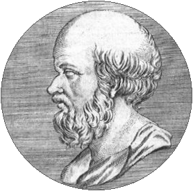
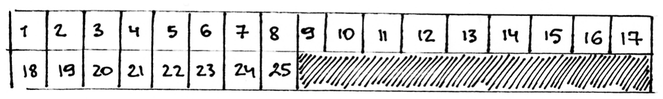
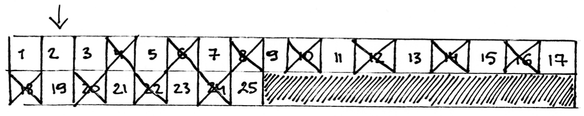
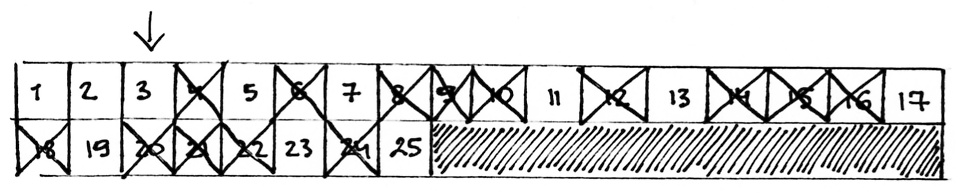
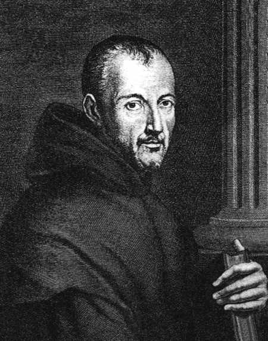
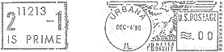

==================
Pirminiai skaičiai
==================

  | *Matematikai veltui bandė atrasti kokį nors dėsningumą pirminių*
  | *skaičių sekoje, ir yra priežasčių manyti, kad šios paslapties*
  | *žmogaus protas neperpras niekada.*
  | Leonardas Oileris (Leonhard Euler)

Manoma, kad pirminiai skaičiai buvo žinomi jau Babilonijos
civilizacijoje. Nuo seniausių laikų jie domino matematikus. XX a.
pabaigoje pirminiai skaičiai buvo sėkmingai pritaikyti
kriptografijoje: kelios populiarios viešojo rakto kriptoschemos
paremtos faktu, jog sudauginti du skaičius lengva, o didelį skaičių
išskaidyti pirminiais daugikliais – labai sudėtinga. Žinių apie
pirminius skaičius gali prireikti ir sprendžiant įvairius
skaičiavimo uždavinius.

Pirminiai skaičiai ir pagrindinė aritmetikos teorema
====================================================

**Pirminiais** vadinami natūralieji skaičiai, kurie dalijasi tik iš
vieneto ir savęs. Štai dešimt pirmųjų pirminių skaičių: 2, 3, 5,
7, 11, 13, 17, 19, 23, 29. Pirminiai skaičiai matematikoje yra svarbūs
dėl **pagrindinės aritmetikos teoremos**, teigiančios, kad kiekvieną
skaičių vieninteliu (unikaliu) būdu galima išreikšti pirminių
skaičių sandauga, nekreipiant dėmesio į jų tvarką. Didelė šios
teoremos svarba yra viena priežasčių, kodėl skaičius *vienas*
nelaikomas pirminiu: tuomet teoremą reikėtų papildyti dar viena
nereikalinga sąlyga.

Kiek jų yra?
============

Pirminių skaičių yra be galo daug. Tai žmonės žinojo jau labai
seniai. Euklidas savo veikale „Pradmenys“ pateikė grakštų
įrodymą:

  Tarkime, kad pirminių skaičių yra baigtinis kiekis – :math:`k`.
  Pažymėkime šiuos :math:`k` pirminių skaičių
  :math:`p1, p_2, \dots, p_{k–1}, p_k`, ir panagrinėkime skaičių
  :math:`m = p_1 \cdot p_2 \cdot p_3 \cdot \dots \cdot p_{k–1} \cdot p_k + 1`.
  Dalydami :math:`m` iš bet kurio :math:`p_i`
  (:math:`1 \leq i \leq k`) gausime liekaną 1, t. y. nė vienas
  pirminis skaičius nedalija :math:`m`. Tai reiškia, kad arba
  :math:`m` pats yra pirminis, arba išrašėme ne visus pirminius
  skaičius. Bet kuriuo atveju yra bent :math:`k + 1` pirminių
  skaičių – gavome prieštarą. Taigi pradžioje padaryta prielaida,
  kad pirminių skaičių yra baigtinis kiekis, buvo neteisinga.
  Vadinasi, pirminių skaičių yra be galo daug. Tai ir reikėjo
  įrodyti.

Kiek yra pirminių skaičių, ne didesnių už :math:`n`? Šis klausimas
buvo užduodamas taip dažnai, kad atsakymas turi net specialų vardą
– :math:`\pi(n)`. *Pi funkcijos* reikšmė lygi pirminių skaičių,
mažesnių arba lygių :math:`n`, skaičiui (ši funkcija neturi nieko
bendra su skaičiumi :math:`\pi`). Pavyzdžiui, :math:`\pi(20) = 8`,
nes yra aštuoni pirminiai skaičiai, mažesni arba lygūs 20. Iš
tiesų nėra jokio paprasto ir efektyvaus būdo, kaip šią funkciją
apskaičiuoti, kai argumentas didelis [#f9]_.

Ar skaičius 234234743 pirminis?
===============================

Pats paprasčiausias būdas nustatyti, ar skaičius :math:`n` pirminis
– patikrinti, ar jis tenkina pirminio skaičiaus apibrėžimą, t. y.
ar neatsiras tokio skaičiaus :math:`d (1 < d < n)`, kuris dalytų
:math:`n`. Algoritmo, tikrinančio visus potencialius daliklius nuo
:math:`2` iki :math:`n-1`, sudėtingumas yra :math:`O(n)`.

Veiksmų skaičių nesunku sumažinti dvigubai: iš pradžių
patikrinę, ar :math:`n` nelyginis, vėliau galime tikrinti dalumą tik
iš nelyginių skaičių. Nors veiksmų teks atlikti beveik dvigubai
mažiau, algoritmo sudėtingumas taip pat yra :math:`O(n)`, nes veiksmų
skaičius tiesiškai priklauso nuo :math:`n`. Įrodysime, kad pakanka
tikrinti potencialius daliklius nuo 2 iki :math:`\sqrt{n}`.

  Tarkime, :math:`n = d_1 \cdot d_2`. Jei :math:`d_1 > \sqrt{n}` ir
  :math:`d_2 > \sqrt{n}`, tuomet :math:`d_1 \cdot d_2 > n`, taigi
  arba :math:`d_1 \leq \sqrt{n}`, arba :math:`d_2 \leq \sqrt{n}`.
  Todėl, nuosekliai ieškodami daliklių nuo 2, negalime tikėtis rasti
  daliklį :math:`d_1 > \sqrt{n}`, nes
  :math:`d_2 = (n / d_1) < \sqrt{n}` taip pat turi būti
  skaičiaus :math:`n` daliklis, ir jį mes būtume aptikę anksčiau.

Apibendrinę šiuos pastebėjimus, galime parašyti pakankamai spartų
(:math:`O(\sqrt{n}`) sudėtingumo) algoritmą, tikrinantį, ar skaičius
:math:`n > 1` pirminis.

.. tabs::

  .. tab:: Paskalis

    .. code-block:: unicode_pascal

      function pirminis(n : longint) : boolean;
      var d,            { potencialus daliklis }
          sn : longint; { riba, iki kurios ieškosime daliklių }
      begin
        pirminis := (n mod 2 <> 0) or (n = 2);
        sn := round(sqrt(n) + 1);
        d := 3;         { tikrinsime dalumą iš nelyginių skaičių }
        while pirminis and (d < sn) do
          if n mod d = 0 then pirminis := false
          else d := d + 2;
      end;

  .. tab:: C++

    .. code-block:: cpp

      bool pirminis(long long n) {
          if(n == 1) return false;
          if(n == 2) return true;
          if(n%2 == 0) return false;

          for(int d = 3; d*d <= n; d+=2) {
              if(n%d == 0) return false;
          }
          return true;
      }

Įvykdę funkciją ``pirminis`` galime atsakyti į skyrelio pradžioje
pateiktą klausimą – skaičius 234234743 tikrai pirminis.

Jei skaičių reikšmės būtų per didelės standartiniams sveikųjų
skaičių tipams, tai su jais atliekamos aritmetinės operacijos
nebegalėtų būti prilyginamos elementariems veiksmams, o joms atlikti
tektų rašyti specialias procedūras. Tai keistų ir algoritmo
sudėtingumą.

Ilgą laiką buvo nežinomas polinominis algoritmas, tikrinantis, ar
didelis skaičius yra pirminis [#f10]_, ir tik 2002 metais Indijos
mokslininkų grupė įrodė, kad tai nėra NP pilnas uždavinys. Beje,
jei būtų atrastas būdas efektyviai išskaidyti didelį skaičių
pirminiais dauginamaisiais, tai kai kurios svarbios saugumo sistemos
taptų nesaugios.

Eratosteno rėtis
================

  Graikų matematikas Eratostenas

  276 – 194 m. pr. Kr.

Jei norėtume surasti visus pirminius skaičius, mažesnius arba lygius
:math:`n`, galėtume tikrinti kiekvieną iš jų ką tik aprašytuoju
būdu. Tokio algoritmo sudėtingumas – :math:`O(n \sqrt{n})`.
Tačiau šitaip ieškodami pirminių skaičių mes nepasinaudotume
svarbiu faktu: tikrinant, ar skaičius :math:`n_0` pirminis, jau rasti
visi pirminiai skaičiai, mažesni už :math:`n_0`.

Geresnį pirminių skaičių paieškos algoritmą prieš kelis
tūkstančius metų sugalvojo graikų matematikas *Eratostenas*
(graikų k. Ἐρατοσθένης). Graikijoje tuo metu buvo rašoma
ant papiruso arba odos, o vykdant šį algoritmą, sudėtinis skaičius
buvo išbraukiamas jį perduriant aštria lazdele. Pabaigus vykdyti
algoritmą, lentelė primindavo rėtį, todėl šis algoritmas vadinamas
**Eratosteno rėčiu**.

Surašykime visus skaičius nuo 1 iki :math:`n` į eilę. Skaičių
„sijojimas“ vyksta labai paprastai: eile keliaujama nuo 2 iki
:math:`\sqrt{n}`, ir, sutikus neišbrauktą skaičių :math:`k`,
išbraukiami visi :math:`k` kartotiniai iki :math:`n` (išskyrus patį
skaičių :math:`k`). Tokiu būdu „atsijojami“ sudėtiniai
skaičiai, o visi likę yra pirminiai (išskyrus, žinoma, vienetą).

Naudodamiesi Eratosteno rėčiu raskime visus pirminius skaičius, ne
didesnius kaip :math:`n = 25`.

Į eilę surašome skaičius nuo 1 iki 25, o eile keliausime iki
:math:`\sqrt{25} = 5`.

Pradedame nuo skaičiaus 2 – patį skaičių paliekame, o visus jo
kartotinius išbraukiame.

Paeiname eile per vieną skaičių į dešinę (nuo 2 pereiname
prie 3). 3 neišbrauktas, tad 3 paliekame, o visus kartotinius
išbraukiame.

Vėl pereiname per vieną skaičių į dešinę. Skaičius 4 jau
išbrauktas, tačiau 5 – ne. Išbraukiame visus skaičiaus 5
kartotinius:

.. figure:: images/leidinys1/22.png
  :align: center

Pasiekėme :math:`5=\sqrt{25}`, taigi darbą baigiame. Eilėje liko
pirminiai skaičiai, ne didesni už 25, ir vienetas.

Dabar užrašykime algoritmą Paskalio kalba. Skaičių eilę vaizduosime
loginiu masyvu pirm.

.. tabs::

  .. tab:: Paskalis

    .. code-block:: unicode_pascal

      for k := 2 to n do
        pirm[k] := true;
      for k := 2 to round(sqrt(n) + 1) do
        if pirm[k] then begin
          j := 2 * k;
          while (j <= n) do begin
            pirm[j] := false;
            j := j + k;
          end;
        end;

  .. tab:: C++

    .. code-block:: cpp

      std::vector<bool> arPirminis(MAXN, true);
      arPirminis.at(0) = false;
      arPirminis.at(1) = false;
      for(int i = 2; i*i <= n; i++) {
          if(arPirminis[i]) {
              for(int j = 2*i; j <= n; j+=i) {
                  arPirminis[j] = false;
              }
          }
      }

Šis algoritmas reikalauja :math:`O(n)` atminties (loginiam masyvui).
Turbūt ne taip akivaizdu, kad algoritmas reikalauja
:math:`O(n \cdot \log(\log n))` laiko – šio fakto neįrodinėsime.
Iš tiesų algoritmo sudėtingumas beveik tiesinis.

Kartą įvykdę Eratosteno rėčio algoritmą, galime per konstantinį
(:math:`O(1)`) laiką patikrinti, ar skaičius iš intervalo
:math:`1 \dots n` yra pirminis, – tereikia patikrinti atitinkamą
masyvo elementą.

Abu aptartus algoritmus galima naudoti kartu. Įsivaizduokime, jog tenka
tikrinti, ar dideli skaičiai (iki :math:`2^{31}`) yra pirminiai. Tiek
atminties skirti negalime, todėl negalime naudoti Eratosteno rėčio
algoritmo. Tačiau Eratosteno rėčiu suradę visus pirminius skaičius
iki :math:`\sqrt{2^{31}} \approx 46341` ir perkėlę į atskirą
masyvą, juos galime naudoti kaip potencialius daliklius vietoj visų
skaičių iš intervalo :math:`2 \dots \sqrt{n}`.

Tarkime, visi pirminiai skaičiai iki :math:`\sqrt{2^{31}}` iš eilės
surašyti masyve ``p``. Tuomet ankstesnę patikrinimo, ar skaičius
pirminis, funkciją galime pakeisti spartesne:

.. tabs::

  .. tab:: Paskalis

    .. code-block:: unicode_pascal

      function pirminis(n : longint) : boolean;
      var i,            { masyvo p indeksas }
          sn : longint; { riba, iki kurios ieškosime daliklių }
      begin
        pirminis := true;
        sn := round(sqrt(n) + 1);
        i := 1;
        while pirminis and (p[i] < sn) do
          if n mod p[i] = 0 then
            pirminis := false
          else
            i := i + 1;
      end;

  .. tab:: C++

    .. code-block:: cpp

      vector<int> primes; // visi pirminiai skaiciai iki sqrt(n)
      bool pirminis(long long n) {
          for(int i = 0; primes[i]*primes[i] <= n; i++) {
              if(n%primes[i] == 0) return false;
          }
          return true;
      }

Pirminių skaičių paieška tęsiasi
================================

  Marinas Mersenas (1588–1648)

  1963 m. didžiausio tuo metu žinomo pirminio skaičiaus garbei
  buvo skirtas pašto ženklas

Pirminių skaičių yra be galo daug, tad didžiausio jų ir negali
būti. Nuo senų laikų lenktyniaujama, kas atras didesnį pirminį
skaičių. XVII amžiuje matematikai ėmė intensyviai ieškoti
dėsningumų pirminių skaičių sekoje. Tuo metu gyvenęs filosofas ir
matematikas vienuolis Marinas Mersenas (*Marin Mersenne*) pastebėjo,
kad daug skaičių, užrašomų pavidalu :math:`2^p-1`, kur :math:`p`
– pirminis skaičius, taip pat yra pirminiai. Tokie pirminiai
skaičiai dabar vadinami Merseno pirminiais. Atsiradus kompiuteriams,
šie iš karto buvo pasitelkti pirminių skaičių paieškai. 1997
metais pirminių skaičių paieškai buvo sukurtas GIMPS (angl. *The
Great Internet Mersenne Prime Search*) paskirstytų skaičiavimų
projektas. Visi norintys dalyvauti šiame projekte gali atsisiųsti į
savo kompiuterį programinę įrangą, kuri išnaudos laisvą jūsų
kompiuterio procesoriaus darbo laiką: parsisiųs ir atliks tam tikrą
užduočių paketą, o rezultatus perduos į centrinį serverį. Šio
projekto vykdytojai jau rado net 9 didžiausius (tuo metu) Merseno
pirminius skaičius. 1999 m. EFF (*Electronic Frontier Foundation*)
paskelbė šimtatūkstantines premijas pirmiesiems, atradusiems
pirminius skaičius, turinčius labai daug (nuo :math:`1 000 000`)
skaitmenų. Pirmoji 50 000 dolerių premija jau buvo išmokėta 2000
metais GIMPS projekto dalyviui, atradusiam Merseno pirminį, sudarytą
iš :math:`2 098 960` skaitmenų. 2005 gruodžio 15 dieną buvo
atrastas 43-iasis Merseno pirminis skaičius :math:`2^{30 402 457}-1`,
sudarytas iš :math:`9 152 052` skaitmenų. Tad iki antrosios,
dvigubai didesnės, premijos už iš ne mažiau kaip
:math:`10 000 000` skaitmenų sudarytą pirminį skaičių laukti
lieka neilgai.

.. rubric:: Išnašos

.. [#f9]
  Tačiau įrodyta, jog teisingas šis funkcijos vertinimas:
  :math:`0,89 \frac{n}{\ln n} < \pi(n) < 1,11 \frac{n}{\ln n}`.
  Taigi funkcijos :math:`\pi(n)` priklausomybė nuo argumento nedaug
  skiriasi nuo tiesinės.

.. [#f10]
  Operacijų su dideliais skaičiais sudėtingumas matuojamas
  aritmetinių bitų operacijų skaičiumi. Tokiu atveju pradinių
  duomenų dydis yra skaitmenų (bitų) skaičius, taigi skaičiui
  :math:`n` pradinių duomenų dydis yra :math:`m = \log n`. O
  algoritmas skaičiui :math:`n` atliekantis :math:`n` veiksmų, iš
  tiesų atliks eksponentinį veiksmų skaičių, kaip funkciją nuo
  pradinių duomenų dydžio: :math:`n = 2^m`.
