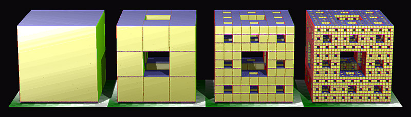
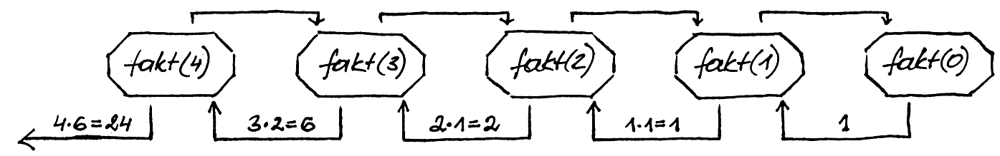
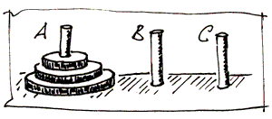
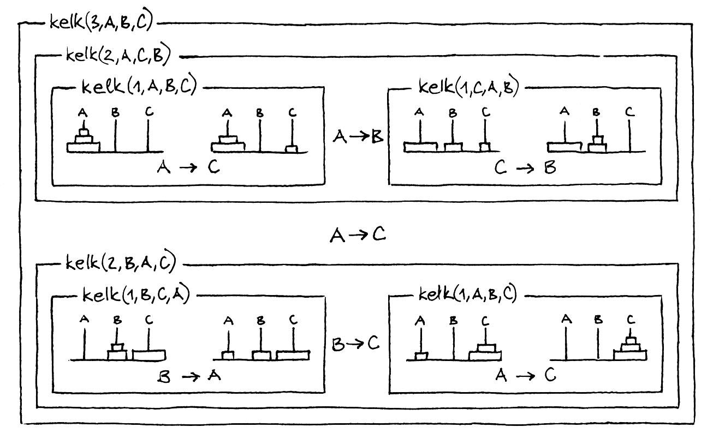

.. _skyrius-rekursija:

=========
Rekursija
=========

  | *In order to understand recursion, one must first understand recursion.*
  | *Norint suprasti rekursiją, pirma reikia suprasti rekursiją.*
  | Populiarus humoristinis posakis

Šis humoristinis posakis gana gerai nusako rekursijos esmę: algoritmas
yra **rekursyvus**, jei bent vienas iš jo žingsnių yra to paties
algoritmo atlikimas su kitais (dažniausiai mažesniais) duomenimis.

Pažintį su rekursija pradėkime nuo geometrinės figūros, vadinamos
Mengerio kempine [#f11]_ (ji yra fraktalinis [#f12]_ kūnas), konstravimo
algoritmo:

#. *žingsnis* Paimamas kubas.

#. *žingsnis* Kubas suskaidomas į 27 vienodo dydžio kubelius.

#. *žingsnis* Pašalinamas kubo viduryje esantis kubelis, taip pat dar 6 kiekvienos
   sienos viduryje esantys kubeliai.

#. *žingsnis* Toliau su kiekvienu likusiu kubeliu veiksmai kartojami nuo antro
   žingsnio.

Pateiktas konstravimo algoritmas yra rekursyvus, nes ketvirtame
žingsnyje nurodoma tą patį algoritmą taikyti kitiems duomenims.

  Mengerio kempinė

.. _skyrelis-rekursyvios-funkcijos:

Rekursyvios funkcijos
=====================

  Lėkščių krovimas į stirtą primena dėklą — paskutinė
  padėta lėkštė bus paimta pirmoji

Aukšto lygio programavimo kalbos suteikia galimybę aprašyti
rekursyvias funkcijas, t. y. funkcijas, kurios iškviečia pačios
save. Kiekvieną kartą kreipiantis į funkciją, įsimenamas grįžimo
adresas, padaromos parametrų kopijos ir sukuriami nauji lokalūs
funkcijos kintamieji.

Tai organizuojama **dėklo** (angl. *stack*) duomenų struktūra. Ši
struktūra veikia LIFO (angl. *Last in First out*) principu: nauji
duomenys dedami į dėklo „viršų“ ir imami nuo „viršaus“,
t. y. imant duomenis visada paimamas paskutinis padėtas duomuo. Taigi
kiekvieną rekursyvų algoritmą galima realizuoti nenaudojant
rekursijos, o suprogramuojant ir panaudojant savo dėklo duomenų
struktūrą.

Rekursyvi funkcija su ją iškvietusia funkcija (savo pačios
„kopija“) gali bendrauti tik parametrais bei globaliais
kintamaisiais.

Panagrinėkime keletą paprastų rekursyvių funkcijų. Vieną, beje,
jau matėme – Euklido algoritmas DBD rasti gali būti užrašomas
rekursyviai.

Kitas pavyzdys – skaičiaus faktorialas:

.. math::
  :nowrap:

  \begin{eqnarray*}
    0! &=& 1 \\
    n! &=& n (n-1)!, \text{ jei } n > 0
   \end{eqnarray*}

Galime parašyti skaičiaus faktorialą skaičiuojančią funkciją:

.. tabs::

  .. tab:: Paskalis

    .. code-block:: unicode_pascal

      function fakt(n : integer) : longint;
      begin
          if n = 0 then
              fakt := 1
          else
              fakt := n * fakt(n - 1);
      end;

  .. tab:: C++

    .. code-block:: cpp

      long long fakt(int n) {
          if(n == 0) return 1;
          return n*fakt(n-1);
      }

Kreipinio ``fakt(4)`` vykdymą iliustruoja žemiau pateiktas paveikslas:

Atlikus kreipinį ``fakt(n)``, iš viso bus įvykdyta :math:`(n + 1)`
funkcijų kvietimų, taigi šios funkcijos sudėtingumas yra
:math:`O(n)`. Šis būdas yra lėtesnis už faktorialo skaičiavimą
ciklu, kadangi funkcijos iškvietimas yra kur kas sudėtingesnis
procesas už ciklo iteraciją.

Kitas rekursyvios funkcijos pavyzdys – Fibonačio skaičiai. 1202
metais italų matematikas Leonardo Pisano, vadinamas Fibonačiu
(*Fibonacci*), sugalvojo uždavinį: triušių pora kas mėnesį
atsiveda po du triušiukus (patinėlį ir patelę), o iš atvestųjų
triušiukų po dviejų mėnesių jau gaunamas naujas prieauglis. Kiek
triušių bus po metų, jei metų pradžioje buvo viena jauniklių pora?
Triušių skaičių kiekvieną mėnesį nusakys seka
:math:`1, 1, 2, 3, 5, 8, 13, 21, 34\dots`, o šie skaičiai yra vadinami
Fibonačio skaičiais. Juos taip pat galima skaičiuoti rekursyviai:

.. math::
  :nowrap:

  \begin{eqnarray*}
    F_1 &=& F_2 = 1 \\
    F_n &=& F_{n–1} + F_{n–2}, \text{ jei } n > 2
  \end{eqnarray*}

.. tabs::

  .. tab:: Paskalis

    .. code-block:: unicode_pascal

      function F(n : integer) : longint;
      begin
          if n <= 2 then
              F := 1
          else
              F := F(n - 1) + F(n - 2);
      end;

  .. tab:: C++

    .. code-block:: cpp

      long long F(int n) {
          if(n <= 2) return 1;
          return F(n-1) + F(n-2);
      }

Nors ši funkcija atrodo tokia pat paprasta, kaip ir faktorialo, jos
sudėtingumas yra eksponentinis [#f13]_. Taip yra todėl, kad kiekviena
funkcija iškviečia net dvi kitas, antrines funkcijas, o joms
perduodami argumentai sumažinami tik pastoviu dydžiu. Iškvietus
``F(45)``, atsakymo tektų palaukti.

Pastebėkime, kad visi minėti uždaviniai pasižymi viena bendra
savybe: spręsdami uždavinį, turime išspręsti analogiškus, bet
mažesnius uždavinius. Pavyzdžiui, jei norime suskaičiuoti
:math:`n!`, turime išspręsti mažesnį uždavinį – suskaičiuoti
:math:`(n – 1)!`, o jei norime rasti ``DBD(25, 15)`` (pagal Euklido
algoritmą), turime rasti ``DBD(15, 10)``.

*Hanojaus bokštų uždavinys*
===========================

Išspręsime klasikinį *Hanojaus bokštų uždavinį*, kurį 1883
metais suformulavo prancūzų matematikas Eduardas Lukas (*Edouard
Lucas*).

  Pavyzdys su trimis diskais

  Duoti trys stiebai ir aštuoni skirtingo dydžio diskai. Iš pradžių
  visi šie diskai sumauti ant pirmojo stiebo: apačioje pats
  didžiausias diskas, ant jo – mažesnis ir t. t. Viršuje užmautas
  pats mažiausias iš diskų.

  *Užduotis.* reikia perkelti visus diskus nuo pirmojo stiebo ant
  paskutinio laikantis šių taisyklių:

  - Vienu ėjimu galima kelti tik vieną diską.

  - Diską galima užmauti tik ant tuščio stiebo arba uždėti ant
    didesnio už jį disko.

  - Atliekamų perkėlimų skaičius turi būti minimalus.

Praplėsime standartinę uždavinio formuluotę: vietoj aštuonių
diskų reikia perkelti :math:`n` diskų. Stiebai pavadinti raidėmis A,
B ir C. Parašykite programą, kuri atspausdintų, kaip perkelti visus
diskus, laikantis minėtų taisyklių.

Panagrinėkime paprasčiausius atvejus [#f14]_. Kai :math:`n = 1`,
diską perkeliame (ir uždavinį išsprendžiame) vienu žingsniu.
Nesunku jį išspręsti, kai :math:`n = 2`, tam reikia trijų
perkėlimų. Šiek tiek pagalvoję suvokiame, kad pakanka 7 perkėlimų
uždaviniui išspręsti, kai :math:`n = 3`.

Atkreipkite dėmesį, kad niekas nepasikeistų, jei uždavinyje būtų
reikalaujama diskus perkelti ne ant dešiniojo, o ant vidurinio disko:
atliktume tuos pačius ėjimus, tik diskus keltume ne ant dešiniojo, o
ant vidurinio ir atvirkščiai.

Ko gi reikia, kad galėtume pagal taisykles perkelti :math:`n`-ąjį
(patį didžiausią) diską? Visų pirma, ant jo neturi būti jokių
kitų diskų. Be to, dešinysis stiebas taip pat turi būti tuščias.
Vadinasi, visi likę diskai turi būti jau perkelti ant vidurinio
stiebo! Tik tuomet galėsime perkelti :math:`n`-ąjį (didžiausią)
diską.

Bandydami :math:`(n – 1)` mažesnių diskų perkelti ant vidurinio
stiebo, galime visiškai nekreipti dėmesio į :math:`n`-ąjį diską:
jis nesutrukdys, kadangi yra didesnis už visus likusius diskus. Taigi
:math:`(n – 1)` diskų perkėlimas yra visiškai tas pats, tik
sumažintas, uždavinys. Taip pradedame įžvelgti rekursyvų uždavinio
sprendimą, kurio bendra schema tokia:

  Jei norime perkelti n > 0 diskų:

  -  Visus mažesnius diskus perkeliame ant tarpinio stiebo.

  -  Perkeliame :math:`n`-ąjį diską.

  -  Visus mažesnius diskus perkeliame ant galinio stiebo.

Tegul kelk yra diskų perkėlinėjimo funkcija. Ji turi priklausyti nuo
diskų, kuriuos reikia perkelti, skaičiaus. Be to, ji turi žinoti, nuo
kurio ir ant kurio stiebo norima perkelti diskus. Tai nebus visada tie
patys stiebai A ir C. Pavyzdžiui, jei norėsime :math:`n` diskų
perkelti nuo stiebo A ant stiebo C, turime :math:`(n - 1)` diską
perkelti nuo stiebo A ant stiebo B (ta pati užduotis, tik kitas diskų
skaičius ir stiebų vardai), o vėliau – nuo B ant C. Kintamuosius
žymėsime ``nuo``, ``ant`` ir ``tarp`` (tarpiniam stiebui). Jei
:math:`n > 0`, diskus perkeliame remdamiesi aukščiau aprašyta
taisykle, o jei :math:`n = 0`, nereikia atlikti nieko – rekursija
baigiama.

.. tabs::

  .. tab:: Paskalis

    .. code-block:: unicode_pascal

      procedure kelk(n : integer; nuo, tarp, ant : char);
      begin
          if n > 0 then begin
              kelk(n - 1, nuo, ant, tarp); { nuo → tarp }
              { perkeliamas n-tasis diskas }
              writeln(nuo, ' –> ', ant);
              kelk(n - 1, tarp, nuo, ant) { tarp → ant }
          end
      end;

  .. tab:: C++

    .. code-block:: cpp

      void kelk(int n, char nuo, char tarp, char ant) {
          if(n == 0) return;
          kelk(n-1, nuo, ant, tarp); //nuo -> tarp
          cout << nuo << " -> " << ant << endl;
          kelk(n-1, tarp, nuo, ant); // tarp -> ant
      }

Jei norime perkelti :math:`n` diskų nuo stiebo A ant stiebo C,
iškviečiame ``kelk(n, 'A', 'B', 'C')``. Žemiau iliustruojamas
procedūros veikimas, iškvietus ``kelk(3, 'A', 'B', 'C')``:

Taigi procedūra atspausdins:

  | A –> C
  | A –> B
  | C –> B
  | A –> C
  | B –> A
  | B –> C
  | A –> C

Nuostabu, kad šiam, iš pirmo žvilgsnio sudėtingam, uždaviniui
egzistuoja toks elegantiškas sprendimas.

Parodysime, jog aprašytuoju būdu kilnojant diskus perkėlimų
skaičius yra mažiausias. Pažymėkime :math:`T_n` mažiausią
perkėlimų skaičių, reikalingą perkelti :math:`n` diskų nuo vieno
stiebo ant kito. Žinome, kad :math:`T_0 = 0`, :math:`T_1 = 1`,
:math:`T_2 = 3` ir :math:`T_3 = 7`.

Be to, iš ankstesnių samprotavimų seka, kad :math:`n` diskų galima
perkelti :math:`T_{n-1} + 1 + T_{n-1} = 2T_{n-1} + 1`
perkėlimais, t. y.:

.. math::
  :label: viršutinis_rėžis

  T_n \leq 2T_{n-1} + 1

Kita vertus, ar galime ką nors atlikti geriau? Anksčiau ar vėliau
būtinai teks perkelti :math:`n`-tąjį (didžiausią) diską. Prieš
tai likusieji :math:`n - 1` diskų privalės atsidurti ant vidurinio
stiebo, o tam reikės bent :math:`T_{n-1}` (minimalaus skaičiaus)
perkėlimų. Vieno perkėlimo reikės :math:`n`-ajam diskui, ir pagaliau
dar bent :math:`T_{n-1}` perkėlimų mažesniems diskams perkelti ant
viršaus. Todėl:

.. math::
  :label: apatinis_rėžis

  T_n \geq 2T_{n-1} + 1

Iš :eq:`viršutinis_rėžis` ir :eq:`apatinis_rėžis` nelygybių
gauname, kad :math:`T_n = 2T_{n-1} + 1`.

Taigi :math:`T_n` galime apskaičiuoti pagal rekurentinį sąryšį:

.. math::
  :label: Tn
  :nowrap:

  \begin{eqnarray*}
    T_0 &=& 0 \\
    T_n &=& 2T_{n-1} + 1, \text{ jei } n > 0
  \end{eqnarray*}

Pavyzdžiui, :math:`T_4 = 2T_3 + 1 = 15`.

Tačiau rekurentinis sąryšis neatsako į klausimą, koks procedūros
kelk sudėtingumas. Matyti, kad, diskų skaičių padidinus vienetu,
ėjimų skaičius maždaug padvigubėja. Norėdami būti tikri,
išspręsime rekurentinį sąryšį.

Pažymėkime :math:`U_n` skaičių, vienetu didesnį už :math:`T_n`:
t. y. :math:`U_n = T_n + 1`.

Pridėję prie :eq:`Tn` lygybių po vienetą, gauname:

.. math::
  :nowrap:

  \begin{eqnarray*}
    T_0 + 1 &=& 1 \\
    T_n + 1 &=& 2T_{n-1} + 2 = 2(T_{n-1} + 1), \text{ jei } n > 0
  \end{eqnarray*}

Taigi:

.. math::
  :nowrap:

  \begin{eqnarray*}
    U_0 &=& 1 \\
    U_n &=& 2U_{n-1}, \text{ jei } n > 0
  \end{eqnarray*}

Iš čia matyti, kad
:math:`U_n = 2U_{n-1} = 2^k U_{n-k} = 2_n`, vadinasi,
:math:`T_n = U_n - 1 = 2^n - 1`.

Procedūros ``kelk``, perkeliančios :math:`n` diskų, atliekamų
žingsnių skaičius proporcingas :math:`T_n`, taigi šios procedūros
sudėtingumas yra :math:`O(2^n)`. Palyginkime procedūrą ``kelk`` su
Fibonačio skaičių skaičiavimo funkcija :math:`F` – kiekviena jų
atlieka du rekursyvius kreipinius, argumentą sumažindamos tik pastoviu
dydžiu. Tai lemia eksponentinį sudėtingumą.

Rekursijos užbaigimas
=====================

  | *Yra jūroj paskandinta dėžė, toj dėžėj yra zuikis,*
  | *tam zuiky – karvelis, tam karvely – kiaušinis,*
  | *tam kiaušiny – adata, ją perlaužus raganius mirs.*
  | Lietuvių liaudies pasaka

Kiekvienoje rekursinėje procedūroje turi būti numatyti visi ribiniai
atvejai, kuriuos pasiekus rekursija nutraukiama. Ribinis atvejis –
randama ir sulaužoma adata – numatytas netgi pasakoje, tuo labiau jo
nereiktų pamiršti programuojant.

Panagrinėkime analizuotų pavyzdžių ribinius atvejus. Skaičiuojant
skaičiaus :math:`n` faktorialą, ribinis atvejis yra
:math:`n = 0 (0! = 1)`, ieškant :math:`n`-ojo Fibonačio skaičiaus
– :math:`n \leq 2` (:math:`F_1 = F_2 = 1`). Ieškant
didžiausiojo bendro skaičių :math:`a` ir :math:`b` daliklio –
rekursija baigiama, kai :math:`b = 0`, keliant diskus Hanojaus bokštų
uždavinyje – kai reikia perkelti 0 (t. y. nebereikia kelti nė
vieno) diskų.

Viena vertus, būtina užtikrinti, kad rekursiniame procese *būtinai*
bus *pasiekiamas* kuris nors ribinis atvejis, kita vertus – reikia
nepamiršti numatyti *visų* ribinių atvejų. Jei karalaitis
kiaušinyje rastų ne adatą, o obuolį, jis atsidurtų keblioje
padėtyje…

.. rubric:: Išnašos

.. [#f11]
  Mengerio kempinės iliustracija paimta iš
  http://en.wikipedia.org/wiki/Menger_sponge.

.. [#f12]
  Terminą „fraktalas“ (išvertus iš lotynų kalbos tai reiškia
  sudužęs, suskilęs) pasiūlė B. Mandelbrotas. Jis norėjo viena
  sąvoka aprašyti tokius gamtoje pasitaikančius darinius kaip debesys,
  kalnai, žaibai arba tam tikrus geometrinius objektus. Pasirodo, visi
  šie objektai yra fraktalai ir turi tam tikrų bendrų savybių.
  Fraktalų geometrijos atradimas yra vienas didžiausių XX amžiaus
  matematikos pasiekimų, ši geometrija plačiai taikoma įvairiose
  srityse, pavyzdžiui, kuriant fantastinius gamtą imituojančius
  peizažus filmuose.

.. [#f13]
  Fibonačio skaičius galima skaičiuoti efektyviai (per tiesinį
  laiką), masyve įsimenant jau apskaičiuotas reikšmes; apie tai
  skaitykite :ref:`skyrelis-dinaminio-programavimo-principai` skyrelyje.

.. [#f14]
  Kelių paprastų uždavinio atvejų sprendimas ranka įtraukia mus į
  užduotį, suteikia intuicijos ir dažnai privilioja geras idėjas!
  Taigi tai naudinga daryti olimpiadose.
