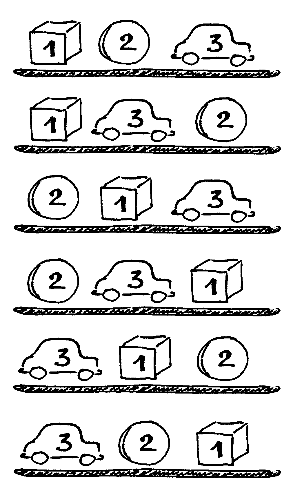
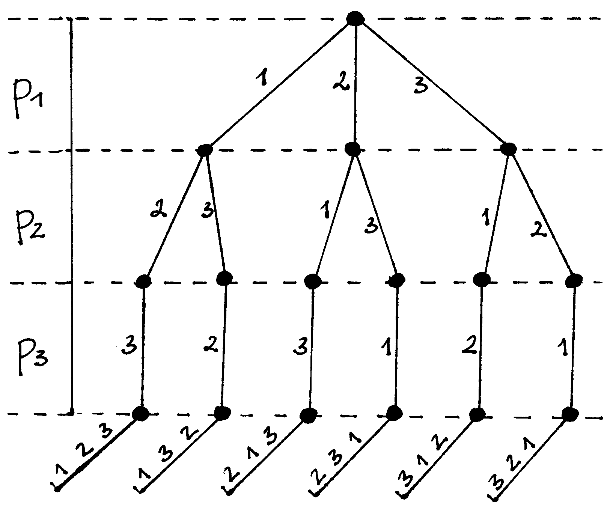
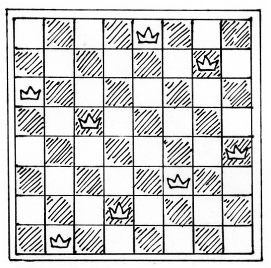
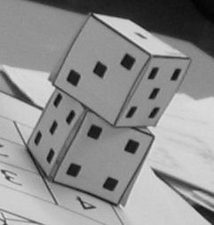
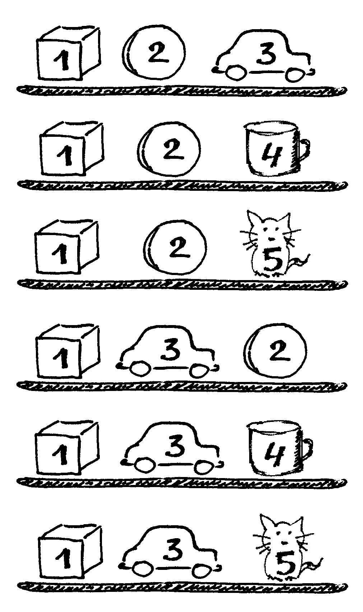
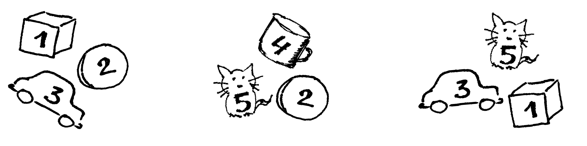
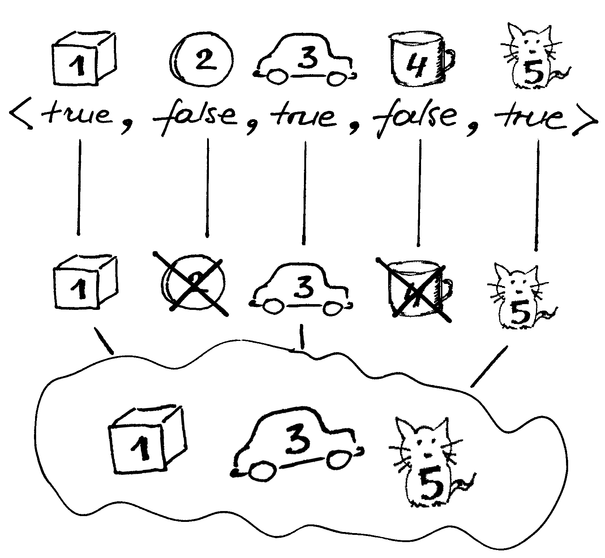
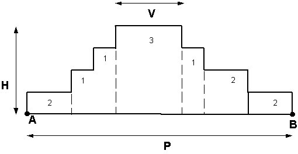

===============================
Perrinkimas ir grįžimo metodas 
===============================

  | *Modern computers are so fast that brute force can be an effective and*
  | *honourable way to solve problems.*
  | *Šiuolaikiniai kompiuteriai yra tokie spartūs, kad perrinkimas gali būti*
  | *efektyvus ir garbingas būdas uždaviniams spręsti.*
  | Steven S. Skienna, Miguel A. Revilla, „Programming Challenges“

1852 metais matematikas F. Gatris (Francis Guthrie) paskelbė hipotezę,
teigiančią, jog kiekvienam žemėlapiui nuspalvinti taip, kad jokios
dvi gretimos valstybės nebūtų nuspalvintos ta pačia spalva, pakanka
keturių spalvų. Daugelis matematikų siūlė šios hipotezės
įrodymus, tačiau vis išaiškėdavo, kad jie neteisingi [#f15]_.
Hipotezė pagaliau tapo teorema (buvo įrodyta) 1976 metais, o dalis
įrodymo rėmėsi kompiuteriu išnagrinėtomis 1476 situacijomis.
Kompiuterio programa veikė šimtus valandų, o žmonėms nepakako ir
šimto metų. Taigi nors perrinkimo metodai dažnai būna neefektyvūs,
spartėjant kompiuteriams šis sprendimo būdas (visų galimų
sprendinių išbandymas) tam tikrais atvejais gali būti priimtinas,
ypač jei perrinkimą pavyksta optimizuoti.

Formaliai **perrinkimą** galima apibrėžti kaip uždavinių sprendimo
metodą, kai išbandomi visi galimi sprendiniai.

Šiame skyrelyje susipažinsime su patogiu metodu perrinkimui realizuoti
– grįžimo metodu. **Grįžimo metodas** (angl. *Backtracking*) –
tai sistemingas būdas spręsti uždaviniams, kurių sprendinys yra
kintamųjų :math:`p_1, p_2, \dots, p_n` reikšmių rinkinys,
tenkinantis kokius nors reikalavimus. Prisiminkime, pavyzdžiui,
*Keliaujančio pirklio uždavinį* [#f16]_: šiuo atveju kintamųjų
:math:`p_1, p_2, \dots, p_n` reikšmėms reikia priskirti skirtingus
miestų numerius taip, kad ši miestų aplankymo tvarka ir būtų
pageidaujamas maršrutas.

Pagrindinė grįžimo metodo idėja tokia: paeiliui renkamos visų
galimų kintamųjų reikšmės ir tikrinama, ar tenkinami reikalavimai,
o radus sprendinį arba situaciją, kai reikalavimai netenkinami,
grįžtama per vieną žingsnį atgal ir parenkama nauja atitinkamo
kintamojo reikšmė.

Programuojant grįžimo metodą dažnai naudojama rekursija.
Panagrinėsime abstrakčių kombinatorinių uždavinių sprendimų
schemas bei porą konkrečių uždavinių.

.. _skyrelis-kėlinių-generavimas:

Kėlinių generavimas
===================

  Visi galimi trijų prekių išdėstymo lentynoje būdai

Sakykime, parduotuvės lentynoje vienoje eilėje reikia išdėlioti
:math:`n` skirtingų prekių. Raskime visus skirtingus būdus, kaip tai
padaryti. Uždavinys yra ekvivalentus visų :math:`n` ilgio kėlinių be
pasikartojimų generavimo uždaviniui.

Kas gi tas kėlinys be pasikartojimų? Tarkime, turime aibę iš
:math:`n` elementų. Kiekviena visų (skirtingų) :math:`n` elementų
seka vadinama kėliniu be pasikartojimų. Taigi kėliniai vienas nuo
kito skiriasi tik elementų išsidėstymu vienas kito atžvilgiu.

Parašykime algoritmą, kuris išspausdintų visus prekių išdėstymo
būdus. Prekes laikysime sunumeruotomis nuo 1 iki :math:`n`.

Atkreipkite dėmesį – šis uždavinys priskiriamas įžangoje
minėtai uždavinių klasei: :math:`m`-ojoje vietoje padėtą prekę
(prekės numerį) pažymėjus :math:`p_m`, reikia rasti kintamųjų
:math:`p_1, \dots, p_n` reikšmių (kintančių nuo 1 iki :math:`n`)
rinkinius, tenkinančius vieną reikalavimą – visos reikšmės turi
būti skirtingos; tuos rinkinius atspausdinti.

Uždavinį galima išreikšti rekursyviai, t. y. suskaidyti į tokius pat,
tik mažesnius, uždavinius. Tegu procedūra ``generuok(m, n)`` priskirs
reikšmes kintamiesiems nuo :math:`p_m`-ojo iki :math:`p_n`-ojo. Tuomet
jos veikimas galėtų būti toks:

-  Jei :math:`m \leq n`, imti po vieną visas dar lentynoje nepadėtas
   prekes ir su kiekviena atlikti tokius veiksmus:  

   -  Prekę padėti į :math:`m`-ąją poziciją lentynoje (:math:`pm`
      := prekės numeris). 

   -  Sudėti į lentyną likusias prekes (priskirti reikšmes
      kintamiesiems nuo :math:`p_m+1` iki :math:`p_n`) – toks pat
      uždavinys, taigi iškviesti ``generuok(m + 1)``.

   -  Prekę, esančią :math:`m`-ojoje pozicijoje, paimti nuo
      lentynos. 

-  Jei :math:`m > n`, tai ši procedūra iškviesta jau išdėliojus
   visas prekes lentynoje, todėl atspausdiname kintamųjų
   :math:`p_1, p_2, \dots, p_n` reikšmes.  

Norint patikrinti, kurios prekės jau sudėtos į lentyną, galima
peržiūrėti jau priskirtas reikšmes. Tačiau paprasčiau ir
efektyviau paskirti globalų loginį masyvą ``panaudotas``, ir,
padėjus į lentyną prekę su numeriu ``i``, pažymėti, jog šis
numeris jau panaudotas (``panaudotas[i] := true``), o paėmus prekę
nuo lentynos – atstatyti buvusią reikšmę
(``panaudotas[i] := false``).

.. tabs::

  .. tab:: Paskalis

    .. code-block:: unicode_pascal

      const MAXN = 20;        { didžiausia n reikšmė }
      var p : array [1..MAXN] of integer;
         panaudotas : array [1..MAXN] of boolean;
      procedure spausdink(m: integer);
      var i : integer;
      begin
         for i := 1 to m do
             write(p[i], ' ');
         writeln;
      end;
      procedure generuok(m, { parenkamas elementas m-ajai pozicijai }
                        n : integer);
      var i : integer;
      begin
         { jei m > n, tai ši procedūra iškviesta jau sugeneravus visą kėlinį }
         if m > n then
            spausdink(n)
         else
             for i := 1 to n do
                 if not panaudotas[i] then begin
                     panaudotas[i] := true;
                     p[m] := i;
                     generuok(m + 1, n);
                     panaudotas[i] := false;
                 end;
      end;

  .. tab:: C++

    .. code-block:: cpp

      const int MAXN = 20;
      int p[MAXN];
      bool panaudotas[MAXN+1];

      // atspausdina sugeneruotą kėlinį
      void spausdink(int n) {
          for(int i = 0; i < n; i++) {
              cout << p[i] << " ";
          }
          cout << endl;
      }

      // n – elementų kiekis
      // k – dabar nagrinėjamo elemento indeksas
      void gen(int n, int k) {
          if(k >= n) {
              spausdink(n);
              return;
          }
          for(int i = 1; i <= n; i++) {
              if(!panaudotas[i]) {
                  panaudotas[i] = true;
                  p[k] = i;
                  gen(n, k+1);
                  p[k] = 0;
                  panaudotas[i] = false;
              }
          }
      }

Kad galėtume išspausdinti visas trijų prekių išdėliojimo lentynoje
tvarkas, įvykdome:

.. tabs::

  .. tab:: Paskalis

    .. code-block:: unicode_pascal

      n := 3;
      for i := 1 to n do
         panaudotas[i] := false;
      generuok(1, n);

  .. tab:: C++

    .. code-block:: cpp

      int n = 3;
      for(int i = 1; i <= n; i++)
        panaudotas[i] = false;
      gen(n, 0);

  Procedūros generuok vykdymą vaizduojantis medis  (n = 3)

Parašytą procedūrą nesunku pritaikyti kitiems uždaviniams –
vietoj spausdinimo galima atlikti kokius nors kitus veiksmus.
Spausdinimą iškėlėme į atskirą procedūrą norėdami paryškinti
sprendimo struktūrą.

Koks gi parašytos programos sudėtingumas, t. y. kaip atliekamų
veiksmų skaičius priklauso nuo n? Algoritmas generuoja visus įmanomus
skaičių nuo 1 iki :math:`n` išdėstymo į eilę būdus. Kiek jų yra?
Pirmąjį skaičių galima parinkti :math:`n` būdų, antrąjį
skaičių – :math:`(n - 1)` būdu (kadangi vienas skaičius jau
pasirinktas), trečiąjį skaičių – :math:`(n - 2)` būdais (du
skaičiai jau parinkti) ir t. t. Gauname, kad yra
:math:`n(n – 1)(n – 2)\cdot \dots \cdot 2 \cdot 1 = n!`
skirtingų būdų išdėstyti :math:`n` skaičių į eilę. Taigi
procedūros ``generuok`` sudėtingumas yra :math:`O(n!)`. Pavyzdžiui,
kai :math:`n = 13`, tai vieną atspausdintą eilutę sudaro apie 30 simbolių, o
eilučių yra :math:`13! = 6227020800` ir programa spausdintų daugiau
nei 150 gigabaitų teksto... (jei, žinoma, sulauktume veikimo
pabaigos).

*Aštuonių valdovių uždavinys*
=============================

Išspręsime klasikinį *aštuonių valdovių* uždavinį.

  **Užduotis.** :math:`8 \times 8` dydžio šachmatų lentoje reikia
  išdėlioti 8 valdoves taip, kad jokiu būdu neatsidurtų dvi vienoje
  eilutėje, stulpelyje arba įstrižainėje (t. y. nė viena
  negalėtų nukirsti kitos tolesniu ėjimu). Uždavinio formuluotę
  išplėsime ir ieškosime, kaip :math:`n` valdovių surikiuoti
  :math:`n \times n` dydžio lentoje.

  Aštuonių valdovių išdėstymo pavyzdys

Šį uždavinį taip pat spręsime grįžimo metodu. Pavyzdžiui, lentos
langelius sunumeravę nuo 1 iki :math:`n^2`, kiekvienai valdovei galime
skirti po vieną langelį (numerį) taip, kad būtų tenkinama
uždavinio sąlyga. Tačiau spręsdami uždavinį šiuo būdu, turėtume
išnagrinėti labai didelį variantų skaičių. Variantų skaičius,
kuriuo aštuonioms valdovėms galima paskirstyti langelių numerius nuo
1 iki 64 yra
:math:`64 \cdot 63 \cdot 62 \cdot 61 \cdot 60 \cdot 59 \cdot 58 \cdot 57 =`
:math:`178\ 462\ 987\ 637\ 760` būdų.

Be abejo, didžioji dalis šių variantų visiškai neįdomūs, nes
labai tikėtina, kad kurios nors dvi valdovės atsidurs toje pačioje
eilutėje, stulpelyje arba įstrižainėje. Atkreipkime dėmesį –
kiekviename stulpelyje turės atsidurti lygiai viena valdovė;
stulpelių yra tiek, kiek ir valdovių, o viename stulpelyje dvi
valdovės stovėti negali.

Taigi galima šiek tiek kitaip vykdyti perrinkimą. Tegu :math:`p_k` yra
valdovės, stovinčios :math:`k`-ajame stulpelyje, eilutės numeris.
Kintamiesiems :math:`p_1, p_2, \dots, p_n` reikia priskirti reikšmes
nuo 1 iki :math:`n` taip, kad jokios dvi valdovės neatsidurtų vienoje
eilutėje arba įstrižainėje.

Šitaip atliekant perrinkimą, net nepaisant įstrižainių apribojimo,
nagrinėjamų variantų bus tik :math:`n!`. Palyginkite – aštuonių
valdovių atveju teks išnagrinėti :math:`8! = 40\ 320` variantų
vietoj :math:`178\ 462\ 987\ 637\ 760`.

Perrenkant valdovių rikiavimo būdus, visai nesudėtinga sekti, kuriose
eilutėse valdovės jau pastatytos – tam galima skirti loginį
masyvą.

Tačiau kaip elgtis su įstrižainėmis? Patikrinti, ar dvi valdovės
nestovi vienoje įstrižainėje, galima sustačius visas valdoves.
Tačiau išsisuksime paprasčiau (ir efektyviau) pastebėję, kad
įstrižaines taip pat nesunku sunumeruoti: vienoje įstrižainėje
esančių langelių eilutės ir stulpelio numerių suma arba skirtumas
yra pastovus.

Taigi žinodami langelio koordinates (stulpelio ir eilutės numerius),
galime pasakyti, kuriai įstrižainei priklauso šis langelis.
Įstrižainėms skiriame du loginius masyvus su indeksais atitinkamai
``[2..2n]`` ir ``[-n + 1..n - 1]``, kuriuose žymėsime, ar
įstrižainės jau užimtos.

.. table::
  Kairėje pavaizduotos įstrižainės numeruojamos eilutės ir
  stulpelio numerių suma, dešinėje – skirtumu

  +-------+-------+-------+-------+-------+-------+-----+-----+-------+-------+--------+--------+--------+--------+
  |       | **1** | **2** | **3** | **4** | **5** |     |     |       | **1** | **2**  | **3**  | **4**  | **5**  |
  +-------+-------+-------+-------+-------+-------+-----+-----+-------+-------+--------+--------+--------+--------+
  | **1** |  2    |   3   |   4   |   5   |  *6*  |     |     | **1** |  *0*  |   -1   |   -2   |   -3   |   -4   |
  +-------+-------+-------+-------+-------+-------+-----+-----+-------+-------+--------+--------+--------+--------+
  | **2** |  3    |   4   |   5   |  *6*  |   7   |     |     | **2** |   1   |  *0*   |   -1   |   -2   |   -3   |
  +-------+-------+-------+-------+-------+-------+-----+-----+-------+-------+--------+--------+--------+--------+
  | **3** |  4    |   5   |  *6*  |   7   |   8   |     |     | **3** |   2   |   1    |  *0*   |   -1   |   -2   |
  +-------+-------+-------+-------+-------+-------+-----+-----+-------+-------+--------+--------+--------+--------+
  | **4** |  5    |  *6*  |   7   |   8   |   9   |     |     | **4** |   3   |   2    |   1    |  *0*   |   -1   |
  +-------+-------+-------+-------+-------+-------+-----+-----+-------+-------+--------+--------+--------+--------+
  | **5** | *6*   |   7   |   8   |   9   |   10  |     |     | **5** |   4   |   3    |   2    |   1    |  *0*   |
  +-------+-------+-------+-------+-------+-------+-----+-----+-------+-------+--------+--------+--------+--------+

Parašysime procedūrą ``statyk(k, n)``, perrenkančią sprendinius
grįžimo metodu, kuri visais įmanomais būdais sudėlios lentoje
valdoves nuo :math:`k`-osios iki :math:`n`-osios. :math:`k`-oji valdovė
bus statoma :math:`k`-ajame stulpelyje. Taigi procedūra turi bandyti
pastatyti :math:`k`-ąją valdovę nepažeisdama apribojimų, o
pastačius – pažymėti užimtas eilutę ir įstrižaines, ir
iškviesti ``statyk(k + 1, n)``.

Jei iškvietus procedūrą parametro :math:`k` reikšmė viršija
:math:`n (k > n)`, tai reiškia, kad ši procedūra buvo iškviesta
sudėliojus visas :math:`n` valdovių, taigi radus sprendinį. Viena
vertus, sudėliojus visas :math:`n` valdovių, procedūros statyk būtų
galima nebekviesti, tačiau dėl šio papildomo iškvietimo programa
tampa paprastesnė ir aiškesnė. Tai dažnai naudojama rekursyviose
procedūrose.

Procedūroje skaičiuosime, kiek yra sprendinių, t. y. būdų
išdėlioti valdoves lentoje. Tačiau nesunku modifikuoti procedūrą
taip, kad ši rastus sprendinius išspausdintų – tuomet dar reikėtų
saugoti, kur lentoje statomos valdovės.

.. tabs::

  .. tab:: Paskalis

    .. code-block:: unicode_pascal

      const MAXN = 12;
      var eilutė : array [1..MAXN] of boolean;
         įstr1 : array [2..2 * MAXN] of boolean;
         įstr2 : array [-MAXN + 1..MAXN - 1] of boolean;
         sprendinių_sk : longint;

      procedure statyk(k, { valdovė statoma k-ajame stulpelyje }
                      n : integer { reikia pastatyti n valdovių });
      var i : integer;
      begin
         if k > n then { rastas sprendinys }
             sprendinių_sk := sprendinių_sk + 1
         else
             for i := 1 to n do
                 if not (eilutė[i] or
                         įstr1[i + k] or
                         įstr2[i - k])
                 then begin
                     eilutė[i] := true;
                     įstr1[i + k] := true;
                     įstr2[i - k] := true;
                     { bandoma pastatyti likusias valdoves }
                     statyk(k + 1, n);
                     eilutė[i] := false;
                     įstr1[i + k] := false;
                     įstr2[i - k] := false;
                 end;
      end;

  .. tab:: C++

    .. code-block:: cpp

      const int MAXN = 12;
      bool eil[MAXN];
      bool istr1[2*MAXN];
      bool istr2[2*MAXN];
      long long sprendiniųSk;

      // padeda karalienę langelyje (r, c)
      // r - eilutės numeris
      // c - stulpelio numeris
      // reikšmė – true, jei padedame karalienę; false, jei nuimame
      void padėti(int n, int r, int c, bool reikšmė) {
          eil[r] = reikšmė;
          istr1[r+c] = reikšmė;
          istr2[r-c+n-1] = reikšmė; // pridedam n-1, kad numeracija pasidarytu nuo 0, o ne nuo neigiamų skaičių
      }

      // ar langelis (r, c) nėra kertamas jokios karalienės?
      // r - eilutės numeris
      // c - stulpelio numeris
      bool arLaisvas(int n, int r, int c) {
          return !eil[r] && !istr1[r+c] && !istr2[r-c+n-1];
      }

      // n - kiek iš viso valdovių
      // c - kuriame stulpelyje dabar statome valdovę
      void statyk(int n, int c) {
          if(c >= n) {
              sprendiniųSk++;
              return;
          }
          for(int r = 0; r < n; r++) {
              if(arLaisvas(n, r, c)) {
                  padėti(n, r, c, true);
                  statyk(n, c+1);
                  padėti(n, r, c, false);
              }
          }
      }

      // funkcijos kvietimas main funkcijoje:
      statyk(n, 0);

.. figure:: images/5_skyrius/16_lin_valdoves.png
  :align: center
  :width: 400px
  :alt: Valdovių uždavinio rekursijos medis, kai n=4

  Valdovių uždavinio rekursijos medis, kai n=4

Gretiniai, deriniai ir poaibiai
===============================

  Azartiniai žaidimai buvo dingstis atsirasti kombinatorikai

Ankstesniame skyrelyje (:ref:`skyrelis-kėlinių-generavimas`)
nagrinėjome, kiek ir kokių kombinacijų galima sudaryti iš įvairių
objektų, kad būtų tenkinamos vienokios ar kitokios sąlygos. Šitai
nagrinėja matematikos šaka, vadinama kombinatorika, kuri atsirado XVI
amžiuje išpopuliarėjus azartiniams žaidimams. Pirmieji
kombinatorikos uždaviniai ir buvo susiję su šiais žaidimais,
pavyzdžiui, buvo tiriama, keliais būdais galima išmesti kokį nors
taškų skaičių, žaidžiant dviem arba trimis kauliukais.

Kombinatorikos žinių prireikia sprendžiant įvairius olimpiadinius
uždavinius. Šiame skyrelyje glaustai išdėstysime, kaip generuoti
kitus junginius rekursiniais algoritmais [#f17]_.

  Keletas gretinių iš penkių prekių po tris

**Gretiniai.** Grįžkime prie pavyzdžio su parduotuve. Sakykime,
turime :math:`n` skirtingų prekių, kurias reikia išdėlioti
lentynoje; deja, lentynoje telpa tik :math:`k` prekių ir visų prekių
iš karto parodyti pirkėjams nepavyks. Reikia rasti visus būdus,
kuriais galima išdėlioti prekes lentynoje. Tuščių vietų likti
lentynoje negali.

Kitaip sakant, reikia rasti visus gretinius be pasikartojimų iš
:math:`n` elementų po :math:`k`. Uždavinys labai panašus į jau
nagrinėtą kėlinių be pasikartojimų generavimo uždavinį, tiesiog
iš :math:`n` elementų renkame tik :math:`k (k \leq n)`.

.. tabs::

  .. tab:: Paskalis

    .. code-block:: unicode_pascal

      const MAX = 20;        { didžiausia n ir k reikšmė }
      var p : array [1..MAX] of integer;
         panaudotas : array [1..MAX] of boolean;

      procedure generuok(m, { parenkamas elementas m-ajai pozicijai }
                        n, k : integer);
      var i : integer;
      begin
         { jei m > k,
           tai ši procedūra iškviesta jau sugeneravus visą gretinį }
         if m > k then
            spausdink(k) { procedūros spausdink tekstą rasite 5.1 skyrelyje }
         else
             for i := 1 to n do
                 if not panaudotas[i] then begin
                     panaudotas[i] := true;
                     p[m] := i;
                     generuok(m + 1, n, k);
                     panaudotas[i] := false;
                 end;
      end;

  .. tab:: C++

    .. code-block:: cpp

      const int MAXN = 20;
      int p[MAXN];
      bool panaudotas[MAXN+1];

      void gen(int m, int n, int k) {
          if(m >= k) {
              spausdink(k);
              return;
          }
          for(int i = 1; i <= n; i++) {
              if(!panaudotas[i]) {
                  panaudotas[i] = true;
                  p[m] = i;
                  gen(m+1, n, k);
                  p[m] = 0;
                  panaudotas[i] = false;
              }
          }
      }

Norėdami gauti visus gretinius iš 5 po 3, į procedūrą kreipiamės:

.. tabs::

  .. tab:: Paskalis

    .. code-block:: unicode_pascal

      n := 5;
      k := 3;
      for i := 1 to n do
         panaudotas[i] := false;
      generuok(1, n, k);

  .. tab:: C++

    .. code-block:: cpp

      int n = 5;
      int k = 3;
      for(int i = 1; i <= n; i++)
        panaudotas[i] = false;
      gen(1, n, k);

Suskaičiuosime, kiek gali būti skirtingų gretinių be pasikartojimų,
tuo pačiu įvertinsime ir algoritmo sudėtingumą. Pirmąją prekę
galime rinktis iš visų :math:`n` prekių, antrąją prekę – iš
:math:`(n – 1)` prekės ir t. t. :math:`k`-ąją prekę galime
rinktis iš :math:`(n - k+1)` prekių.

Gretinių be pasikartojimų iš :math:`n` elementų po :math:`k`
skaičius žymimas :math:`A_n^k` ir lygus

.. math::

  A_n^k = n (n – 1)(n – 2)....(n – k + 1).

**Deriniai.** Generuodami gretinius atsižvelgėme į prekių išdėstymą
lentynose. Pamėginkime rasti visus būdus, kuriais galima išdėstyti
:math:`n` skirtingų prekių lentynoje, kurioje telpa tik :math:`k`
prekių (lentynoje neturi likti tuščių vietų) nekreipiant dėmesio
į prekių išdėstymą, t. y. kai rūpi tik tai, kokios prekės yra
lentynoje, tačiau nesvarbu, kokia tvarka jos ten išdėliotos. Kitaip
sakant, reikia sugeneruoti visus **derinius be pasikartojimų** iš
:math:`n` elementų po :math:`k`.

Derinius galima generuoti kaip gretinius, laikantis vienos papildomos
taisyklės: prekės dėliojamos taip, kad jų numeriai sudarytų didėjančią
seką, t. y. :math:`p_1 < p_2 < p_3 < \dots < p_k`. Derinius
generuojančiai rekursinei procedūrai prireiks vieno papildomo
parametro, kuris rodytų, nuo kurio elemento galime rinkti tolesnius
elementus.

  Keletas derinių iš penkių prekių po tris (tvarka
  deriniuose nesvarbi)

.. tabs::

  .. tab:: Paskalis

    .. code-block:: unicode_pascal

      const MAX = 20;        { didžiausia n ir k reikšmė }
      var p : array [1..MAX] of integer;
         panaudotas : array [1..MAX] of boolean;
      procedure generuok(nuo, { bus renkamasi tik iš elementų,
                              didesnių arba lygių „nuo“ }
                        m, { parenkamas elementas m-ajai pozicijai }
                        n, k: integer);
      var i : integer;
      begin
         { jei m > k, tai ši procedūra iškviesta jau sugeneravus visą derinį }
         if m > k then spausdink(k) { procedūros spausdink tekstą rasite 5.1 skyrelyje }
         else
             for i := nuo to n do
                 if not panaudotas[i] then begin
                     panaudotas[i] := true;
                     p[m] := i;
                     generuok(i + 1, m + 1, n, k);
                     panaudotas[i] := false;
                 end;
      end;

  .. tab:: C++

    .. code-block:: cpp

      const int MAXN = 20;
      int p[MAXN];
      int panaudotas[MAXN+1];

      void gen(int nuo, int m, int n, int k) {
          if(m >= k) {
              spausdink(k);
              return;
          }
          for(int i = nuo; i <= n; i++) {
              if(!panaudotas[i]) {
                  panaudotas[i] = true;
                  p[m] = i;
                  gen(i+1, m+1, n, k);
                  p[m] = 0;
                  panaudotas[i] = false;
              }
          }
      }

Norėdami gauti visus skirtingus derinius iš 5 elementų po 3, į
procedūrą kreipiamės:

.. tabs::

  .. tab:: Paskalis

    .. code-block:: unicode_pascal

      n := 5;
      k := 3;
      for i := 1 to n do
         panaudotas[i] := false;
      generuok(1, 1, n, k);

  .. tab:: C++

    .. code-block:: cpp

      int n = 5;
      int k = 3;
      for(int i = 1; i <= n; i++)
        panaudotas[i] = false;
      gen(1, n, k);

Beliko apskaičiuoti, kiek gali būti skirtingų derinių be
pasikartojimų iš :math:`n` po :math:`k`. Šį skaičių pažymėkime
:math:`C_n^k`.

Sakykime, turime konkretų derinį. Jei paimtume visus jo perstatymus,
gautume visus kėlinius be pasikartojimų iš tų :math:`k` derinį
sudarančių elementų. Tokių kėlinių gali būti :math:`k!`

O jei kartu paimtume visus kiekvieno galimo derinio perstatymus, gautume
visus gretinius be pasikartojimų iš :math:`n` elementų po :math:`k`.
Žinome, kad jų gali būti
:math:`A_n^k = n(n - 1)(n - 2)\dots(n - k + 1)`. Gauname:

.. math::

  k!C_n^k = A_n^k

arba:

.. math::

  C_n^k =
    \frac{A_n^k}{k!} =
    \frac{n(n-1)(n-2)\dots(n-k+1)}{k!} =
    \frac{n!}{k!(n-k)!}

Pavyzdžiui, jei turime 10 prekių, o lentynoje telpa 7 prekės, tai
nepaisydami prekių išdėstymo tvarkos šias prekes galime išdėlioti
lentynoje
:math:`C_{10}^7 = \frac{10!}{7!(10-7)!} =`
:math:`\frac{8 \cdot 9 \cdot 10}{3 \cdot 2 \cdot 1} = 1080`
būdų.

**Poaibiai.** Visus galimus :math:`n` elementų aibės poaibius galime
gauti generuodami iš eilės :math:`0, 1, 2, \dots, n` ilgio derinius be
pasikartojimų. Galimas ir dar paprastesnis būdas: pakanka sugeneruoti
visus įmanomus žodžius, kurių ilgis :math:`n` iš abėcėlės
:math:`\{true, false\}`.

  Abėcėlės {true, false} žodžių transformavimo į poaibius pavyzdys

.. tabs::

  .. tab:: Paskalis

    .. code-block:: unicode_pascal

      const MAXN = 20;        { didžiausia n reikšmė }
      var parinktas : array [1..MAXN] of boolean;
         
      procedure spausdink (m: integer);
      var i : integer;
      begin
         write('{ ');
         for i := 1 to m do
             if parinktas[i] then
                 write(i, ' ');
         writeln('}');
      end;

      procedure generuok(k, n : integer);
      { nagrinėjamas k-asis n elementų aibės narys }
      var log : boolean;
      begin
         { jei k > n, tai ši procedūra iškviesta jau sugeneravus visą poaibį }
         if k > n then
             spausdink (k)
         else
             for log := false to true do begin
                 parinktas[k] := log;
                 generuok(k + 1, n);
             end;
      end;

  .. tab:: C++

    .. code-block:: cpp

      const int MAXN = 20;

      bool parinktas[MAXN];

      void spausdink(int m) {
          cout << "{";
          for(int i = 0; i < m; i++) {
              if(parinktas[i]) {
                  cout << i << " ";
              }
          }
          cout << "}" << endl;
      }

      void gen(int k, int n) {
          if(k >= n) {
              spausdink(n);
              return;
          }
          for(int log = 0; log <= 1; log++) {
              parinktas[k] = log;
              gen(k+1, n);
          }
      }

Norėdami gauti visus poaibius iš 4 elementų, į procedūrą
``generuok`` kreipiamės:

.. tabs::

  .. tab:: Paskalis

    .. code-block:: unicode_pascal

      n := 4;
      generuok(1, n);

  .. tab:: C++

    .. code-block:: cpp

      int n = 4;
      gen(0, n);

Suskaičiuosime, kiek skirtingų poaibių turės aibė iš :math:`n`
elementų, o tuo pačiu ir algoritmo sudėtingumą. Poaibių skaičius
lygus visų įmanomų :math:`n` ilgio žodžių iš abėcėlės
:math:`\{true, false\}` skaičiui. Kadangi kiekvieną tokio žodžio
raidę galime parinkti dviem būdais (atitinkamas elementas arba
įtraukiamas į poaibį, arba ne), tai tokių žodžių (ir galimų
poaibių) skaičius lygus :math:`2^n`.

Uždavinys *Pakyla* [#f20]_
==========================

Panagrinėsime vieną uždavinį, kurio sprendimui reikia taikyti
kombinatorikos žinias ir perrinkti visus įmanomus variantus.

  Tarp dviejų taškų :math:`A` ir :math:`B` norime pastatyti pakylą,
  kurios aukštis :math:`H` metrų. Į pakylos viršų tiek iš taško
  :math:`A`, tiek iš taško :math:`B` turi vesti kylantys laiptai.
  Laiptų pakopos aukštis yra 1 metras. Nesunku apskaičiuoti, kad
  pakylą turi sudaryti :math:`(2H-1)` pakopų – po
  :math:`(H – 1)` iš kiekvienos pusės bei viršutinė. Pirmoji
  laiptų, kylančių iš taško :math:`A` (taško :math:`B`), pakopa
  turi prasidėti taške :math:`A` (atitinkamai taške :math:`B`).

  Atstumas tarp taškų :math:`A` ir :math:`B` lygus :math:`P` metrų. O
  kiekvienos pakopos plotis turi būti lygus sveikajam metrų skaičiui.
  Aukščiausioje dalyje esančios pakopos plotis turi būti lygus
  :math:`V` metrų.

  **Užduotis.** Reikia rasti visus galimus skirtingus būdus pakylai
  įrengti. Dvi pakylos laikomos skirtingomis, jei jų aukštis
  skiriasi bent vienoje pozicijoje tarp taškų :math:`A` ir :math:`B`.

  Galioja ribojimai: pradiniai duomenys tokie, kad galimų variantų
  skaičius pakylai įrengti neviršija :math:`20\ 000`.

  Pakylos pavyzdys. :math:`H=4; P=12; V=3;`
  Ši pakyla apibūdinama seka: :math:`0\ 2\ 3\ 4\ 7\ 8\ 10\ 12`

Prieš sprendžiant uždavinį, svarbu tiksliai apibrėžti, ko iš
tiesų ieškome. Kiekvieną galimą pakylą atitinka didėjanti
skaičių nuo :math:`0` iki :math:`P` seka :math:`{S_i}`, kurią sudaro
lygiai :math:`2H` skaičių ir kuri tenkina papildomus ribojimus:

-  :math:`S_1 = 0`;

-  :math:`S_{2H} = P`;

-  :math:`S_{H+1} - S_H = V`. 

Kiekvienas šios sekos elementas rodo vietą (koordinatę :math:`x`),
kurioje keičiasi pakopos aukštis. Pavyzdžiui, paveiksle pavaizduotą
pakylą atitinka skaičių seka
:math:`< 0, 2, 3, 4, 7, 8, 10, 12 >`.

Taigi pirmojo ir paskutinio nario reikšmės yra fiksuotos, o
:math:`(H+1)`-ojo nario reikšmė priklauso nuo :math:`H`-ojo nario:
:math:`S_{H+1} = S_H + V`. Nesunku apriboti :math:`k`-ojo nario
reikšmę:

.. math::
  :nowrap:

  \begin{align*}
    S_{k-1} &<& S_k &\leq& P - (V - 1) - (2H - k), &
      \text{ jei }2 \leq k \leq H; \\
    S_{k-1} &<& S_k &\leq& P - (2H - k), &
      \text{ jei }H+2 \leq k \leq 2H - 1.
  \end{align*}

Apatinis ribojimas išplaukia iš to, kad seka yra didėjanti, o
viršutinis – kad nepritrūktų skaičių sekai užbaigti.

Gavome derinių generavimo uždavinį, tik tam tikrais ribojimais
maksimalioms pozicijų reikšmėms.

Pasinaudosime jau žinomu derinių generavimo algoritmu, kurį
pritaikysime šio uždavinio sprendimui. Beje, sutarsime, kad sprendinys
egzistuoja.

.. tabs::

  .. tab:: Paskalis

    .. code-block:: unicode_pascal

      const MAXH = 100; { maksimalus pakylos aukštis }
      var s : array [1..2*MAXH] of integer;
         P, H, V : integer;

      procedure generuok(k : integer);
      { generuoja sekos narį, kurio numeris k }
      var i, max : integer;
      begin
         if k = 2*H then
             { sugeneruoti visi nariai (paskutinis žinomas iš anksto) }
             spausdink(2*H) { Procedūra spausdink analogiška spausdinimo
                              procedūrai 5.1 skyrelyje. }
         else if k = H+1 then begin
             { (H+1)-osios pakopos viršūnės plotis fiksuotas }
             s[k] := s[k-1]+V;
             generuok(k+1);
         end
         else begin
             { nagrinėjamos visos galimos k-ojo nario reikšmės }
             if k <= H then
                 max := P-(2*H-k)-(V-1)
             else
                 max := P-(2*H-k);
             for i := s[k-1]+1 to max do begin
                 s[k] := i;
                 generuok(k+1);
             end;
         end;
      end;

  .. tab:: C++

    .. code-block:: cpp

      const int MAXH = 100;

      int s[2*MAXH+1];
      int P, H, V;

      // generuoja sekos narį, kurio numeris k
      void gen(int k) {
          if (k == 2*H) {
              spausdink(2*H);
          } else if (k == H+1) {
              // (H+1)-osios pakopos viršūnės plotis fiksuotas
              s[k] = s[k-1] + V;
              gen(k + 1);
          } else {
              // nagrinėjamos visos galimos k-ojo nario reikšmės

              int mx;
              if (k <= H)
                  mx = P-(2*H-k)-(V-1);
              else
                  mx = P-(2*H-k);

              for (int i = s[k-1]+1; i <= mx; i++) {
                  s[k] = i;
                  gen(k+1);
              }
          }
      }

Į procedūrą ``generuok`` turi būti kreipiamasi tokiu būdu:

.. tabs::

  .. tab:: Paskalis

    .. code-block:: unicode_pascal

      S[1] := 0;
      S[2*H] := P;
      generuok(2);

  .. tab:: C++

    .. code-block:: cpp

      // Funkcija gen() turi būti iškviečiama tokiu būdu:
      s[1] = 0
      s[2*H] = P;
      gen(2);

Perrinkimo optimizavimas
========================

Panagrinėkime dar vieną pavyzdį. Sakykime, saugos kodą, kurį reikia
surinkti įeinant į laiptinę, sudaro 3 skaitmenys. Norint jį
atspėti, reikia išbandyti :math:`10^3=1000` variantų. Jei vieną
kodą galima surinkti ir pabandyti atidaryti duris per 3 sekundes, tai
visus variantus pavyks išbandyti per 50 minučių. Tačiau jei saugos
kodą sudarytų 4 skaitmenys, tai visiems :math:`10^4=10\ 000`
variantams išbandyti prireiktų daugiau nei 8 valandų. Matome, kad
pradiniams duomenims (t. y. skaitmenų skaičiui) padidėjus 33%,
galimų sprendinių skaičius padidėja 900%. Toks staigus sprendinių
skaičiaus augimas vadinamas **kombinatoriniu sprogimu**.

Vienas didžiausių perrinkimo trūkumų yra tai, kad susiduriama su
kombinatoriniu sprogimu. Generuojant kombinatorinius objektus kitaip ir
negali būti: reikia rasti visus objektus, o jų yra daug, taigi ir
algoritmų sudėtingumas turi būti didelis. Tačiau dažniau tenka
ieškoti tam tikros kombinacijos, t. y. sprendinio, tenkinančio
konkrečias sąlygas.

Todėl daugelyje tokių uždavinių stengiamasi **optimizuoti
paiešką**. Vienas galimų optimizavimo būdų – paanalizuoti
sprendinio struktūrą ir sumažinti galimų **sprendinių paieškos
erdvę**. Taip darėme *Aštuonių valdovių uždavinyje*. Pradinė
sprendinių erdvė buvo gana didelė: buvo sutarta, kad kiekviena
valdovė gali stovėti bet kuriame lentos langelyje (po vieną valdovę
langelyje), ir galimų variantų skaičius viršijo
:math:`4 \cdot 10^9`. Tačiau jei perrenkant variantus, kiekviena
valdovė statoma tik į tuščią eilutę – tai išnagrinėjamų
variantų skaičius iš karto sumažėja iki :math:`8! = 40\ 320`.

Gali pavykti sumažinti ir skyrelio pradžioje pateikto uždavinio
paieškos erdvę. Jei žinoma, kad visi skaičiai turi būti paspausti
vienu metu, tai saugos kode nebus pasikartojančių skaitmenų. Be to,
šitaip parenkant kodą nenustatoma skaitmenų tvarka, todėl galime dar
sumažinti sprendinių erdvę: pakanka išbandyti visus derinius.
Pavyzdžiui, bandant atspėti keturių skaitmenų saugos kodą, mus
domina visi deriniai iš 10 po 4. Jų skaičius yra
:math:`C_{10}^4 = 210` (palyginkite su :math:`10\ 000`).

Jei reikalingas tik vienas sprendinys, paiešką verta optimizuoti
parenkant sprendinių nagrinėjimo tvarką taip, kad tikėtini
sprendiniai būtų nagrinėjami pirmiausia, jei tik tai įmanoma
padaryti.

Yra įvairiausių kitų metodų paieškai pagreitinti, dažnai
priimtinų tik konkrečiam uždaviniui. Pavyzdžiui, ieškant geriausio
ėjimo stalo žaidimuose, naudojama *Minimax* paieška su *Alfa-Beta
atkirtimu*; šis metodas leidžia anksčiau atkirsti daug
neperspektyvių paieškos medžio šakų.

.. [#f15]
  Keletas įrodymų buvo paneigta praėjus tik 11 metų po jų paskelbimo.

.. [#f16]
  Žr. skyrelį :ref:`skyrelis-np-sudėtingumas`.

.. [#f17]
  Yra efektyvesnių (nerekursinių) kombinatorinius objektus
  generuojančių algoritmų, tačiau rekursiniai algoritmai yra
  intuityvesni ir lengviau realizuojami.

.. [#f20]
  Šis uždavinys buvo pateiktas Lietuvos moksleivių informatikos
  olimpiadoje III etape 2004 metais.
