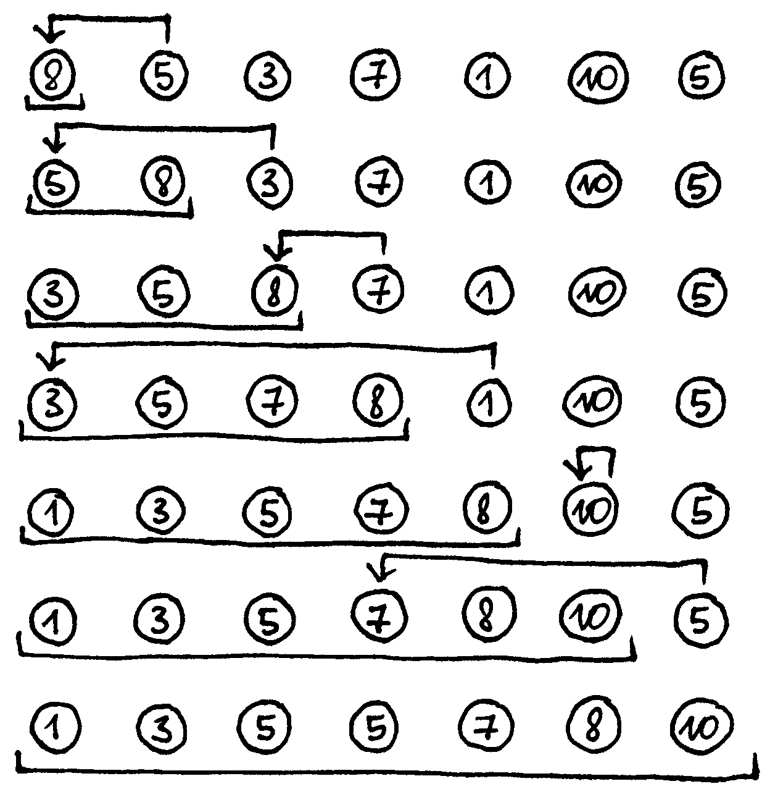
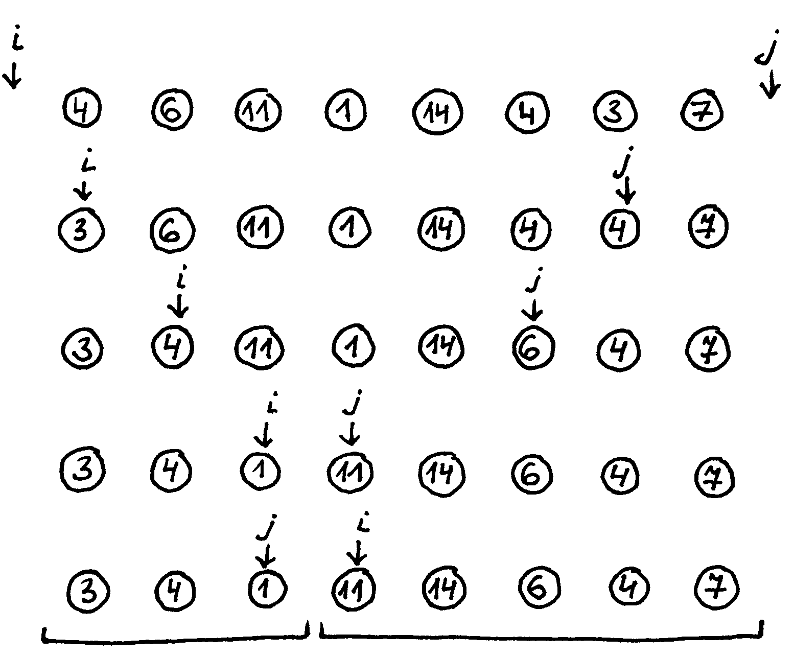
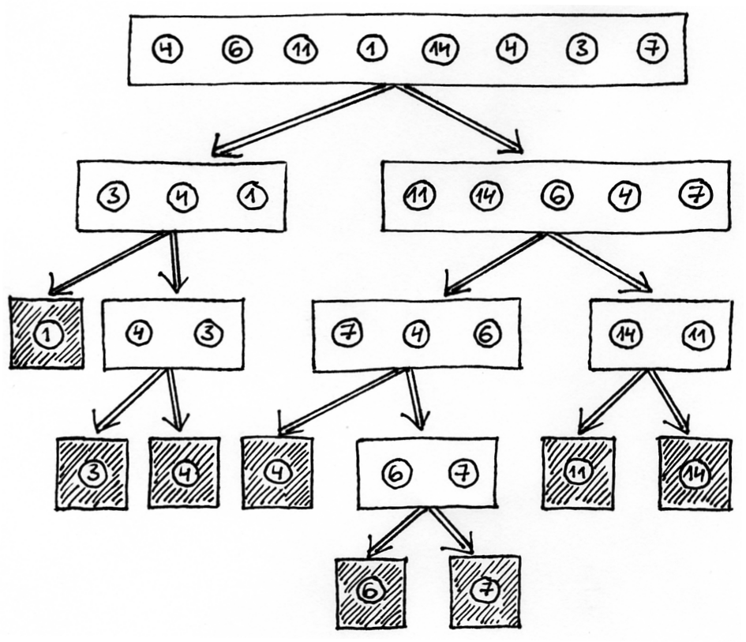
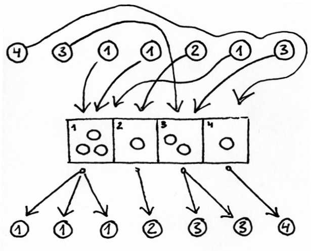
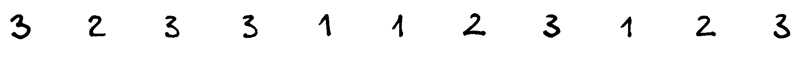
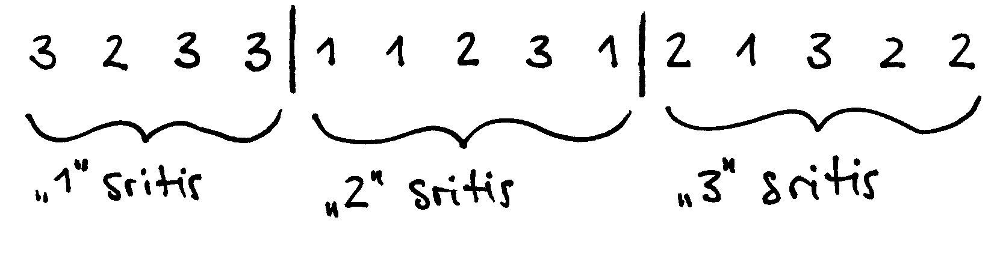
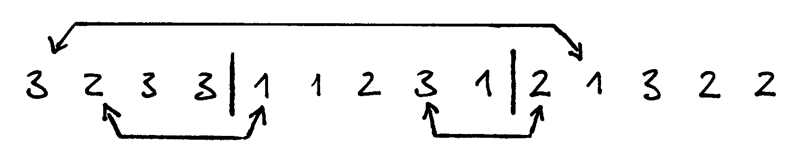
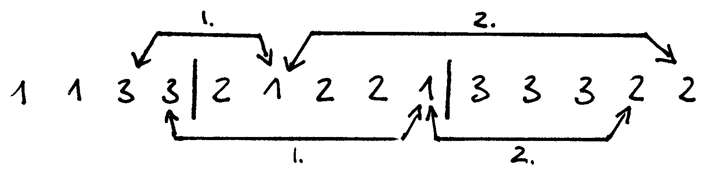
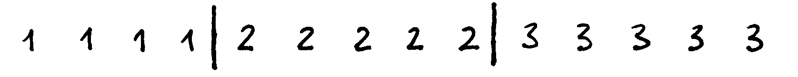

======================
Rikiavimas ir paieška 
======================

  | *Any inaccuracies in this index may be explained by the fact that it has*
  | *been sorted with the help of a computer*
  | *Bet kokie netikslumai šiame sąraše gali būti paaiškinti tuo,*
  | *kad jis buvo išrikiuotas kompiuteriu.*
  | Donaldas Knutas (Donald Knuth)

Su rikiavimo ir paieškos uždaviniais susiduriama labai dažnai.
Rikiavimas ir paieška neretai yra sudėtinė kitų algoritmų dalis.
Norint sėkmingai dalyvauti informatikos olimpiadose, būtina išmanyti
rikiavimo ir paieškos algoritmus. Su jais susipažinsime šiame
skyrelyje.

Rikiavimo uždavinys
===================

Rikiavimo uždavinys apibrėžiamas taip: reikia rasti tokią sekos
:math:`a_1, a_2, \dots, a_n` perstatą
:math:`a_{j1}, a_{j2}, \dots, a_{jn}`, kad
:math:`a_{j1} \leq a_{j2} \leq \dots \leq a_{jn}`.

Praktikoje retai rikiuojama vien tik skaičių seka. Dažniausiai
dirbama su sudėtingesniais duomenimis (įrašais), kurie rikiuojami
pagal vieną ar kelis įrašo laukus. Pastaruoju atveju norint palyginti
du įrašus tenka apibrėžti, kada vienas įrašas „mažesnis“ už
kitą, ir parašyti atskirą loginę funkciją dviems elementams
palyginti.

Kad nekomplikuotume, algoritmus pateiksime rikiuodami skaičių masyvą
didėjimo (nemažėjimo) tvarka:

.. tabs::

  .. tab:: Paskalis

    .. code-block:: unicode_pascal

      const MAXN = ...;   { maksimalus masyvo ilgis }
      type masyvas = array [1..MAXN] of integer;

  .. tab:: C++

    .. code-block:: cpp

      const int MAXN = ...;
      int a[MAXN];

Rikiavimo algoritmų yra daug ir įvairių, tolesniuose skyreliuose
aptarsime tik kelis naudingiausius. Pateiktus algoritmus bus nesunku
pritaikyti ir kitokiems duomenų tipams.

Rikiavimas įterpimu
===================

**Rikiavimo įterpimu** (angl. *Insertion sort*) algoritmo idėja
primena rankoje laikomų kortų rikiavimą – į išrikiuotų kortų
eilę kiekvienu žingsniu įterpiama viena nauja korta.

  Rikiavimo įterpimu pavyzdys

Pradedant rikiuoti masyvą, surikiuota masyvo dalis susideda iš vieno
(pirmojo) elemento. Prieš atliekant :math:`k`-ąjį žingsnį, jau yra
išrikiuota masyvo dalis :math:`[1..k]`, o :math:`k`-uoju žingsniu
:math:`(k + 1)`-asis elementas įterpiamas į šią išrikiuotą
dalį. Įterpimas atliekamas tokiu būdu: :math:`(k + 1)`-asis
elementas įsimenamas, visi didesni už jį išrikiuotos masyvo dalies
elementai paslenkami pirmyn, o šis įterpiamas į naują savo vietą.

.. tabs::

  .. tab:: Paskalis

    .. code-block:: unicode_pascal

      procedure rikiuok(const n : integer;
                       var A : masyvas);
      var i, k, t : integer;
      begin
         for k := 1 to n - 1 do begin
             t := A[k + 1];
             { skaičių t įterpsime į išrikiuotą masyvo dalį [1..k] }
             i := k;
             while (i > 0) and (A[i] > t) do begin
                 A[i + 1] := A[i];
                 i := i - 1;
             end;
             A[i + 1] := t;
          end;
      end;

  .. tab:: C++

    .. code-block:: cpp

      /*
          Pastaba: kintamasis n ir masyvas a aprašytas globaliai
          praeitame kodo pavyzdyje.
      */

      void rikiuok () {
          for (int k = 0; k < n-1; k++) {
              int t = a[k+1];
              // Skaičių t terprsime į išrikiuotą masyvo dalį [1..k]
              int i = k;
              while (i > 0 && a[i] > t) {
                  a[i+1] = a[i];
                  i--;
              }
              a[i+1] = t;
          }
      }

Algoritmo sudėtingumas blogiausiu atveju yra :math:`O(n^2)`. Tuo
nesunku įsitikinti panagrinėjus algoritmo veikimą rikiuojant seką,
kuri jau išrikiuota priešinga tvarka – tuomet kiekvienu žingsniu
elementas įterpiamas į masyvo pradžią. Taigi atliekamų veiksmų
skaičius priklauso nuo pradinės masyvo tvarkos. Kuo tvarkingesnis
(panašesnis į išrikiuotą) yra masyvas, tuo greičiau veikia
rikiavimas įterpimu. Jei tenka rikiuoti beveik išrikiuotą masyvą,
algoritmas veikia beveik tiesiškai.

Algoritmas nėra tinkamas rikiuoti didelių elementų masyvams, kadangi
atliekama itin daug kopijavimo operacijų. Tačiau rikiavimą įterpimu
efektyvu taikyti sąrašų (sudėtingesnių duomenų struktūrų)
rikiavimui – juose elemento įterpimą galima atlikti nekopijuojant
kitų elementų.

Taigi rikiavimą įterpimu verta naudoti, jei masyvas nedidelis, jame
saugomi nedideli elementai arba iš anksto žinoma, kad teks kelis
kartus rikiuoti tą patį masyvą, pavyzdžiui, pakeitus kelis jo
elementus.

Greitasis rikiavimas
====================

**Greitojo rikiavimo** algoritmas (angl. *Quicksort*) perskiria
rikiuojamą masyvą į dvi dalis, ir kiekvieną dalį išrikiuoja
atskirai. Pagalvokime, kokias sąlygas turi tenkinti masyvas, kad
perskyrę jį pusiau ir šias dalis išrikiavę atskirai, gautume
išrikiuotą masyvą. Atsakymas gana paprastas: pirmojoje dalyje turi
būti mažesnieji elementai, o antroje – didesnieji, t.y. pirmoje
dalyje neturi būti jokio elemento, kuris, išrikiavus masyvą,
atsidurtų antroje dalyje ir atvirkščiai.

Deja, nežinomas joks greitas (tiesinis) „perkėlimo“ algoritmas.
Tačiau nenusiminkime. Yra žinomi tiesinio sudėtingumo algoritmai,
kurie, perkeldami mažesniuosius elementus į pirmą dalies pusę,
padalija masyvą *beveik* pusiau. T. y. tikimybė, kad padalijimas bus
neblogas (abiejose pusėse elementų skaičius bus panašus), yra labai
didelė.

Pateiksime funkciją ``perskirk``, perskiriančią masyvo dalį
:math:`[k..d]` į dvi dalis :math:`[k..v]` ir :math:`[v+1..d]` taip, kad
pirmojoje dalyje atsidurtų mažesnieji elementai, o antroje –
didesnieji. Kadangi funkcija ne visuomet masyvo dalį perskiria pusiau,
ji grąžina dalijamojo elemento indeksą v (t. y. vietą, kurioje
masyvo dalis perskiriama). Šios informacijos reikia rikiavimo
algoritmui.

.. tabs::

  .. tab:: Paskalis

    .. code-block:: unicode_pascal

      function perskirk(var A : masyvas;
                       const k, d : integer) : integer;

         procedure sukeisk(var x, y : integer);
         var t : integer;
         begin
             t := x;
             x := y;
             y := t;
         end;

      var x : integer; { dalijamoji reikšmė }
         i, j : integer;
      begin
         x := A[k];
         i := k - 1;
         j := d + 1;
         perskirk := 0;
         while perskirk = 0 do begin { dalis dar neperskirta }
             repeat { praleidžiami elementai, mažesni už x }
                 i := i + 1
             until A[i] >= x;
             repeat { praleidžiami elementai, didesni už x }
                 j := j - 1
             until A[j] <= x;
             if i < j then sukeisk(A[i], A[j])
             else perskirk := j;
         end;
      end;

  .. tab:: C++

    .. code-block:: cpp

      /*
          Pastaba: masyvas a aprašytas globaliai
          viename iš praeitų kodo pavyzdžių.
      */

      int perskirk (int k, int d) {
          int x = a[k]; // dalijamoji reikšmė
          int i = k-1;
          int j = d+1;
          int rez = 0; // grąžinamas rezultatas
          while (rez == 0) {
              do { // praleidžiami elementai, mažesni už x
                  i++;
              } while (a[i] >= x);

              do { // praleidžiami elementai, didesni už x
                  j--;
              } while (a[i] <= x);

              if (i < j)
                  swap(a[i], a[j]);
              else
                  rez = j;
          }

          return rez;
      }

Šis perskyrimo algoritmas pirmiausia pasirenka dalijamąją reikšmę
:math:`x` ir pamažu augina dvi masyvo dalis: :math:`[k..i]` su
mažesniais už :math:`x` elementais ir :math:`[j..d]` su elementais,
didesniais už :math:`x`. Kai indeksai :math:`i` ir :math:`j`
„susitinka“, algoritmas baigia darbą, o funkcija grąžina
perskyrimo vietą. Iš tiesų šioje funkcijoje slepiasi daug svarbių
detalių ir ją programuoti reikia labai atidžiai.

 
  Funkcijos ``perskirk`` veikimo pavyzdys

Dabar nesunku užrašyti greitojo rikiavimo algoritmą:

.. tabs::

  .. tab:: Paskalis

    .. code-block:: unicode_pascal

      procedure rikiuok(var A : masyvas;
                       const k, d : integer);
      var v : integer;
      begin
         if k < d then begin
             v := perskirk(A, k, d);
             { rekursyviai išrikiuojamos kairioji ir dešinioji masyvo dalys }
             rikiuok(A, k, v);
             rikiuok(A, v + 1, d);
         end;
      end;

    Norint surikiuoti :math:`n` elementų seką :math:`A`, į procedūrą
    kreipiamasi ``rikiuok (A, 1, n);``

  .. tab:: C++

    .. code-block:: cpp

      /*
          Pastaba: kintamasis n ir masyvas a aprašytas globaliai
          viename iš praeitų kodo pavyzdžių.
      */

      void rikiuok (int k, int d) {
          if (k < d) {
              int v = perskirk(k, d);
              // rekursyviai išrikiuojamos kairioji ir dešinioji masyvo dalys
              rikiuok (k, v);
              rikiuok (v+1, d);
          }
      }

  // Norint surikiuoti n elementų seką a, kviečiama funkcija:
  rikiuok (0, n-1);

  Greitojo rikiavimo veikimo iliustracija

Nelengva apskaičiuoti greitojo rikiavimo algoritmo sudėtingumą, nes
atliekamų veiksmų skaičius priklauso ne tik nuo duomenų skaičiaus,
bet ir nuo pačių duomenų. Greitojo rikiavimo algoritmo sudėtingumas
blogiausiu atveju yra :math:`O(n^2)`, o vidutiniu –
:math:`O(n \log n)`.

Nors yra rikiavimo algoritmų, net blogiausiu atveju išrikiuojančių
:math:`n` elementų per :math:`O(n \log n)` laiką, greitasis
rikiavimas, nepaisant savo blogiausio atvejo sudėtingumo, praktiškai
yra sparčiausias rikiavimo algoritmas. Be to, jį užrašyti procedūra
nesudėtinga, o jo vykdymui nereikalinga papildoma atmintis.

Dėl išvardytų privalumų greitasis rikiavimas dažnai naudojamas
praktikoje.

Ir įterpimo, ir greitojo rikiavimo algoritmai pagrįsti dviejų
elementų palyginimais, t. y. šių algoritmų sudėtingumas
proporcingas atliekamų palyginimų skaičiui. Yra įrodyta, kad
nepavyks parašyti palyginimais paremto algoritmo, kurio efektyvumas
būtų geresnis nei :math:`O(n \log n)`, kur :math:`n` – rikiuojamos
sekos elementų skaičius. Tačiau duomenims, pasižymintiems tam
tikromis savybėmis, galima sudaryti greitesnių rikiavimo algoritmų.
Vienas tokių – rikiavimas skaičiavimu.

Rikiavimas skaičiavimu
======================

  Rikiavimas skaičiavimu

Rikiavimas skaičiavimu (angl. *Counting sort*) skirtas rikiuoti sekoms,
kurių visi elementai priklauso nedidelei aibei.

Pavyzdžiui, žinome, kad visi masyvo :math:`A` elementai yra sveikieji
skaičiai, priklausantys intervalui :math:`[1, 1000]`. Tuomet atskirame
1000 elementų skaičių masyve :math:`C` įsimenama, kiek kartų
kiekviena reikšmė pasirodo pradiniame masyve :math:`A`. Belieka
pasinaudoti šia informacija ir elementus surašyti atgal į masyvą
:math:`A` didėjimo tvarka. Šio algoritmo sudėtingumas yra
:math:`O(n)` (tiesinis), o jam reikalinga papildoma atmintis priklauso
nuo aibės, kuriai priklauso rikiuojamo masyvo elementai, dydžio.

.. tabs::

  .. tab:: Paskalis

    .. code-block:: unicode_pascal

      const MAXN = ...;   { maksimalus masyvo ilgis }
      type skaičius = 1..1000;
          masyvas = array [1..MAXN] of skaičius;
          intMasyvas = array [skaičius] of integer;
      procedure rikiuok(const n : integer;
                       var A : masyvas);
      var c : intMasyvas;
         i, j : longint;
      begin
         { suskaičiuojama, kiek kokių elementų yra masyve A }
         for i := low(C) to high(C) do
             C[i] := 0;
         for i := 1 to n do
             C[A[i]] := C[A[i]] + 1;
         { visi n masyvo A elementų surašomi iš eilės }
         j := low(C);
         for i := 1 to n do begin
             while C[j] = 0 do
                 j := j + 1;
             C[j] := C[j] - 1;
             A[i] := j;
         end;
      end;

  .. tab:: C++

    .. code-block:: cpp

      const int MAXN = ...; // maksimalus masyvo ilgis
      const int MAXS = ...; // maksimali sekos nario reikšmė

      int n;
      int a[MAXN];
      int c[MAXS+1]; // c[i] nurodys, kiek sekoje yra skaičių i

      void rikiuok () {
          // suskaičiuojama, kiek kokių elementų yra masyve a
          for (int i = 0; i <= MAXS; i++)
              c[i] = 0;
          for (int i = 0; i < n; i++)
              c[a[i]]++;

          // visi n masyvo a elementų surašomi iš eilės
          int j = 0;
          for (int i = 0; i < n; i++) {
              while (c[j] == 0) {
                  j++;
              }
              c[j]--;
              a[i] = j;
          }
      }

Paieškos uždavinys
==================

Paieškos uždavinys apibrėžiamas taip: duota seka
:math:`a_1, a_2, \dots, a_n` ir elementas :math:`x`. Reikia nustatyti,
ar :math:`x` yra šioje sekoje, o jei yra, tai koks jo numeris. Kitaip
sakant, reikia rasti tokį sekos nario indeksą :math:`j`, kad būtų
:math:`a_j = x`, arba nustatyti, kad :math:`x` nėra lygus nė vienam
iš sekos narių.

Praktikoje sekos nariai yra sudėtingi duomenų tipai (įrašai), o
paieška atliekama pagal vieną arba kelis įrašo laukus, vadinamus
paieškos raktu. Paprastumo dėlei paiešką atliksime tik skaičių
sekoje, kurią vaizduosime vienmačiu masyvu.

Tiesinė paieška
===============

Paprasčiausias paieškos algoritmas – iš eilės patikrinti visus
masyvo elementus – vadinamas **tiesine paieška** (angl. *Linear
search*). Patikrinimą, ar :math:`n` ilgio masyve :math:`A` yra
elementas :math:`x`, atlieka tokia funkcija:

.. tabs::

  .. tab:: Paskalis

    .. code-block:: unicode_pascal

      function ieškok (const n, x: integer;
                      var A: masyvas): integer;
      var j: integer;
      begin
         j := 1;
         while (A[j] <> x) and (j < n) do
             j := j + 1;
         if A[j] = x then
             ieškok := j
         else
             ieškok := 0; { elementas nerastas }
      end;

  .. tab:: C++

    .. code-block:: cpp

      const int MAXN = ...; // maksimalus sekos ilgis
      int n, x;
      int a[MAXN];

      int ieskok () {
          for (int i = 0; i < n; i++)
              if (a[i] == x)
                  return i;
          return -1; // elementas nerastas
      }

Baigus vykdyti tiesinę paiešką, funkcijos reikšmė bus lygi ieškomo
elemento indeksui masyve :math:`A` arba nuliui, jei tokio elemento
masyve nėra. Žinoma, priklausomai nuo masyvo rėžių gali tekti
kitaip pažymėti nesėkmingą paieškos baigtį.

Tiesinės paieškos sudėtingumas, kaip teigia ir pats pavadinimas, yra
:math:`O(n)`. Netgi žinant, kad ieškomasis elementas tikrai yra
masyve, vidutiniškai teks atlikti :math:`n / 2` patikrinimų (jei bet
koks elementų išsidėstymas masyve vienodai tikėtinas). Taigi
atliekamų veiksmų skaičius tiesiškai priklauso nuo masyvo ilgio
:math:`n`.

Svarbiausias šio algoritmo privalumas – paprastumas.

Dvejetainė paieška
==================

Daug efektyviau galima atlikti paiešką išrikiuotame masyve –
prisiminkime, kaip greitai randame norimą telefono numerį storoje
telefonų knygoje.

**Dvejetainės paieškos** (angl. *Binary search*) principas labai
paprastas: ieškomasis elementas palyginamas su surikiuotos sekos
viduriniu nariu. Jei jie yra lygūs, vadinasi, radome ieškomą
elementą sekoje. Jei ieškomasis elementas yra mažesnis už vidurinį,
tai juo labiau jis mažesnis ir už visus „dešiniuosius“ sekos
narius, todėl paiešką tęsime kairiojoje sekos dalyje. Analogiškai,
jei ieškomasis elementas didesnis už vidurinį, paiešką tęsime
dešiniojoje masyvo dalyje. Toliau ieškoma tuo pačiu principu, kol
randamas ieškomas elementas arba paieškos sritis tampa tuščia.

Aprašytąjį algoritmą nesudėtinga užrašyti rekursyvia funkcija.
Nesėkmingos paieškos atveju ši funkcija grąžins nulį, o sėkmingos
– ieškomo elemento indeksą masyve.

.. tabs::

  .. tab:: Paskalis

    .. code-block:: unicode_pascal

      function ieškok(x, k, d : integer;
                     var A : masyvas) : integer;
      var v : integer;
      begin
         if k > d then
             ieškok := 0
         else begin
             v := (k + d) div 2;
             { pagal vidurinį masyvo dalies elementą toliau ieškoma
               kairiojoje arba dešiniojoje masyvo dalyje }
             if A[v] > x then
                 ieškok := ieškok(x, k, v - 1, A)
             else if A[v] < x then
                 ieškok := ieškok(x, v + 1, d, A)
             else { trečiuoju atveju A[v] = x (elementas rastas) }
                 ieškok := v;
         end;
      end;

  .. tab:: C++

    .. code-block:: cpp

      int binSearch(int x, vector<int> arr) {
          int lo = 0, hi = masyvas.size()-1;
          // ieskome intervale [0, n-1]
          while (lo < hi) {
              int mid = (lo+hi)/2;
              if (arr[mid] < x) {
                  lo = mid+1;
              } else {
                  hi = mid;
              }
          }
          return mid;
      }

Taigi jei norime sužinoti, ar skaičius :math:`x` yra :math:`n`
elementų masyve :math:`A`, turime patikrinti sąlygą
``ieškok(A, x, 1, n) > 0``.

Dvejetainės paieškos algoritmas kiekvienu žingsniu sutrumpina
paieškos sritį maždaug dvigubai. Kitaip tariant, jei masyvo ilgis
padidėja dvigubai, tai algoritmui tenka atlikti tik vieną papildomą
žingsnį. Dvejetainės paieškos sudėtingumas yra :math:`O(\log n)`,
t. y. logaritminis. Milijardo elementų dydžio masyve paieškai
prireiktų ne daugiau kaip 30 žingsnių. Tačiau sąlygą, kad masyvas
turi būti išrikiuotas, ne visuomet paprasta patenkinti.

Dvejetainės paieškos idėją galima panaudoti ne tik elemento
paieškai išrikiuotame masyve. Geras pavyzdys – žaidimas *Atspėk
skaičių*: pirmasis žaidėjas sugalvoja skaičių nuo 1 iki :math:`n`,
o antrasis bando jį atspėti; po kiekvieno spėjimo pirmasis žaidėjas
pasako, ar jo sugalvotasis skaičius yra mažesnis, didesnis ar lygus
spėtajam; žaidimo tikslas – atspėti skaičių kuo mažesniu
bandymų skaičiumi. Vėliau žaidėjai apsikeičia vaidmenimis. Iš
tiesų dvejetainė paieška – optimali spėjimo strategija. Nepaisant
to, gali laimėti žaidėjas, kuriam tądien labiau sekasi.

Bendriausiu atveju dvejetainę paiešką galima pritaikyti sprendžiant
lygtį :math:`f(x) = y` tam tikrame intervale, kur
:math:`f(x)` – **monotoninė** (nedidėjanti
arba nemažėjanti) **funkcija**.

Kada rikiuoti?
==============

Jei programoje laikome masyvą, kuriame teks ieškoti elementų, reikia
atsakyti į klausimą: ar nerikiuoti masyvo ir atlikti tiesinę
paiešką, ar išrikiuoti masyvą ir ieškoti jame naudojant daug
efektyvesnę dvejetainę paiešką.

Olimpiadose programos paprastumas – didelė vertybė. Todėl visuomet
geriau naudoti kuo paprastesnius algoritmus, jei tik programos veikimo
laikas yra pakankamas.

Tarkime, masyvą sudaro :math:`n` elementų, o jame žadame ieškoti
:math:`m` kartų. Naudodami tiesinę paiešką nerikiuotame masyve,
užtruksime :math:`O(mn)` laiko. Masyvo rikiavimas ir :math:`m` kartų
atlikta dvejetainė paieška užtruktų
:math:`O(n \log n + m \log n)`. Taigi, šiuo atveju rikiuoti masyvą
verta tik tada, kai :math:`m > \log n`.

Rikiavimo uždaviniai olimpiadose, uždavinys *Sekos rikiavimas*
==============================================================

Olimpiadose tiesioginių rikiavimo ar paieškos uždavinių pasitaiko
retai. Daug dažniau rikiavimas ir paieška tėra kito, sudėtingesnio,
algoritmo dalis [#f22]_.

Tuo tarpu uždaviniams, kuriuose tiesiogiai minimas rikiavimas,
dažniausiai reikia sugalvoti kokią nors kitą originalią idėją, o
ne taikyti žinomus rikiavimo ar paieškos algoritmus.

Kaip pavyzdį panagrinėkime pasaulinės informatikų olimpiados uždavinį
*Sekos rikiavimas* [#f23]_.

  Duota skaičių seka, kurios nariai gali įgyti tik tris skirtingas
  reikšmes: vienetą, dvejetą ir trejetą. Seką reikia surikiuoti
  nemažėjimo tvarka. Rikiuojama sukeičiant vietomis po du sekos
  narius.

  **Užduotis.** Reikia rasti minimalų sukeitimo operacijų,
  reikalingų sekai surikiuoti, skaičių.

Toliau pateikti piešiniai iliustruoja rikiavimo algoritmą rikiuojantį
seką minimaliu sukeitimų skaičiumi.

  Uždavinio „Sekos rikiavimas“ sprendimo iliustracija;
  paveiksle pateikta seka, kurią reikia išrikiuoti

  1 žingsnis: suskaičiuojama, kiek sekoje yra vienetų,
  dvejetų ir trejetų (šiuo atveju 4 vienetai, 5 dvejetai ir 5
  trejetai), ir seka padalijama į vienetų, dvejetų ir trejetų sritis

  2 žingsnis: randamos visos poros, kurių narius sukeitus
  vietomis, **abu** atsidurs savo srityse, ir atliekami sukeitimai

  3 žingsnis: ne savo srityse likę skaičiai sukeitinėjami po
  tris; kiekvienam trejetui sutvarkyti prireiks dviejų sukeitimų

  Gavome surikiuotą seką: buvo atlikti 7 sukeitimai,
  sukeitimų skaičius yra minimalus

.. rubric:: Išnašos

.. [#f22]
  Programavimo kalbų C ir C++ standartinėse bibliotekose yra
  realizuoti svarbiausi paieškos ir rikiavimo algoritmai, tad juos
  galima taikyti neprogramuojant šių algoritmų.

.. [#f23]
  Šis uždavinys buvo pateiktas 1996 metais Vengrijoje vykusioje
  Pasaulinėje informatikos olimpiadoje. Čia pateikėme sutrumpintą
  sąlygą.
