===================================================
Pirma pažintis su grafais: paieška platyn ir gilyn 
===================================================

  | *Mathematicians are like Frenchmen: whenever you say something to*
  | *them, they translate it into their own language, and at once it is*
  | *something entirely different.*
  | *Matematikai – kaip prancūzai: kad ir ką jiems bepasakytum, jie*
  | *iškart išverčia tai į savo kalbą, ir tai iškart tampa*
  | *visiškai skirtingu dalyku.*
  | Johanas Volfgangas fon Gėtė (Johann Wolfgang von Goethe)
 
.. figure:: images/vieši/Image-Koenigsberg,_Map_by_Merian-Erben_1652.jpg
  :align: center
  :width: 300px
  :alt: Karaliaučiaus žemėlapis Oilerio laikais

  Karaliaučiaus žemėlapis Oilerio laikais

Per Karaliaučių tekančioje Priegliaus upėje yra dvi gražios salos.
Septyni tiltai jungia krantus su šiomis salomis, taip pat abi salas
tarpusavyje. Maždaug prieš tris šimtus metų Karaliaučiaus
gyventojus sudomino klausimas: ar galimas toks maršrutas, kuris
prasidėtų viename iš krantų, kad per kiekvieną tiltą būtų
pereinama tik vieną kartą, o pasivaikščiojimas pagaliau baigtųsi
ten, kur ir prasidėjo.

1736 m. šio uždavinio ėmėsi garsus šveicarų matematikas Leonardas
Oileris (*Leonhard Euler*). Krantai, salos, tiltai – visa tai jam buvo
tik uždavinio „apvalkalas“: salos buvo tam tikri objektai, o tiltai
– šiuos objektus siejantys ryšiai. Krantus bei salas Oileris
sutapatino su taškais, o tiltus – su linijomis. Jis paprastai
įrodė, jog maršruto, tenkinančio minėtus kriterijus, nėra ir
negali būti. Šitaip buvo pradėta grafų teorija. Tačiau apie tai
vėliau.

Šiame skyrelyje išsiaiškinsime, kas tie grafai, kam jie reikalingi,
taip pat susipažinsime su dviem pirmaisiais grafų teorijos
algoritmais.

Grafo sąvoka
============

**Grafas** yra sąsajų struktūra, nurodanti, kad yra objektų grupė,
ir kad šie objektai yra tarpusavy susiję (arba nesusiję).

Objektai vadinami grafo **viršūnėmis**, o jų ryšius apibūdina
grafo **briaunos**. Jei grafe briauna jungia dvi viršūnes, tai šios
viršūnės vadinamos **gretimomis**. Viršūnei gretimos viršūnės
dar vadinamos jos **kaimynėmis**. Jei briauna jungia viršūnę su ja
pačia, tai ta briauna vadinama **kilpa**.

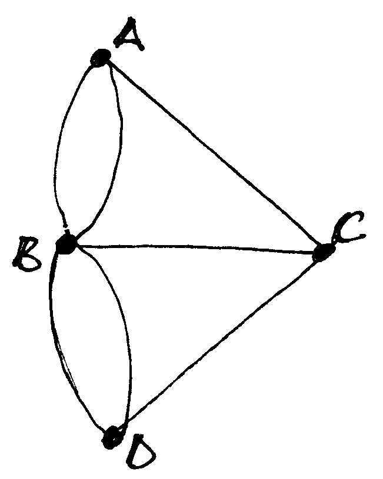

  Karaliaučiaus tiltų brėžinys, kai krantai sutapatinti su
  taškais, o tiltai – su linijomis

Labai svarbi yra grafų geometrinė interpretacija: grafo viršūnes
patogu vaizduoti plokštumos taškais, o briaunas – linijomis,
jungiančiomis viršūnių (taigi taškų) porą. Viršūnių (taškų)
ir briaunų (linijų) geometrinis išdėstymas nesvarbus, svarbus tik
pačių sąsajų pavaizdavimas. Tą patį grafą galima nupiešti
daugybe skirtingų būdų.

.. _img-7-grafas01:

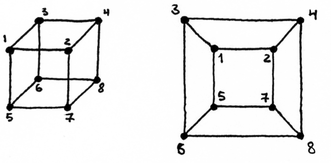

  Tas pats grafas, pavaizduotas dviem skirtingais būdais, grafo
  viršūnės žymimos skaičiais

Matematiškai grafas apibrėžiamas kaip dviejų aibių – viršūnių
ir briaunų – rinkinys: :math:`G = (V, B)`. Briaunų aibės
elementai – tai viršūnių poros. Pavyzdžiui, :numref:`img-7-grafas02`
pav. pavaizduotą
grafą atitinka tokios viršūnių ir briaunų aibės:
:math:`V = \{a, b, c, d, e, f, g\}`,
:math:`B = \{(a, c), (a, f), (b, f), (c, f), (d, e), (d, g)\}`.

.. _img-7-grafas02:

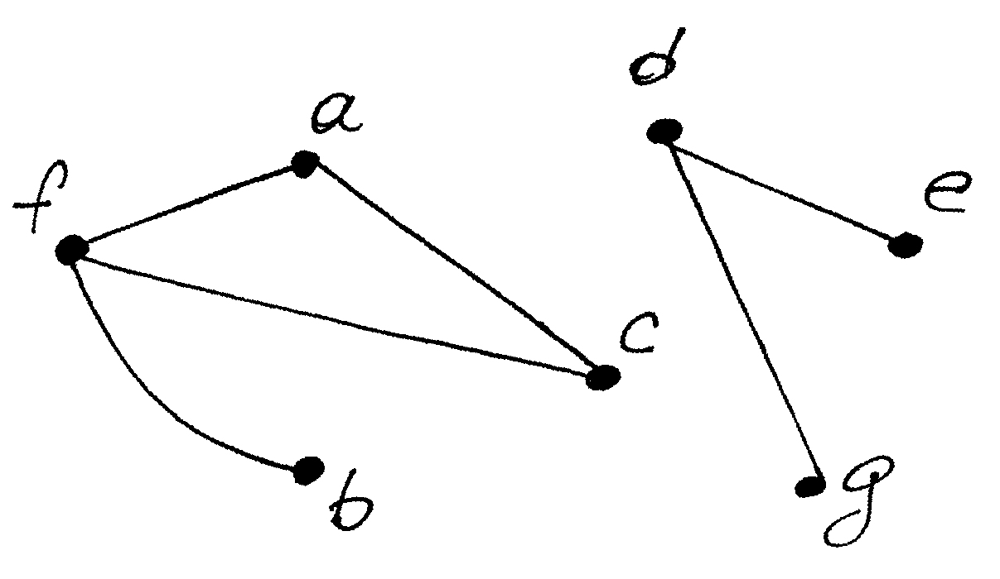

  Grafas, jo viršūnės žymimos raidėmis

Pastabesni galėtų prikibti – aibėje negali būti pasikartojančių
elementų. Tačiau skyrelio pradžioje sutikome grafą, kurio dvi
viršūnes jungia **kelios briaunos** (salą su tuo pačiu krantu jungia
keli tiltai).

Grafai su pasikartojančiomis briaunomis vadinami **multigrafais**.
Tokių grafų matematiniame modelyje aibė pakeičiama multiaibe (aibe,
kurioje elementai gali kartotis). Daugelyje uždavinių vietoj
multigrafo pakanka nagrinėti paprastą grafą, gautą iš multigrafo,
iš kelių dvi viršūnes jungiančių briaunų paliekant tik vieną,
tinkamiausią uždaviniui spręsti.

**Keliu** grafe vadinama gretimų viršūnių seka, kai ta pati briauna
kelyje sutinkama tik vieną kartą, o ta pati viršūnė gali būti
kelyje sutinkama kelis kartus. Jei kelias prasideda ir baigiasi toje
pačioje viršūnėje, jis vadinamas **ciklu**. Kelio ilgis lygus
pereitų briaunų skaičiui.

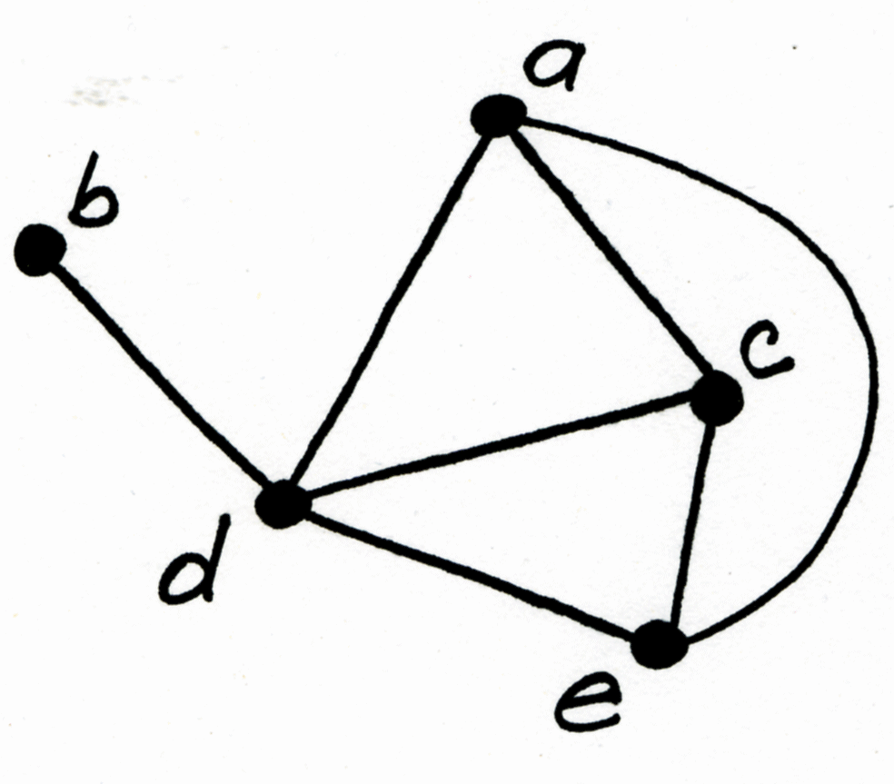

  Viršūnių seka :math:`a-d-c-e-d-b` yra kelias, kurio ilgis
  5, o seka :math:`a-c-d-e-a` yra ciklas (ilgis 4).

Tačiau kam gi reikalinga grafų teorija? Pasirodo, grafų teorijos
„kalba“ galima išreikšti daugelį svarbių (dažnai praktinių)
uždavinių. Vieną jų ką tik matėme – tai maršruto, kai kiekviena
briauna pereinama lygiai vieną kartą, paieška. Grafu galima
pavaizduoti ir miesto planą, briaunomis žymint jo gatves. Tuomet,
kiekvienai briaunai priskyrę po teigiamą skaičių – gatvės ilgį,
galime klausti: koks trumpiausias kelias iš viršūnės :math:`a` į
viršūnę :math:`b`? Šio uždavinio sprendimui taip pat yra efektyvus
algoritmas, kurį pateiksime vėliau.

Ne visuomet ryšys tarp uždavinio ir jo sumodeliavimo grafų teorijos
terminais toks akivaizdus. Štai dar vieno uždavinio pavyzdys: tarkime,
kad :math:`n` vaikų pasirinko mokytis kai kuriuos iš :math:`m`
dalykų. Reikia sudaryti optimalų (kuo glaustesnį) užsiėmimų
tvarkaraštį. Sudarykime grafą, kurio :math:`m` viršūnių atitiks
visus dalykus, o briauna, jungianti viršūnes :math:`a` ir :math:`b`,
reikš, kad bent vienas vaikas pasirinko abu dalykus :math:`a` ir
:math:`b`.

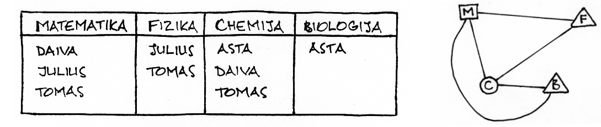

  Viršūnių spalvinimo uždavinys. Sudarę ir nuspalvinę
  pasirinkimų grafą, darome išvadą, kad fizikos ir biologijos
  užsiėmimai gali vykti vienu metu

Dabar galime spręsti *grafo viršūnių spalvinimo uždavinį*: kaip,
panaudojant kuo mažiau spalvų, nuspalvinti grafo viršūnes, kad
jokios dvi gretimos grafo viršūnės nebūtų nuspalvintos ta pačia
spalva. Viena spalva nuspalvintomis viršūnėmis pažymėtų dalykų
užsiėmimai gali vykti vienu metu: tai netrukdys nė vienam
moksleiviui. Taigi svarbioji uždavinio dalis bus išspręsta. Deja,
viršūnių spalvinimo uždaviniui nežinomas joks efektyvus algoritmas.

Grafų vaizdavimas
=================

Grafus vaizduoti aibėmis pagal jų matematinį apibrėžimą
dažniausiai nėra patogu. Tarus, kad grafas turi :math:`n` viršūnių,
sunumeruotų nuo 1 iki :math:`n`, viršūnių aibės nurodyti nebūtina
– pakanka žinoti viršūnių skaičių :math:`n`. Grafo briaunas
paprasčiausia pavaizduoti dvimačiu :math:`n \times n` loginiu
masyvu: elementus :math:`[u, v]` ir :math:`[v, u]` pažymint reikšme
``true``, jei viršūnes su numeriais :math:`u` ir :math:`v` grafe
jungia briauna. Šis masyvas
visuomet [#f24]_ yra simetrinis įstrižainės atžvilgiu.

.. tabs::

  .. tab:: Paskalis

    .. code-block:: unicode_pascal

      const MAXN = ...; { maksimalus grafo viršūnių skaičius }
      type grafas = record
              n : integer;
              briauna : array [1..MAXN,
                               1..MAXN] of boolean;
          end;

  .. tab:: C++

    .. code-block:: cpp

      const int MAXN = ...;  // maksimalus viršūnių skaičius
                            // dažniausiai galima nustatyti pagal sąlygoje pateiktus ribojimus

      int n;                    // viršūnių skaičius
      bool briauna[MAXN][MAXN]; // jei briauna[i][j] == true, tai grafe yra briauna tarp viršūnių i ir j

      // Pastaba: originaliame pavyzdyje grafas pateikiamas kaip struktūra,
      //  tačiau čia kintamuosius ir bool masyvą apsirašome globaliai.

Kol visos masyvo briauna reikšmės lygios false, grafe nėra nė vienos
briaunos. Priklausomai nuo uždavinio pradinių duomenų, kai kurias
viršūnes reikės sujungti briauna. Tai atlieka tokia procedūra:

.. tabs::

  .. tab:: Paskalis

    .. code-block:: unicode_pascal

      procedure papildyk_briauna(var g : grafas;
                                u, v : integer);
      begin
         g.briauna[u, v] := true;
         g.briauna[v, u] := true;
      end;

  .. tab:: C++

    .. code-block:: cpp

      void papildykBriauna (int u, int v) {
          /*
              Kadangi grafo kaimynystės matricą saugojomės
              globaliai (žr. ankstesnį kodą), nereikia
              paties grafo paduoti funkcijos parametruose.
          */

          briauna[v][u] = true;
          briauna[u][v] = true;
      }

Toks grafo vaizdavimas vadinamas **kaimynystės matrica**. Tokio
vaizdavimo kompiuteryje privalumai – jo paprastumas ir galimybė
sparčiai patikrinti, ar dvi viršūnes jungia briauna. Deja, yra ir
svarbus trūkumas – norėdami rasti visas viršūnės :math:`v`
kaimynes, turime patikrinti visą :math:`v`-ąją masyvo ``briauna``
eilutę, tikrindami sąlygą, ar ``briauna[v, u] = true``. Jei grafas
yra **retas** (t. y. jame palyginti nedaug briaunų), tai atmintis,
skiriama beveik tuščiam masyvui, neefektyviai išnaudojama.

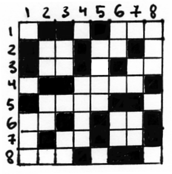

  Kaimynystės matrica pavaizduotas :numref:`img-7-grafas01` grafas; juodi
  langeliai žymi grafo briaunas

Kai grafe briaunų daug (grafas **tankus**), tai šis paprastas
vaizdavimo būdas labai patogus.

Iš anksto žinant, kad grafas bus retas, geriau naudoti kitą
vaizdavimo būdą – **kaimynystės sąrašus** – t. y. kiekvienai
viršūnei saugoti jai gretimų viršūnių (jos kaimynių) sąrašą.

Naudojant sudėtingesnes dinamines duomenų struktūras šiems sąrašams
saugoti, galima sutaupyti atminties. Tačiau olimpiadose, jei tik
įmanoma, geriau vengti dinaminių duomenų struktūrų – jas kur kas
sudėtingiau teisingai realizuoti per trumpą laiką.

Savo pavyzdžiuose paprastumo dėlei kaimynių sąrašą saugosime
masyvu. Kadangi iš anksto nežinome, kiek daugiausiai kaimynių gali
turėti kiekviena viršūnė, tai šių masyvų ilgis bus toks, koks
gali būti didžiausias viršūnių skaičius.

.. tabs::

  .. tab:: Paskalis

    .. code-block:: unicode_pascal

      const MAXN = ...; { maksimalus grafo viršūnių skaičius }
      type viršūnė = record
              k : integer;               { kaimynių skaičius }
              ksąrašas : array [1..MAXN] of integer;
                                         { kaimynių sąrašas }
          end;
          grafas = record
              n : integer;                 { viršūnių skaičius }
              vir : array [1..MAXN] of viršūnė;
                                           { viršūnių sąrašas }
          end;

  .. tab:: C++

    .. code-block:: cpp

      const int MAXN = ...;  // maksimalus galimas viršūnių skaičius
                            // dažniausiai galima nustatyti pagal sąlygoje pateiktus ribojimus

      int n;                 // viršūnių skaičius
      vector<int> adj[MAXN]; // adj[i] yra i-tosios viršūnės kaimynų sarašas

      // Pastaba: pascal kalbos kode grafas pateikiamas kaip struktūra,
      //  tačiau čia kintamuosius ir kaimynystės sąrašą apsirašome globaliai.

Kai grafe nėra briaunų, visų viršūnių kaimynių skaičiaus
atributas lygus nuliui. Įterpti briauną :math:`(u, v)` į šitaip
vaizduojamą grafą reiškia papildyti viršūnių :math:`u` ir
:math:`v` kaimynių sąrašus. Tai atlieka tokia procedūra:

.. tabs::

  .. tab:: Paskalis

    .. code-block:: unicode_pascal

      procedure papildyk_briauna(var g : grafas;
                                u, v : integer);
      begin
         with g do begin
             inc(vir[u].k);
             vir[u].ksąrašas[vir[u].k] := v;
             if v <> u then begin { jei tai ne kilpa }
                 inc(vir[v].k);
                 vir[v].ksąrašas[vir[v].k] := u;
             end;
         end;
      end;

  .. tab:: C++

    .. code-block:: cpp

      void papildykBriauna (int u, int v) {
          /*
              Kadangi grafo kaimynystės sąrašą saugojomės
              globaliai (žr. ankstesnį kodą), nereikia
              paties grafo paduoti funkcijos parametruose.
          */

          adj[u].push_back (v);
          if (u != v) { // jei tai ne kilpa
              adj[v].push_back (u);
          }
      }

Nors surasti vienos viršūnės kaimynes galime labai greitai,
patikrinti, ar viršūnes :math:`u` ir :math:`v` grafe jungia briauna
tapo sudėtingiau: tam reikia perbėgti vienos iš šių viršūnių
kaimynių sąrašą, ieškant antrosios.

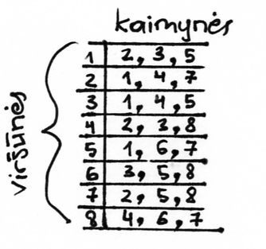

  Taip atrodys :numref:`img-7-grafas01` paveikslo grafas, jį pavaizdavus
  kaimynystės sąrašais

Kurį iš aptartų vaizdavimo būdų pasirinkti? Tai priklauso nuo
sprendžiamo uždavinio. Daugelyje algoritmų tenka surasti duotosios
viršūnės kaimynes, o rečiau – patikrinti, ar viršūnes jungia
briauna. Kai reikalingas abiejų šių operacijų efektyvumas, tą patį
grafą gali tekti vaizduoti dviem būdais.

Galimas ir dar kitoks grafo pavaizdavimo būdas. Jei grafe viršūnių
labai daug, o briaunų nedaug, galime saugoti briaunų (viršūnių
porų) sąrašą. Tuomet briauną, jungiančią viršūnes :math:`u` ir
:math:`v`, verta vaizduoti dviem poromis: :math:`(u, v)` ir
:math:`(v, u)`. Išrikiavę tokį sąrašą, konkrečios briaunos
paiešką galime atlikti per :math:`O(\log b)` laiko (:math:`b` –
briaunų skaičius), pasitelkę dvejetainę paiešką. Praktikoje šis
būdas retai naudojamas.

.. _skyrelis-paieška-gilyn:

Paieška gilyn
=============

  | *Karalaitė slapta padavė Tesėjui kamuoliuką siūlų ir pamokė,*
  | *ką reikia daryti, kad nepaklystų vingiuotuose paslaptingojo*
  | *statinio koridoriuose. Tesėjas pririšo siūlo galą prie labirinto*
  | *angos ir, eidamas priekin, vyniojo rankoje laikomą kamuoliuką.*
  | Iš graikų mitų

Pirmieji grafų algoritmai, su kuriais susipažinsime, – tai paieška
grafe gilyn ir platyn. Pradėjus nuo kažkurios viršūnės, aplankomos
visos kitos briaunomis pasiekiamos viršūnės. Dvi skirtingos
viršūnių aplankymo strategijos – paieška gilyn ir platyn –
dažnai yra kitų algoritmų sudėtinė dalis.

Pradėsime nuo **paieškos gilyn** (angl. *Depth-First Search, DFS*),
jos principas panašus į grįžimo metodo. Algoritmo parametras yra
pradžios viršūnė :math:`v_0`, iš jos aplankomos kitos viršūnės:
aplankius viršūnę :math:`v_0`, aplankoma dar neaplankyta :math:`v_0`
kaimynė :math:`v_1`, tada ieškoma dar neaplankyta :math:`v_1` kaimynė
:math:`v_2` ir taip toliau, kol pasiekiama viršūnė :math:`v_m`, kuri
nebeturi neaplankytų kaimynių. Tuomet grįžtama vieną žingsnį ir
žiūrima, ar viršūnė :math:`v_{m-1}` dar turi nors vieną
neaplankytą kaimynę :math:`v'_m`. Jei turi, – ieškoma gilyn, jei ne
– grįžtama dar per vieną žingsnį ir t. t. Paiešką gilyn, kaip
ir grįžimo metodu pagrįstus algoritmus, paprasta realizuoti naudojant
rekursiją.

Skirtingai negu grįžimo metodas, paieška gilyn yra efektyvus
algoritmas, kadangi kiekviena grafo viršūnė aplankoma tik vieną
kartą. Tuo tarpu jei taikytume grįžimo metodą, ta pati viršūnė
galėtų būti aplankyta daug kartų, nes būtų išbandomi visi
įmanomi keliai grafe, prasidedantys viršūnėje :math:`v_0`.

Paieškos gilyn algoritmas veikimo metu kiekvieną viršūnę nuspalvina
tam tikra spalva – balta, pilka arba juoda. Viršūnių spalvoms
žymėti aprašysime specialų duomenų tipą:

.. code-block:: unicode_pascal

  type spalvos = (balta, pilka, juoda);

Prieš pradedant vykdyti algoritmą visos viršūnės nuspalvinamos
baltai (pažymimos neaplankytomis). Algoritmo veikimo metu, aplankant
viršūnę, ji nuspalvinama pilkai, o įvykdžius algoritmą su visomis
neaplankytomis jos kaimynėmis – juodai.

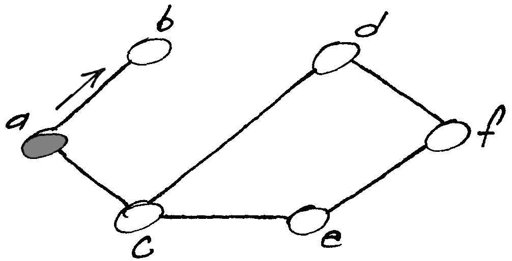
.. |dfs_b| image:: images/7_skyrius/39_lin_dfs_b.png
  :width: 300px
  :alt: 2 žingsnis
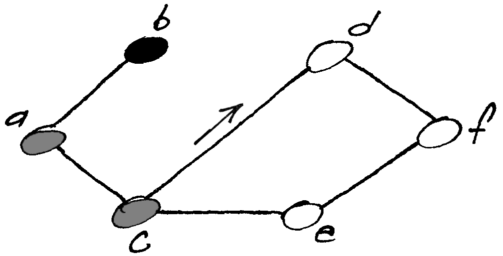
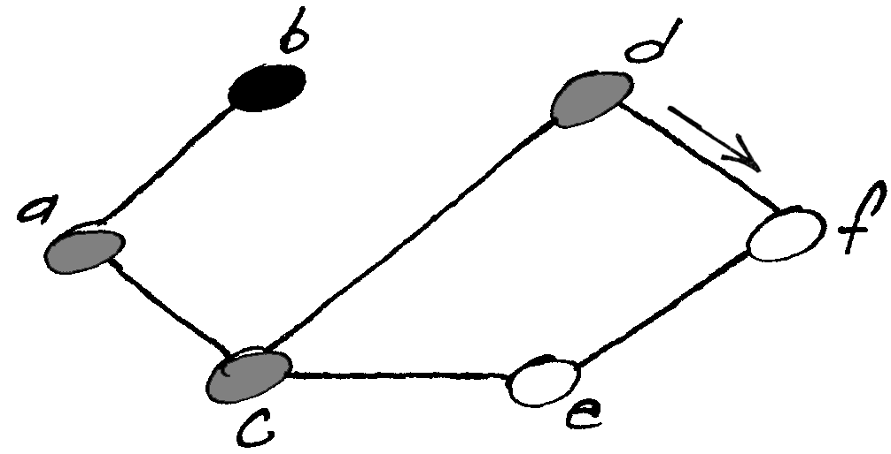
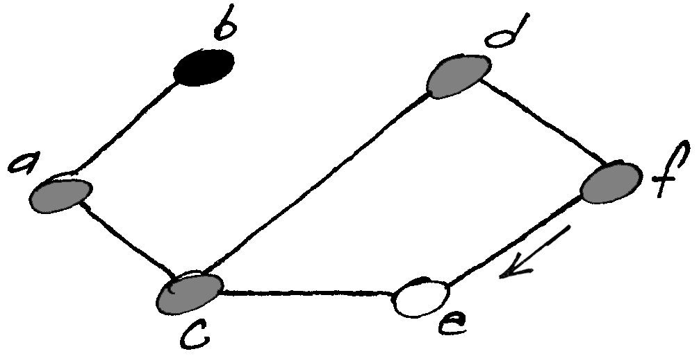
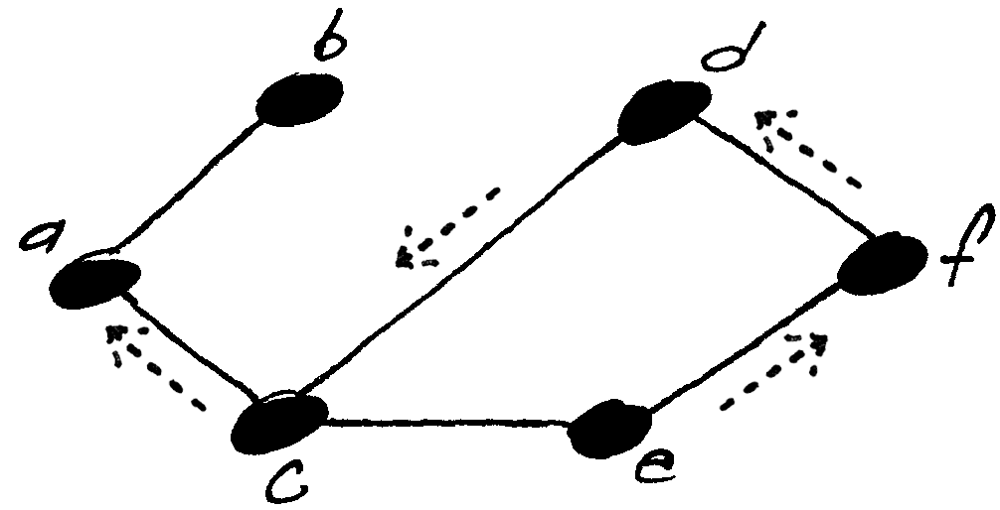

.. table::
  Paieškos gilyn veikimo iliustracija, kai pradine viršūne pasirinkta
  viršūnė :math:`a`.

  +---------+---------+
  | |dfs_a| | |dfs_b| |
  +---------+---------+
  | |dfs_c| | |dfs_d| |
  +---------+---------+
  | |dfs_e| | |dfs_f| |
  +---------+---------+

Algoritmas taip pat išsaugo paieškos į gylį pirminumo medį, t. y.
kiekvienai viršūnei įsimena, iš kurios ši buvo aplankyta.

.. figure:: images/7_skyrius/40_lin_dfs-medis.png
  :align: center
  :width: 300px
  :alt: Paieškos gilyn pirminumo medis

  Paieškos gilyn pirminumo medis

Žemiau pateiktas algoritmo tekstas Paskalio ir C++ kalbomis. Algoritmo veikimo
metu dažnai reikės rasti kurios nors viršūnės kaimynes, todėl
grafą vaizduosime kaimynystės sąrašais.

.. tabs::

  .. tab:: Paskalis

    .. code-block:: unicode_pascal

      type spalvos = (balta, pilka, juoda);
          sp_masyvas = array [1..MAXN] of spalvos;
          masyvas = array [1..MAXN] of integer;
      var spalva : sp_masyvas;  { pradinės reikšmės – balta}
         pirminė : masyvas;    { pradinės reikšmės – 0}

      procedure ieškok_gilyn(var g: grafas;
                            v : integer { aplankoma viršūnė });
        { Procedūra ieškok_gilyn nepakeičia grafo g, tačiau kintamasis g
          perduodamas kaip parametras-kintamasis, nes kurti sudėtingos
          duomenų struktūros kopiją būtų neefektyvu. }
      var u, i : integer;
      begin
         spalva[v] := pilka;
         with g do
             { toliau paieška iš eilės vykdoma visose neaplankytose
               (baltose) kaimynėse }
             for i := 1 to vir[v].k do begin
                 u := vir[v].ksąrašas[i];
                 if spalva[u] = balta then begin
                     pirminė[u] := v;
                     ieškok_gilyn(g, u);
                 end;
             end;
         spalva[v] := juoda;
      end;

  .. tab:: C++

    .. code-block:: cpp

      int spalva[MAXN];      // spalva[i] yra 0, jei i-tosios viršūnės spalva yra balta,
                            //               1 - jei pilka,
                            //               2 - jei juoda
                            // pradinės reikšmės - 0
      int pirmine[MAXN];     // prieš kviečiant DFS reiktų nustatyti pradines reikšmes į -1

      void dfs (int v) {
          spalva[v] = 1;            // nuspalvinam viršūnę v pilkai
          for (int u : adj[v]) {    // einame per kaimynų sąrašą
              if (spalva[u] == 0) { // kaimyninė viršūnė u yra dar neaplankyta
                  pirmine[u] = v;
                  dfs (u);
              }
          }
          spalva[v] = 2;            // nuspalvinam viršūnę v juodai
      }

Iškvietus ``ieškok_gilyn(v0)``, visos viršūnės, kurias galima
pasiekti briaunomis iš viršūnės :math:`v_0`, bus pažymimos juodai.
Atspausdinti kelią, kuriuo buvo pasiekta viršūnė :math:`u`, nesunku
pasinaudojus masyve ``pirminė`` išsaugota informacija:

.. tabs::

  .. tab:: Paskalis

    .. code-block:: unicode_pascal

      procedure spausdink_kelią(u : integer);
      begin
         if pirminė[u] <> 0 then
             spausdink_kelią(pirminė[u]);
         writeln(u);
      end;

  .. tab:: C++

    .. code-block:: cpp

      void spausdinkKelia (int u) {
          if (pirmine[u] != -1) // jei tai nėra pradinė viršūnė (nuo kurios pradėjom paiešką gilyn)
              spausdinkKelia (pirmine[u]);
          cout << u << "\n";
      }

Iš tiesų algoritme pakaktų viršūnes spalvinti tik dviem spalvomis:
atskirti aplankytas nuo neaplankytų. Tačiau naudojant tris spalvas
algoritmas tampa aiškesnis. Be to, gali būti naudinga atskirti
viršūnes, kuriose pradėtas vykdyti paieškos gilyn algoritmas, bet
nebaigtas (pilkas viršūnes), pavyzdžiui, norint pritaikyti paieškos
gilyn algoritmą ciklo paieškai.

Procedūros ``ieškok_gilyn`` sudėtingumas yra :math:`O(b)`, kur
:math:`b` yra grafo briaunų skaičius. Tokiam efektyvumui pasiekti
grafą būtina vaizduoti kaimynystės sąrašais. Jei grafą vaizduotume
kaimynystės matrica, galėtume pasiekti tik :math:`O(n^2)`
sudėtingumą.

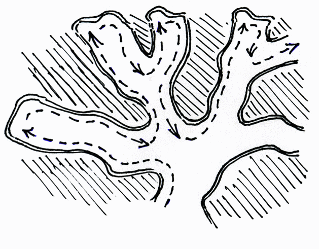

  Labirintas; brūkšnine linija pavaizduotas kelias, kuris
  rodo, kaip apeinamas labirintas

Kaip tik paieška gilyn ir naudojosi Tesėjas, ieškodamas labirinte
Minotauro. Kiekvienoje koridorių sankirtoje jis pasirinkdavo tolimesnę
kryptį ir jei prieidavo aklavietę, grįždavo atgal iki praeitos
sankirtos bandyti kitos krypties. O jei toje sankirtoje visi koridoriai
jau išbandyti – grįždavo į dar ankstesnę sankirtą ir taip
toliau. Siūlas padėjo Tesėjui rasti Minotaurą.

Patikrinimas, ar grafas jungus
==============================

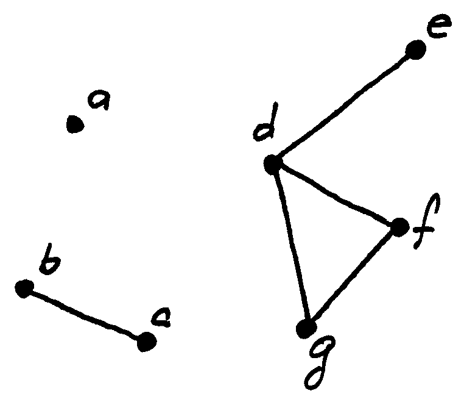

  Nejungus grafas, sudarytas iš trijų jungumo komponentų

Grafas yra **jungus**, jei iš bet kurios viršūnės galima pasiekti
bet kurią kitą viršūnę einant briaunomis. Priešingu atveju grafas
vadinamas **nejungiu**.

Nejungus grafas yra sudarytas iš jungių dalių, vadinamų **jungumo
komponentais**.

Grafo jungumą tenka tikrinti sprendžiant įvairiausius uždavinius.
Paprasčiausia tai padaryti taikant paiešką į gylį grafe.
Pritaikysime praeitame skyrelyje pateiktą algoritmą, grafą
vaizduosime kaimynystės sąrašais. Šiuo atveju viršūnes užteks
spalvinti tik dviem spalvomis (t. y. atskirti aplankytas nuo
neaplankytų), tad tam naudosime loginį masyvą. Pirminės viršūnės
taip pat nesvarbios, taigi paiešką gilyn realizuoti bus paprasčiau.
Tačiau paieškos gilyn procedūrą papildysime skaičiavimu, kiek
viršūnių aplankyta. Grafas yra jungus tada ir tik tada, jei
įvykdžius paiešką gilyn iš bet kurios jo viršūnės, bus
aplankytos **visos** grafo viršūnės.

.. tabs::

  .. tab:: Paskalis

    .. code-block:: unicode_pascal

      function jungus(var g : grafas) : boolean;
      var aplankyta : array [1..MAXN] of boolean;
         procedure ieškok_gilyn(v : integer;
                                var sk : integer);
         { v – aplankoma viršūnė, sk – aplankytų viršūnių skaičius }
         var u, i : integer;
         begin
             aplankyta[v] := true;
             inc(sk);
             with g do
                 for i := 1 to vir[v].k do begin
                     u := vir[v].ksąrašas[i];
                     if not aplankyta[u] then
                         ieškok_gilyn(u, sk);
                 end;
         end;
      var v, sk : integer;
      begin
         for v := 1 to g.n do
             aplankyta[v] := false;
         sk := 0;
         ieškok_gilyn(1, sk);
         { jei buvo aplankytos visos viršūnės – tai grafas jungus }
         jungus := sk = g.n;
      end;

  .. tab:: C++

    .. code-block:: cpp

      bool aplankyta[MAXN];
      int sk = 0;            // kiek viršūnių aplankėm

      void dfs (int v) {
          aplankyta[v] = true;
          sk++;
          for (int u : adj[v]) // einame per viršūnės v kaimynų sąrašą
              if (!aplankyta[u])
                  dfs (u);
      }

      bool jungus () {
          for (int i = 0; i < n; i++)
              aplankyta[i] = false;
          sk = 0;
          dfs (0);
          return (sk == n);
      }

Uždavinys *Epidemijos modeliavimas*: grafo jungumo komponentų paieška
=====================================================================

Taikydami grafų teoriją išspręsime pirmą konkretų uždavinį
*Epidemijos modeliavimas* [#f26]_:

  Plinta pavojinga paukščių liga. Jeigu paukštis užsikrečia šia
  liga, tai nuo jo užsikrės visi kiti paukščiai, turintys su juo
  nuolatinius kontaktus, po to nuo jų užsikrės dar kiti (turintys
  nuolatinius kontaktus su naujai užsikrėtusiais) ir t. t.
  Paukščiai, neturintys tarpusavyje nuolatinių kontaktų, tiesiogiai
  vienas nuo kito užsikrėsti negali.

  **Užduotis.** Žinoma, kad :math:`m` paukščių jau yra užsikrėtę liga,
  ir žinomos visos paukščių poros, turinčios nuolatinius kontaktus.
  Deja, nežinoma, kurie iš visų :math:`n` paukščių jau yra
  užsikrėtę. Reikia nustatyti, kiek daugiausiai šios rūšies
  paukščių gali užsikrėsti dėl epidemijos.

Paukščiai atitiks grafo viršūnes, o nuolatiniai kontaktai –
briaunas. Grafas gali būti nejungus, t. y. jame gali egzistuoti
keletas jungių komponentų, kuriuos toliau sprendimo aprašyme
vadinsime paukščių šeimomis. Atskiru atveju šeimą gali sudaryti
tik vienas paukštis.

Jei užsikrės nors vienas paukštis iš šeimos, tai nuo šio
paukščio užsikrės visa šeima. Tad užsikrėtusių paukščių bus
daugiausiai, jei iš pradžių bus užsikrėtę po vieną paukštį iš
kuo gausesnių šeimų.

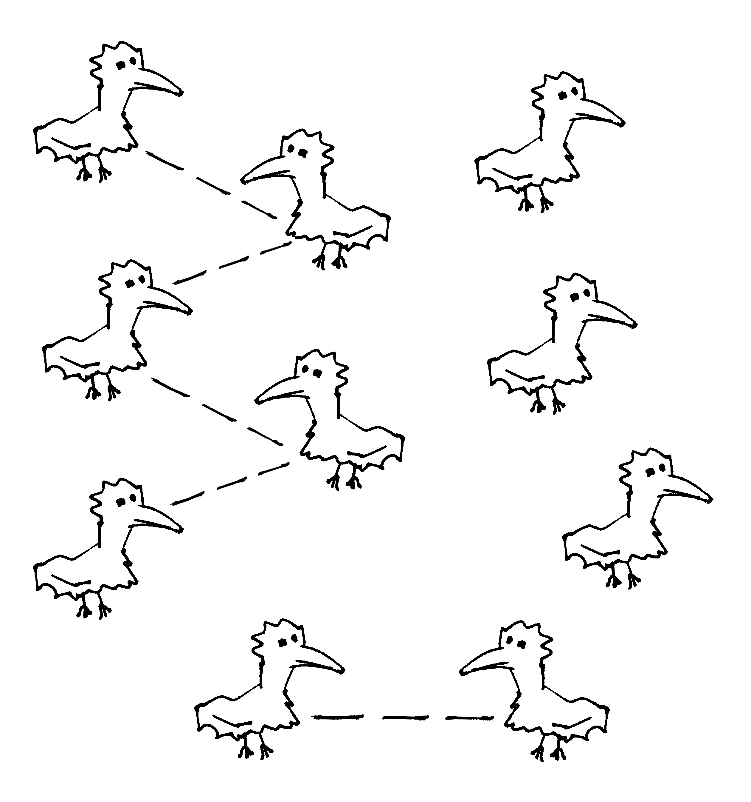

  Kontaktus palaikantys paukščiai sujungti punktyrine linija

Taigi norint išspręsti šį uždavinį, reikia rasti viršūnių skaičių
kiekviename **jungumo komponente**, tuomet jas išrikiuoti nedidėjimo
tvarka ir suskaičiuoti, kiek yra viršūnių didžiausiuose :math:`m`
komponentų.

Piešinyje pateiktame pavyzdyje yra penkios paukščių šeimos: tris
šeimas sudaro vieniši paukščiai, vieną šeimą sudaro paukščių
pora, o dar vieną – penki paukščiai. Išrikiavę gautume: 5, 2, 1,
1, 1.

Sakykime, užsikrėtė 3 paukščiai. Tad didžiausias galimų
užsikrėtusių paukščių skaičius lygus: 5 + 2 + 1 = 8.

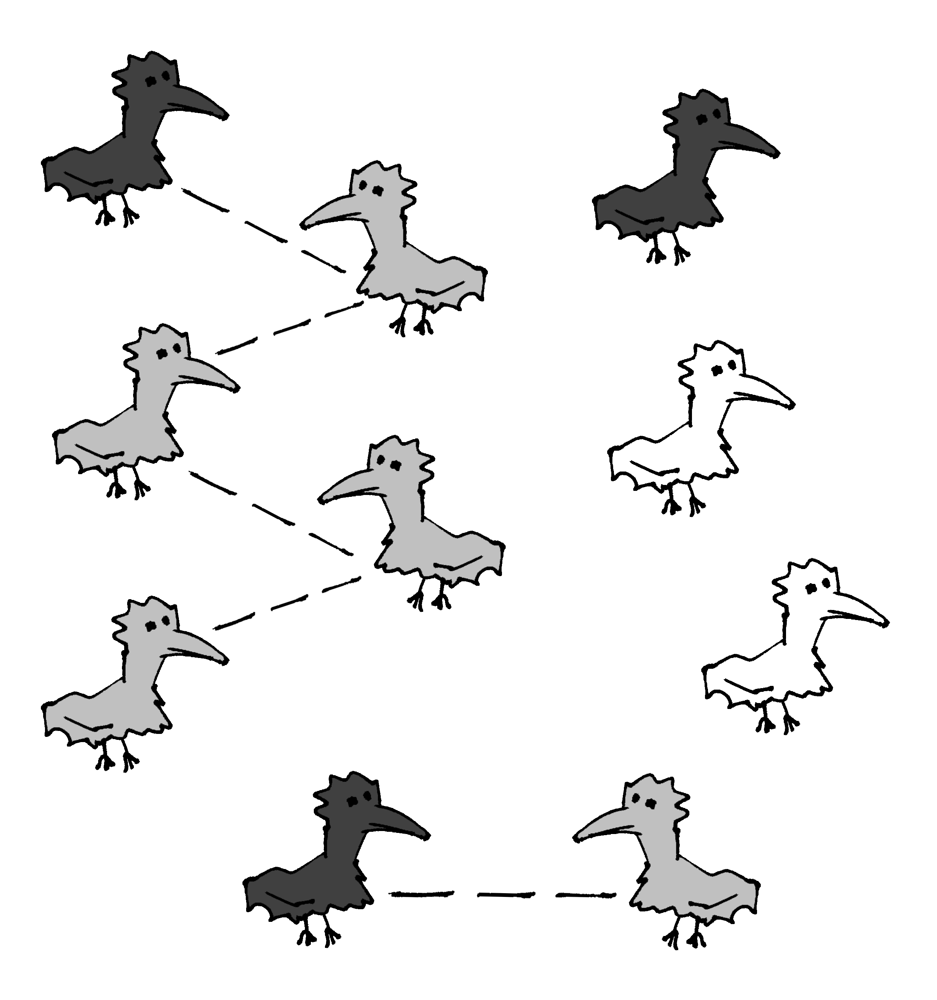

  Užsikrėtus trims, gali nukentėti daugiausiai aštuoni paukščiai

Tačiau kaip ieškoti jungumo komponentų? Pasirinkime bet kurią grafo
viršūnę – ji priklauso kažkokiam grafo jungumo komponentui. Jei
pradėdami joje įvykdysime paiešką gilyn, tai bus aplankomos visos
komponento viršūnės. Todėl norėdami suskaičiuoti, kiek jungumo
komponentų sudaro grafą, galime iteruoti per visas grafo viršūnes ir
radę neaplankytą, vykdyti paiešką gilyn (aplankančią visas aptikto
komponento viršūnes). Kiek kartų iteruodami aptiksime neaplankytą
viršūnę, tiek ir jungumo komponentų yra grafe.

Šiame uždavinyje svarbu sužinoti ir pačių komponentų dydžius,
todėl panaudosime paieškos gilyn procedūrą, kurią naudojome grafo
jungumo tikrinimui – įsimenančią, kiek viršūnių buvo aplankyta
paieškos metu.

.. tabs::

  .. tab:: Paskalis

    .. code-block:: unicode_pascal

      type log_mas = array [1..MAXN] of boolean;
          masyvas = array [1..MAXN] of integer;
      function užsikrės(var g : grafas;
                           m : integer): integer;
      { m – jau užsikrėtusių paukščių skaičius;
       g – grafas, vaizduojamas kaimynystės sąrašais }
      var aplankyta : log_mas;
         i, komp_sk, iki : integer;
         komp_dydis : masyvas;
      begin
          for i := 1 to g.n do
             aplankyta[i] := false;
         komp_sk := 0;
         for i := 1 to g.n do
             if not aplankyta[i] then begin
                 komp_sk := komp_sk + 1;
                 komp_dydis[komp_sk] := 0;
                 ieškok_gilyn (i, komp_dydis[komp_sk]);
                  { Procedūros ieškok_gilyn teskstą rasite 7.4 skyrelyje. }
             end;
         rikiuok(komp_sk, komp_dydis);
          { Procedūros rikiuok tekstą rasite 6.2 skyrelyje (jei
            pasirinksite rikiavimą įterpimu) arba 6.3 skyrelyje (jei
            pasirinksite greitąjį rikiavimą ir modifikuosite kreipinį). }

          užsikrės := 0;
         { užsikrėtusių paukščių gali būti daugiau
           nei jungumo komponentų }
         if m > komp_sk then
             iki := 1
         else
             iki := komp_sk - m + 1;
         for i := komp_sk downto iki do
             užsikrės := užsikrės + komp_dydis[i];
      end;

  .. tab:: C++

    .. code-block:: cpp

      bool mazejimo (int a, int b) { // funkcija rikiavimui mažėjimo tvarka
          return a > b;

      }

      const int MAXN = ...;  // maksimalus grafo viršūnių skaičius
                            // jį galima sužinoti iš sąlygoje pateiktų ribojimų

      int n;                 // viršūnių skaičius
      vector<int> adj[MAXN]; // kaimynystės sąrašas
      bool aplankyta[MAXN];
      vector<int> kompDydis; // komponentų dydžių sąrašas

      int sk = 0;            // kiek viršūnių aplankėm

      void dfs (int v) {
          aplankyta[v] = true;
          sk++;
          for (int u : adj[v]) // einame per viršūnės v kaimynų sąrašą
              if (!aplankyta[u])
                  dfs (u);
      }

      int uzsikres (int m) { // m - jau užsikrėtusių paukščių skaičius (duodamas įvestyje)
          for (int i = 0; i < n; i++)
              aplankyta[i] = false;

          for (int i = 0; i < n; i++) {
              if (!aplankyta[i]) {
                  sk = 0;
                  dfs (i);
                  kompDydis.push_back (sk);
              }
          }

          sort (kompDydis.begin(), kompDydis.end(), mazejimo);    // surikiuojam dydžius mažėjimo tvarka

          int ats = 0;
          int iki;

          if (m > (int)kompDydis.size()) // užsikrėtusių paukščių gali būti daugiau nei jungumo komponentų
              iki = (int)kompDydis;
          else
              iki = m;

          for (int i = 0; i < iki; i++)
              ats += kompDydis[i];

          return ats;
      }

.. _skyrelis-paieška-platyn:

Paieška platyn
==============

**Paieškos platyn** (angl. *Breadth-First Search, BFS*) algoritmas
aplanko viršūnes pagal griežtą taisyklę: pradėjus nuo pasirinktos
viršūnės (tarkime, :math:`p`), aplankomos visos viršūnės, kurios
pasiekiamos iš :math:`p` viena briauna (vienu ėjimu), tuomet –
pasiekiamos iš :math:`p` dvejomis briaunomis (dviem ėjimais) ir t. t.

Kaip užtikrinti tokią viršūnių lankymo tvarką? Algoritmas naudoja
aplankytų viršūnių eilę: pirmiausia į eilę įrašoma pradinė
viršūnė; kol eilė netuščia, iš jos pradžios imama viršūnė ir
visos neaplankytos jos kaimynės įrašomos į eilės galą. Šitaip
eilėje pirmiausia atsiduria viršūnės, pasiekiamos viena briauna,
tada – dviem briaunomis ir t. t.

Programuodami paiešką gilyn panaudojome rekursiją, tad nekonstravome
savo dėklo [#f29]_ duomenų struktūros. Paieškai platyn jau
reikalinga eilės duomenų struktūra:

.. code-block:: unicode_pascal

  type eilė = record
           duom : array [1..MAXN] of integer;
           pradžia, pabaiga : integer;
       end;

Nauji elementai dedami į eilės galą, o imami iš eilės pradžios.
Žemiau pateiktos procedūros su eile atlieka veiksmus, kurių reikės
paieškos platyn algoritmui:

.. tabs::

  .. tab:: Paskalis

    .. code-block:: unicode_pascal

      procedure išvalyk(var eil : eilė);
      begin
         eil.pradžia := 0;
         eil.pabaiga := 0;
      end;
      function tuščia(var eil : eilė) : boolean;
      begin
         tuščia := eil.pradžia = eil.pabaiga;
      end;
      procedure įdėk(var eil : eilė; x : integer);
      begin
         eil.pabaiga := eil.pabaiga + 1;
         eil.duom[eil.pabaiga] := x;
      end;
      function išimk(var eil : eilė) : integer;
      begin
         eil.pradžia := eil.pradžia + 1;
         išimk := eil.duom[eil.pradžia];
      end;

  .. tab:: C++

    .. code-block:: cpp

      /*
          Pastaba: C++ kalboje jau yra suimplementuota eilė:
          #include <queue>
          queue<int> q;
          Tokia eilė palaiko visas reikiamas operacijas:
          q.push(x) - įdeda į eilės galą skaičių x
          q.front() - grąžina eilės priekyje esantį elementą
          q.pop()   - pašalina iš eilės priekinį elementą

          Visgi, įdomumo dėlei, pateikiame ir eilės kaip struktūros
          implementaciją, analogišką užrašytai Paskalio kalba.
      */

      struct eile {
          int duom[MAXN];
          int pradzia, pabaiga;

          void isvalyk () {
              pradzia = pabaiga = 0;
          }

          bool tuscia () {
              return (pradzia == pabaiga);
          }

          void idek (int x) {
              pabaiga++;
              duom[pabaiga] = x;
          }

          int isimk () {
              pradzia++;
              return duom[pradzia];
          }

      };

Kaip ir paieškos gilyn atveju, algoritmo vykdymo metu viršūnės
spalvinamos balta, pilka ir juoda spalvomis, nors užtektų ir dviejų
spalvų. Balta spalva nuspalvintos dar neaplankytos viršūnės, pilka
– viršūnės, kurios įtrauktos į eilę, o juoda – jau
išnagrinėtos (pašalintos iš eilės) viršūnės.

Paieškos platyn viršūnių aplankymo strategija garantuoja, kad
kiekviena viršūnė iš pradinės bus aplankyta **trumpiausiu keliu**
(jį sudaro mažiausias briaunų skaičius). Taigi paieška platyn –
tinkamas algoritmas trumpiausio kelio paieškai grafuose, kurių visos
briaunos yra lygiavertės (grafų teorijos terminais, **besvorės**).

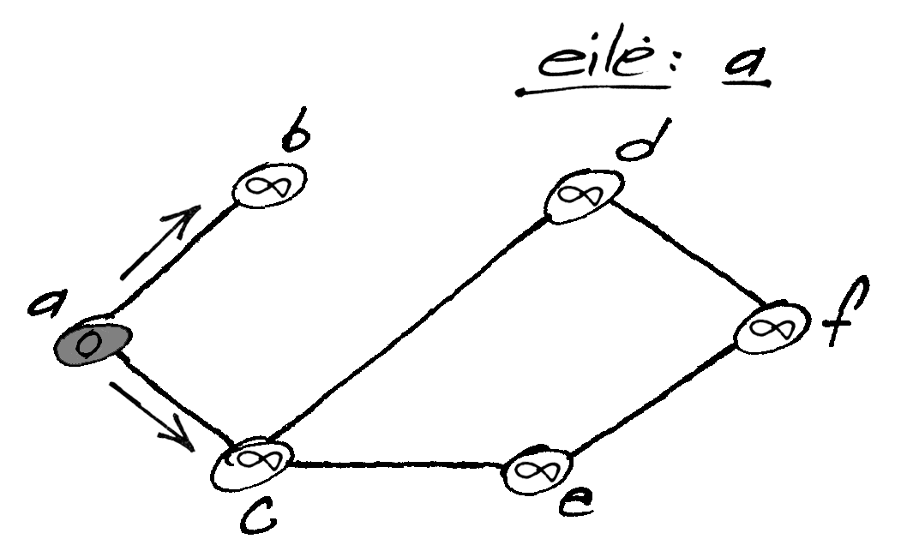

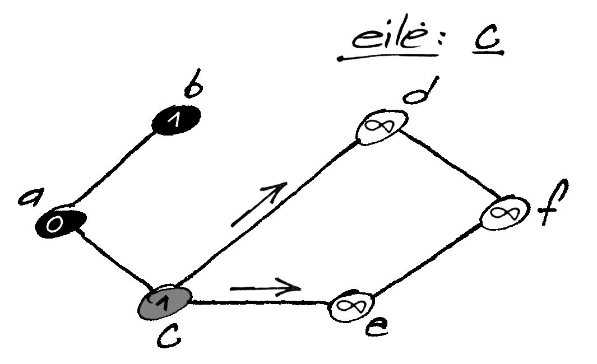
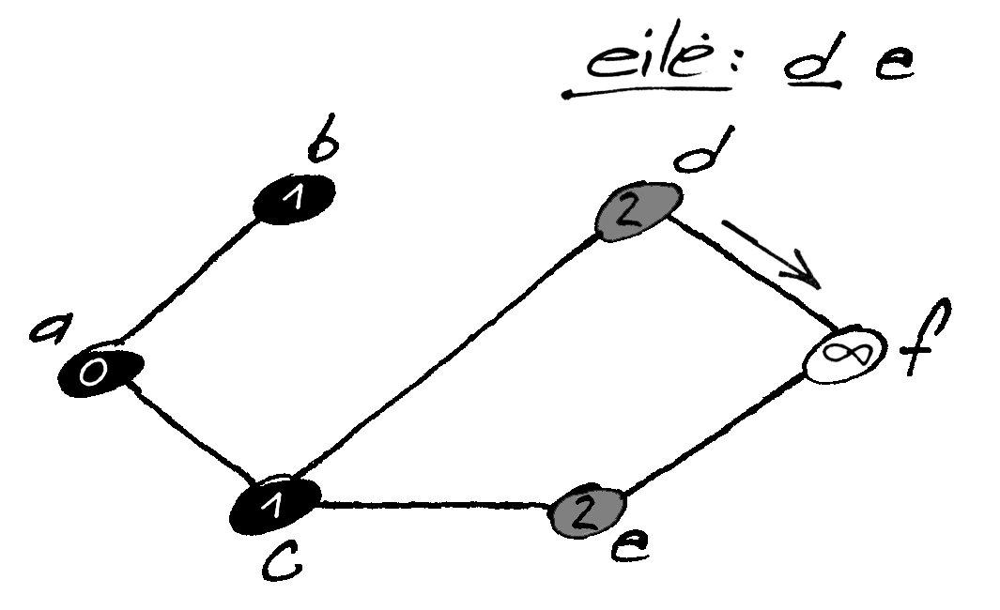
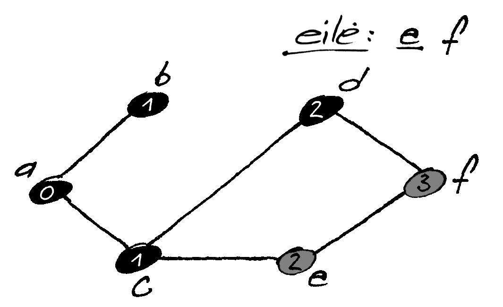
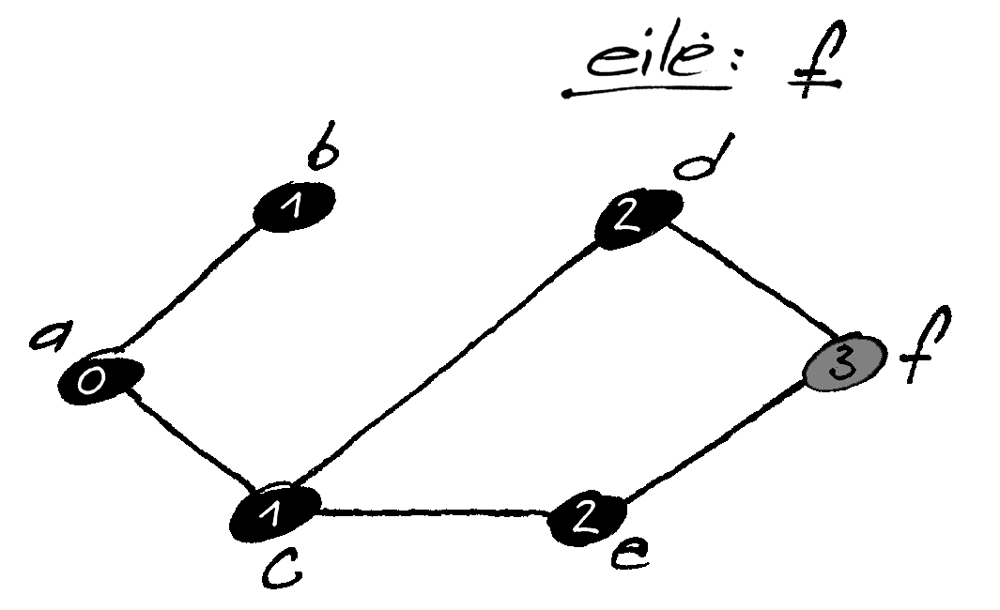
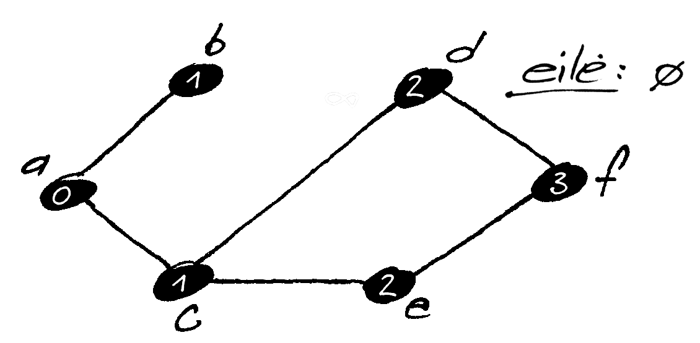

.. table::
  Paieškos platyn veikimo iliustracija, kai pradine viršūne
  pasirinkta viršūnė :math:`a`

  +---------+---------+
  | |bfs_a| | |bfs_b| |
  +---------+---------+
  | |bfs_c| | |bfs_d| |
  +---------+---------+
  | |bfs_e| | |bfs_f| |
  +---------+---------+
  | |bfs_g| |         |
  +---------+---------+

Trumpiausi atstumai iki kiekvienos viršūnės saugomi atskirame masyve.
Kol nerastas kelias iki viršūnės, šis atstumas laikomas begaliniu.
Grafas vaizduojamas kaimynystės sąrašais.

.. tabs::

  .. tab:: Paskalis

    .. code-block:: unicode_pascal

      const BEGALINIS = MAXINT;
      type spalvos = (balta, pilka, juoda);
      var atstumas, { saugomi atstumai nuo pradinės iki
                     visų kitų viršūnių }
         pirminė : array [1..MAXN] of integer;
         spalva : array [1..MAXN] of spalvos;
      procedure ieškok_platyn(var g : grafas;
                             p : integer { pradinė viršūnė } );
      var eil  : eilė;
         i, u, v : integer;
      begin
         for v := 1 to g.n do begin
             atstumas[v] := BEGALINIS;
             pirminė[v] := 0;
             spalva[v] := balta;
         end;
         išvalyk(eil);
         { į eilę įtraukiama pradinė viršūnė }
         spalva[p] := pilka;  atstumas[p] := 0;
         pirminė[p] := 0;     įdėk(eil, p);
         while not tuščia(eil) do begin
             v := išimk(eil);
             with g do
             { dar neaplankytos (baltos) v kaimynės įtraukiamos į eilę }
                 for i := 1 to vir[v].k do begin
                     u := vir[v].ksąrašas[i];
                     if spalva[u] = balta then begin
                         spalva[u] := pilka;
                         pirminė[u] := v;
                         atstumas[u] := atstumas[v] + 1;
                         įdėk(eil, u);
                     end;
                 end;
             spalva[v] := juoda;
         end;
      end;

  .. tab:: C++

    .. code-block:: cpp

      int atstumas[MAXN];    // saugomi atstumai nuo pradinės iki visų kitų viršūnių
      int pirmine[MAXN];
      int spalva[MAXN];      // 0, jei balta,
                            // 1, jei pilka,
                            // 2, jei juoda

      void bfs (int p) {     // p - pradinė viršūnė
          queue<int> q;
          for (int i = 0; i < n; i++)
              atstumas[i] = -1;

          // į eilę įtraukiama pirma viršūnė
          spalva[p] = 1; // nuspalvinama pilkai
          atstumas[p] = 0;
          pirmine[p] = -1;
          q.push(p);

          while (!q.empty()) {
              int v = q.front();
              q.pop();
              for (int u : adj[v]) { // einame per viršūnės v kaimynų sąrašą
                  // dar neaplankytos (baltos) v kaimynės įtraukiamos į eilę
                  if (spalva[u] == 0) {
                      spalva[u] = 1; // viršūnė u nuspalvinama pilkai
                      pirmine[u] = v;
                      atstumas[u] = atstumas[v] + 1;
                      q.push(u);
                  }
              }
              spalva[v] = 2; // viršūnė v nuspalvinama juodai
          }
      }

Jei reikia išspausdinti trumpiausią kelią nuo pradinės viršūnės
iki viršūnės :math:`u`, naudojamės sudarytu pirminumo medžiu ir
kreipiamės į procedūrą ``spausdink_kelią(u)`` – ji pateikta
:ref:`skyrelis-paieška-gilyn` skyrelyje.

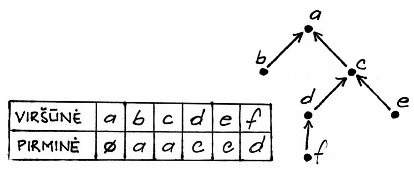

  Paieškos platyn pirminumo medis

Algoritmo sudėtingumas yra toks pat kaip ir paieškos gilyn:
:math:`O(n + b)`, jei grafas vaizduojamas kaimynystės sąrašais, ir
:math:`O(n^2)`, jei grafas vaizduojamas kaimynystės matrica. Čia
:math:`n` – grafo viršūnių, :math:`b` – briaunų skaičius.

Uždavinys *Nykštukai* [#f30]_
=============================

  Nykštukai gyvena vienaukščiame name, kuriame yra daug kambarių.
  Jei tarp dviejų kambarių yra durys, tai galima pereiti iš vieno
  kambario į kitą. Įėjimas iš namo yra tik pro vienintelį
  kambarį. Namas stebuklingas ir durys gali būti tarp bet kurių
  kambarių. Išėjimas pro duris į kitą kambarį arba į lauką
  užtrunka vieną laiko vienetą.

  Netikėtai nykštukai sužinojo, kad po :math:`t` laiko vienetų iš
  aikštelės šalia namo išvažiuoja autobusas į NKL (Nykštukų
  krepšinio lygos) finalines varžybas. Žinoma, kiek nykštukų yra
  name ir kokiuose kambariuose. Kiekvienas nykštukas žino
  greičiausią kelią iki išėjimo ir iš namo bėgs būtent tuo
  keliu.

  .. figure:: images/7_skyrius/47_lin_nykstukai1.gif
    :align: center
    :width: 500px
    :alt: Namo išplanavimo pavyzdys

    Namo išplanavimo pavyzdys; parodyta, kuriuose kambariuose
    pradiniu momentu yra nykštukai

  **Užduotis.** Reikia nustatyti, kurie nykštukai suspės į
  autobusą, jeigu kiekvienas bėgs greičiausiu keliu.

Uždavinį modeliuojame grafu: kambariai bei išėjimas laikomi grafo
viršūnėmis, o durys – briaunomis.

Reikia sužinoti, per kiek mažiausiai laiko vienetų kiekvienas
nykštukas gali išbėgti laukan. Laiko vienetų skaičius lygus
perbėgamų durų skaičiui, t. y. briaunų skaičiui mūsų sudarytame
grafe. Taigi ieškome trumpiausių kelių iš viršūnių, kuriose
„stovi“ nykštukai, iki išėjimo viršūnės. Nepamirškime – mus
domina ne patys keliai, o tik jų ilgiai.

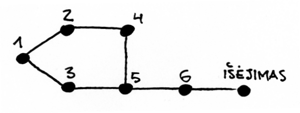

  Pavyzdyje pateiktą namą atitinkantis grafas

Trumpiausio kelio paieškai galime panaudoti ką tik išmoktą paieškos
platyn algoritmą, ir vykdyti jį iš kiekvienos viršūnės, kurioje
„stovi“ bent vienas nykštukas. Tačiau galima uždavinį
išspręsti efektyviau: įsivaizduokime, kad lauke stovi vienas
nykštukas (pavyzdžiui, autobuso vairuotojas?); jei rasime visus
nykštukus, pas kuriuos šis nykštukas gali atbėgti per :math:`t` ar
mažiau laiko vienetų, tai ir išspręsime uždavinį. Pakanka **vieną
kartą** įvykdyti paieškos platyn algoritmą iš išėjimo
viršūnės. Žinant trumpiausių kelių ilgius nuo išėjimo iki
kiekvieno kambario, nesunku baigti spręsti uždavinį.

Toliau pateiktame programos fragmente paieška platyn realizuota
paprasčiau, kadangi mus domina ne patys keliai, o tik atstumai.
Neaplankytas viršūnes atpažinsime ne pagal spalvą, o pagal tai, kad
atstumas iki jų yra pažymėtas begaliniu. Grafas vaizduojamas
kaimynystės sąrašais.

.. tabs::

  .. tab:: Paskalis

    .. code-block:: unicode_pascal

      const BEGALINIS = MAXINT;
           MAXN = ...; {maksimalus kambarių (grafo viršūnių) skaičius}
           MAXK = ...; {maksimalus nykštukų skaičius}
      type  masyvas = array [1..MAXK] of integer;
           loginis = array [1..MAXK] of boolean;
      var atstumas : array [1..MAXN] of integer;

      procedure ieškok_platyn(var g : grafas;
                             p : integer { pradinė viršūnė } );
      var eil : eilė;
         i, u, v : integer;
      begin
         for v := 1 to g.n do
             atstumas[v] := BEGALINIS;
         išvalyk(eil);
         { į eilę įtraukiama pradinė viršūnė }
         atstumas[p] := 0;
         idėk(eil, p);
         while not tuščia(eil) do begin
             v := išimk(eil);
             with g do
             { visos dar neaplankytos (pažymėtos begaliniu atstumu)
               v kaimynės įtraukiamos į eilę }
                 for i := 1 to vir[v].k do begin
                     u := vir[v].ksąrašas[i];
                     if atstumas[u] = BEGALINIS then begin
                         atstumas[u] := atstumas[v] + 1;
                         įdėk(eil, u);
                     end;
                 end;
         end;
      end;
      procedure kas_spės(var g : grafas;
                        var kamb : masyvas;
                        { kamb[i] – i-ojo nykštuko kambario numeris }
                        išėjimas, t : integer;
                        var spės : loginis);
      begin
         ieškok_platyn(g, išėjimas);
         for i := 1 to nyk_sk do
            spės[i] := atstumas[kamb[i]] <= t;
      end;

  .. tab:: C++

    .. code-block:: cpp

      const int MAXN = ...,  // maksimalus kambarių (grafo viršūnių) skaičius
                MAXK = ...;  // maksimalus nykštukų skaičius
                            // tiek MAXN, tiek MAXK galima sužinoti iš pateiktų sąlygoje ribojimų

      int n;                 // viršūnių (kambarių) skaičius
      vector<int> adj[MAXN]; // kaimynystęs sąrašas, kur adj[i] yra i-tosios viršūnės kaimynų sąrašas

      int nykSk;             // nykštukų skaičius
      int kamb[MAXN];        // kamb[i] - i-tojo nykštuko kambario numeris
      int isejimas, t;
      bool spes[MAXN];

      int atstumas[MAXN];

      void bfs (int p) { // p - pradinė viršūnė
          queue<int> q;
          for (int i = 0; i < n; i++)
              atstumas[i] = -1;

          // į eilę įtraukiama pradinė viršūnė
          atstumas[p] = 0;
          q.push (p);

          while (!q.empty()) {
              int v = q.front();
              q.pop();
              for (int u : adj[v]) { // pereinama per viršūnės v kaimynų sąrašą
                  // visos neaplankytos (pažymėtos atstumu -1) v kaimynės įtraukiamos į eilę
                  if (atstumas[u] == -1) {
                      atstumas[u] = atstumas[v] + 1;
                      q.push(u);
                  }
              }
          }
      }

      void kasSpes () {
          bfs (isejimas);
          for (int i = 0; i < nykSk; i++)
              spes[i] = atstumas[kamb[i]] <= t;
      }

.. rubric:: Išnašos

.. [#f24]
  :ref:`skyrius-orientuotieji-grafai` skyriuje nagrinėsime orientuotus
  grafus, kurie vaizduojami nesimetriškais dvimačiais masyvais.

.. [#f26]
  Šis uždavinys buvo pateiktas Lietuvos moksleivių informatikos
  olimpiados III etape 2006 metais.

.. [#f29]
  Žr. :ref:`skyrelis-rekursyvios-funkcijos` skyrelį.

.. [#f30]
  Analogiškas uždavinys buvo pateiktas Lietuvos informatikos
  olimpiados III etape 2005 metais.
