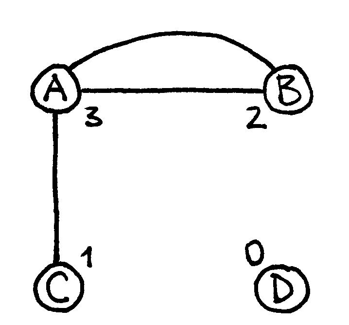
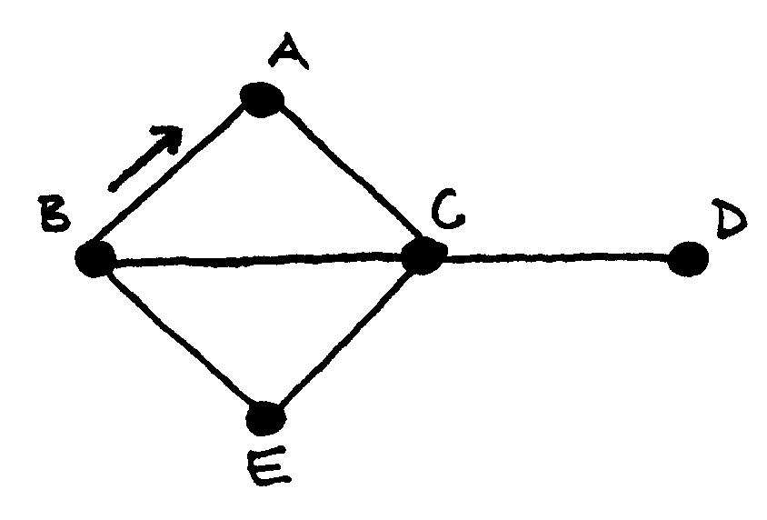
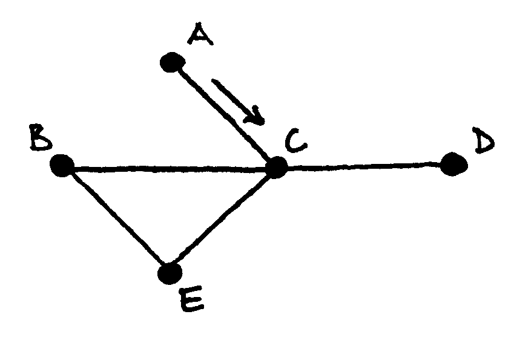
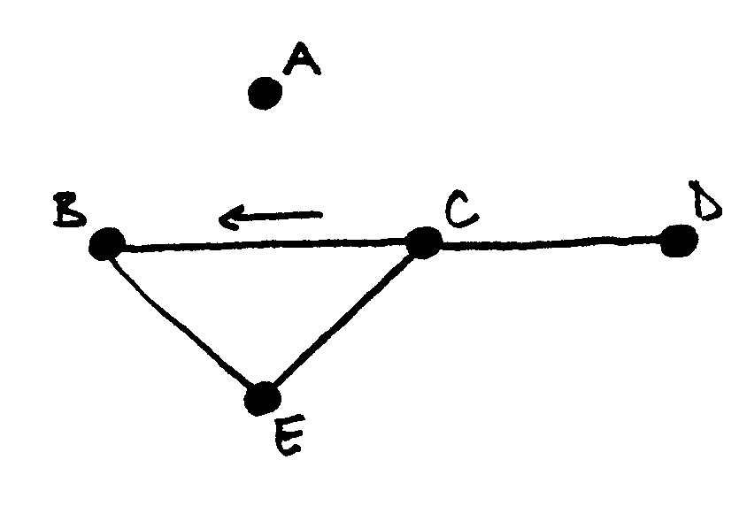
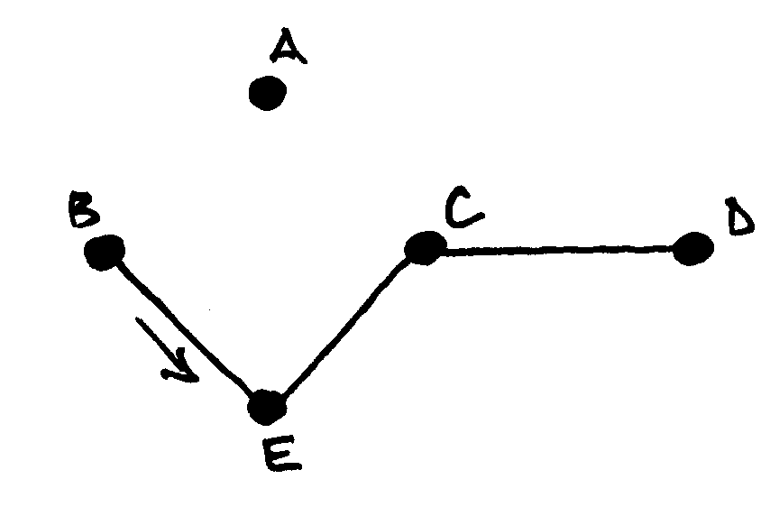
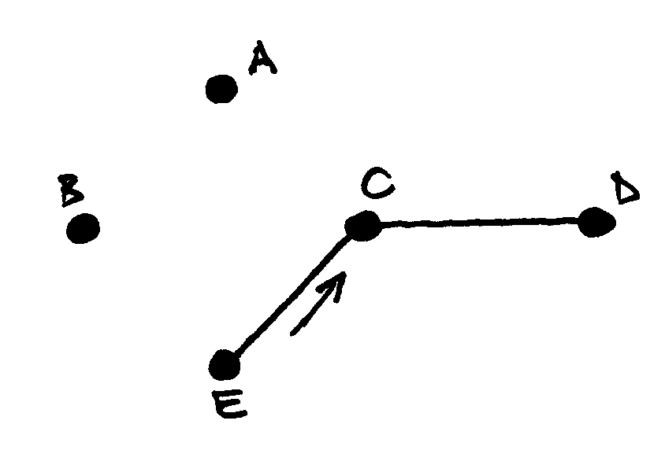
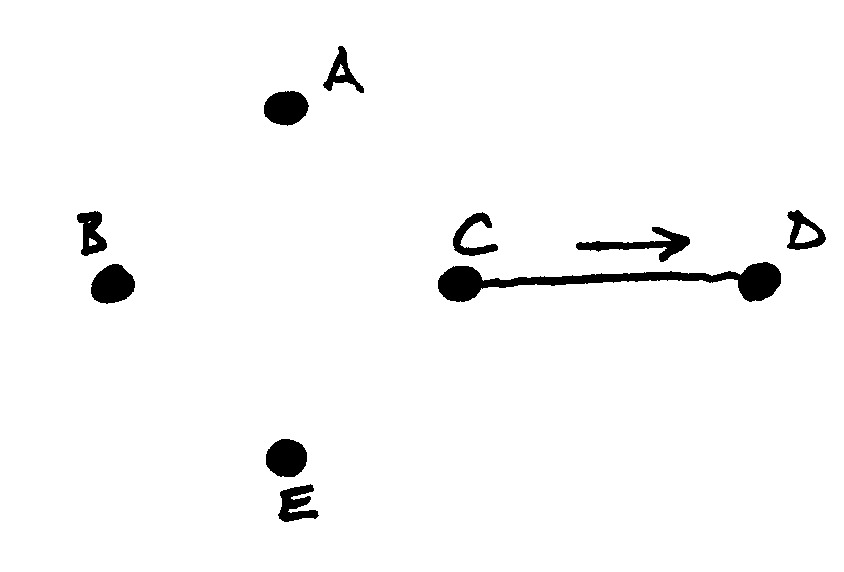
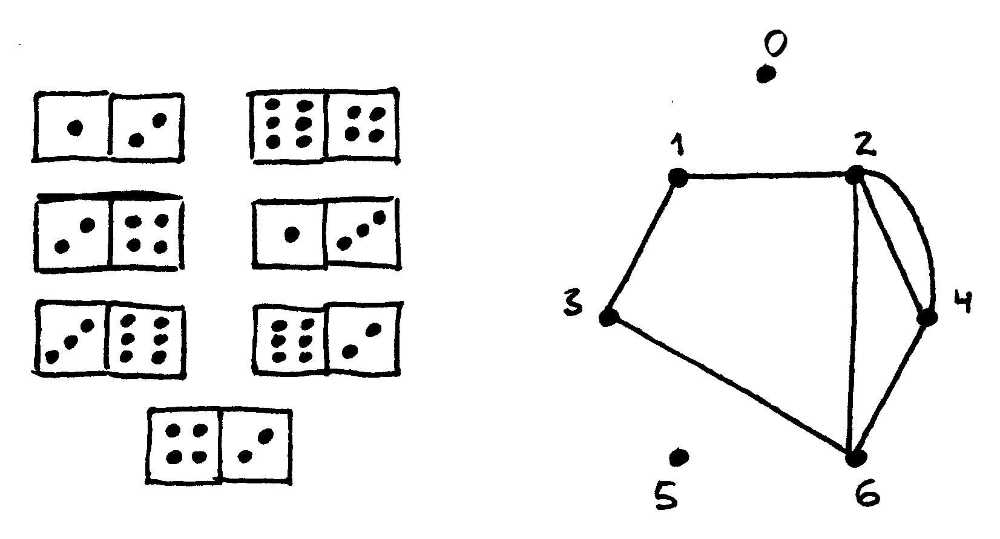
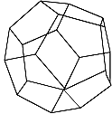
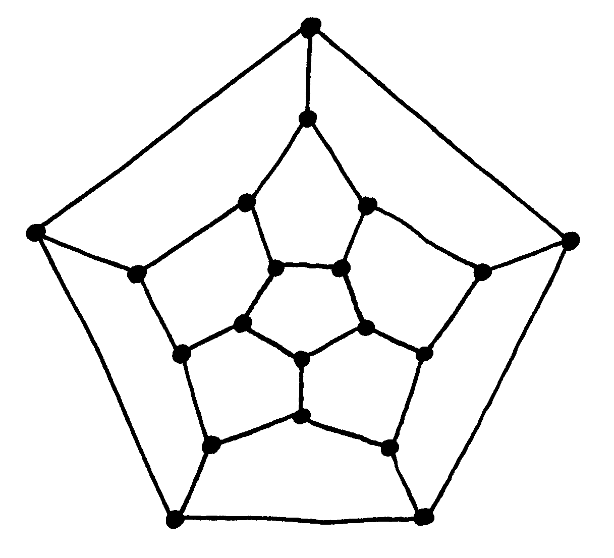

===========================
Oilerio ir Hamiltono ciklai
===========================

  | *The whole branch of mathematics was born out of the game.*
  | *Iš žaidimų kilo net atskira matematikos šaka.*
  | Nežinomas autorius apie grafų teorijos atsiradimą

Pažintį su grafais pradėjome nuo istorijos apie septynių
Karaliaučiaus tiltų uždavinį. Šiame skyrelyje papasakosime, kaip
tą uždavinį išsprendė Oileris, taip pat išspręsime jau ne kartą
sutiktą Hamiltono ciklų uždavinį.

Tam prireiks keleto naujų grafų teorijos sąvokų, tad nuo jų ir
pradėkime.

Kelios grafų teorijos sąvokos
=============================

Briaunų, jungiančių viršūnę :math:`v` su kokia nors kita
viršūne, skaičius vadinamas viršūnės :math:`v` **laipsniu**.
Paprastuose grafuose viršūnės laipsnis yra jai gretimų viršūnių
skaičius, tačiau multigrafuose (grafuose, kuriuose dvi viršūnes gali
jungti daugiau nei viena briauna), šie du skaičiai gali skirtis.

  Grafo viršūnių laipsniai užrašyti šalia viršūnių;
  grafas turi vienintelį tiltą – briauną :math:`AC`

Briauna, kurią pašalinus iš grafo padidėtų jungumo komponentų
skaičius, vadinama **tiltu**. Kitaip tariant, jei norėtume iš kurios
nors viršūnės pasiekti kitą, ir tam **būtinai** turėtume eiti
briauna :math:`(u, v)`, ši briauna ir būtų tiltas.

Oilerio keliai ir ciklai
========================

.. figure:: images/vieši/Leonhard_Euler.jpg
  :align: center
  :width: 200px
  :alt: Šveicarų matematikas Leonardas Oileris

  Šveicarų matematikas Leonardas Oileris (*Leonhard Euler*),
  1707–1783

Jau minėjome, kad Oileris neigiamai atsakė į Karaliaučiaus
gyventojus dominantį klausimą: nėra maršruto, kuris prasidėtų
viename iš krantų, pereitų kiekvienu iš septynių tiltų lygiai
vieną kartą ir baigtųsi tame pačiame krante. Išnagrinėjęs tokių
maršrutų galimybę, Oileris padėjo grafų teorijos pagrindus.

Jam pavyko išspręsti šį uždavinį: Oileris nustatė, kokios
sąlygos yra būtinos ir pakankamos, kad grafe egzistuotų toks
maršrutas, be to, pateikė algoritmą jam rasti. Maršrutai,
prasidedantys ir užsibaigiantys toje pačioje viršūnėje bei
apeinantys visas grafo briaunas po vieną kartą, nuo tada vadinami
**Oilerio ciklais** arba (jei baigiasi kitoje viršūnėje negu
prasideda) **Oilerio keliais**.

.. _img-8-karaliauciaus-grafas:

.. figure:: images/8_skyrius/51_lin_b_karliaucius_grafas.gif
  :align: center
  :width: 200px
  :alt: Karaliaučiaus tiltų uždavinį atitinkantis grafas

  Karaliaučiaus tiltų uždavinį atitinkantis grafas

Nėra sudėtinga Karaliaučiaus tiltų atveju įrodyti, kad neegzistuoja
Oilerio ciklas. Prisiminkime, kaip atrodė grafas, kurio viršūnės –
Karaliaučiaus salos ir krantai, o briaunos – juos jungiantys tiltai
(:numref:`img-8-karaliauciaus-grafas` pav.).

Ieškome maršruto, kuris kiekviena briauna pereitų vieną kartą.
Panagrinėjus kurią nors vieną viršūnę, nesunku pastebėti, jog
ieškomas maršrutas neįmanomas, jei viršūnės laipsnis nelyginis:
juk išeiti iš šios viršūnės turėsime lygiai tiek kartų, kiek ir
atėjome, ir kiekvienąkart vis kita briauna, taigi visas briaunų
skaičius turi būti dviejų kartotinis, lyginis. Tačiau šiame grafe
visų viršūnių laipsniai nelyginiai (3, 3, 3 ir 5), taigi ir toks
maršrutas tikrai neįmanomas.

Įrodėme, kad toks maršrutas negalimas, jei bent vienos viršūnės
laipsnis nelyginis. Oileris įrodė griežtesnį teiginį: **Oilerio
ciklas egzistuoja tada ir tik tada, kai visų viršūnių laipsniai yra
lyginiai**.

O kaip su Oilerio keliais? Jei maršrutas turi baigtis ne toje pačioje
viršūnėje kur prasidėjo, tai minėta taisyklė turi galioti visoms
viršūnėms, išskyrus pradinę ir galinę. **Oilerio kelias egzistuoja
tada ir tik tada, kai lygiai dviejų viršūnių laipsniai yra
nelyginiai.**

Be abejo, grafai, turintys Oilerio ciklą arba kelią, turi pasižymėti dar
viena natūralia savybe – jie turi būti jungūs [#f31]_

Flerio algoritmas
=================

Žinome, kas yra Oilerio kelias ir ciklas, ir netgi mokame duotame grafe
nustatyti, ar toks egzistuoja. Tačiau kaip ieškoti Oilerio kelio?
Pasirodo, tai labai paprasta. Flerio algoritmas, skirtas Oilerio ciklų
ir kelių paieškai, gali būti nusakytas trimis žodžiais: *venk eiti
tiltu*.

Flerio algoritmą, ieškantį Oilerio ciklo, galime išskaidyti į
tokius žingsnius:

+   pradedame bet kurioje viršūnėje;
+   jei įmanoma, einame briauna, kuri nėra tiltas (jei tokios briaunos
    nėra, tai einame tiltu);
+   briauną, kuria jau ėjome, pašaliname iš grafo;
+   kartojame nuo antro žingsnio, o jei nėra kur eiti, baigiame.

.. table::
  Flerio algoritmo Oilerio keliui rasti iliustracija

  +------------+------------+
  | |fleris_a| | |fleris_b| |
  +------------+------------+
  | |fleris_c| | |fleris_d| |
  +------------+------------+
  | |fleris_e| | |fleris_f| |
  +------------+------------+

Oilerio kelio paieška skiriasi tik pradinės viršūnės pasirinkimu:
pradedame viršūnėje su nelyginiu laipsniu.

Flerio algoritmą Oilerio ciklo arba kelio paieškai multigrafe (t. y.
grafe, kuriame dvi viršūnes gali jungti daugiau negu viena briauna)
užrašysime programavimo kalba. Multigrafą vaizduosime kaimynystės
matrica – kiekvienai porai viršūnių įsiminsime, kelios briaunos
jas jungia:

.. tabs::

  .. tab:: Paskalis

    .. code-block:: unicode_pascal

      type grafas = record
              n : integer;
              briaunų_sk : array [1..MAXN,
                                  1..MAXN] of integer;
              laipsnis : array [1..MAXN] of integer;
          end;

  .. tab:: C++

    .. code-block:: cpp

      const int MAXN = ...;      // maksimalus galimas viršūnių skaičius
                                // dažniausiai galima nustatyti pagal sąlygoje pateiktus ribojimus

      int n;                     // viršūnių skaičius
      int briaunuSk[MAXN][MAXN];
      int laipsnis[MAXN];

      // Pastaba: pascal kalbos kode grafas pateikiamas kaip struktūra,
      //  tačiau čia kaimynystės matricą ir laipsnių masyvą apsirašome globaliai.

Tarsime, kad masyvas ``laipsnis`` užpildomas sudarant grafą.

Prieš pradedant ieškoti svarbu įsitikinti, ar tenkinamos būtinos ir
pakankamos sąlygos. Paprastumo dėlei tarsime, kad grafas jungus, arba
jį sudaro tik vienas nevienetinio dydžio jungumo komponentas. Šias
sąlygas nesunku patikrinti pasinaudojus paieška gilyn, kaip tai
darėme :ref:`skyrelis-paieška-gilyn` skyrelyje.

Viršūnių laipsnių ribojimą patikrinti dar paprasčiau: tereikia
suskaičiuoti, kiek viršūnių grafe turi nelyginius laipsnius. Jei
tokios bus dvi, tai ieškosime Oilerio kelio ir turėsime pradėti
vienoje iš nelyginio laipsnio viršūnių, priešingu atveju galėsime
pradėti bet kurioje viršūnėje.

Patikrinus, ar tenkinamos abi sąlygos, galima pradėti vykdyti Flerio
algoritmą: įsiminti pradinę viršūnę, pasirinkti tolesnę ir
briauną, kuria jau ėjome, išbraukti iš grafo. Tolesnę lankomą
viršūnę renkamės pagal minėtą sąlygą – stengiamės neiti
tiltu, jei tik įmanoma.

.. tabs::

  .. tab:: Paskalis

    .. code-block:: unicode_pascal

      const MAXB = ...; { maksimalus briaunų skaičius }
      type  masyvas = array [1..MAXB+1] of integer;
      procedure Flerio(var g : grafas;
                      var kelio_ilgis : integer;
                      var kelias : masyvas);
      { jei Oilerio ciklas/kelias grafe neegzistuoja, tai „kelio_ilgis“
        reikšmė lygi nuliui, kitu atveju Oilerio ciklas/kelias įrašomas
        į masyvą „kelias“ }
      var k, p, v, u, nelyg : integer;
      begin
         nelyg := 0;
         { suskaičiuojama, kiek yra nelyginio laipsnio
           viršūnių, ir parenkama pradinė (v) }
         v := 1;
         for k := 1 to g.n do
             if odd(g.laipsnis[k]) then begin
                 nelyg := nelyg + 1;
                 { jei randama bent viena nelyginio laipsnio viršūnė,
                   tai v priskiriamas jos numeris }
                 v := k;
             end;
         kelio_ilgis := 0;
         if ((nelyg = 0) or (nelyg = 2))
         { jei tenkinamos būtinos Oilerio ciklo/kelio egzistavimo sąlygos }
         then begin { vykdomas Flerio algoritmas }
             while v > 0 do begin
                 inc(kelio_ilgis);
                 kelias[kelio_ilgis] := v;
                 p := v; { paskutinė pereita viršūnė }
                 v := 0;
                 { pagal Flerio algoritmą pasirenkama sekanti viršūnė }
                 for u := 1 to g.n do
                     if (g.briaunų_sk[p, u] > 0) and
                        ((v = 0) or not tiltas(g, p, u))
                     then
                         v := u;
                 if v > 0 then begin { ištrinama briauna }
                     dec(g.briaunų_sk[p, v]);
                     dec(g.briaunų_sk[v, p]);
                 end;
             end;
         end;
      end;

  .. tab:: C++

    .. code-block:: cpp

      const int MAXB = ...; // maksimalus briaunų skaičius

      int kelioIlgis;
      int kelias[MAXB];

      void flerio () {
          /*
              jei Oilerio ciklas/kelias grafe neegzistuoja, tai "kelioIlgis"
              reikšmė bus lygi nuliui, kitu atveju Oilerio ciklas/kelias
              įrašomas į masyvą "kelias"
          */

          int nelyg = 0;
          // suskaičiuojama, kiek yra nelyginio laipsnio viršūnių, ir pradinė viršūnė (v)
          int v = 0;
          for (int k = 0; k < n; k++) {
              if (laipsnis[k] % 2 == 1) {
                  nelyg++;
                  v = k;
              }
          }

          kelioIlgis = 0;

          if (nelyg == 0 || nelyg == 2) {
              /*
                  jei tenkinamos būtinos Oilerio ciklo/kelio sąlygos,
                  vykdomas Flerio algoritmas
              */
              while (v > -1) {
                  kelioIlgis++;
                  kelias[kelioIlgis] = v;
                  int p = v; // paskutinė pereita viršūnė
                  v = -1;
                  // pagal Flerio algoritmą pasirenkama kita viršūnė
                  for (int u = 0; u < n; u++)
                      if (briaunuSk[p][u] > 0 && (v == -1 || !tiltas(p, u)))
                          v = u;
                  if (v > -1) {
                      // ištrinama briauna
                      briaunuSk[p][v]--;
                      briaunuSk[v][p]--;
                  }
              }
          }

      }

Liko nerealizuota funkcija ``tiltas``. Ji turėtų grąžinti ``true``
reikšmę, jei grafe :math:`g` briauna :math:`(u, v)` yra tiltas. Tai
patikrinti nesunku: jei :math:`(u, v)` yra tiltas, tai pašalinus šią
briauną viršūnės :math:`u` ir :math:`v` atsidurs skirtinguose
jungumo komponentuose. Taigi pašalinkime šią briauną, paieška gilyn
patikrinkime, ar :math:`v` pasiekiama iš :math:`u`, ir sugrąžinę
pašalintą briauną pateikime rezultatą.

.. tabs::

  .. tab:: Paskalis

    .. code-block:: unicode_pascal

      function tiltas(var g : grafas;
                     u, v : integer) : boolean;
      var k : integer;
      begin
         if g.briaunų_sk[u, v] > 1 then
             tiltas := false
         else begin
             for k := 1 to g.n do
                 spalva[k] := balta;
             g.briaunų_sk[u, v] := 0; { pašalinama briauna }
             g.briaunų_sk[v, u] := 0;
             ieškok_gilyn (g, u);
              { Ši procedūra pateikta 7.3 skyrelyje, tačiau kitaip
                pavaizduotam grafui, taigi prieš taikant ją būtina
                modifikuoti. }
             g.briaunų_sk[u, v] := 1; { atstatoma briauna }
             g.briaunų_sk[v, u] := 1;
             tiltas := spalva[v] = balta;
         end;
      end;

  .. tab:: C++

    .. code-block:: cpp

      bool tiltas (int v, int u) {
          if (briaunuSk[v][u] > 1)
              return false;

          for (int k = 0; k < n; k++)
              spalva[k] = 0;

          briaunuSk[v][u]--;
          briaunuSk[u][v]--;
          dfs(u);
          briaunuSk[v][u]++;
          briaunuSk[u][v]++;

          return spalva[v] == 0;
      }

Uždavinys *Domino kauliukai* [#f33]_
====================================

  Yra krūvelė domino kauliukų. Kiekvienas domino kauliukas perskirtas
  pusiau, kiekvienoje pusėje užrašytas skaičius iš intervalo
  :math:`0..6`. Du kauliukus galima sujungti, jei sutampa skaičiai,
  užrašyti ant sujungiamų kauliukų pusių.

  **Užduotis.** Reikia nustatyti, ar krūvelėje esančius kauliukus
  galima sudėlioti į nenutrūkstamą liniją.

Uždavinį modeliuosime grafais. Grafas turės septynias viršūnes,
sunumeruotas nuo 0 iki 6 (mat nuo 0 iki 6 taškų gali būti ant domino
kauliuko puselės). Kauliukus atitiks grafo briaunos.

  Kauliukų rinkinys ir juos atitinkantis grafas; grafe Oilerio
  kelias yra toks: :math:`6–4–2–1–3–6–2`, tad kauliukus galima
  sudėlioti į vieną eilę: :math:`[6,4]` :math:`[4,2]` :math:`[2,1]`
  :math:`[1,3]` :math:`[3,6]` :math:`[6,2]` :math:`[2,4]`

Kauliukų dėliojimas į liniją atitinka kelią, kai visomis grafo
briaunomis apeinama po vieną kartą, t. y. Oilerio kelią. Norint
išspręsti šį uždavinį tereikia patikrinti, ar grafe egzistuoja
Oilerio kelias.

Hamiltono keliai ir ciklai
==========================

  | *O brooding Spirit of Wisdom and of Love,*
  | *Whose mighty wings even now o'ershadow me,*
  | *Absorb me in thine own immensity,*
  | *And raise me far my finite self above!*
  | *Mąslioji išminties ir meilės siela,*
  | *kurios eiklių sparnų šešėlyje slepiuos,*
  | *leisk prisiliesti prie gelmės tavos*
  | *ir peržengt savo ribotumo sieną!* [#f34]_
  | Seras Viljamas Rovanas Hamiltonas (Sir William Rowan Hamilton)

.. figure:: images/vieši/William_Rowan_Hamilton_portrait_oval_combined.png
  :align: center
  :width: 200px
  :alt: Seras Viljamas Rovanas Hamiltonas

  Seras Viljamas Rovanas Hamiltonas, (*Sir William Rowan
  Hamilton*) 1805–1865

Airija nėra šalis, kurią garsina matematikai. Tačiau vieną jų –
matematiką ir poetą serą Viljamą Rovaną Hamiltoną – žino
daugelis. Deja, labai gabaus, daug kalbų žinojusio mokslininko
asmeninis gyvenimas buvo nenusisekęs: jis sirgo alkoholizmu ir
depresija. 1859 metais – pasakoja, jog pristigęs pinigų – jis
sukonstravo ir Dublino žaislų gamintojams pardavė galvosūkį
„Aplink pasaulį“ – iš medžio pagamintą taisyklingą
dodekaedrą su dvidešimčia viršūnių. Ant kiekvienos viršūnės
buvo užrašytas miesto pavadinimas. Tai buvo galvosūkis: reikėjo
rasti kelią dodekaedro briaunomis, kuriuo būtų kiekvienas miestas
aplankytas po vieną kartą.

  Erdvinis dodekaedro vaizdas

**Hamiltono keliu** imta vadinti kelią, kuriuo einant kiekviena
viršūnė aplankoma po vieną kartą.

  Dodekaedras, pavaizduotas plokštumoje

Atrodytų, Hamiltono kelio uždavinys nedaug skiriasi nuo Oilerio kelio
uždavinio: vienu atveju reikia rasti kelią, kuris apeitų visas
viršūnes po vieną kartą, kitu atveju – kelią, kuris po vieną
kartą apeitų visas briaunas. Tačiau jų sprendimai iš esmės
skiriasi. Oilerio ciklus ir kelius sėkmingai randa Flerio algoritmas, o
**Hamiltono kelio paieška – NP sunkus uždavinys**. Tai reiškia, kad
nėra žinoma jokio efektyvaus algoritmo šiam uždaviniui spręsti.

Hamiltono kelio paieško uždavinys labai artimas keliaujančio pirklio
uždaviniui, su kuriuo jau susidūrėme :ref:`skyrelis-np-sudėtingumas`
skyrelyje. Pastarajame uždavinyje grafas yra **pilnas** (t. y. bet
kurios dvi viršūnės yra sujungtos briauna, nes egzistuoja kelias tarp
bet kurių dviejų miestų) ir **svorinis** (grafo briaunoms yra
priskirti svoriai, t. y. atstumai tarp miestų).

Hamiltono kelio paieška
=======================

Ieškodami visų Hamiltono kelių grafe, kurio viršūnės sunumeruotos
nuo 1 iki :math:`n`, galėtume generuoti visus skaičių nuo 1 iki
:math:`n` kėlinius (t. y. visas galimas viršūnių apėjimo tvarkas)
:math:`k_1, k_2, \dots, k_n`, o sugeneravę patikrinti, ar egzistuoja
visos briaunos :math:`(k_i, k_{i+1})`,
:math:`(i = 1, 2, ..., n - 1)`.

Tačiau retuose (t. y. tokiuose, kurie turi nedaug briaunų) grafuose
Hamiltono kelių galima ieškoti kur kas efektyviau. Viršūnių seką
galima iškart sudaryti taip, kad gretimas sekos viršūnes jungtų
briauna. Naudodami grįžimo metodą parašysime procedūrą,
spausdinančią visus konkrečioje viršūnėje :math:`v`
prasidedančius Hamiltono kelius. Grafą vaizduosime kaimynystės
sąrašais.

.. tabs::

  .. tab:: Paskalis

    .. code-block:: unicode_pascal

      const MAXN = ...;
      var seka : array [1..MAXN] of integer;
         aplankyta : array [1..MAXN] of boolean;
      procedure ieškok(var g : grafas;
                      k,          { kiek viršūnių apeita }
                      v : integer { kurioje viršūnėje sustota } );
      var i, u : integer;
      begin
         seka[k] := v;
         { aplankytomis žymimos konstruojamame kelyje esančios viršūnės }
         aplankyta[v] := true;
         if (k = g.n) then
             { jei apeitos visos viršūnės – tai rastas Hamiltono kelias}
             spausdink (g.n)
              { Procedūra spausdink(m) išveda masyvo elementus nuo 1 iki
                m; ji analogiška 5.1 skyrelyje pateiktai procedūrai. }
         else
             { bandoma toliau eiti į visas neaplankytas v kaimynes }
             for i := 1 to g.vir[v].k do begin
                 u := g.vir[v].ksąrašas[i];
                 if (not aplankyta[u]) then
                     ieškok(g, k + 1, u);
             end;
         { pabaigus, v pažymima kaip neaplankyta }
         aplankyta[v] := false;
      end;

  .. tab:: C++

    .. code-block:: cpp

      const int MAXN = ...;

      int seka[MAXN];
      bool aplankyta[MAXN];

      void ieskok (int k, int v) {
          /*
              k - kiek viršūnių apeita,
              v - kurioje viršūnėje sustota
          */

          seka[k] = v;
          // aplankytomis žymimos konstruojamame kelyje esančios viršūnės
          aplankyta[v] = true;
          if (k == n) {
              // jei apeitos visos viršūnės - tai rastas Hamiltono kelias
              spausdink(n);
          } else {
              // bandoma toliau eiti į visas neaplankytas v kaimynes
              for (int u : adj[v])
                  if (!aplankyta[u])
                      ieskok (k+1, u);
          }
          aplankyta[v] = false;
      }

Norint rasti Hamiltono kelius, prasidedančius visose viršūnėse,
reikia įvykdyti:

.. tabs::

  .. tab:: Paskalis

    .. code-block:: unicode_pascal

      for v := 1 to g.n do
         ieškok(g, 1, v);

  .. tab:: C++

    .. code-block:: cpp

      for (int v = 0; v < n; v++)
          ieskok (1, v);

Jei ieškotume ne kelių, o ciklų, tuomet sugeneravus visą seką
reiktų papildomai patikrinti, ar egzistuoja briauna, jungianti pirmą
ir paskutinę kelyje esančias viršūnes.

.. rubric:: Išnašos

.. [#f31]
  Išimtis, jei grafe yra izoliuotų (t.y. iš kurių neišeina nė
  viena briauna) viršūnių; tokiu atveju Oilerio ciklas gali
  egzistuoti, nors grafas ir nejungus.

.. [#f33]
  Šis uždavinys buvo pateiktas Lietuvos informatikos olimpiados III
  etape 1995 metais.

.. [#f34]
  Eiles vertė Gediminas Pulokas.
