.. _skyrius-orientuotieji-grafai:

============================================
Orientuotieji grafai, Topologinis rikiavimas 
============================================

  | *It is amazing how often messy applied problems have a simple description*
  | *and solution in terms of classical graph properties.*
  | *Nuostabu, kaip dažnai sudėtingus praktinius uždavinius pavyksta*
  | *paprastai suformuluoti ir išspręsti naudojant grafų teoriją.*
  | Stivenas S. Skiena (Steven S. Skienna)

Iki šiol nagrinėjome tik paprasčiausius grafus: juose briaunos rodo,
kad tarp dviejų objektų ryšys yra arba jo nėra. Tačiau ne visada
ryšys tarp objektų esti vienodas. Šiame ir tolesniame skyreliuose
praplėsime grafo sąvoką ir panagrinėsime uždavinius, modeliuojamus
sudėtingesniais grafais.

Orientuotieji grafai
====================

Kartais gali tekti grafais pavaizduoti nesimetrišką ryšį tarp
objektų. Pavyzdžiui, jei grafu norėtume vaizduoti miesto planą, kur
viršūnės atitiktų sankryžas, o briaunos – jas jungiančias
gatves, tai galbūt tektų parodyti, kad kai kurios gatvės yra vienos
krypties eismo: iš sankryžos :math:`A` galima nuvažiuoti į
sankryžą :math:`B`, bet ne atvirkščiai. Tarkime, atėjo pavasaris ir
grafu modeliuojame, kuri mergaitė patinka kuriam berniukui, ir kuriai
mergaitei – kuris berniukas. Čia vėl (deja!) susiduriame su
nesimetrišku sąryšiu: Pauliui gali patikti Milda, o ši galbūt net
nežvilgtelės į jo pusę.

Taigi kartais prasminga grafo briaunoms suteikti kryptį. Grafas,
kuriame briaunos turi kryptį, vadinamas **orientuotu** arba
**kryptiniu**, o tokio grafo briaunos (su kryptimi) vadinamos
**lankais**. Piešiant grafą, lankai vaizduojami rodyklėmis. Jei
lankas nukreiptas iš viršūnės :math:`A` į viršūnę :math:`B`,
sakoma, kad lankas **išeina iš viršūnės** :math:`A` ir **ateina į
viršūnę** :math:`B`.

Ankstesniame skyrelyje buvome apibrėžę kai kurias grafų teorijos
sąvokas, kurias reikėtų patikslinti orientuotiems grafams:
viršūnės laipsnis, kelias, jungus grafas.

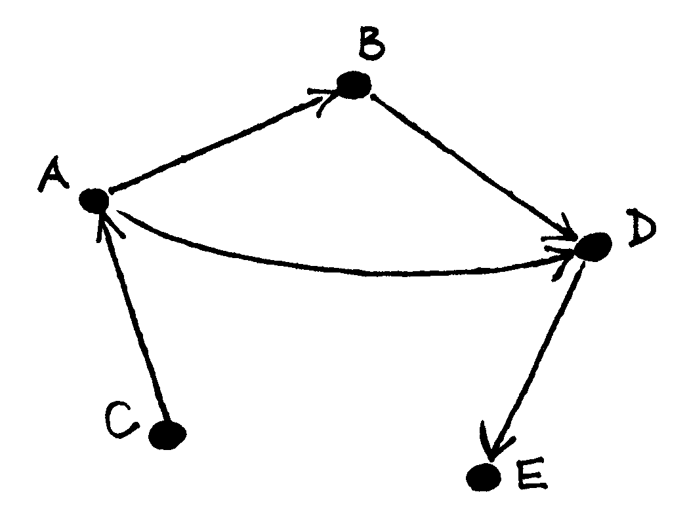

  Orientuotojo grafo pavyzdys

Orientuoto grafo viršūnės **išėjimo laipsnis** lygus lankų,
išeinančių iš šios viršūnės, skaičiui, o **įėjimo laipsnis**
lygus įeinančių į viršūnę lankų skaičiui.

**Kelias ir ciklas orientuotame grafe** traktuojamas taip pat, kaip ir
neorientuotame grafe, tačiau einama tik lanko kryptimi.

Orientuotame grafe yra keli jungumo tipai. Orientuotas grafas vadinamas
**silpnai jungiu**, jei orientuotą grafą pakeitus jį atitinkančiu
neorientuotu grafu (t. y. grafo lankus pakeitus briaunomis), šis yra
jungus.

**Vienkryptiškai jungiu** grafu vadinamas orientuotas grafas, jei
pasirinkus bet kurias dvi viršūnes :math:`A` ir :math:`B`, egzistuoja
kelias iš :math:`A` į :math:`B` arba iš :math:`B` į :math:`A`.

Orientuotas grafas yra **stipriai jungus** (stipriai susietas), jei iš
bet kurios viršūnės galima pasiekti bet kurią kitą viršūnę.

Visi stipriai jungūs grafai yra ir vienkryptiškai jungūs, o visi
vienkryptiškai jungūs yra ir silpnai jungūs.

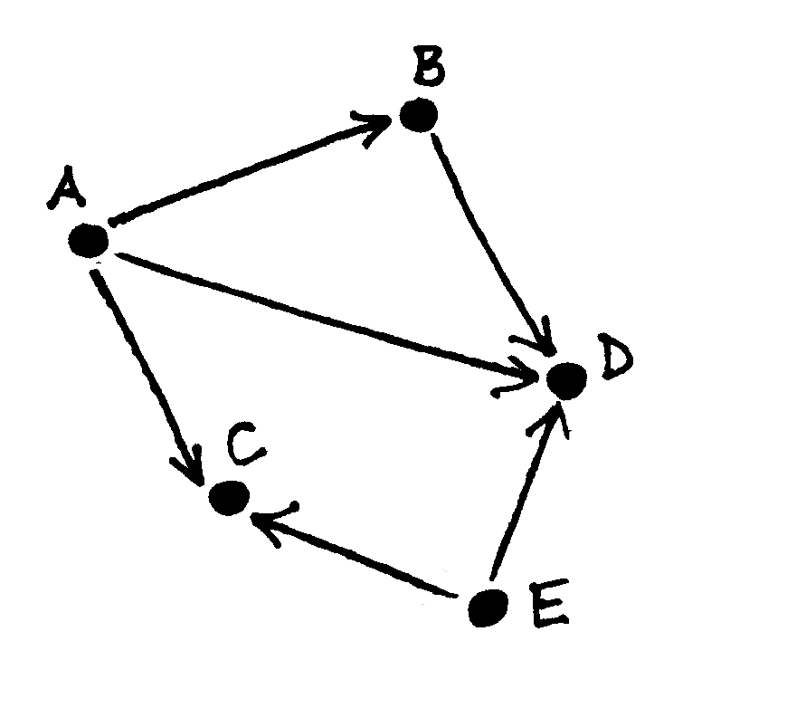

  Silpnai jungus grafas

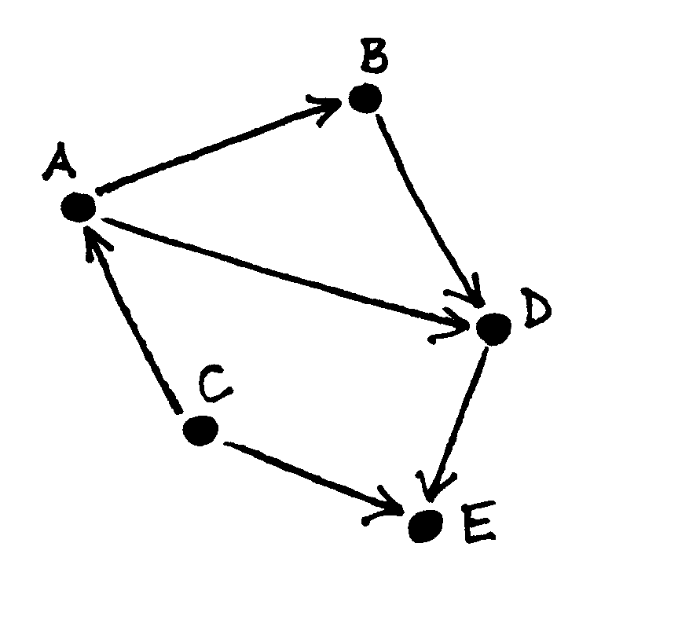

  Vienkryptiškai jungus grafas

.. figure:: images/9_skyrius/58_lin_3._orient.gif
  :align: center
  :width: 300px
  :alt: Stipriai jungus grafas

  Stipriai jungus grafas

Orientuotas grafas yra bendresnis grafo atvejis, ir atvirkščiai –
paprastas grafas :math:`G'` yra atskiras orientuoto grafo :math:`G`
atvejis, kuriame grafo :math:`G'` briauną :math:`(u, v)` atitinka du
lankai :math:`(u, v)` ir :math:`(v, u)`. Taigi nereikia beveik jokių
pakeitimų norint pavaizduoti orientuotą grafą kompiuteriu. Jei grafą
vaizduojame kaimynystės matrica, tai ši matrica tiesiog nebus
simetrinė (lanko įterpimas į grafą reikš reikšmės įrašymą į
vieną matricos langelį). Jei grafą vaizduojame kaimynystės
sąrašais, tai lanko įterpimas į grafą reikš vienos viršūnės
kaimynių sąrašo papildymą (dar mažiau darbo negu vaizduojant
paprastą grafą).

Beveik be jokių pakeitimų orientuotuose grafuose veiks jau aptarti
algoritmai: paieška gilyn ir platyn, Oilerio ciklų bei Hamiltono
ciklų paieška. Tiesa, algoritmai turės naują prasmę. Pavyzdžiui,
paieškos gilyn ir platyn algoritmai aplankys ne visas vizualiai
prijungtas viršūnes, bet tik tas, kurios pasiekiamos einant lankais
(tik viena briaunos kryptimi). Šiek tiek skiriasi Oilerio ciklo
egzistavimo sąlyga, tačiau ji labai natūrali: įeinančių lankų
skaičius (įėjimo laipsnis) turi būti lygus išeinančių lankų
skaičiui (išėjimo laipsniui) kiekvienoje viršūnėje (į kiekvieną
viršūnę turime ateiti tiek kartų, kiek ir išeiti).

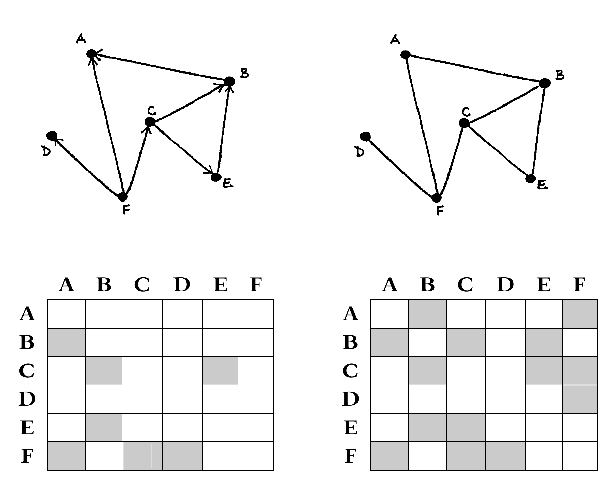

  Paveiksle pavaizduotas orientuotas grafas, jį atitinkantis
  neorientuotas grafas bei šiuos grafus atitinkanti kaimynystės
  matrica; matome, kad vienu atveju matrica yra simetriška, kitu atveju
  – ne

Topologinis rikiavimas
======================

Įsivaizduokite, kad pradėjote ruoštis atostogoms ir norite keliauti
į tolimą šalį. Teks nuveikti nemažai darbų: užsisakyti lėktuvo
bilietus, numatyti ar užsisakyti nakvynės vietas, susipakuoti daiktus,
galbūt gauti vizas, išsirinkti valstybę, į kurią vyksite,
susiplanuoti maršrutą ir t. t. Akivaizdu, kad šių darbų bet kokia
tvarka atlikti negalima. Prieš perkant lėktuvo bilietus būtina
išsirinkti valstybę, į kurią vyksite, prieš numatant nakvynės
vietas – susiplanuoti maršrutą, kuriuo keliausite. Reikia visus
pasiruošimo atostogoms darbus surikiuoti į eilę taip, kad juos
atlikdami ta tvarka sėkmingai išvyktume atostogauti. Darbus galime
vaizduoti grafo viršūnėmis, o faktą, kad darbas :math:`A` turi būti
atliktas prieš darbą :math:`B`, žymėti lanku iš :math:`A` į
:math:`B`.

Šis uždavinys bus grafo **topologinio rikiavimo** uždavinys:
orientuoto grafo viršūnes reikia išrikiuoti į vieną eilę taip, kad
bet kuriam grafo lankui :math:`(u, v)`, toje eilėje viršūnė
:math:`u` eitų prieš viršūnę :math:`v`.

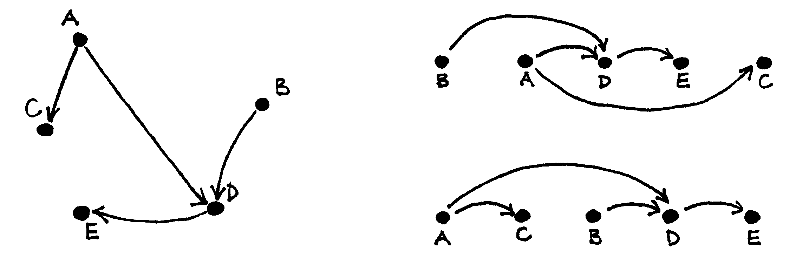

  Orientuotas beciklis grafas ir du skirtingi
  topologiniai jo išrikiavimai

Ar visada galima topologiškai surikiuoti grafo viršūnes? Tarkime, kad
darbas :math:`A` turi būti atliktas prieš darbą :math:`B`, darbas
:math:`B` – prieš darbą :math:`C`, o darbas :math:`C` – prieš
darbą :math:`A`. Topologiškai surikiuoti tokios darbų sekos
neįmanoma, tačiau ir pačios darbų sekos turbūt negalima pavadinti
korektiška. Tad grafo viršūnes topologiškai galima išrikiuoti, jei
ir tik jei grafe nėra ciklų.

Topologinio rikiavimo algoritmas gana intuityvus: pirma išrenkamos ir
į seką įtraukiamos viršūnės, kurių įėjimo laipsniai lygūs 0
(iš tiesų reikia pradėti nuo darbų, prieš kuriuos nieko daugiau
nereikia atlikti). Tuomet pašalinami iš šių viršūnių išeinantys
lankai ir atnaujinama informacija apie visų viršūnių laipsnius.
Toliau vėl kartojami tie patys veiksmai, kol į seką įtraukiamos
visos viršūnės.

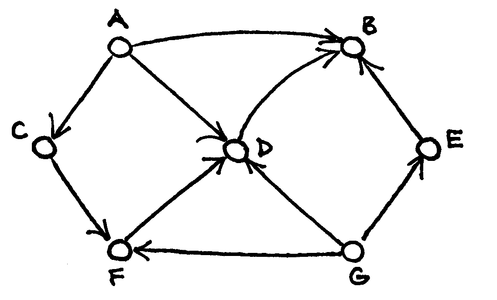
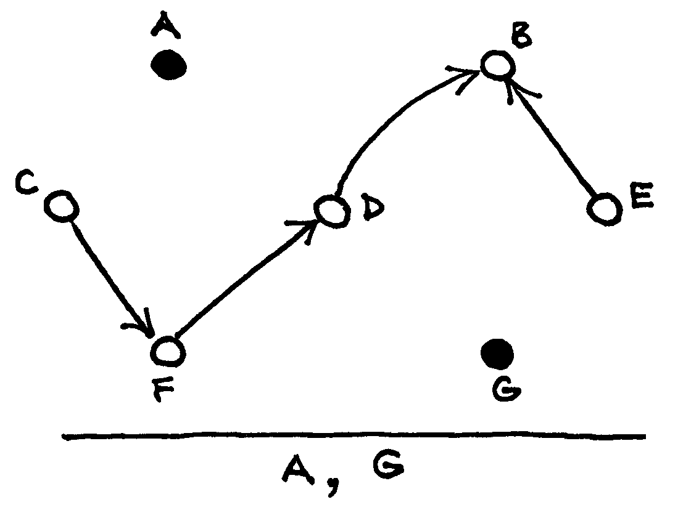
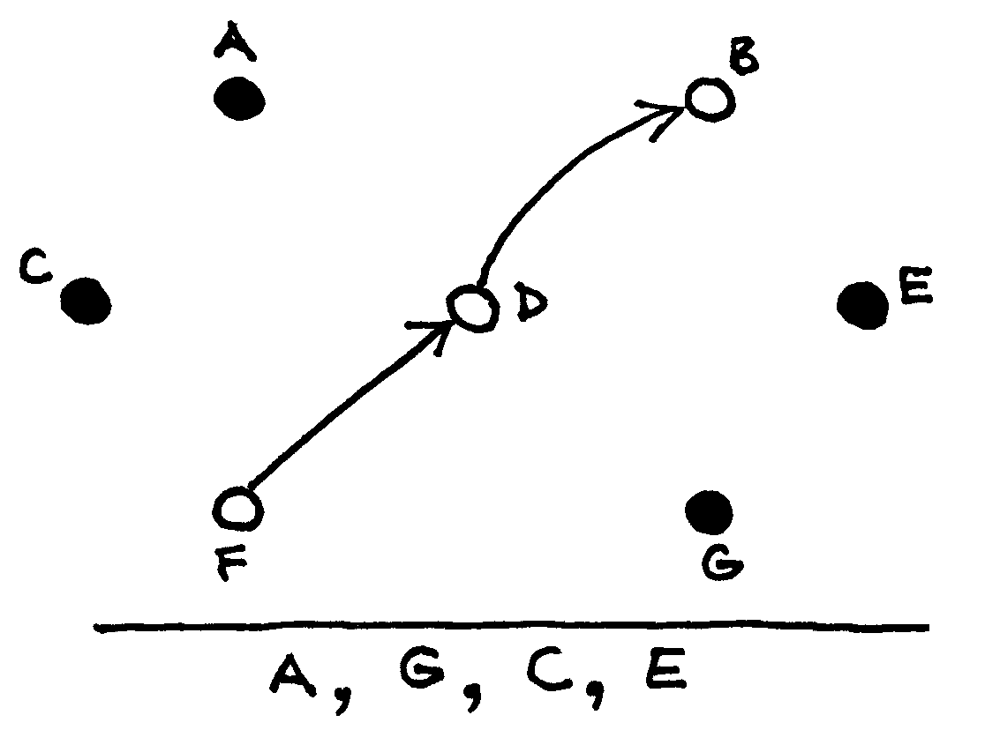
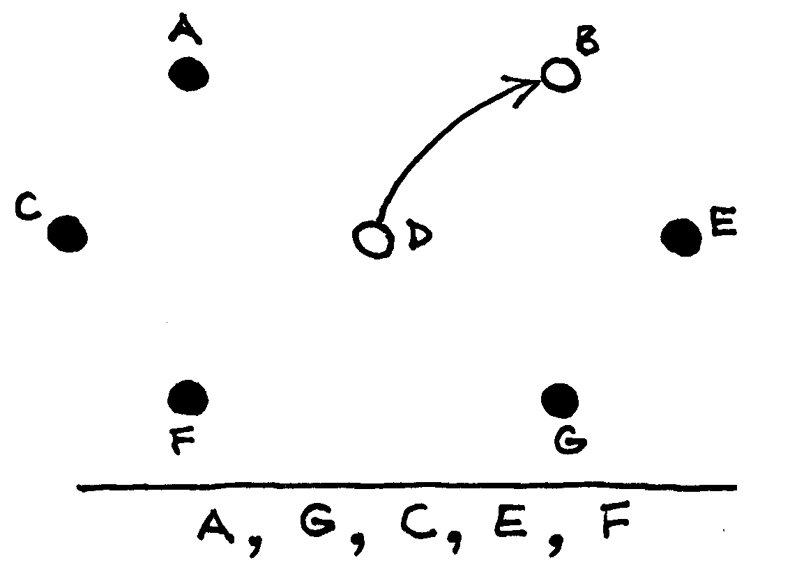
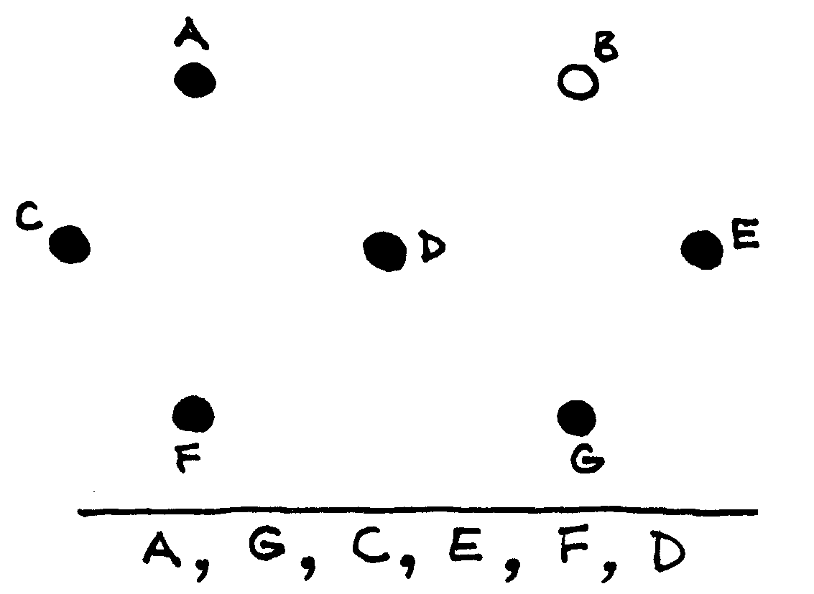
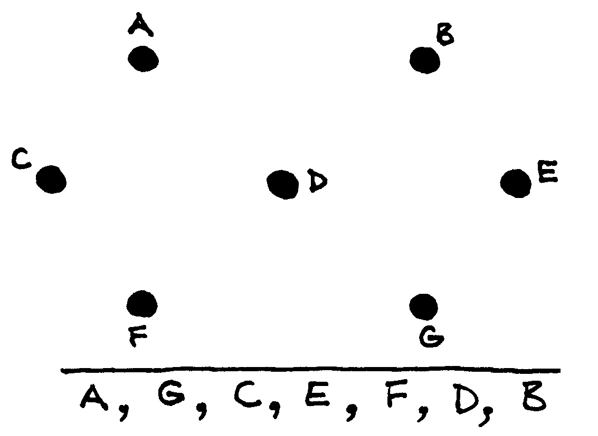

.. table::
  Topologinio rikiavimo pavyzdys; įvykdžius visus algoritmo
  žingsnius, gaunama viršūnių seka, kuri yra topologinis grafo
  išrikiavimas.

  +---------------------------------+------------------------------------+
  | |sort_a|                        | |sort_b|                           |
  +---------------------------------+------------------------------------+
  | Orientuotas beciklis grafas;    | Pašalinami lankai, išeinantys iš   |
  | viršūnių :math:`A` ir :math:`G` | viršūnių :math:`A` ir :math:`G`, o |
  | įėjimo laipsniai lygūs 0        | šios viršūnės įtraukiamos į seką   |
  +---------------------------------+------------------------------------+
  | |sort_c|                        | |sort_d|                           |
  +---------------------------------+------------------------------------+
  | Į seką įtraukiamos naujos       | Pašalinamas lankas, išeinantis iš  |
  | viršūnės :math:`C` ir           | viršūnės :math:`F`, nes jos        |
  | :math:`E`, kurių laipsniai      | laipsnis lygus 0; viršūnė          |
  | tapo lygūs 0                    | :math:`F` įtraukiama į sekos galą  |
  +---------------------------------+------------------------------------+
  | |sort_e|                        | |sort_f|                           |
  +---------------------------------+------------------------------------+

Norint efektyviai vykdyti algoritmo žingsnius, grafą reikia vaizduoti
kaimynystės sąrašais. Viršūnių, kurios neturi įeinančių lankų,
galima ieškoti kiekvienąkart ciklu perbėgant visas viršūnes.
Tačiau efektyviau laikyti eilę viršūnių, kurių įėjimo laipsniai
lygūs 0, ir ją vis papildyti iš grafo trinant lankus. Tam panaudosime
*eilės* duomenų struktūrą, aprašytą :ref:`skyrelis-paieška-platyn`
skyrelyje.

.. tabs::

  .. tab:: Paskalis

    .. code-block:: unicode_pascal

      const MAXN = ...;       { maksimalus viršūnių skaičius }
           MAXB = MAXN*MAXN; { maksimalus lankų skaičius }
      type viršūnė = record
              k : integer;         { kaimynių skaičius  ir sąrašas }
              ksąrašas : array [1..MAXN] of integer;
          end;
          grafas = record
              n : integer;                 { viršūnių skaičius }
              laipsnis : array [1..MAXN] of integer;
                                           { įėjimo laipsnis }
              vir : array [1..MAXN] of viršūnė;
                                           { viršūnių sąrašas }
          end;
      procedure topologinis_rikiavimas(var g : grafas;
                                      var seka : masyvas);
      { topologinis išrikiavimas įrašomas į masyvą seka }
      var v, u, i, nr : integer;
         eil : eilė;
      begin
         išvalyk(eil);

          { į eilę įtraukiamos viršūnės, kurių įėjimo laipsniai lygūs 0 }
         for v := 1 to g.n do
             if g.laipsnis[v] = 0 then
                 įdėk(eil, v);
         nr := 0; { išrikiuotų viršūnių sekos indeksas }
         while not tuščia(eil) do begin
             v := išimk(eil);
             nr := nr + 1;
             seka[nr] := v; { v įrašoma į seką }
             { „ištrinami“ iš v išeinantys lankai ir papildoma eilė }
             for i := 1 to g.vir[v].k do begin
                 u := g.vir[v].ksąrašas[i]; { kaimynė }
                 g.laipsnis[u] := g.laipsnis[u] - 1;
                 if g.laipsnis[u] = 0 then
                     įdėk(eil, u);
             end;
         end;
      end;

  .. tab:: C++

    .. code-block:: cpp

      const int MAXN = ...;  // maksimalus viršūnių skaičius

      int n;                 // viršūnių skaičius
      vector<int> adj[MAXN]; // adj[i] yra i-tosios viršūnės kaimynų sąrašas
      int laipsnis[MAXN];    // įėjimo laipsniai

      vector<int> seka;

      void toposort () {
          // topologinis išrikiavimas bus įrašomas į vektorių "seka"

          queue<int> q;
          for (int i = 0; i < n; i++)
              if (laipsnis[i] == 0)
                  q.push(i);

          while (!q.empty()) {
              int v = q.front();
              q.pop();
              seka.push_back(v); // v įrašomas į seką

              // "ištrinami" iš v išeinantys lankai ir papildoma eilė
              for (int u : adj[v]) {
                  // u - viršūnės v kaimynė
                  laipsnis[u]--;
                  if (laipsnis[u] == 0)
                      q.push(u);
              }
          }
      }

Jei baigus vykdyti algoritmą, į seką nebuvo įtrauktos visos
viršūnės (t. y. ``nr < g.n``), tai reiškia, kad grafe aptikta
ciklų, ir topologinis išrikiavimas neįmanomas. Atkreipkite dėmesį,
jog pateiktoje procedūroje grafo lankai iš tiesų nėra ištrinami,
tik atnaujinama informacija apie viršūnių įeinančius laipsnius.
Šio algoritmo sudėtingumas – :math:`O(n + b)`, kur :math:`b` –
lankų skaičius.

Yra ir kitas tokio paties sudėtingumo topologinio rikiavimo algoritmas,
naudojantis paiešką gilyn; šį algoritmą realizuoti yra paprasčiau.
Jo teksto nepateiksime, tik trumpai paaiškinsime idėją.

Pasirinkus bet kurią viršūnę, nuo jos atliekama paieška gilyn. Paieškos
gilyn metu pirmiausia juodai nuspalvinamos „giliausios“ viršūnės: jei
orientuotasis grafas neturi ciklų, tai viršūnė :math:`v` bus
nuspalvinta juodai tik tada, kai jau nuspalvintos juodai visos iš jos
pasiekiamos viršūnės. Todėl jei spalvinant viršūnę juodai, ji dar
ir įterpiama į *sekos pradžią*, tai gautoji seka ir yra topologinis
grafo išrikiavimas.

Jei paieška gilyn baigta, bet dar likę baltų viršūnių, tuomet vėl
pasirenkama bet kuri balta viršūnė ir nuo jos atliekama paieška
gilyn, kartojant jau aprašytus veiksmus. Šis algoritmas taip pat gali
aptikti ciklą grafe: nagrinėjant viršūnės kaimynes neturi būti
aptinkama *pilka* viršūnė, nes joje pradėta ir dar nebaigta paieška
gilyn.

Žemiau pateikti paveikslai iliustruoja topologinį rikiavimą taikant
paiešką gilyn.

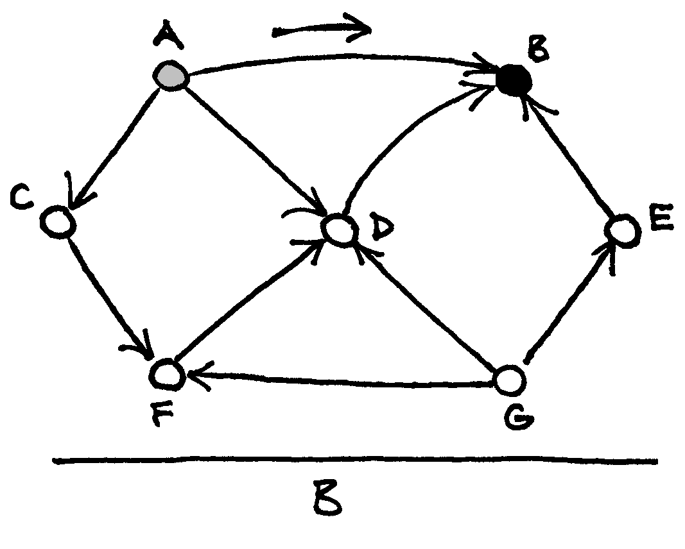
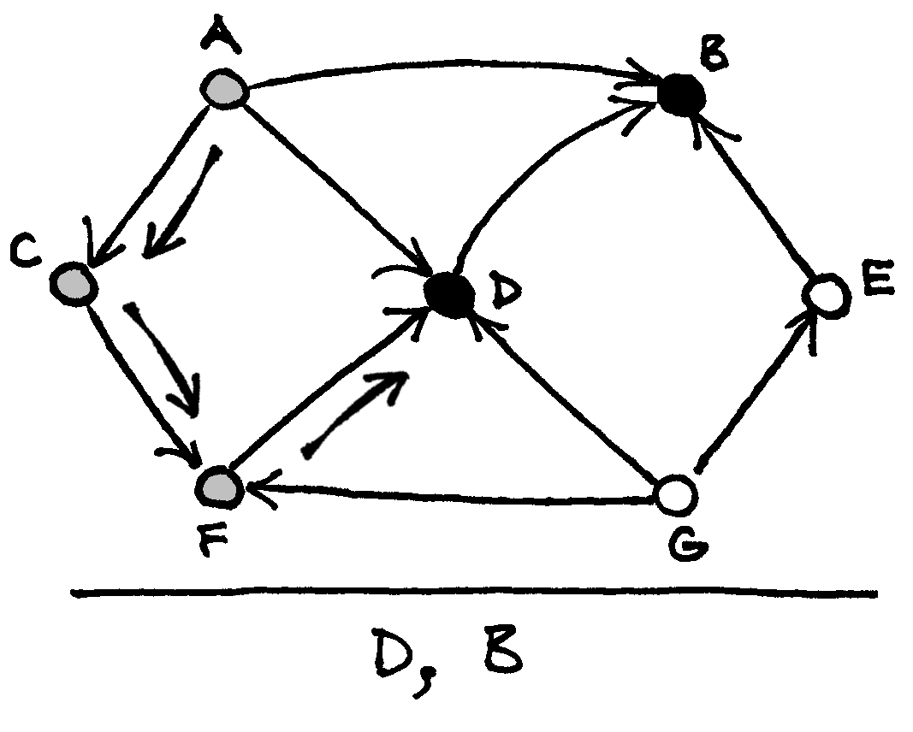
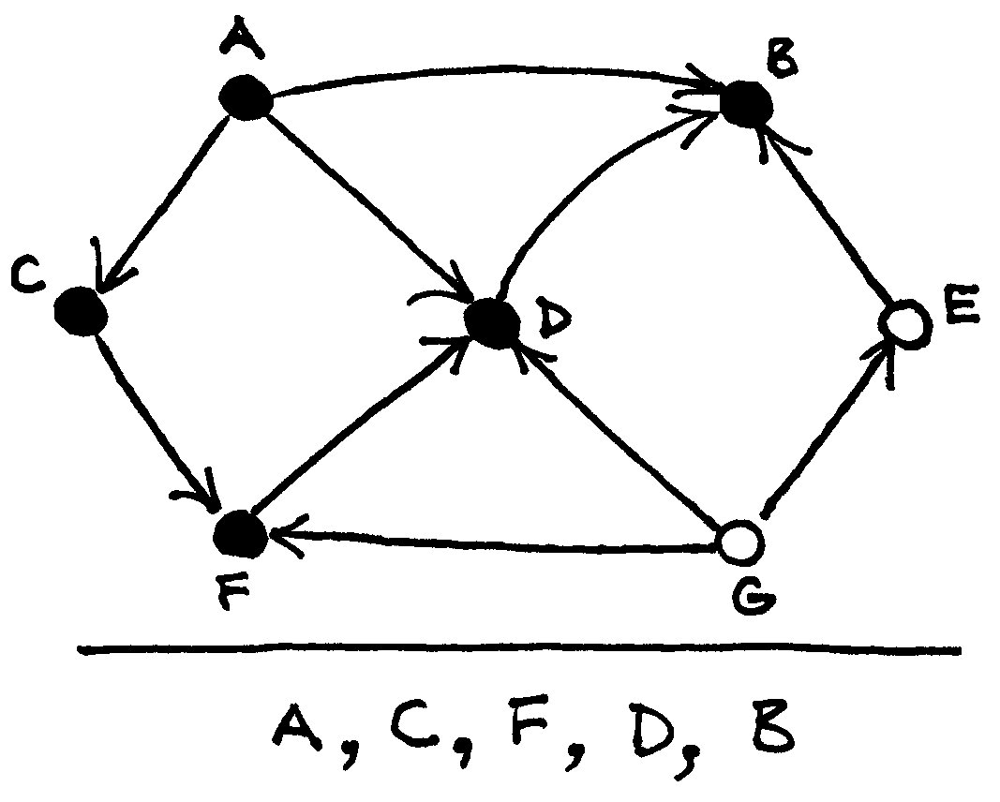
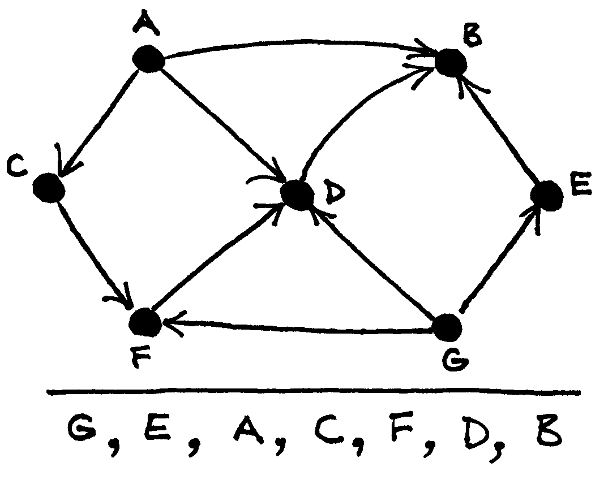

.. table::
  Topologinio rikiavimo, taikant paiešką gilyn, pavyzdys

  +---------------------------------+------------------------------------+
  | |dsort_a|                       | |dsort_b|                          |
  +---------------------------------+------------------------------------+
  | Pradėjus nuo pasirinktos        |                                    |
  | viršūnės :math:`A`, vykdoma     |                                    |
  | paieška gilyn; juodai           |                                    |
  | nuspalvintos viršūnės           |                                    |
  | įtraukiamos į sekos pradžią;    |                                    |
  | įtraukus į seką visas viršūnes  |                                    |
  | šios atsidurs sekos pabaigoje   |                                    |
  +---------------------------------+------------------------------------+
  | |dsort_c|                       | |dsort_d|                          |
  +---------------------------------+------------------------------------+
  | Jei baigus vykdyti paiešką      |                                    |
  | gilyn lieka baltų viršūnių,     |                                    |
  | tai pasirenkama bet kuri iš jų  |                                    |
  | ir vėl vykdoma paieška gilyn    |                                    |
  +---------------------------------+------------------------------------+

Uždavinys *Abėcėlė* [#f36]_
===========================

  Dauguma mūsų moka išrikiuoti žodžius pagal abėcėlę. Šiame
  uždavinyje nagrinėsime atvirkščią procesą. Duotas nežinomos
  kalbos žodžių, surikiuotų pagal tos kalbos abėcėlę, sąrašas.
  Į pateiktus žodžius įeina visos tos kalbos abėcėlės raidės.

  **Užduotis.** Reikia rasti  šios nežinomos kalbos abėcėlę.

  Visos raidės rikiavimo ir abėcėlės požiūriu laikomos
  skirtingomis, taip pat trumpesnis žodis eina prieš ilgesnį žodį,
  gautą iš to trumpesnio prirašant raidžių jo pabaigoje.
  Pavyzdžiui, lietuvių kalboje žodis „aš“ eina prieš žodį
  „ašara“. Sąraše pakanka informacijos abėcėlei nustatyti.

Prisiminkime, ką kalbėjome apie olimpiadinius uždavinius, kurių
sąlygose minimas rikiavimas: dažniausiai jų sprendimui žinomų
rikiavimo algoritmų tiesiogiai pritaikyti negalėsime. Taip bus ir šį
kartą. Nors sąlygoje kalbama apie rikiavimą, tai iš tiesų yra
topologinio rikiavimo uždavinys.

Sakykime, žinome, kuris iš dviejų žodžių, išrikiavus abėcėlės
tvarka, eina pirmas. Pavyzdžiui:

  | ARKLYS
  | ARKTINIS

Ką galime sužinoti apie raidžių tvarką abėcėlėje? Pirmosios
skirtingos žodžių raidės yra L ir T, tad į jas ir buvo atsižvelgta
rikiuojant žodžius. Vadinasi, nežinomoje abėcėlėje raidė L eina
prieš raidę T.

Raides žymėsime grafo viršūnėmis, o sąryšius tarp raidžių –
lankais. Nustatę, kad raidė A abėcėlėje eina prieš raidę B,
nuvesime lanką iš viršūnės :math:`A` į viršūnę :math:`B`.
Gautasis grafas bus aibė reikalavimų, kuriuos turi tenkinti tos kalbos
raidžių tvarka abėcėlėje. Abėcėlę, tenkinančią šiuos
reikalavimus, rasime būtent topologiškai išrikiavę grafo viršūnes.
Uždavinio sąlyga teigia, jog sąraše pakanka informacijos raidžių
tvarkai nustatyti, taigi sudaryto grafo viršūnes bus įmanoma
topologiškai išrikiuoti vieninteliu būdu.

Sudarinėjant grafą, pakanka išnagrinėti *tik gretimų* sąrašo
žodžių poras: jei žinoma, kad raidė A eina prieš raidę B, o
raidė B prieš raidę C, tai šias raides topologiškai išrikiavus
raidė A būtinai eis prieš raidę C. Pavyzdžiui, sudarykime grafą
iš tokio rusų kalbos žodžių, išrikiuotų abėcėlės tvarka,
sąrašo:

  | ЕМ
  | ИМЯ
  | МАМА
  | МЕНЯ
  | МНЕ
  | МОНЕТА
  | НЕТ
  | НИНА
  | ОНА
  | ОНИ
  | РОТ
  | ТОТ
  | Я

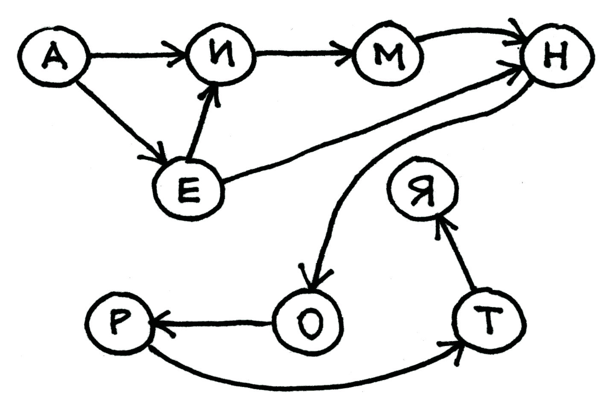

  Grafas, atitinkantis pateiktą žodžių sąrašą

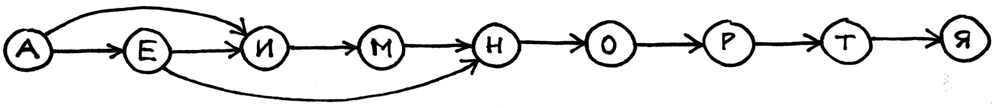

  Topologiškai išrikiavę raidžių grafą, randame nežinomos
  kalbos abėcėlę

Žemiau pateiktame sprendime grafo struktūroje žymėsime, kurias
raides atitinkančios viršūnės yra grafe, nes ne visi simboliai
įeina į abėcėlę. Procedūrai ``rask_abėcėlę`` perduodamas
išrikiuotų pagal abėcėlę žodžių masyvas.

.. tabs::

  .. tab:: Paskalis

    .. code-block:: unicode_pascal

      const MAXŽODŽIŲ = ...;
      type žodžiai = array [1..MAXŽODŽIŲ + 1] of string;
          grafas = record
              n : integer; { viršūnių skaičius }
              viršūnė : array [char] of boolean;
                        { ar grafe yra raidę atitinkanti viršūnė }
              lankas : array [char, char] of boolean;
              įein_lankų : array [char] of integer;
          end;
      procedure rask_abėcėlę(sk : integer; { žodžių skaičius }
                            var ž : žodžiai;
                            var abėcėlė : string);
                          { atsakymas įrašomas į eilutę abėcėlė }
         procedure sudaryk_grafą(var g : grafas);
         var i, j, m : integer;
             c, d : char;
         begin
             { išvalomi masyvai }
             g.n := 0;
             for c := low(char) to high(char) do begin
                 g.viršūnė[c] := false;
                 g.įein_lankų[c] := 0;
                 for d := low(char) to high(char) do
                     g.lankas[c, d] := false;
             end;

              { sudaromas grafas }
             ž[sk + 1] := ''; { pridedame tuščią žodį }
             for i := 1 to sk do begin
                 { jei randama naujų raidžių – jos įtraukiamos į grafą }
                 for j := 1 to length(ž[i]) do
                     if not g.viršūnė[ž[i][j]] then begin
                         g.viršūnė[ž[i][j]] := true;
                         inc(g.n);
                     end;
                 m := min (length(ž[i]), length(ž[i + 1]));
                  { Funkcijos min teksto nepateikiame – ji
                    paprasčiausiai grąžina mažesnįjį iš dviejų
                    parametrų. }
                 j := 1;
                 while (j <= m) and (ž[i][j] = ž[i+1][j])
                     do inc(j); { ieškoma nesutampanti raidė }
                 if (j <= m) and
                    not g.lankas[ž[i][j], ž[i+1][j]]
                 then begin
                 { rasta nesutampanti raidė – grafas papildomas lanku }
                     g.lankas[ž[i][j], ž[i+1][j]] := true;
                     inc(g.įein_lankų[ž[i + 1][j]]);
                 end;
             end;
         end;
      var g : grafas;
         c, d : char;
      begin
         sudaryk_grafą(g);
         { topologiškai išrikiuojamas grafas (randama abėcėlė) }
         abėcėlė := '';
         while g.n > 0 do begin
             c := low(char);
             { randama viršūnė be įeinančių lankų }
             while (not g.viršūnė[c]) or
                 (g.įein_lankų[c] > 0) do inc(c);
             { raidė pridedama prie abėcėlės }
             abėcėlė := abėcėlė + c;

              { atnaujinami kaimynių laipsniai }
             for d := low(char) to high(char) do
                 if g.lankas[c, d] then
                     dec(g.įein_lankų[d]);
             { viršūnė ištrinama iš grafo }
             g.viršūnė[c] := false;
             dec(g.n);
         end;
      end;

  .. tab:: C++

    .. code-block:: cpp

      #include <limits.h>
      /*
          šios bibliotekos prireiks, kadangi naudosime konstantas
          CHAR_MIN (mažiausia char tipo kintamojo pasiekiama reikšmė) ir
          CHAR_MAX (didŽiausia char tipo kintamojo pasiekiama reikšmė)
      */

      const int MAXZODZIU = ...;

      int sk;                             // žodžių skaičius
      string z[MAXZODZIU + 1];            // žodžių masyvas
      int n;                              // viršūnių skaičius
      map<char, bool> virsune;            // ar grafe yra raidę atitinkanti viršūnė
      map<pair<char, char>, bool> lankas;
      map<char, int> ieinLanku;

      void sudarykGrafa () {
          // išvalomos duomenų struktūros
          n = 0;
          virsune.clear();
          lankas.clear();
          ieinLanku.clear();

          // sudaromas grafas
          zodziai[sk] = ""; // pridedame tuščią žodį
          for (int i = 0; i < sk; i++) {
              for (int j = 0; j < (int)z[i].size(); j++) {
                  // jei randama naujų raidžių - jos įtraukiamos į grafą
                  if (!virsune[z[i][j]]) {
                      n++;
                      virsune[z[i][j]] = true;
                  }
              }

              int m = min((int)z[i].size(), (int)z[i+1].size());
              int j = 0;
              while (j < m && z[i][j] == z[i+1][j]) {
                  j++;
                  // ieškoma nesutampanti raidė
              }

              if (j < m && !(lankas[{z[i][j], z[i+1][j]}])) {
                  // rasta nesutampanti raidė - grafas papildomas lanku
                  lankas[{z[i][j], z[i+1][j]}] = true;
                  ieinLanku[z[i+1][j]]++;
              }
          }
      }

      string raskAbecele () {
          string abecele = ""; // atsakymas bus įrašomas į eilutę "abėcėlė"
          sudarykGrafa ();     // topologiškai išrikiuojamas grafas (randama abėcėlė)

          while (n > 0) {
              char c = CHAR_MIN;
              // randama viršūnė be įeinančių lankų
              while (!virsune[c] || ieinLanku[c] > 0) {
                  c++;
              }
              abecele += c; // raidė pridedama prie abėcėlės

              // atnaujinami kaimynų laipsniai
              for (char d = CHAR_MIN; d <= CHAR_MAX; d++) {
                  if (lankas[{c,d}])
                      ieinLanku[d]--;

              // viršūnė ištrinama iš grafo
              virsune[c] = false;
              n--;
          }

          return abecele;
      }

Atkreipiame dėmesį, kad šio uždavinio sprendime topologinis
rikiavimas realizuotas kitaip – grafas vaizduojamas kaimynystės
matrica, nenaudojama eilės duomenų struktūra. Algoritmo sudėtingumas
– :math:`O(n^2)`.

.. rubric:: Išnašos

.. [#f36]
  Analogiškas uždavinys buvo pateiktas Lietuvos informatikos
  olimpiados III etape 2005 metais.
