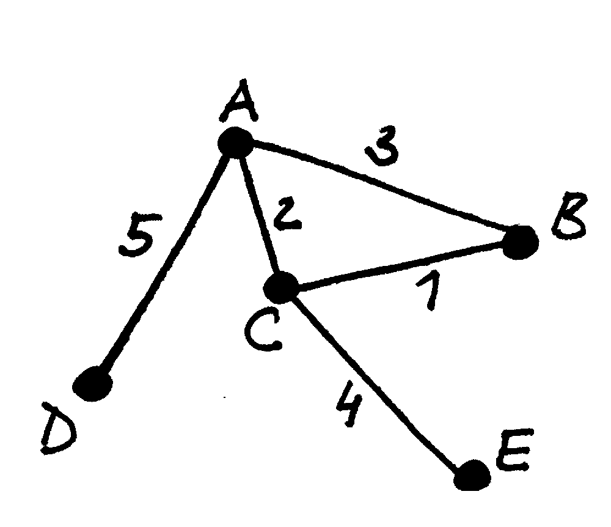
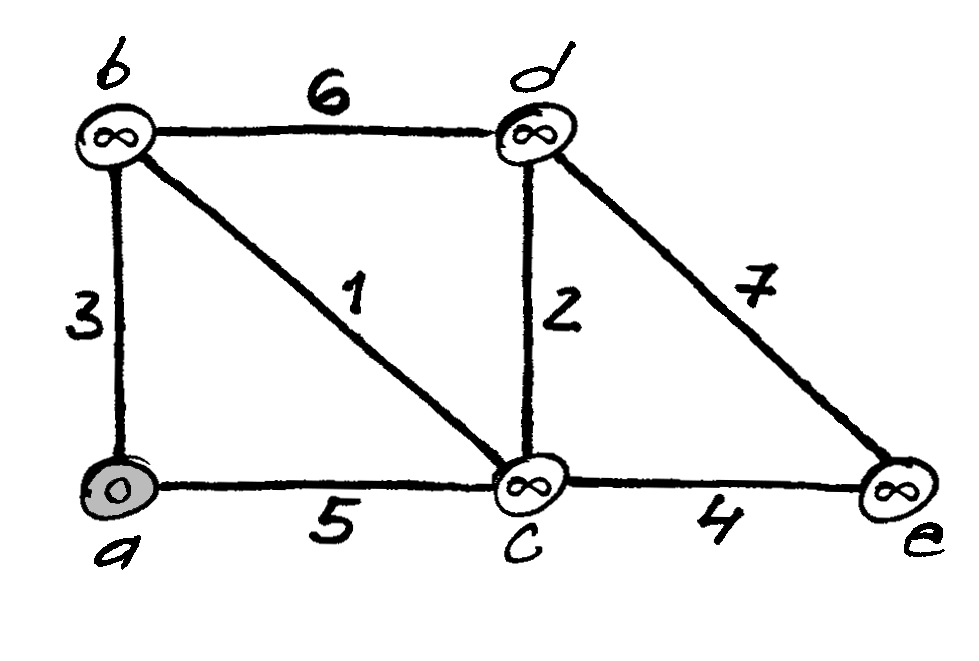
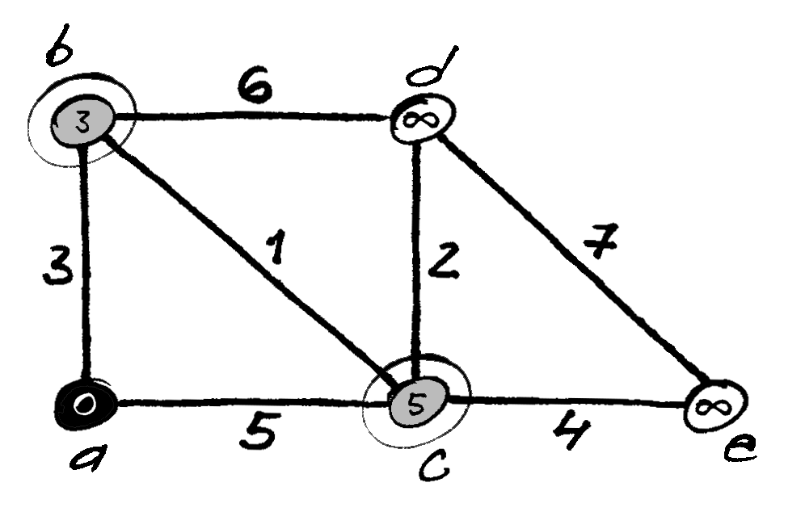
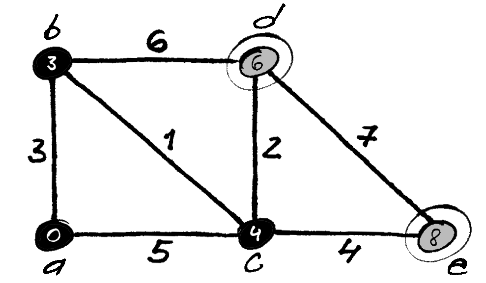
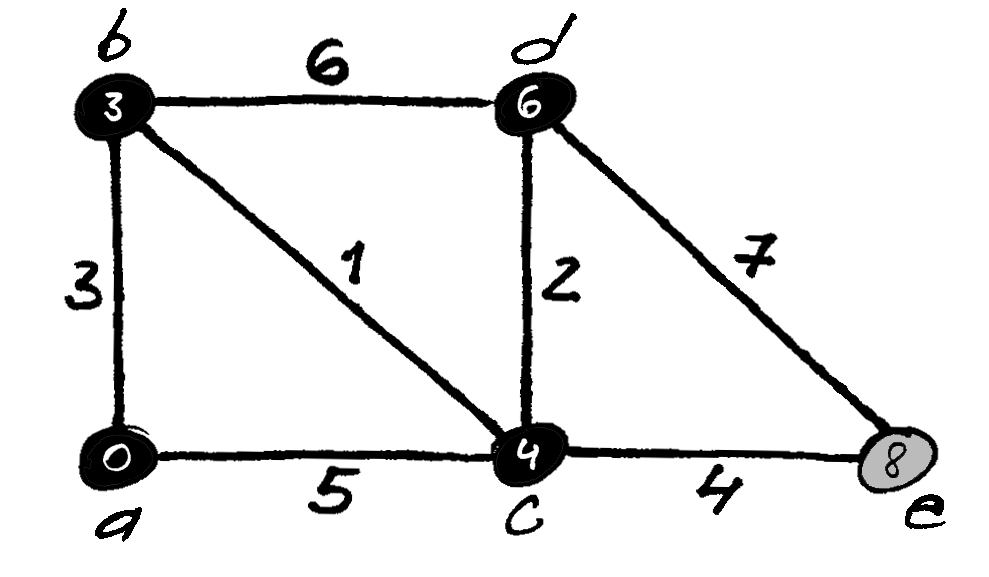
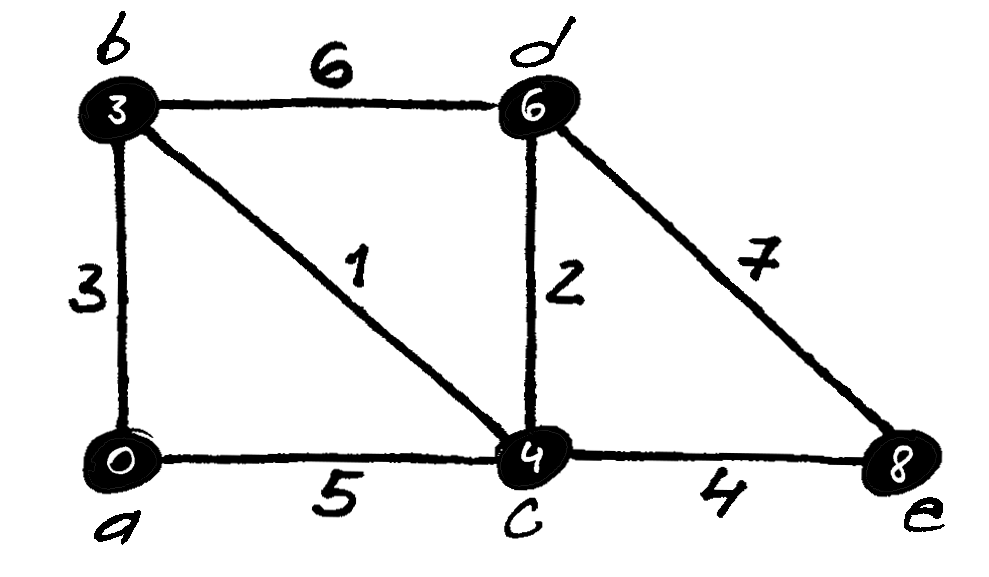
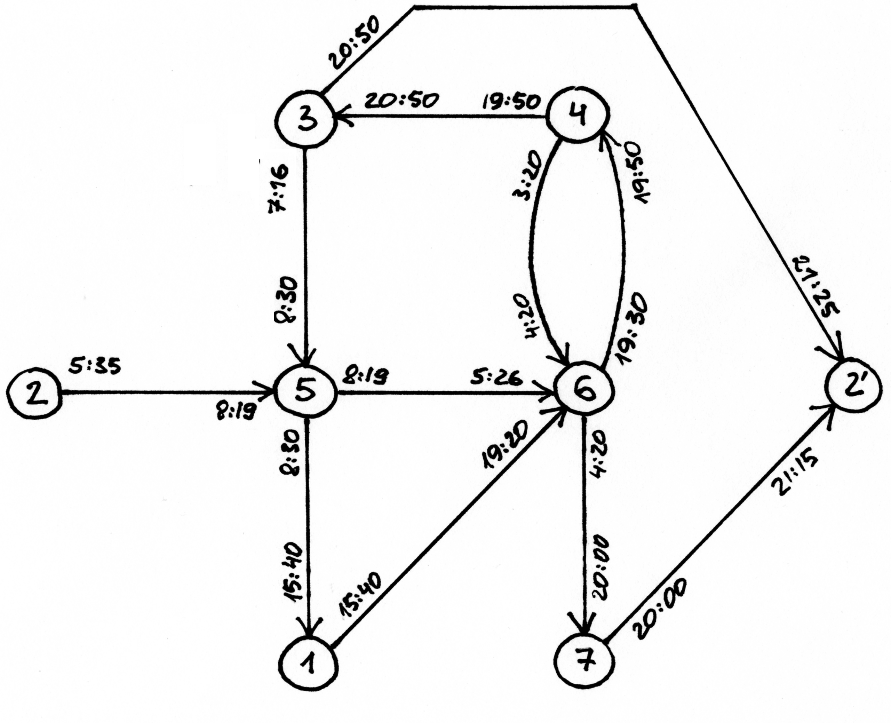

==================================================================
Svoriniai grafai, Trumpiausio kelio paieška – Dijkstros algoritmas
==================================================================

  | *Most of fundamental ideas of science are essentially simple.*
  | *Dauguma fundamentalių mokslo idėjų yra iš esmės paprastos.*
  | Albertas Enšteinas (Albert Einstein)

Dažnai tikslinga grafo briaunai (arba lankui) priskirti kokį nors
dydį. Pavyzdžiui, jei grafu modeliuojame vietovės žemėlapį
(viršūnėmis – miestus, o briaunomis – kelius), tai briaunoms
galima priskirti tų kelių ilgius. Šiame skyrelyje aptarsime tokių
grafų vaizdavimą ir vieną iš garsiausių algoritmų – Dijkstros
algoritmą trumpiausiam keliui rasti.

.. _skyrelis-svoriniai-grafai:

Svoriniai grafai
================

  Svorinio grafo pavyzdys

Grafas, kurio visoms briaunoms (lankams) yra priskirti dydžiai
(svoriai), vadinamas **svoriniu**. Dažniausiai nagrinėjami svoriniai
grafai, kurių briaunų svoriai yra skaičiai.

Galime tarti, kad paprastas **besvoris** grafas tėra atskiras svorinio
grafo atvejis, kai visų briaunų svoriai lygūs 1.

Duomenų struktūra, kuria galime pavaizduoti svorinį grafą,
nesudėtinga. Galime naudoti kaimynystės matricą, kurioje saugosime
briaunų svorius. Ta pati matrica turėtų saugoti ne tik briaunų
svorius, bet ir parodyti, kurios grafo briaunos egzistuoja, kurios ne.
Neegzistuojančias briaunas galime žymėti tokiu skaičiumi, kokio
svorio būti negali, pavyzdžiui „begaliniu“ (labai dideliu) svoriu
arba neigiamu skaičiumi (pavyzdžiui, jei grafo svoriai reiškia
atstumus tarp miestų). Bet kuriuo atveju reikia būti tikram, kad
jokioje algoritmo vykdymo stadijoje egzistuojančios briaunos svoris
negalės įgauti tokios reikšmės.

.. tabs::

  .. tab:: Paskalis

    .. code-block:: unicode_pascal

      const MAXN = ...; { maksimalus grafo viršūnių skaičius }
           BEGALINIS = MAXINT;
      type grafas = record
              n : integer;      { viršūnių skaičius }
              svoris : array [1..MAXN,
                              1..MAXN] of integer;
                                { briaunų svorių matrica }
          end;

  .. tab:: C++

    .. code-block:: cpp

      const int MAXN = ...;      // maksimalus grafo viršūnių skaičius
      const int BEGALINIS = ...;
      /*
        Konstanta BEGALINIS - kažkoks pakankamai didelis skaičius, kuris turėtų būti didesnis už bet
        kokį įmanomą atstumą, tad atstotų begalybės reikšmę. Pavyzdžiui, dažnai naudojama reikšmė 1e9.
      */

      int n; // viršūnių skaičius
      int svoris[MAXN][MAXN];

Šitaip vaizduojant grafą, viršūnes :math:`u` ir :math:`v` jungia
briauna, jei ``G.svoris[u, v] < BEGALINIS``.

Jei grafas vaizduojamas kaimynystės sąrašais, tai briaunos svorį
tenka arba saugoti atskirame dvimačiame masyve, arba kiekvienai
viršūnei sudaryti iš jos išeinančių briaunų svorių sąrašą.

Trumpiausio kelio paieškos algoritmas – Dijkstros algoritmas
============================================================

Nagrinėjant olimpiadinių uždavinių sprendimus dažnai gali tekti
susidurti su Dijkstros algoritmu trumpiausio kelio grafe paieškai. Šio
algoritmo autorius – E. V. Dijkstra (*Edsger Wybe Dijkstra*) –
olandų mokslininkas, daug nusipelnęs kompiuterių mokslui, ypač
programavimo kalbų srityje. Trumpiausio kelio algoritmas nėra
svarbiausias jo darbas, tačiau daugelis Dijkstros pavardę sieja
būtent su šiuo algoritmu.

.. figure:: images/vieši/Edsger_Wybe_Dijkstra.jpg
  :align: center
  :width: 200px
  :alt: E. V. Dijsktra

  E. V. Dijsktra (*Edsger Wybe Dijkstra*) 1930–2002

Pats E. V. Dijkstra apie tai rašo: *„Daug metų plačiuose
sluoksniuose trumpiausio kelio algoritmas garsino mano vardą ir teikė
šlovės, tačiau nuostabu tai, kad jis buvo sukurtas net be popieriaus
ir pieštuko, geriant kavą su žmona saulėtoje Amsterdamo kavinės
terasoje, sukurtas tik pademonstruoti kompiuterio galimybėms...“*

Jau esame aptarę vieną algoritmą, tinkamą trumpiausio kelio
paieškai – paiešką platyn. Pradėta viršūnėje :math:`p`,
paieška platyn pirmiau ima viršūnes, kurių atstumas nuo viršūnės
:math:`p` (matuojamas briaunų, kuriomis einama, skaičiumi) yra
mažiausias.

Nagrinėkime svorinį grafą :math:`G`, kurio briaunos :math:`(u, v)`
svoris reiškia atstumą tarp viršūnių :math:`u` ir :math:`v`.
**Kelio svoriniame grafe ilgiu** vadinsime visų kelią sudarančių
briaunų svorių sumą. Nagrinėsime svorinį grafą :math:`G`, kurio
briaunos :math:`(u, v)` **neneigiamas** svoris reiškia atstumą tarp
viršūnių :math:`u` ir :math:`v`. Kaip ieškoti trumpiausio kelio
tokiame grafe? Nesunku įsitikinti, kad paieška platyn čia visai
netinkamas algoritmas, kadangi trumpiausias kelias nebūtinai reikš
mažiausią briaunų, kuriomis einama, skaičių (pavyzdžiui, pasiekti
viršūnę einant dviem briaunomis, kurių svoriai atitinkamai, 1 ir 2,
yra „pigiau“ negu viena briauna, kurios svoris 5, nes
:math:`1 + 2 = 3 < 5`).

Dijkstros algoritmas, kaip ir paieška platyn, iš duotosios viršūnės
:math:`p` randa trumpiausius kelius iki **visų** svorinio grafo
viršūnių. Algoritmas skirsto viršūnes į dvi aibes: tų, iki kurių
trumpiausi keliai (ir atstumai) jau žinomi (jas vadinsime
*prijungtomis*), ir visų kitų.

Pradžioje nežinomas trumpiausias kelias nė iki vienos viršūnės,
išskyrus pradinę :math:`p`, tad pažymima, kad atstumai iki šių
viršūnių yra begaliniai. Atstumas (nuo pradinės) iki pradinės
viršūnės jau žinomas – jis lygus nuliui.

Kiekvienu žingsniu algoritmas suranda dar *neprijungtą* viršūnę,
iki kurios atstumas yra mažiausias (pirmu algoritmo žingsniu tai
pradinė viršūnė :math:`p`, kadangi iki visų kitų viršūnių
atstumai yra begaliniai). Pasirinktoji viršūnė prijungiama, o tuomet
atnaujinama informacija apie visas *neprijungtas* jos kaimynes: galbūt
kelias iki šios viršūnės dar nebuvo rastas, o jei buvo – tai
galbūt kelias, einantis per ką tik prijungtąją viršūnę iki šios
kaimynės, yra trumpesnis už iki šiol rastąjį.

Taigi pirmuoju algoritmo žingsniu prijungiama pradinė viršūnė
:math:`p`. Antruoju – artimiausia :math:`p` kaimynė. Kiekvienu
žingsniu prijungiamų viršūnių atstumai sudaro nemažėjančią
seką, kadangi visąlaik bandoma prijungti kuo artimesnes viršūnes.
Šie samprotavimai intuityviai pagrindžia algoritmo teisingumą.
Prijungdami viršūnę, galime būti tikri, jog rastasis atstumas yra
trumpiausias, kadangi visi kiti, vėliau atrasti, trumpiausi atstumai
bus tik ilgesni už šį.

Kadangi ieškoma trumpiausių kelių, o ne tik jų ilgių, kiekvienai
viršūnei išsaugoma jos pirminė viršūnė (tai viršūnė, iš
kurios į ją ateinama einant trumpiausiu keliu). Kol kelias iki
viršūnės nerastas, jos pirminė viršūnė yra neapibrėžta.
Atnaujinant atstumą iki viršūnės, kartu pažymima, iš kurios
viršūnės į ją ateinama. Algoritmo vykdymo metu kiekvienos
viršūnės pirminė viršūnė (kaip ir trumpiausias rastas atstumas)
gali ne kartą pasikeisti. Dijkstros algoritmo vykdymas konkrečiame
grafe, kai ieškomi trumpiausi keliai iš viršūnės :math:`a` iki
kitų grafo viršūnių.

.. |dijkstra_c| image:: images/10_skyrius/67_lin_dijkstra3.png
  :width: 300px
  :alt: Dijkstros algoritmo iliustracija

.. table:: Dijkstros algoritmo iliustracija

  +---------------+----------------------------------------------------+
  | |dijkstra_a|  | Pradinė situacija: trumpiausio kelio iki viršūnės  |
  |               | :math:`a` (pasirinktosios pradinės viršūnės)       |
  |               | ilgis lygus 0, o iki kitų viršūnių – nežinomas;    |
  +---------------+----------------------------------------------------+
  | |dijkstra_b|  | Viršūnė :math:`a` turi dvi kaimynes :math:`b` ir   |
  |               | :math:`c`; iki šių viršūnių rasti trumpesni keliai |
  +---------------+----------------------------------------------------+
  | |dijkstra_c|  | Iš neprijungtų viršūnių išrenkama ta, iki          |
  |               | kurios atstumas trumpiausias (viršūnę :math:`b`);  |
  |               | trumpesnio kelio iki :math:`b` rasti negalima, ji  |
  |               | prijungiama; peržiūrimos neprijungtos :math:`b`    |
  |               | kaimynės :math:`c` ir :math:`d` ir pastebima, kad  |
  |               | iki šių abiejų viršūnių rasti trumpesni keliai     |
  |               | per viršūnę :math:`b`: iki viršūnės :math:`d`      |
  |               | kelias anksčiau nebuvo rastas, o iki viršūnės      |
  |               | :math:`c` buvo rastas tiesioginis kelias iš        |
  |               | :math:`a`; tačiau naujasis kelias per viršūnę      |
  |               | :math:`b` yra trumpesnis                           |
  +---------------+----------------------------------------------------+
  | |dijkstra_d|  |                                                    |
  +---------------+----------------------------------------------------+
  | |dijkstra_e|  |                                                    |
  +---------------+----------------------------------------------------+
  | |dijkstra_f|  | Baigus vykdyti Dijkstros algoritmą visos           |
  |               | viršūnės yra prijungtos (t. y. visos yra           |
  |               | pasiekiamos iš pradinės viršūnės) ir žinomi        |
  |               | trumpiausi atstumai iki jų: trumpiausio kelio iki  |
  |               | viršūnės :math:`b` ilgis lygus 3, iki :math:`c`    |
  |               | – 4, iki :math:`d` – 6, iki :math:`e` – 8.         |
  +---------------+----------------------------------------------------+

Toliau pateikiamas algoritmo tekstas, tinkamas trumpiausių kelių
paieškai tiek orientuotame, tiek ir neorientuotame grafe. Grafas
vaizduojamas kaimynystės matrica.

.. tabs::

  .. tab:: Paskalis

    .. code-block:: unicode_pascal

      type masyvas = array [1..MAXN] of longint;
          logmas = array [1..MAXN] of boolean;
      procedure dijkstra(var G : grafas;
                        var atstumas, pirminė : masyvas;
                        p : integer);
      var prijungta : logmas;
         v, u : integer;
         min : longint;
      begin
         { įrašomos pradinės masyvų reikšmės }
         for u := 1 to G.n do begin
             atstumas[u] := BEGALINIS;
             pirminė[u] := -1;
             prijungta[u] := false;
         end;
         atstumas[p] := 0;
          v := p;
         while v <> 0 do begin
             { jei v <> 0, tai rasta viršūnė, kurią galima prijungti }
             prijungta[v] := true;
             for u := 1 to G.n do { peržiūrimos kaimynės }
                 if (G.svoris[v, u] < BEGALINIS) and
                    (atstumas[u] >
                        atstumas[v] + G.svoris[v, u])
                 then begin { į viršūnę u verčiau eiti per v }
                     atstumas[u] :=
                         atstumas[v] + G.svoris[v, u];
                     pirminė[u] := v;
                 end;
              { randama tolesnė kandidatė -
                dar neprijungta viršūnė su mažiausiu atstumu }
              v := 0;
              min := BEGALINIS;
              for u := 1 to G.n do
                  if not prijungta[u] and
                     (atstumas[u] < min)
                  then begin
                      v := u;
                      min := atstumas[u];
                  end;
              { jei jokia viršūnė nerasta, tai v = 0 ir ciklas nutraukiamas }
         end;
      end;

  .. tab:: C++

    Kodas analogiškas Paskalio kalba užrašytam variantui:

    .. code-block:: cpp

      int atstumas[MAXN];
      int pirmine[MAXN];
      bool prijungta[MAXN];

      void dijkstra (int p) {
          // įrašomos pradinės masyvų reikšmės
          for (int u = 0; u < n; u++) {
              atstumas[u] = BEGALINIS;
              pirmine[u] = -1;
              prijungta[u] = false;
          }

          atstumas[p] = 0;
          int v = p;
          while (v != -1) {
              // jei v != -1, tai rasta viršūnė, kurią galima prijungti
              prijungta[v] = true;
              for (int u = 0; u < n; u++) {
                  if (svoris[v][u] < BEGALINIS && atstumas[u] > atstumas[v] + svoris[v][u]) {
                      // į viršūnę u verčiau eiti per v
                      atstumas[u] = atstumas[v] + svoris[v][u];
                      pirmine[u] = v;
                  }
              }

              // randama tolesnė viršūnė - dar neprijungta viršūnė su mažiausiu atstumu
              v = -1;
              int minAtstumas = BEGALINIS;
              for (int u = 0; u < n; u++) {
                  if (!prijungta[u] && atstumas[u] < minAtstumas) {
                      v = u;
                      minAtstumas = atstumas[u];
                  }
              }
              // jei tokia viršūnė nerasta, tai v = -1 ir ciklas nutraukiamas
          }
      }

  .. tab:: Idiomatinis C++

    Dijkstros algoritmo realizacija panaudojant `priority_queue`:

    .. code-block:: cpp

      vector<pair<int, int>> adj[MAXN];
      /*
          adj[i] yra i-tosios viršūnės kaimynų sąrašas, kur
          adj[i][j].first yra j-tosios kaimynės numeris
          adj[i][j].second yra briaunos, jungiančios i-tąją viršūnę su jos j-tąja kaimyne, svoris
      */

      void dijkstra (int p) {
          // įrašomos pradinės masyvų reikšmės
          for (int u = 0; u < n; u++) {
              atstumas[u] = BEGALINIS;
              pirmine[u] = -1;
              prijungta[u] = false;
          }

          atstumas[p] = 0;
          priority_queue<pair<int, int>, vector<pair<int,int>>, greater<pair<int,int>>> q; // priority_queue, kurios top() elementas visad yra mažiausias
          q.push({atstumas[p], p}); // į q visados dedam poras {atstumas[i], i}, nes tada q.top() elementas visad būs mažiausio atstumo

          while (!q.empty()) {
              int v = q.top().second;
              if (!prijungta[v]) {
                  prijungta[v] = true;
                  for (auto p : adj[v]) { // einame per viršūnės v kaimynus
                      int u = p.first;  // kaimynės numeris
                      int w = p.second; // briaunos tarp v ir u svoris
                      if (atstumas[u] > atstumas[v] + w) {
                          // verčiau į u eiti per v
                          atstumas[u] = atstumas[v] + w;
                          pirmine[u] = v;
                          q.push ({atstumas[u], u});
                      }
                  }
              }
          }
      }

Užrašytojo algoritmo sudėtingumas yra :math:`O(n^2)`, kur :math:`n`
– grafo viršūnių skaičius. Pasitelkus sudėtingesnes duomenų
struktūras, Dijkstros algoritmą galima pagreitinti iki
:math:`O((n + b) \log n)` (čia :math:`b` – grafo briaunų
skaičius). Pastarasis sudėtingumas yra kur kas geresnis retuose
(turinčiuose nedaug briaunų) grafuose.

Uždavinys *Aplink žemę per 80 dienų* [#f38]_
============================================

  Žiulio Verno knygoje pasakojama, kaip Filijas Fogas apkeliavo aplink
  Žemę per 80 dienų. Tačiau galbūt sudarius labai gerą maršrutą,
  jam būtų pasisekę apkeliauti dar greičiau.

  Žinomi įvairių transporto priemonių, vykstančių į rytus
  (Filijas Fogas keliavo tik į rytus), tvarkaraščiai, tie patys
  visomis dienomis. Apie kiekvieną reisą žinoma šitokia informacija:
  išvykimo miestas, išvykimo laikas, miestai, kuriuose sustojama,
  kelionės trukmė tarp dviejų gretimų stočių. Visi tvarkaraščiai
  nurodyti Grinvičo laiku.

  Laikomasi susitarimo, kad tarpinėje stotyje transporto priemonės
  neužsibūna: atvyksta ir išvyksta tą pačią minutę, taip pat kad
  persėsti iš vienos transporto priemonės į kitą galima tą pačią
  minutę.

  **Užduotis.** Žinomas miestas, iš kurio pradedama keliauti.
  Kelionės pradžia yra lygiai vidurnaktis Grinvičo laiku. Parašykite
  programą, kuria nustatytumėte, ar galima apkeliauti aplink Žemės
  rutulį pagal pateiktus susisiekimo priemonių tvarkaraščius ir, jei
  galima, informuotumėte, kada anksčiausiai įmanoma grįžti į
  miestą, iš kurio buvo išvykta.

Kaip jau galėjote atspėti, uždavinys bus sprendžiamas taikant
Dijkstros algoritmą. Tačiau olimpiada nėra kontrolinis darbas, kuriuo
tikrinama, ar gerai dalyviai moka vieną ar kitą algoritmą. Tad ir
uždaviniai olimpiadose pateikiami tokie, kad net žinant algoritmą,
tenka jį modifikuoti ir pritaikyti neįprastai situacijai.

Sudarysime orientuotą grafą, kurio viršūnės atitiks miestus. Reikia
rasti trumpiausią kelią iš pradinio miesto atgal į jį patį, tik
trumpiausią laiko prasme. Tačiau Dijkstros algoritmas kiekvieną
viršūnę nagrinėja tik po vieną kartą, todėl pradinį miestą (į
kurį turime sugrįžti) pavaizduosime dviem viršūnėmis (:math:`M` ir
:math:`M'`): viena turės tik išeinančius lankus, kita – tik
įeinančius.

Galime būti tikri, kad bet kuri kelionė iš viršūnės :math:`M` į
viršūnę :math:`M'` bus kelionė aplink pasaulį, kadangi visi
maršrutai yra tik rytų krypties.

Į bet kurį maršrutą galima žiūrėti kaip į kelių tiesioginių
(be persėdimų) ir nepriklausomų reisų rinkinį. Kiekvieną tokį
(tiesioginį) reisą grafe atitiktų lankas, turintis du parametrus
(svorius): reiso pradžios laiką ir jo trukmę. Kiekvienu Dijkstros
algoritmo žingsniu būtų prijungiama viršūnė, iki kurios galime
atvykti anksčiausiai. Prijungus viršūnę peržiūrimi visi iš jos
išeinantys lankai. Pagal atvykimo į šią viršūnę laiką ir
maršruto trukmę apskaičiuojama, kada galima nuvykti į kaimynines
viršūnes.

Panagrinėkime pavyzdį. Sakykime, duoti 7 miestai, Filijas Fogas
kelionę pradeda ir baigia antrajame, ir galimi tokie maršrutai:

*Pirmasis maršrutas*: 2 → 5 → 6, išvykimo laikas – 5:35,
važiavimų trukmės: 2:44 ir 21:07.

*Antrasis maršrutas:* 3 → 5 → 1 → 6, išvykimo laikas –
7:16, važiavimų trukmės: 1:14, 7:10, 3:40.

*Trečiasis maršrutas:* 4 → 6 → 7 → 2, išvykimo laikas –
3:20, važiavimų trukmės: 1:00, 15:40, 1:15.

*Ketvirtasis maršrutas:* 6 → 4 → 3 → 2, išvykimo laikas
– 19:30, važiavimų trukmės: 0:20, 1:00, 0:35.

.. _img-10-80d:

  Pavyzdyje pateiktus maršrutus atitinkantis grafas; kad
  iliustracija būtų aiškesnė, vietoj važiavimo trukmių nurodyti
  atvykimo laikai (nė vienas reisas netrunka ilgiau nei parą)

Šiuos maršrutus atitinkantis grafas pateiktas :numref:`img-10-80d`
paveiksle. Tarkime,
Filijas Fogas pradeda kelionę iš antrojo miesto. Jis anksčiausiai
sugrįš namo, jei stotyje lauks iki ryto ir 5:35 išvyks į penktąjį
miestą (tai, beje, vienintelis reisas iš antrojo miesto). Penktajame
mieste jam verta persėsti ir važiuoti į pirmąjį miestą, o iš ten
– į šeštąjį, kuriame jis atsidurs 19 val. 20 min. Ir spės į
reisą, išvykstantį į ketvirtąjį miestą 19 val. 30 min. O iš ten
be persėdimo važiuos iki pradinio miesto. Kelionės trukmė: 21 val.
25 min.

Jeigu Filijas Fogas penktajame mieste nepersėstų ir važiuotų toliau
į šeštąjį miestą, tuomet jis ten atsidurtų kitos dienos ryte:
5 val. 26 min. ir pavėluotų į rytinį reisą, vykstantį į
septintą miestą. Jam tektų laukti iki vakaro ir tik 19 val. 30 min.
jis galėtų išvykti į ketvirtąjį miestą. Kelionė aplink pasaulį
truktų 1 parą, 21 val. ir 25 min., t. y. lygiai parą ilgiau nei
optimaliu atveju.

Kadangi gali būti keli skirtingi reisai tarp tų pačių miestų,
grafą būtina vaizduoti kaimynystės sąrašais. Sutarsime, kad
skaitant pradinius duomenis, visi tarpinių sustojimų turintys
maršrutai iš karto išskaidomi į persėdimų neturinčius reisus ir
tuo pačiu sudaromas grafas. Taip pat sutarsime, kad, kuriant grafą,
išvykimo laikai perskaičiuoti minutėmis. Rezultatas (laikas, kada
anksčiausiai įmanoma grįžti) taip pat pateikiamas minutėmis nuo
kelionės pradžios.

.. tabs::

  .. tab:: Paskalis

    .. code-block:: unicode_pascal

      const BEGALINIS = MAXLONGINT;
           PARA = 24 * 60;
           MAXM = ...; { maksimalus miestų skaičius }
           MAXR = ...; { maksimalus reisų skaičius }
      type masyvas = array [1..MAXM + 1] of longint;
          logmas = array [1..MAXM + 1] of boolean;
          reisas = record
              kur, kada, trukmė : longint;
          end;
          reisai_iš_miesto = record
              k : longint; { reisų skaičius }
              reisai : array [1..MAXR] of reisas;
          end;
          grafas = record
              n : longint; { miestų skaičius }
              mst : array [1..MAXM+1] of reisai_iš_miesto;
          end;

      procedure dijkstra(var G : grafas;
                       pr : longint; { pradinis miestas }
                       var laikas : masyvas {atvykimo laikai});
      var i, u, v, t, min, atvykta, išvyksta : longint;
         prijungta : logmas;
      begin
         { įrašomos pradinės masyvų reikšmės }
         for u := 1 to G.n do begin
             laikas[u] := BEGALINIS;
             prijungta[u] := false;
         end;
         laikas[pr] := 0;
         v := pr;
         while v <> 0 do begin
             { prijungiama viršūnė v }
             prijungta[v] := true;
             { atnaujinama informacija apie kaimynes }
             for i := 1 to G.mst[v].k do begin
                 u := G.mst[v].reisai[i].kur;
                 t := G.mst[v].reisai[i].trukmė;
                 { kiek reikės laukti mieste v ? }
                 atvykta := laikas[v] mod PARA;
                 išvyksta := G.mst[v].reisai[i].kada;
                 if atvykta <= išvyksta then
                     { reisu pavyks išvykti tą pačią parą }
                     t := t + (išvyksta - atvykta)
                 else { teks laukti kitos dienos }
                     t := t + (PARA - atvykta) + išvyksta;
                 { ar į u verta vykti per v? }
                 if laikas[u] > laikas[v] + t then
                     laikas[u] := laikas[v] + t;
             end;
             { randama tolesnė kandidatė –
            dar neprijungta viršūnė su mažiausiu atstumu }
            v := 0;
            min := BEGALINIS;
            for u := 1 to G.n do
                if not prijungta[u] and (laikas[u] < min)
                then begin
                    v := u;
                    min := laikas[u];
                end;
         end;
      end;

      procedure keliauk(var G : grafas; { informacija apie visus
                                       reisus iš kiekvieno miesto}
                       pr : longint;   { pradinis miestas}
                       var atvykimas : longint { sprendinys});
      var i, j, pb : longint;
         laikas : masyvas;
      begin
         { pradinis miestas keičiams dviem miestais: miestu, kuriame
         kelionė prasidėjo ir fiktyviu, kuriame kelionė baigėsi }
         G.n := G.n + 1;
         pb := G.n;
         for i := 1 to G.n - 1 do
             for j := 1 to g.mst[i].k do
                 if G.mst[i].reisai[j].kur = pr then
                     G.mst[i].reisai[j].kur := pb;
         { suskaičiuojama, per kokį mažiausią laiką galima
           nuvykti į kiekvieną miestą }
         dijkstra(G, pr, laikas);
         atvykimas := laikas[pb];
         { jei maršruto nėra, atvykimas = BEGALINIS }
      end;

  .. tab:: C++

    .. code-block:: cpp

      const long long BEGALINIS = 1e18;
      const long long PARA = 24*60;
      const int MAXM = ...; // maksimalus miestų skaičius
      const int MAXR = ...; // maksimalus reisų skaičius

      struct reisas {
          int kur, kada, trukme;
      };

      struct reisaiIsMiesto {
          int k; // miestų skaičius
          reisas reisai[MAXR];
      };

      int n;                    // miestų skaičius
      reisaiIsMiesto mst[MAXM]; // grafas
      long long laikas[MAXM];   // atvykimo laikai
      bool prijungta[MAXM];

      void dijkstra (int pr) { // pr - pradinis miestas
          // įrašomos pradinės masyvų reikšmės
          for (int u = 0; u < n; u++) {
              laikas[u] = BEGALINIS;
              prijungta[u] = false;
          }
          laikas[pr] = 0;

          int v = pr;
          while (v != -1) {
              // prijungiama viršūnė v
              prijungta[v] = true;

              // atnaujinama informacija apie kaimynes
              for (int i = 0; i < mst[v].k; i++) {
                  int u = mst[v].reisai[i].kur;
                  int t = mst[v].reisai[i].trukme;
                  // kiek reikės laukti mieste u?
                  int atvyksta = laikas[v] % PARA;
                  int isvyksta = mst[v].reisai[i].kada;
                  if (atvyksta <= isvyksta) // reisu pavyks išvykti tą pačią dieną
                      t += (isvyksta - atvyksta);
                  else // teks laukti kitos dienos
                      t += (PARA - atvyksta) + isvyksta;

                  // ar į u verta vykti per v?
                  if (laikas[u] > laikas[v] + t)
                      laikas[u] = laikas[v] + t;
              }

              // randama tolesnė kandidatė - dar neprijungta viršūnė su mažiausiu atstumu
              v = -1;
              int minAtstumas = BEGALINIS;
              for (int u = 0; u < n; u++) {
                  if (!prijungta[u] && laikas[u] < minAtstumas) {
                      v = u;
                      minAtstumas = laikas[u];
                  }
              }
          }
      }

      void keliauk (int pr) { // pr - pradinis miestas
          /*
              pradinis miestas keičiamas dviem miestais:
              miestu, kuriame kelionė prasidėjo, ir
              fiktyviu, kuriame kelionė baigėsi
          */
          int pb = n;
          n++;
          for (int i = 0; i < n-1; i++)
              for (int j = 0; j < mst[i].k; j++)
                  if (mst[i].reisai[j].kur == pr)
                      mst[i].reisai[j].kut = pb;

          // suskaičiuojama, per kokį mažiausią laiką galima nuvykti į kiekvieną miestą
          dijkstra (pr);

          return laikas[pb];
          // jei maršruto nėra - laikas[pb] yra BEGALINIS
      }

.. rubric:: Išnašos

.. [#f38]
  Panašus uždavinys buvo pateiktas Lietuvos moksleivių informatikos
  olimpiadoje III etape 2000 metais.
