=============================================
Medžiai, Minimalaus jungiamojo medžio radimas
=============================================

  | *I hope to convince you that mathematical trees are no less lovely than*
  | *their biological counterparts.*
  | *Tikiuosi, galiausiai jūs sutiksite, jog matematiniai medžiai*
  | *džiugina širdį ne mažiau nei tikrieji.*
  | Džo Malkevičius (Joe Malkevitch)

Ankstesniuose skyriuose išplėtėme grafo sąvoką: susipažinome su
orientuotais bei svoriniais grafais. Šį kartą susiaurinsime grafo
sąvoką. Panagrinėsime medžius – grafus, pasižyminčius tam
tikromis savybėmis. Pamatysime, jog medžiai dažnai pasitaiko, kai
grafais modeliuojami praktiniai uždaviniai.

Medžiai
=======

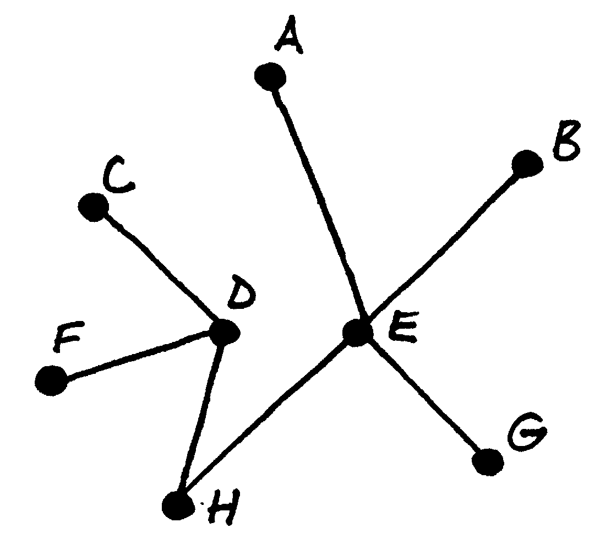

  Medis

**Medžiu** vadinamas neorientuotas jungus ciklų neturintis grafas.

Kiekvienas medis pasižymi tokiomis savybėmis:

-  bet kurias dvi viršūnes medyje jungia vienintelis kelias; 

-  visos medžio briaunos yra tiltai (t. y. panaikinus bet kurią
   briauną medis taptų nejungus); 

-  :math:`n` viršūnių turintis medis visuomet turi :math:`(n - 1)`
   briauną, ir atvirkščiai – jungusis grafas turintis :math:`n`
   viršūnių ir :math:`(n - 1)` briauną yra medis. 

Kai kada medžiuose viena viršūnė išskiriama iš kitų ir pavadinama
**medžio šaknimi**, o pats medis – **šakniniu medžiu**.

Šakninio medžio viršūnės taip pat turi skirtingus pavadinimus. Bet
kuri viršūnė :math:`u`, esanti tiesioginiame kelyje tarp šakninės
viršūnės ir viršūnės :math:`v`, vadinama viršūnės :math:`v`
**protėviu**, o viršūnė :math:`v` vadinama viršūnės :math:`u`
**vaikaičiu**. Šakninė viršūnė yra visų medžio viršūnių
protėvis, o visos medžio viršūnės yra jos vaikaičiai, kiekviena
viršūnė yra savo pačios protėvis ir vaikaitis. Jei viršūnė
:math:`u` yra :math:`v` protėvis ir egzistuoja briauna, jungianti
:math:`u` ir :math:`v`, tuomet :math:`u` vadinama **pirmine (tėvine)**
:math:`v` viršūne, o :math:`v` vadinama **antrine (vaikine)**
:math:`u` viršūne. Medžio viršūnė, neturinti antrinių
viršūnių, vadinama **lapu**.

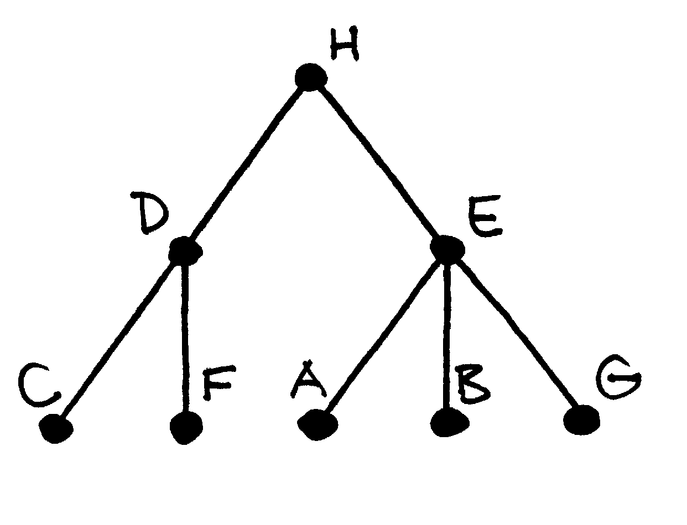

  Šakninis medis, gautas iš praeitame paveiksle pateikto
  medžio, šaknine pasirinkus viršūnę :math:`H`; medis turi penkis
  lapus :math:`(C, F, A, B, G)`; šakninė viršūnė :math:`H` turi dvi
  antrines viršūnes (:math:`D` ir :math:`E`) ir 7 vaikaičius
  :math:`(D, E, C, F, A, B, G)`.

Medžių vaizdavimas
==================

Medis yra susiaurinta grafo sąvoka: bet kuris medis yra grafas, bet ne
atvirkščiai. Tad medžius galima vaizduoti lygiai tomis pačiomis
duomenų struktūromis kaip ir grafus: kaimynystės matricomis ir
kaimynystės sąrašais. Kita vertus, galime tikėtis rasti
elegantiškesnį būdą medžiams pavaizduoti. Juk iš anksto žinome,
jog toks grafas turės :math:`(n - 1)` briauną, bus jungus bei
neturės ciklų.

Iš tiesų, jei medis šakninis, tai kiekviena viršūnė, išskyrus
medžio šaknį, turi lygiai vieną pirminę viršūnę. Todėl medį
visiškai apibrėžia jau anksčiau minėtas pirminumo masyvas:

.. tabs::

  .. tab:: Paskalis

    .. code-block:: unicode_pascal

      const MAX = ...; { maksimalus medžio viršūnių skaičius }
      type masyvas = array [1..MAX] of integer;
      var pirminė : masyvas; { kiekvienai viršūnei įsimenama jos
                              pirminė viršūnė }

  .. tab:: C++

    .. code-block:: cpp

      const int MAXN = ...; // maksimalus medžio viršūnių skaičius
      int pirmine[MAXN];    // kiekvienai viršūnei įsimenama jos pirminė viršūnė

Taip pavaizdavę medį, galime sužinoti visas medžiui priklausančias
briaunas (jos yra pavidalo (``k``, ``pirminė[k]``)) ir efektyviai
rasti kelius nuo viršūnės :math:`v` iki šakninės viršūnės,
pereinant visus viršūnės :math:`v` protėvius. Tačiau „leistis“
medžiu, t. y. ieškoti kiekvienos viršūnės antrinių viršūnių
efektyviai negalime, nes tektų peržiūrėti visą masyvą.

Siekdami efektyviai rasti tiek pirminę, tiek ir antrines viršūnes,
šakninį medį galime vaizduoti įrašų masyvu, kuriame saugoma
kiekvienos viršūnės pirminė viršūnė ir antrinių viršūnių
sąrašas:

.. tabs::

  .. tab:: Paskalis

    .. code-block:: unicode_pascal

      type viršūnė = record
              pirminė : integer;
              antr_sk : integer; { antrinių viršūnių skaičius }
              antr_sąr : array [1..MAX] of integer
          end;
          medis = array [1..MAX] of viršūnė;

  .. tab:: C++

    .. code-block:: cpp

      int pirmine[MAXN];
      vector<int> antrSar[MAXN]; // antrinių viršūnių sąrašas

Toks vaizdavimas neefektyvus atminties požiūriu: nors visų
viršūnių sąrašų ``antr_sąr`` ilgių suma bus lygi
:math:`(n - 1)`, šiems masyvams skiriama :math:`O(n^2)` atminties,
nes iš anksto nežinoma, kiek kuri viršūnė turės antrinių. Šią
problemą galima spręsti naudojant dinaminę atmintį, kuomet atmintis
išskiriama tik tada, kai jos prireikia, ir kiekvienam sąrašui
išskirti tik tiek atminties, kiek būtina. Tačiau dinaminės duomenų
struktūros yra gana sudėtingos, jų realizavimas ir derinimas atima
nemažai laiko, todėl olimpiadose geriau jų vengti.

Kokį vaizdavimą pasirinkti? Tai visuomet priklauso nuo sprendžiamo
uždavinio. Dažnai pakanka medį saugoti pirminumo masyvu. Kai norima
efektyviai ieškoti antrinių viršūnių, medį tenka vaizduoti
antruoju būdu, jei tik viršūnių skaičius nėra per didelis. Be to,
kai kuriuose uždaviniuose nagrinėjami specifiniai medžiai,
pavyzdžiui, kurių kiekviena viršūnė turi ne daugiau kaip dvi
antrines viršūnes (dvejetainiai medžiai). Jiems nesunku pritaikyti
įrašo tipo struktūrą.

.. _skyrelis-minimalus-jungiamasis-medis:

Minimalus jungiamasis medis
===========================

Panagrinėsime optimizavimo uždavinį, su kuriuo dažnai susiduriama
praktikoje. Tarkime, kad tiesiamos elektros linijos tiekti elektrai į
:math:`N` miestelių. Šiuo tikslu visus N miestelių reikia sujungti į
vieną elektros tinklą. Yra apskaičiuota linijos nutiesimo tarp bet
kurių dviejų miestelių kaina, ir norima sudaryti tokį elektros
linijų planą, kad visų linijų tiesimo kainų suma būtų kuo
mažesnė. Be abejo, nutiesus linijas, kiekvienas miestelis turi turėti
elektrą.

Panagrinėkime pavyzdį. Tarkime, kad miestelių yra penki, o elektros
linijų tiesimo tarp miestelių porų kainos yra tokios:

+-----+------+------+------+------+------+
|     | A    | B    | C    | D    | E    |
+-----+------+------+------+------+------+
| A   | –    | 50   | 10   | 25   | 10   |
+-----+------+------+------+------+------+
| B   | 50   | –    | 20   | 35   | 40   |
+-----+------+------+------+------+------+
| C   | 10   | 20   | –    | 15   | 24   |
+-----+------+------+------+------+------+
| D   | 25   | 35   | 15   | –    | 5    |
+-----+------+------+------+------+------+
| E   | 10   | 40   | 24   | 5    | –    |
+-----+------+------+------+------+------+

Paveiksluose pateikiami keli elektros linijų tiesimo planai.

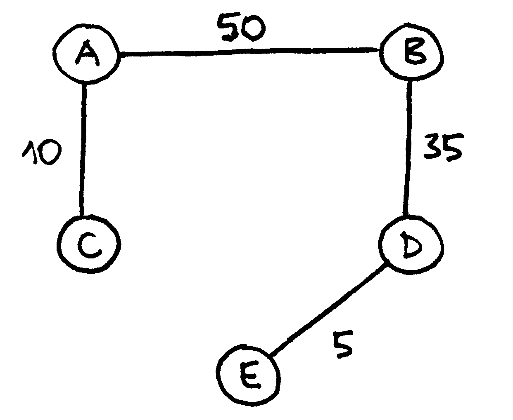

  Pirmas visų penkių miestelių sujungimo būas; tokio sujungimo kaina
  – 100

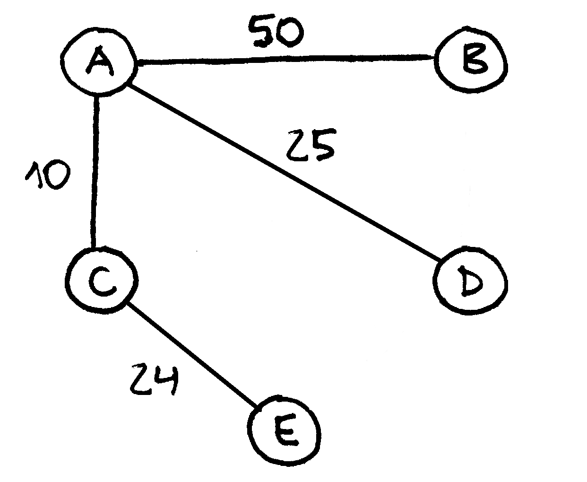

  Antras miestelių sujungimo būdas; šio sujungimo kaina – 109

Matyti, kad yra ne vienas būdas sujungti miestelius į tinklą, ir
vieni šių būdų gali būti ekonomiškesni už kitus.

Turbūt jau supratote, jog šį uždavinį nesunku formaliai apibrėžti
grafų teorijos terminais. Tačiau prieš tai įvesime dar kelias
sąvokas.

Grafo :math:`G` **pografiu** vadinamas grafas :math:`G'`, kurį
papildžius viršūnėmis ir (arba) briaunomis, gaunamas grafas
:math:`G`. Pografis :math:`G'` negali turėti briaunos arba viršūnės,
kurios neturi grafas :math:`G`.

.. figure:: images/11_skyrius/72_lin_pograf1.png
  :align: center
  :width: 200px
  :alt: Grafas

  Grafas

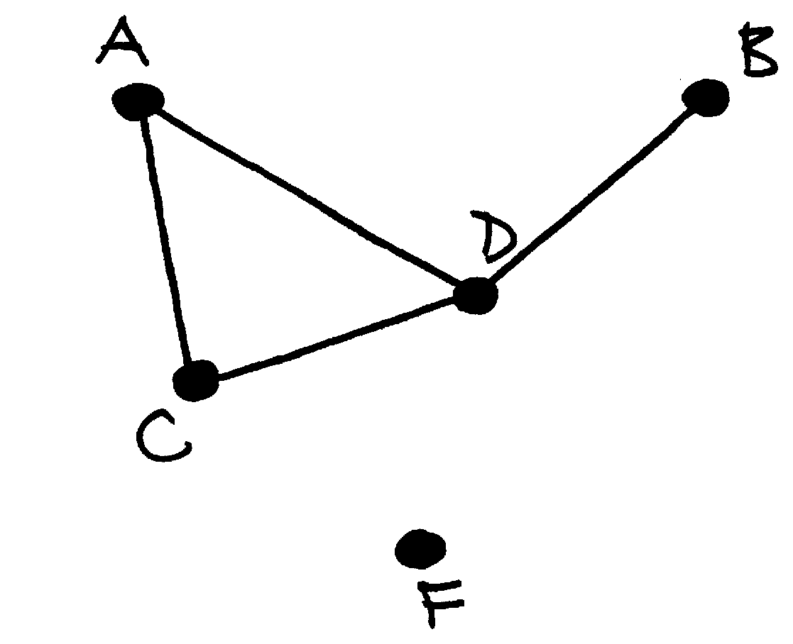

  Vienas iš aukščiau pateikto grafo pografių

Grafo :math:`G` pografis, kuriam priklauso visos :math:`G` viršūnės
ir kuris yra medis, vadinamas grafo :math:`G` **jungiamuoju medžiu**.
Nesunku suvokti, kad vienas grafas gali turėti daugiau nei vieną
jungiamąjį medį. Tačiau jei grafas nejungus, jis neturi jungiamojo
medžio.

Dabar žinome viską, ko reikia nagrinėjamam uždaviniui formalizuoti.
Jei kiekvieną miestelį atitinka grafo :math:`G` viršūnė, o elektros
linijos tiesimo iš miestelio :math:`A` į miestelį :math:`B` kainą
žymi briaunos :math:`(A, B)` svoris, tai ieškomasis linijų tiesimo
planas yra grafo :math:`G` jungiamasis medis, kurio briaunų svorių
suma mažiausia. Toks medis vadinamas **minimaliu jungiamuoju medžiu**
(MJM), o pats uždavinys – minimalaus jungiamojo medžio uždaviniu.

.. _img-11-mjm:

.. figure:: images/11_skyrius/73_lin_MJM.png
  :align: center
  :width: 200px
  :alt: Minimalus jungiamasis medis

  Grafo, sudaryto iš skyrelio pradžioje nagrinėto pavyzdžio,
  minimalus jungiamasis medis; sujungimo kaina – 45

Kitame skyrelyje panagrinėsime efektyvius algoritmus minimalaus
jungiamojo medžio paieškai.

Primo ir kiti algoritmai MJM rasti
==================================

Knygose ir mokslinėje literatūroje ilgą laiką buvo rašoma, kad
pirmieji MJM ieškančius algoritmus sukūrė Džozefas Bernardas
Kruskalas (*Joseph Bernard Kruskal*) ir Robertas Klėjus Primas (*Robert
Clay Prim*) apie 1956–1957 metus. Šie algoritmai vėliau buvo
pavadinti jų vardais. Deja, liko nepastebėta, kad labai gražų ir
elegantišką algoritmą MJM paieškai net dvidešimčia metų anksčiau
jau siūlė čekų mokslininkas Otakaras Boruvka (*Otakar Borůvka*).
Galbūt šio mokslininko darbas buvo nepastebėtas todėl, kad
straipsnį jis išspausdino čekų kalba. Dar daugiau – pasirodo,
Primo algoritmas taip pat buvo atrastas anksčiau kito čekų matematiko
Vojtecho Jarniko (*Vojtĕch Jarník*), o algoritmui jau buvo prigijęs
Primo algoritmo vardas.

Šiame skyrelyje aprašysime visus tris algoritmus MJM paieškai,
tačiau pateiksime tik Primo algoritmo realizaciją. Tam yra rimta
priežastis – Primo algoritmo MJM paieškai realizacija skiriasi nuo
Dijkstros trumpiausio kelio algoritmo vos keliomis eilutėmis.

Visi trys algoritmai remiasi **godžiąja strategija**, t.y. kiekviename
žingsnyje pasirenkamas palankiausias tuo momentu sprendimas. Ko gero,
aiškiausias yra **Kruskalo algoritmas**, kuriuo konstruojamas MJM
prijungiant grafo briaunas. Iš pradžių medis yra tuščias, o
kiekvienu tolesniu žingsniu prijungiama pigiausia (mažiausio svorio)
briauna, kurios prijungimas nesudarytų ciklo. Medis baigiamas
konstruoti, kai daugiau negalima prijungti nė vienos briaunos. Kadangi
medis turi lygiai :math:`(n - 1)` briauną, tai MJM sudaryti prireikia
lygiai :math:`(n - 1)` žingsnių (:math:`n` – grafo viršūnių
skaičius).

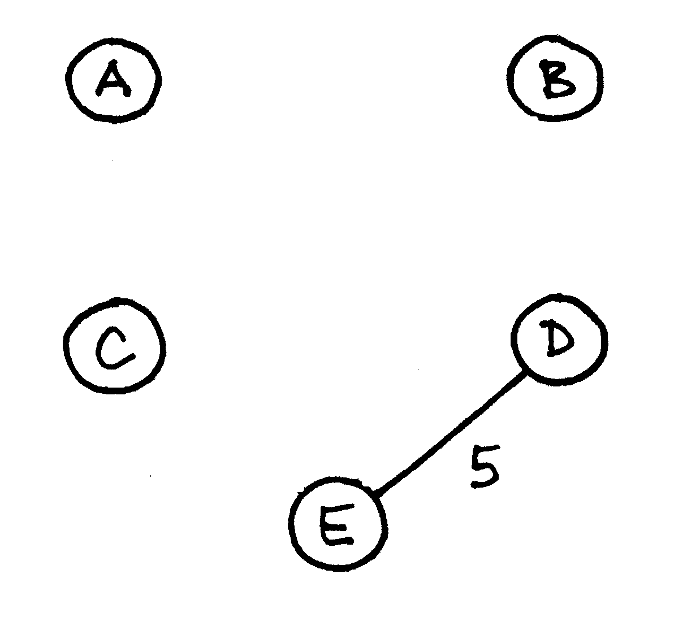
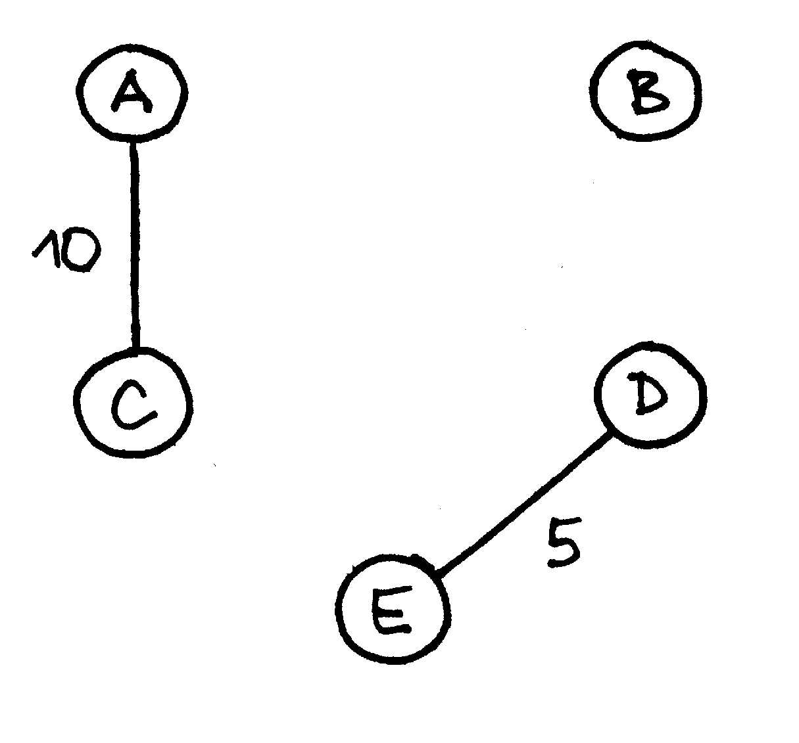
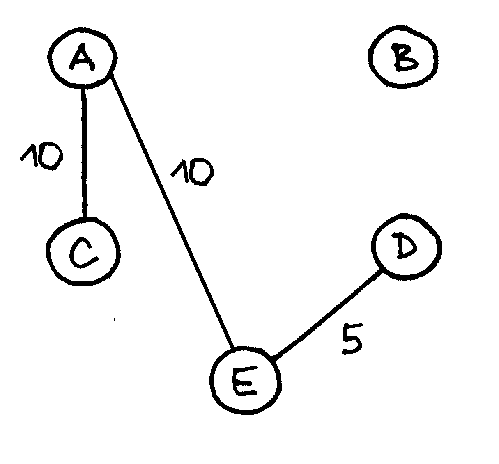
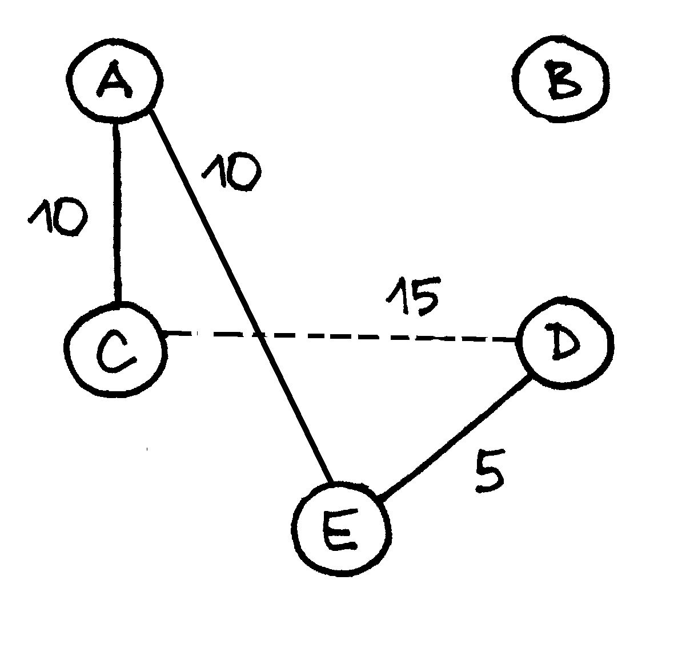
.. |kruskalas_e| image:: images/11_skyrius/75_lin_MJM5.png
  :width: 200px
  :alt: Kruskalo algoritmo veikimo iliustracija

.. table:: Kruskalo algoritmo veikimo iliustracija

  +---------------+----------------------------------------------------+
  | |kruskalas_a| | Randama pigiausia briauna (jos kaina – 5) ir       |
  |               | įtraukiama į MJM                                   |
  +---------------+----------------------------------------------------+
  | |kruskalas_b| | Pasirenkama kita pigiausia briauna (yra dvi tokios |
  |               | briaunos :math:`AC` ir :math:`AE`, imama bet kuri) |
  |               | ir įtraukiama į MJM                                |
  +---------------+----------------------------------------------------+
  | |kruskalas_c| | Kita pigiausia briauną yra :math:`AE`; ji          |
  |               | įtraukiama į MJM                                   |
  +---------------+----------------------------------------------------+
  | |kruskalas_d| | Tolesnė pigiausia briauna yra :math:`CD` (jos      |
  |               | kaina 15), tačiau jos įtraukti į MJM negalima, nes |
  |               | susidarytų ciklas, tad ši briauna praleidžiama     |
  +---------------+----------------------------------------------------+
  | |kruskalas_e| | Prijungiama ketvirtoji pigiausia briauna           |
  |               | (:math:`BC`, jos kaina 20) ir gaunamas MJM; jo]    |
  |               | kaina – 45                                         |
  +---------------+----------------------------------------------------+

Nors Kruskalo algoritmą suprasti labai lengva, jį realizuoti
sudėtingiau, nes nuolat tenka tikrinti, ar prijungiant briauną
nesusidarys ciklas.

**Primo algoritmu** taip pat MJM konstruojamas prijungiant grafo
briaunas, tačiau pradedama nuo medžio, kurį sudaro viena laisvai
pasirinkta viršūnė. Prijungiamoji briauna taip pat turi būti
pigiausia, tačiau tenkinti kitokią sąlygą negu Kruskalo algoritme:
lygiai viena briaunos viršūnė turi priklausyti konstruojamam
medžiui. Ši sąlyga garantuoja, kad prijungiant briauną nesusidarys
ciklas.

Toliau iliustruojama, kaip veikia Primo algoritmas. Prijungtos
viršūnės spalvinamos pilkai, ir iliustracijose pateikiamos tik tos
briaunos, kurios yra arba jau prijungtos prie MJM, arba kurių lygiai
viena viršūnė priklauso MJM.

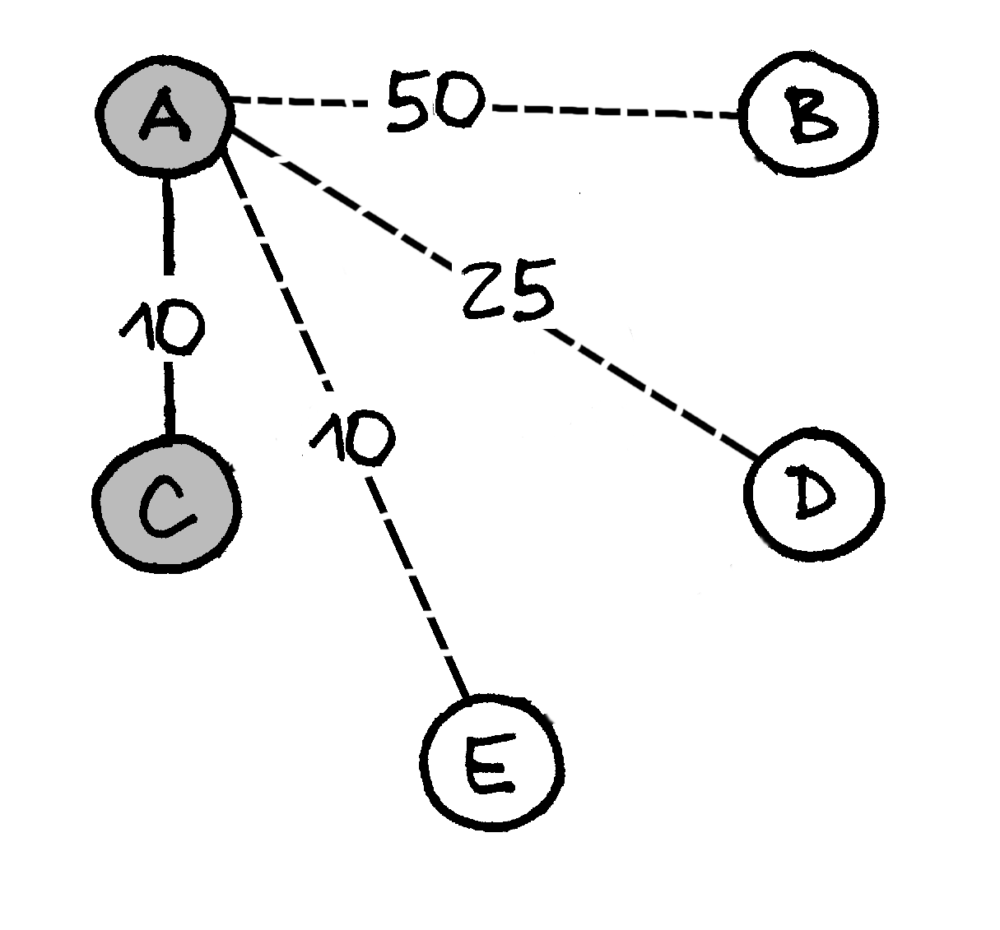
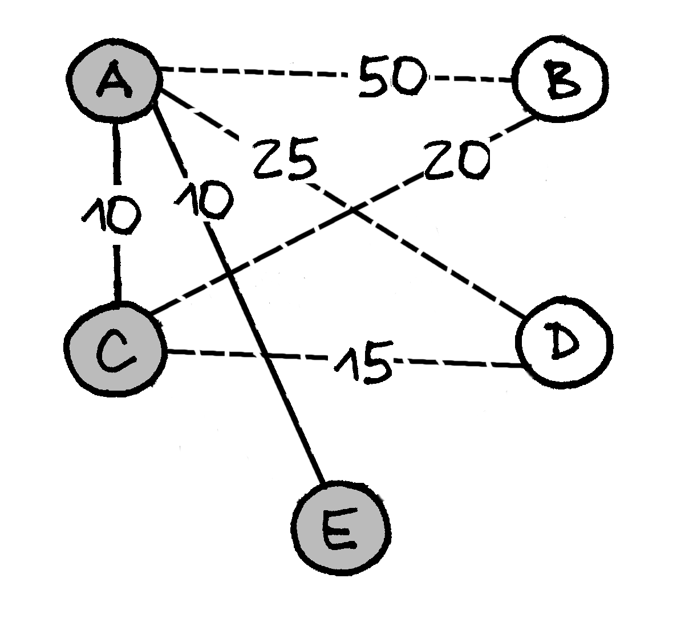
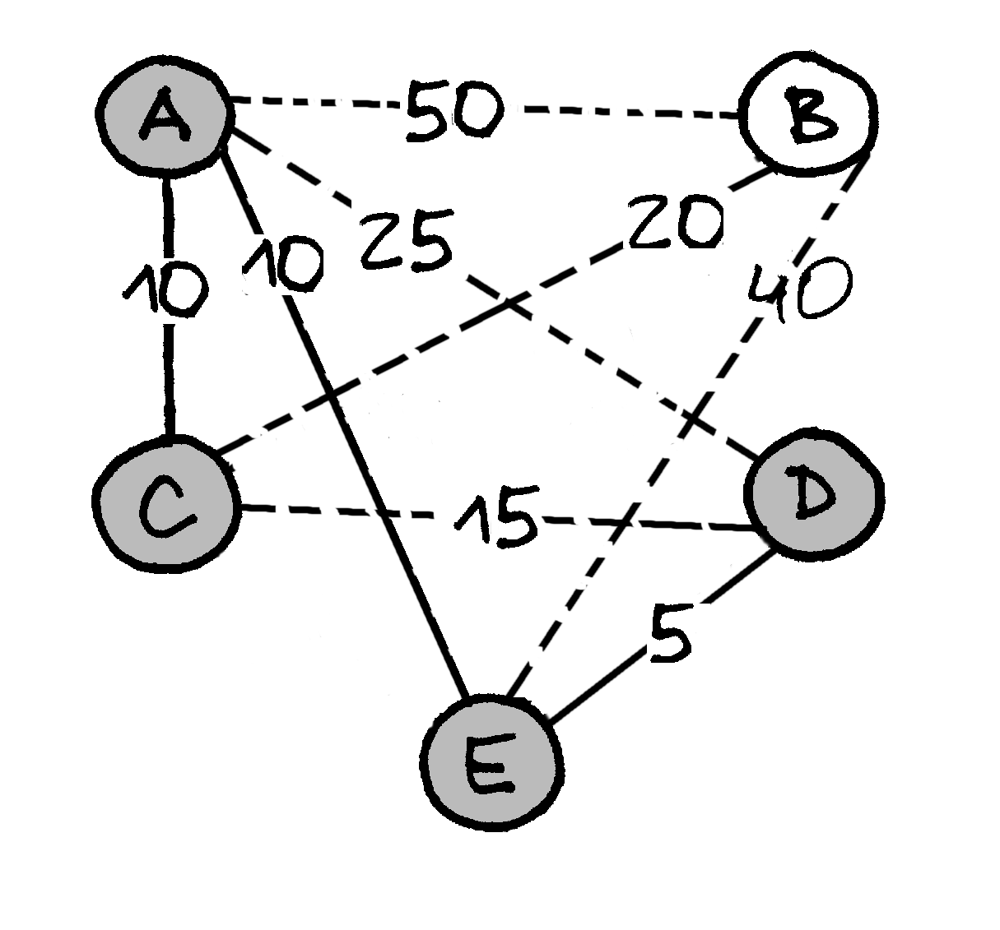
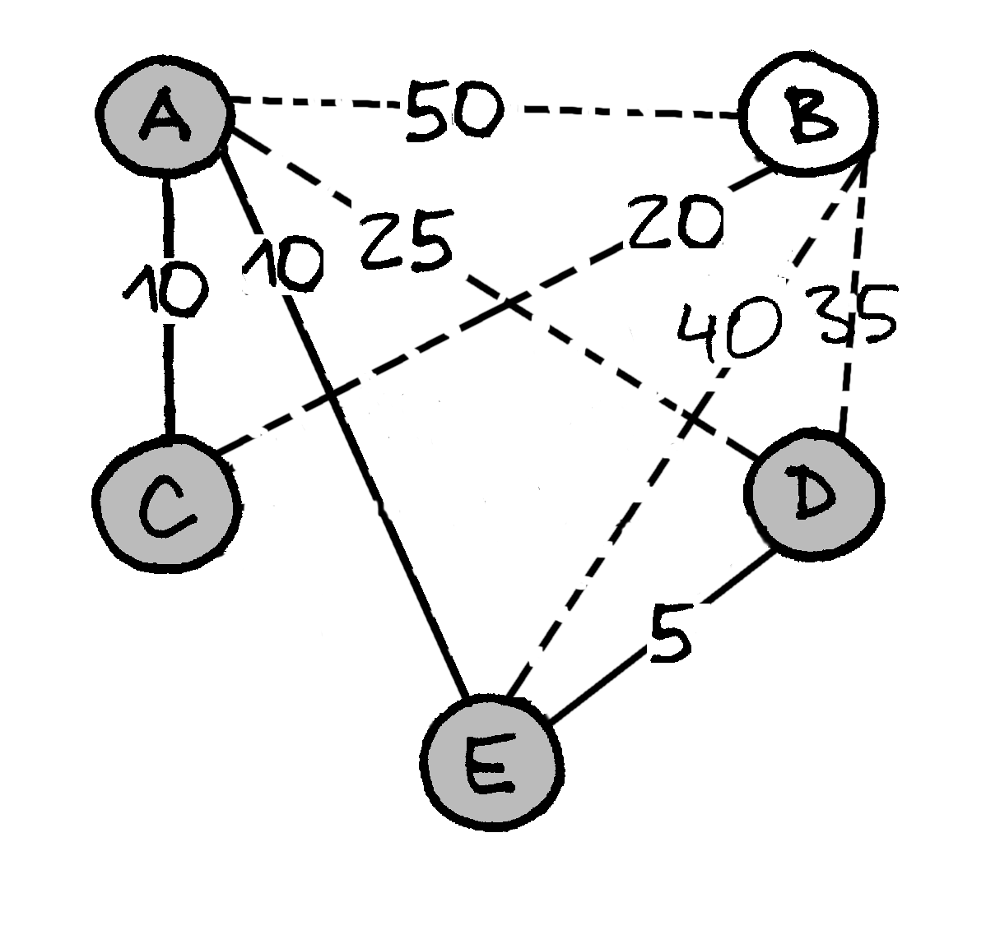

.. table:: Primo algoritmo veikimo iliustracija

  +-------------+-----------------------------------------------------+
  | |primas_a|  | Pasirenkame pradinę viršūnę (pavyzdžiui,            |
  |             | :math:`A`); matome, kad pigiausiai prie jos galime  |
  |             | prijungti viršūnes :math:`C` arba :math:`E`;        |
  |             | pasirenkame bet kurią – :math:`C`                   |
  +-------------+-----------------------------------------------------+
  | |primas_b|  | Prie sudarinėjamo MJM, kuris kol kas turi dvi       |
  |             | viršūnes :math:`A`, :math:`C` ir briauną tarp jų,   |
  |             | pigiausiai galime prijungti viršūnę :math:`E`       |
  |             | (briaunos :math:`AE` svoris 10)                     |
  +-------------+-----------------------------------------------------+
  | |primas_c|  | Toliau pigiausiai galima prijungti viršūnę          |
  |             | :math:`D` (briaunos svoris 5)                       |
  +-------------+-----------------------------------------------------+
  | |primas_d|  | Liko viena neprijungta viršūnė; ją pigiausiai       |
  |             | galima prijungti briauna :math:`CB`, jos svoris –   |
  |             | 20; gauname :numref:`img-11-mjm` pav.               |
  |             | pavaizduotą MJM                                     |
  +-------------+-----------------------------------------------------+

Kaip jau minėjome, Primo algoritmo realizacija labai primena Dijkstros
algoritmą. Pradedant nuo tuščio medžio, kiekvienu žingsniu
išsirenkama ir prijungiama nauja viršūnė. Todėl, kaip ir Dijkstros
algoritme, visos viršūnės paskirstomos į dvi aibes: prijungtų prie
konstruojamo medžio ir dar neprijungtų. Kiekvienu žingsniu norėsime
prie medžio prijungti tą viršūnę, kurią galima prijungti pigiausia
briauna. Todėl Primo algoritmas išlaiko mažiausią žinomą
kiekvienos viršūnės prijungimo kainą. Pradžioje šios kainos
nustatomos begalinės visoms viršūnėms, išskyrus pasirinktąją.
Kiekvienu žingsniu prijungus viršūnę su mažiausia prijungimo kaina,
galbūt bus rastas geresnis būdas, kaip prie medžio prijungti jos
kaimynes. Todėl peržiūrimos ir, jei reikia, atnaujinamos
prijungtosios viršūnės kaimynių prijungimo kainos. Atliekamų
žingsnių skaičius lygus grafo viršūnių skaičiui.

Toliau pateiktame algoritme grafas vaizduojamas kaimynystės matrica, o
minimalus jungiamasis medis – pirminumo masyvu.

.. tabs::

  .. tab:: Paskalis

    .. code-block:: unicode_pascal

      const BEGALINIS = MAXINT;
           MAXN = ...; { maksimalus viršūnių skaičius }
      type grafas = record
              n : longint; { viršūnių skaičius }
              svoris : array [1..MAXN,
                              1..MAXN] of integer;
          end;
          masyvas = array [1..MAXN] of integer;
          logmas  = array [1..MAXN] of boolean;
      procedure Primo(var G : grafas;
                     var pirminė : masyvas);
      { ieškomasis medis grąžinamas masyve „pirminė“ }
      var prijungta : logmas;
         kaina : masyvas;
         v, u, min : integer;
      begin
         { įrašomos pradinės masyvų reikšmės }
         for u := 1 to G.n do begin
             kaina[u] := BEGALINIS;
             pirminė[u] := -1;
             prijungta[u] := false;
         end;
         v := 1;
         kaina[v] := 0; { pradėsime nuo pirmos viršūnės }
         while v <> 0 do begin
             { jei v <> 0, tai rasta viršūnė, kurią galima prijungti }
             prijungta[v] := true;
             for u := 1 to G.n do { nagrinėjamos kaimynės }
                 if (not prijungta[u]) and
                    (G.svoris[v, u] < BEGALINIS) and
                    (kaina[u] > G.svoris[v, u])
                 then begin { viršūnę u verčiau jungti prie v }
                     kaina[u] := G.svoris[v, u];
                     pirminė[u] := v;
                 end;
              { randama tolesnė kandidatė -
             dar neprijungta viršūnė su mažiausia prijungimo kaina }
             v := 0;
             min := BEGALINIS;
             for u := 1 to G.n do
                if (not prijungta[u]) and (kaina[u] < min)
                then begin
                    v := u;
                    min := kaina[u];
                end;
              { jei jokia viršūnė nerasta, tai v = 0 ir ciklas nutraukiamas }
         end;
      end;

  .. tab:: C++

    .. code-block:: cpp

      /*
          Pastaba: pirmiau pateikiamas Primo algoritmo kodas, analogiškas kodui, užrašytam Paskalio kalba,
          o žemiau - efektyvus, naudojantis duomenų struktūrą priority_queue (kaip ir efektyvioje
          Dijkstros algoritmo realizacijoje).
          Taip pat verta paminėti, kad olimpiadose patogiausia naudoti Kruskalio algoritmą MJM rasti,
          kurio realizacijoje naudojama duomenų struktūra "nesikertančių aibių sąjunga" (trumpinama, DSU).
          Apie Kruskalio algoritmą galite pasiskaityti čia: https://cp-algorithms.com/graph/mst_kruskal_with_dsu.html
      */

      const int BEGALINIS = ...; // kažkoks pakankamai didelis skaičius, pavyzdžiui 1e9
      const int MAXN = ...;      // maksimalus viršūnių skaičius

      int n;                     // viršūnių skaičius
      int svoris[MAXN][MAXN];
      int pirmine[MAXN];
      vector<int> antrSar[MAXN]; // antrinių viršūnių sąrašas
      bool prijungta[MAXN];
      int kaina[MAXN];

      void primo () {
          // ieškomas medis grąžinamas masyve "pirmine"

          // įrašomos pradinės masyvų reikšmės
          for (int u = 0; u < n; u++) {
              kaina[u] = BEGALINIS;
              pirmine[u] = -1;
              prijungta[u] = false;
          }

          int v = 0;
          kaina[v] = 0; // pradėsime nuo viršūnės su numeriu 0

          while (v != -1) {
              // jei v != -1, tai rasta viršūnė, kurią galima prijungti
              prijungta[v] = true;

              for (int u = 0; u < n; u++) { // nagrinėjamos kaimynės
                  if (!prijungta[u] && svoris[v][u] < BEGALINIS && kaina[u] > svoris[v][u]) {
                      // viršūnę u verčiau prijungti prie v
                      kaina[u] = svoris[v][u];
                      pirmine[u] = v;
                  }
              }

              // randama tolesnė kandidatė - dar neprijungta viršūnė su mažiausia prijungimo kaina
              v = -1;
              int minKaina = BEGALINIS;
              for (int u = 0; u < n; u++) {
                  if (!prijungta[u] && kaina[u] < minKaina) {
                      v = u;
                      minKaina = kaina[u];
                  }
              }

              // jei jokia viršūnė nerasta, tai v = -1 ir ciklas nutraukiamas

          }
      }

      // Primo algoritmo realizacija, naudojanti priority_queue

      vector<pair<int, int>> adj[MAXN];
      /*
          adj[i] yra i-tosios viršūnės kaimynų sąrašas, kur
          adj[i][j].first yra j-tosios kaimynės numeris
          adj[i][j].second yra briaunos, jungiančios i-tąją viršūnę su jos j-tąja kaimyne, svoris
      */

      void primo () {
          // įrašomos pradinės masyvų reikšmės
          for (int u = 0; u < n; u++) {
              kaina[u] = BEGALINIS;
              pirmine[u] = -1;
              prijungta[u] = false;
          }

          kaina[0] = 0;
          priority_queue<pair<int, int>, vector<pair<int,int>>, greater<pair<int,int>>> q; // priority_queue, kurios top() elementas visad yra mažiausias
          q.push({kaina[p], p}); // į q visados dedam poras {kaina[i], i}, nes tada q.top() elementas visad būs mažiausios kainos

          while (!q.empty()) {
              int v = q.top().second;
              if (!prijungta[v]) {
                  prijungta[v] = true;
                  for (auto p : adj[v]) { // einame per viršūnės v kaimynus
                      int u = p.first;  // kaimynės numeris
                      int w = p.second; // briaunos tarp v ir u svoris
                      if (kaina[u] > w) {
                          // verčiau į u eiti per v
                          kaina[u] = w;
                          pirmine[u] = v;
                          q.push ({kaina[u], u});
                      }
                  }
              }
          }
      }

Įvykdžius algoritmą, minimaliam jungiamajam medžiui priklauso
briaunos (``v``, ``pirminė[v]``), kur :math:`v` – bet kuri grafo
viršūnė, išskyrus pradinę. Primo algoritmo sudėtingumas –
:math:`O(n^2)`.

Aprašysime ir nepelnytai pamirštą, tačiau ne mažiau elegantišką
nei Primo ar Kruskalo algoritmai, **Boruvkos algoritmą**.

Algoritmas operuoja medžių sąrašu. Pradžioje šį sąrašą sudaro
:math:`N` medžių, kurių kiekvieną sudaro viena (kiekvienam kita)
grafo viršūnė. Tuomet paeiliui nagrinėjami visi medžiai. Kiekvienam
jų randama pigiausia į medį ateinanti, tačiau medžiui
nepriklausanti briauna, ir įtraukiama į jį. Jei keliems medžiams
buvo parinkta ta pati pigiausia briauna, tai tie medžiai sujungiami.
Veiksmai kartojami tol, kol lieka tik vienas medis. Tai ir bus minimalus
jungiamasis medis.

Uždavinys *Tinklas* [#f39]_
===========================

  Firma ALFA gavo užsakymą: sujungti :math:`k` kompiuterių ir
  :math:`m` komutatorių [#f40]_ į vieną laidinį tinklą.
  Reikalavimai tinklo architektūrai tokie:

  -  Kiekvienas kompiuteris tiesiogiai vienu laidu sujungiamas su bet
     kuriuo vienu (ir tik vienu) komutatoriumi;  

  -  Prie kiekvieno komutatoriaus tiesiogiai laidais galima prijungti
     bet kokį skaičių kitų įrenginių (kompiuterių arba
     komutatorių); du įrenginiai tiesiogiai sujungiami vienu laidu;  

  -  Visi :math:`m` komutatorių ir :math:`k` kompiuterių turi sudaryti
     jungų tinklą, t. y. bet kuris įrenginys turi būti tiesiogiai
     arba netiesiogiai (per kitus įrenginius) sujungtas su visais
     kitais;  

  **Užduotis.** Duotos kompiuterių ir komutatorių sujungimo kainos.
  Reikia rasti tokią tinklo jungimų schemą, kurios kaina būtų
  mažiausia.

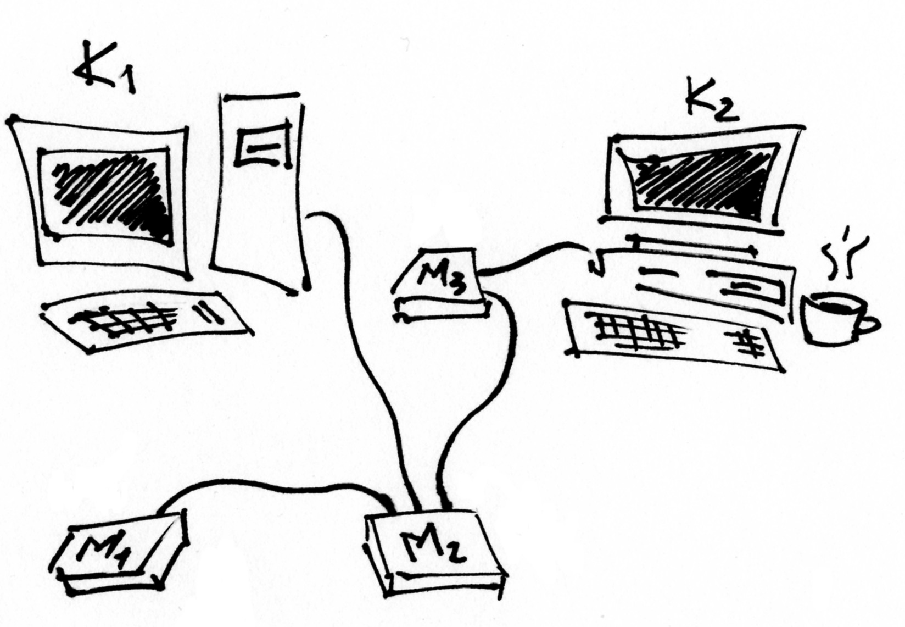

  Galima dviejų kompiuterių ir trijų komutatorių jungimo į
  tinklą schema

Kiekvienas kompiuteris turi būti prijungtas tik prie vieno įrenginio,
būtent, komutatoriaus. Kadangi kompiuterį galime prijungti prie bet
kurio iš jų, tai išsirinksime tą komutatorių, prie kurio prijungti
kompiuterį yra pigiausia.

Tačiau visi įrenginiai turi sudaryti jungų tinklą, todėl
komutatoriai turės būti sujungti tarpusavyje. Žinomos kiekvieno
galimo jungimo kainos, todėl šiam jungimui rasti galime pritaikyti bet
kurį minimalaus jungiamojo medžio paieškos algoritmą.

Pateiktame programos tekste visi įrenginiai sunumeruoti nuosekliai:
komutatoriai nuo 1 iki :math:`m`, o kompiuteriai – nuo
:math:`(m + 1)` iki :math:`k + m`. Procedūrai perduodamas užpildytas
įrenginių jungimo kainų masyvas, taip pat įrenginių skaičius
(:math:`k` ir :math:`m`). Grafas vaizduojamas briaunų svorių matrica
(žr. skyrelį :ref:`skyrelis-svoriniai-grafai`).

.. tabs::

  .. tab:: Paskalis

    .. code-block:: unicode_pascal

      const BEGALINIS = MAXINT;
           MAXM = ...; { maksimalus komutatorių skaičius }
           MAXK = ...; { maksimalus kompiuterių skaičius }
      type masyvas = array [1..MAXM] of integer;
          jungimas = record
              įrenginysA, įrenginysB : integer;
          end;
          jungimų_mas =
              array [1..MAXM + MAXK] of jungimas;
          kainų_mas = array [1..MAXM + MAXK,
                             1..MAXM + MAXK] of integer;
      procedure rask_jungimus(var kaina : kainų_mas;
                             m, k : integer;
                             var jung_sk,
                                 jung_kaina : integer;
                             var jungimai : jungimų_mas);
      { k – kompiuterių, m – komutatorių skaičius, „kaina“ – įrenginių jungimo
        kainų masyvas; atsakymas pateikiamas masyve „jungimai“ }
         procedure junk(a, b : integer);
         { įrenginys a sujungiamas su įrenginiu b }
         begin
             jung_sk := jung_sk + 1;
             jungimai[jung_sk].įrenginysA := a;
             jungimai[jung_sk].įrenginysB := b;
             jung_kaina := jung_kaina + kaina[a, b];
         end;
      var i, j, t : integer;
         g : grafas;
         pirminė : masyvas;
      begin
         jung_sk := 0; jung_kaina := 0;
         { prijungiame kiekvieną kompiuterį prie „artimiausio“
           komutatoriaus (kompiuteriai sunumeruoti nuo (m + 1)
           iki (m + k), komutatoriai - nuo 1 iki m) }
         for i := m + 1 to m + k do begin
             t := 1;
             for j := 1 to m do
                 if kaina[i, t] > kaina[i, j] then t := j;
             junk(i, t);
         end;
         { komutatorių jungimui sudarome grafą ir randame
           minimalų jungiamąjį medį }
         g.n := m;
         for i := 1 to m do
             for j := 1 to m do
                 if i <> j then
                     g.svoris[i, j] := kaina[i, j]
                 else { jei i = j, tai briaunos (kilpos) nėra }
                     g.svoris[i, j] := BEGALINIS;
         { pagal Primo algoritmą randamas MJM }
         Primo(g, pirminė);
         { medžio briaunos yra (i, pirminė[i]), visoms i, išskyrus 1 }
         for i := 2 to g.n do
             junk(i, pirminė[i]);
      end;

  .. tab:: C++

    .. code-block:: cpp

      const int BEGALINIS = ...; // kažkoks pakankamai didelis skaičius, pavyzdžiui 1e9
      const int MAXM = ...;      // maksimalus komutatorių skaičius
      const int MAXK = ...;      // maksimalus kompiuterių skaičius

      int k;                                 // kompiuterių skaičius
      int m;                                 // komutatorių skaičius
      pair<int, int> jungimai[MAXM + MAXK];  // masyvas, kuriame bus pateikiamas atsakymas
      int kaina[MAXM + MAXK][MAXM + MAXK];   // įrenginių jungimo kainų masyvas
      int jungSk;
      int jungKaina;

      void junk (int a, int b) {
          // įrenginys a sujungiamas su įrenginiu b
          jungimai[jungSk].first = a;
          jungimai[jungSk].second = b;
          junkSk++;
          jungKaina += kaina[a][b];
      }

      void raskJungimus () {
          jungSk = 0;
          jungKaina = 0;

          /*
              prijungiame kiekvieną kompiuterį prie "artimiausio" komutatoriaus
              (kompiuteriai sunumeruoti nuo m iki m+k-1, komutatoriai - nuo 0 iki m-1
          */

          for (int i = m; i < m+k; i++) {
              int t = 0;
              for (int j = 0; j < m; j++)
                  if (kaina[i][t] > kaina[j][t])
                      t = j;
              junk(i, t);
          }

          // komutatorių jungimui sudarome grafą ir randame minimalų jungiamąjį medį
          n = m;
          for (int i = 0; i < m; i++)
              for (int j = 0; j < m; j++)
                  if (i != j)
                      svoris[i][j] = (i != j ? kaina[i][j] : BEGALINIS);
          // pagal Primo algoritmą randamas MJM
          Primo ();

          // medžio briaunos yra (i, pirmine[i]), visoms i, išskyrus 0
          for (int i = 1; i < n; i++)
              junk (i, pirmine[i]);
      }

.. rubric:: Išnašos

.. [#f39]
  Panašus uždavinys buvo pateiktas Lietuvos informatikos olimpiadoje
  III etape 2005 metais.

.. [#f40]
  Komutatorius – įtaisas, skirtas sujungti į bendrą tinklą du ar
  daugiau kitų įrenginių ar tinklų.
