=======================
Dinaminis programavimas
=======================

  | *Computer science is no more about computers*
  | *than astronomy is about telescopes.*
  | *Kompiuterių mokslą vadinti mokslu apie kompiuterius būtų tas pats,*
  | *kas vadinti astronomiją mokslu apie teleskopus.*
  | Edsgeras V. Dijkstra (Edsger W. Dijkstra)

Apie dinaminį programavimą būtų galima pasakyti panašiai kaip ir
apie kompiuterių mokslą: dinaminis programavimas neturi jokio
tiesioginio ryšio su programavimu. Matematikai šį žodį vartoja
nusakyti taisyklėms ir principams, kurių laikantis sprendžiamas
uždavinys.

Dinaminis programavimas yra efektyvus sprendinių radimo būdas, kurį
galima pritaikyti kai kuriems, ypač optimizavimo, uždaviniams
spręsti.

Šį metodą pasiūlęs ir 1952 metais aprašęs amerikiečių
mokslininkas Ričardas Belmanas savo autobiografijoje pasakoja, iš kur
kilo pavadinimas *Dinaminis programavimas*:

  1950-ieji metai buvo ne itin palankūs matematiniams tyrinėjimams.
  Tuo metu Vašingtone dirbo labai įdomus ponas, pavarde Vilsonas. Jis
  buvo gynybos sekretorius ir patologiškai bijojo to, kas vadinama
  moksliniais tyrinėjimais. <...> Jo veidas parausdavo ir jis
  įtūždavo, jei kas nors jam girdint pavartodavo šią sąvoką.
  Galite tik įsivaizduoti, kaip jį veikė žodis „matematika“.
  Tuomet aš dirbau RAND korporacijoje, kurią samdė Oro pajėgos, o
  pastarosios buvo pavaldžios ir Vilsonui. Taigi kažkokiu būdu
  reikėjo nuslėpti, kad užsiimu matematiniais tyrinėjimais. Kokį
  pavadinimą galėjau pasirinkti? Mane domino planavimas ir sprendimų
  priėmimas, tačiau „planavimas“ nebuvo tinkamas žodis, tad
  pasirinkau „programavimą“. Žodis „dinaminis“ atspindėjo
  daugiapakopiškumą, buvo būdvardis ir turėjo labai tikslią
  reikšmę fizikine prasme. <...> Kita vertus, šis žodis jokiame
  kontekste neįgaudavo menkinančios reikšmės. Tad pasirinkau
  pavadinimą, kuriam net Kongreso narys negalėjo prieštarauti ir tai
  buvo priedanga mano tolesniems darbams.

Uždavinių, sprendžiamų dinaminiu programavimu, dažnai pasitaiko
olimpiadose. Šiame skyriuje apžvelgsime dinaminio programavimo
principus. Iš pirmo žvilgsnio gali pasirodyti nelengva suprasti
dinaminį programavimą, kadangi tai nėra algoritmas, o veikiau
uždavinio sprendimo schema. Todėl daug dėmesio skirsime
iliustravimui, kaip taikyti šį metodą sprendžiant konkrečius
uždavinius.

Optimizavimo uždaviniai
=======================

**Optimizavimo uždaviniu** vadiname uždavinį, kai yra daug galimų
sprendinių, kurių kiekvieną galima kaip nors įvertinti, o ieškoma
sprendinio, turinčio tam tikrą (optimalią) vertę. Štai klasikinio
optimizavimo uždavinio, vadinamo *Kuprinės uždaviniu*, pavyzdys:

  Vagis, naktį įsilaužęs į muziejų, rado :math:`n` vertingų
  eksponatų. Žinoma kiekvieno eksponato vertė :math:`v_k` bei svoris
  :math:`s_k` (sveikasis skaičius). Vagis gali panešti kuprinę,
  sveriančią ne daugiau kaip :math:`S` kilogramų. Kuriuos eksponatus
  jis turėtų susikrauti į kuprinę, kad bendra jų vertė būtų kuo
  didesnė, o kuprinė – panešama?

Tai optimizavimo uždavinys, nes yra daug būdų sudaryti eksponatų
rinkinį, kurį galėtų panešti vagis, ir kiekvienas jų turi tam
tikrą vertę, o ieškoma rinkinio, kurio vertė *maksimali*.

Svarbu skirti sąvokas **sprendinys** ir **sprendinio vertė**. Mūsų
pavyzdyje sprendinio vertė yra pasirinktų eksponatų verčių suma, o
sprendinys yra pats eksponatų rinkinys. Optimizavimo uždaviniuose
dažniausiai nesunku rasti bet kurį sprendinį (pavyzdžiui, bet kurį
eksponatų rinkinį, kurį galėtų panešti vagis). Kur kas sunkiau
rasti optimalų sprendinį (tokį panešamą eksponatų rinkinį, kurio
vertė maksimali).

Optimizavimo uždavinių sprendimui galima taikyti **godųjį
algoritmą**, kiekviename algoritmo žingsnyje pasirenkant geriausią
variantą *toje situacijoje* (pavyzdžiui, rinktis eksponatus, kurių
vertės ir svorio santykis kuo didesnis). Godieji algoritmai
dažniausiai yra efektyvūs. Tačiau kiekviename žingsnyje renkantis
lokalųjį optimumą, nebūtinai gaunamas globalusis optimumas. Reikia
įsitikinti, kad godusis algoritmas tikrai ras geriausią sprendinį.

:ref:`skyrelis-minimalus-jungiamasis-medis` skyriuje nagrinėta
*Minimalaus jungiamojo medžio paieška* taip pat yra optimizavimo
uždavinys, o jį sprendžiantys Primo bei Kruskalo algoritmai –
godieji algoritmai.

Galima pamanyti, kad ir *Kuprinės uždaviniui* spręsti tiktų godusis
algoritmas: išrikiuoti eksponatus jų vertės ir svorio santykio
(t. y. svorio vieneto vertės) mažėjimo tvarka, ir paeiliui, kol
neviršijamas svoris :math:`s`, rinkti kuo vertingesnius eksponatus iš
šio sąrašo. Deja, toks sprendimas ne visuomet randa optimalų
sprendinį. Pateiksime kontrpavyzdį. Tegu :math:`s = 50`, o
eksponatų svoriai bei vertės pateikti lentelėje:

+-------+----------+---------+------------------------+
| Nr.   | Svoris   | Vertė   | Svorio vieneto vertė   |
+-------+----------+---------+------------------------+
| 1     | 10       | 60      | 6                      |
+-------+----------+---------+------------------------+
| 2     | 20       | 100     | 5                      |
+-------+----------+---------+------------------------+
| 3     | 30       | 120     | 4                      |
+-------+----------+---------+------------------------+

Taikant godųjį algoritmą, būtų pasirenkami pirmasis ir antrasis
eksponatai, kurių bendra vertė yra 160. Trečio eksponato nebepavyktų
paimti, nes visi trys jie netilptų į kuprinę. Tuo tarpu pasirinkus
antrąjį ir trečiąjį eksponatus, gaunama vertė 220.

Optimizavimo uždavinius galima spręsti **perrinkimu:** perrinkti visus
įmanomus sprendinius ir iš jų išrinkti optimalų. Nors šiuo būdu
galima rasti optimalų sprendinį, deja, perrinkimas praktiškai
netaikomas, nes yra labai neefektyvus, t. y. nepolinominio
sudėtingumo.

**Dinaminis programavimas** turi abiejų metodų gerąsias savybes:
viena vertus, kiekviename žingsnyje pasirenkamas geriausias variantas
(gaunamas efektyvus algoritmas), kita vertus – peržiūrimi visi
galimi pasirinkimai, galintys vesti prie optimalaus sprendinio (randamas
optimalus sprendinys).

Dinaminiu programavimu galima spręsti tuos optimizavimo uždavinius,
kuriuose optimalų sprendinį pavyksta rekursyviai išreikšti per
analogiškų, bet mažesnių optimizavimo uždavinių sprendinius.

.. _skyrelis-dinaminio-programavimo-principai:

Dinaminio programavimo principai
================================

Uždavinio sprendimas dinaminiu programavimu susideda iš keturių
žingsnių:

#. Nustatoma optimalaus sprendinio struktūra. 

#. Rekursyviai apibrėžiama sprendinio vertė. 

#. Apskaičiuojama optimalaus sprendinio vertė (skaičiuojant ją
   įsimenamos smulkesnių uždavinių sprendinių vertės, kurios
   panaudojamos ieškomai optimalaus sprendinio vertei rasti). 

#. Sukonstruojamas pats optimalus sprendinys. 

Jeigu reikia rasti ne patį optimalų sprendinį, o tik jo vertę,
tuomet paskutinis žingsnis praleidžiamas.

Panagrinėsime labai paprastą uždavinį, sprendžiamą dinaminiu
programavimu ir kartu padėsiantį suvokti, kodėl dinaminiu
programavimu pagrįsti algoritmai yra efektyvūs. Prisiminkime
Fibonačį, triušius ir jo skaičius, apie kuriuos buvo rašyta
:ref:`skyrelis-rekursyvios-funkcijos` skyrelyje. Fibonačio skaičiai
apibrėžiami tokiu būdu: :math:`F_0 = 0`, :math:`F_1 = 1`,
:math:`F_n = F_{n-1} + F_{n-2}`, reikia rasti :math:`n`-ąjį
Fibonačio skaičių :math:`F_n`.

Tai nėra optimizavimo uždavinys. Sprendinio vertė jau apibrėžta
rekursyviai, tereikia ją suskaičiuoti.
:ref:`skyrelis-rekursyvios-funkcijos` skyrelyje buvo pateikta rekursinė
funkcija, skaičiuojanti Fibonačio skaičius:

.. tabs::

  .. tab:: Paskalis

    .. code-block:: unicode_pascal

      function F(n : longint) : longint;
      begin
         if n = 0 then
             F := 0
         else if n <= 2 then
             F := 1
         else
             F(n - 1) + F(n - 2);
      end;       

  .. tab:: C++

    .. code-block:: cpp

      long long F (long long n) {
          if (n == 0)
              return 0;
          if (n <= 2)
              return 1;
          return F(n-1) + F(n-2);
      }

:ref:`skyrelis-rekursyvios-funkcijos` skyrelyje rašėme, kad rekursyvus
Fibonačio skaičių skaičiavimas yra eksponentinio sudėtingumo (labai
lėtas). Pažvelkime į žemiau pateiktą kreipinio (į rekursinę
funkciją) ``F(6)`` skaičiavimų medį.

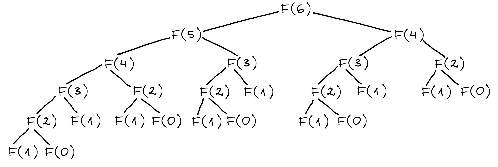

  Kreipinio ``F(6)`` į rekursinę funkciją skaičiavimų medis

Nesunku pastebėti, kad skaičiuojant :math:`F_6` darbo atliekama kur
kas daugiau negu reikia. Tos pačios mažesnių Fibonačio skaičių
reikšmės perskaičiuojamos daug kartų. Pavyzdžiui, skaičiuojant
:math:`F_6`, net 5 kartus tenka skaičiuoti :math:`F_2`. Nesunku
įsivaizduoti, kaip atrodytų :math:`F_7` paieškos medis: reikėtų
atlikti beveik dvigubai daugiau darbo.

Taigi, būtų natūralu kartą suskaičiuotą reikšmę įsiminti
masyve, ir jos daugiau neperskaičiuoti:

.. tabs::

  .. tab:: Paskalis

    .. code-block:: unicode_pascal

      const MAX = ...;
      var Fmas : array [0..MAX] of longint;
      function F(n : longint) : longint;
      begin
         { dar neapskaičiuotos reikšmės žymimos -1 }
         if Fmas[n] <> -1 then
             F := Fmas[n]
         else if n = 0 then
             F := 0
         else if n = 1 then
             F := 1
         else begin
             Fmas[n] := F(n - 1) + F(n - 2);
             F := Fmas[n];
         end;
      end;

  .. tab:: C++

    .. code-block:: cpp

      const int MAX = ...;
      long long Fmas[MAX+1];

      long long F (long long n) {
          // dar neapsaičiuotos reikšmės žymimos -1
          if (Fmas[n] != -1)
              return Fmas[n];
          if (n == 0)
              return 0;
          if (n <= 2)
              return 1;
          Fmas[n] = F(n-1) + F(n-2);
          return Fmas[n];
      }

Toliau pateiktas šios funkcijos rekursijos medis. Kvadratėliais
įrėmintos reikšmės iš naujo nebeskaičiuojamos, o paimamos iš
lentelės.

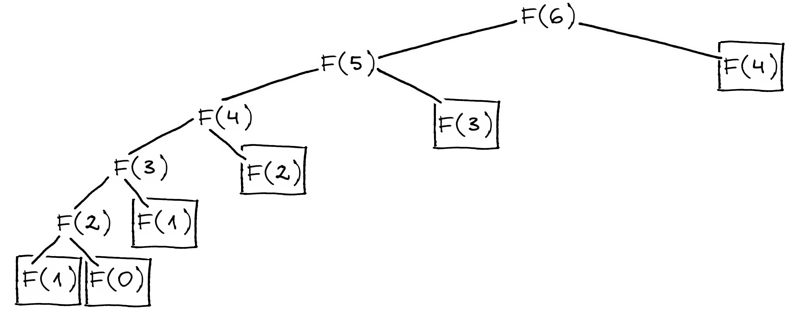

  Funkcijos ``F``, įsimenančios tarpinius sprendinius,
  skaičiavimų medis, kai į ją kreiptasi ``F(6)``

Kiekviena reikšmė bus skaičiuojama tik vieną kartą, todėl
:math:`F_n` suskaičiuojamas per :math:`O(n)` laiko. Tačiau dar
paprasčiau yra apsieiti be rekursijos ir suskaičiuoti :math:`F_n`
generuojant Fibonačio skaičių seką iš eilės, kiekvieną narį
gaunant iš dviejų paskutinių:

.. tabs::

  .. tab:: Paskalis

    .. code-block:: unicode_pascal

      var Fmas : array [0..MAX] of longint;
      function F(n : longint) : longint;
      var k : integer;
      begin
         Fmas[0] := 0;
         Fmas[1] := 1;
         for k := 2 to n do
             Fmas[k] := Fmas[k - 1] + Fmas[k - 2];
         F := Fmas[n];
      end;

  .. tab:: C++

    .. code-block:: cpp

      const int MAX = ...;
      long long Fmas[MAX+1];

      long long F (long long n) {
          Fmas[0] = 0;
          Fmas[1] = 1;
          for (int k = 2; k <= n; k++)
              Fmas[k] = Fmas[k-1] + Fmas[k-2];
          return Fmas[n];
      }

Šioje funkcijoje :math:`F_n` reikšmė skaičiuojama iš **apačios į
viršų**, t. y. pradedant nuo pačių mažiausių reikšmių ir vis
gaunant didesnes. Prieš tai aprašytos funkcijos reikšmes skaičiavo
iš **viršaus į apačią**.

Tai, ką atlikome, buvo trečiasis dinaminio programavimo metodo
žingsnis: rekursyvus apibrėžimas padėjo sukonstruoti *efektyvų*
algoritmą. Efektyvumą (laiko atžvilgiu) pasiekėme atmetę
pakartotinį tų pačių uždavinių sprendimą, įsimindami jų vertes
(taigi atminties efektyvumo sąskaita [#f41]_).Tai būdinga visiems
dinaminiu programavimu pagrįstiems algoritmams.

Jau buvo minėta, kad dinaminio programavimo išmokstama ne skaitant
teoriją, o analizuojant sprendimus, tad tolesniuose skyreliuose ir
analizuosime uždavinius, sprendžiamus dinaminio programavimo metodu.

Pradėsime nuo uždavinio, su kurio sąlyga jau esame susipažinę.

*Kuprinės uždavinys*
====================

  Vagis, naktį įsilaužęs į muziejų, rado :math:`n` vertingų
  eksponatų. Žinoma kiekvieno eksponato vertė :math:`v_k` bei svoris
  :math:`s_k`, išreikšti sveikaisiais skaičiais. Vagis gali panešti
  kuprinę, sveriančią ne daugiau kaip :math:`S` kilogramų.

  **Užduotis.** Reikia nustatyti, kuriuos eksponatus jis turėtų
  susikrauti į kuprinę, kad bendra jų vertė būtų kuo didesnė, o
  kuprinė – panešama.

Tai klasikinis optimizavimo uždavinys, sprendžiamas optimizuojant
(pavyzdžiui, minimizuojant arba maksimizuojant) pasirinkto svorio
:math:`S` kuprinės vertę.

Uždavinį būtų galima spręsti perrinkimu – išbandyti visus
įmanomus rinkinius – tačiau tai, be abejo, labai neefektyvu.
Pastebėkime, kad nors galimų rinkinių labai daug (:math:`2^n`),
tačiau galimų rinkinių svorių pakankamai nedaug – nuo 0 iki
:math:`s_1 + s_2 + \dots + s_n`. Pasinaudosime šia savybe ir
sudarysime efektyvų, dinaminiu programavimu pagrįstą algoritmą.

Dinaminio programavimo taikymas prasideda nuo optimalaus sprendinio
struktūros nustatymo. Sunumeruokime eksponatus nuo 1 iki :math:`n` ir
pagalvokime, kokią didžiausią vertę galima pasiekti neviršijant
svorio :math:`S`. :math:`n`-asis eksponatas gali priklausyti arba
nepriklausyti optimaliam sprendiniui:

-  jei :math:`n`-asis eksponatas nepriklauso optimaliam sprendiniui, tai
   optimalus sprendinys lygus kito, mažesnio uždavinio – optimalaus
   rinkinio iš pirmųjų :math:`(n - 1)` eksponatų, neviršijančio
   svorio :math:`S` – sprendiniui; 

-  jei :math:`n`-asis eksponatas priklauso optimaliam sprendiniui, tai
   optimalų sprendinį sudaro :math:`n`-asis eksponatas ir kito,
   mažesnio, uždavinio – optimalaus rinkinio iš pirmųjų
   :math:`(n - 1)` eksponatų, neviršijančio svorio
   :math:`(S - s_n)` – sprendinys. 

Tai ir yra optimalaus kuprinės uždavinio sprendinio struktūra.
Optimalų sprendinį gausime išnagrinėję abu variantus ir išsirinkę
didesnės vertės sprendinį.

Pažymėkime :math:`D(k, r)` didžiausią rinkinio, kurio svoris
neviršija :math:`r` ir kuris sudarytas iš pirmųjų :math:`k`
eksponatų, vertę. Tuomet, remdamiesi ankstesniais samprotavimais,
:math:`D(k, r)` galime išreikšti rekursyviai:

.. math::
  D(k, r) = \left\{
    \begin{array}{ll}
      0, & \text{ jei } k = 0 \\
      D(k-1, r), & \text{ jei } s_n > r \\
      \max \{D(k-1, r), v_k + D(k-1, r-s_k)\}, & \text{ kitais atvejais }
    \end{array}
  \right.

Ši formulė jau leidžia apskaičiuoti optimalaus sprendinio vertę
:math:`D(n, S)`, tačiau efektyviai galime skaičiuoti tik įsimindami
dalinių sprendinių vertes (kaip ir Fibonačio skaičių atveju).

Panagrinėkime konkretų pavyzdį. Sakykime, vagis gali panešti 12
kilogramų. Eksponatų svoriai bei vertės pateikti lentelėje:

+--------------+---------+----------+
| Eksponatas   | Vertė   | Svoris   |
+--------------+---------+----------+
| 1            | 1       | 1        |
+--------------+---------+----------+
| 2            | 5       | 2        |
+--------------+---------+----------+
| 3            | 8       | 3        |
+--------------+---------+----------+
| 4            | 11      | 4        |
+--------------+---------+----------+
| 5            | 20      | 7        |
+--------------+---------+----------+

Paruošiame funkcijos :math:`D` reikšmių lentelę, užpildydami iš
anksto žinomas kraštines reikšmes: maksimali vertė visada lygi
nuliui, kai nėra nė vieno eksponato (:math:`D(0, S) = 0`), arba kai
vagis negali panešti jokio svorio (:math:`D(n, 0) = 0`).

Skaičiuojant :math:`D(n, S)` reikšmę pagal rekurentinį sąryšį,
naudojamos funkcijos reikšmės su mažesniais parametrais (t. y.
analogiškų uždavinių su mažesniais parametrais optimalūs
sprendiniai). Todėl jei lentelę pildysime po eilutę, pradėdami nuo
:math:`k = 0`, o eilutėje – iš kairės į dešinę, pradėdami nuo
:math:`r = 0`, tai skaičiuodami konkrečią reikšmę
(:math:`D(k, r)`) tikrai būsime jau anksčiau apskaičiavę kitas
reikalingas reikšmes (:math:`D(k-1, r)` ir :math:`D(k-1, r-s_n)`).

Pavyzdžiui, apskaičiuokime langelio :math:`D(3, 5)` reikšmę, t. y.
raskime, kokia gali būti didžiausia kuprinėje esančių eksponatų
vertė, jei galime rinktis iš trijų pirmųjų eksponatų, o kuprinės
svoris negali viršyti 5 kg.
 
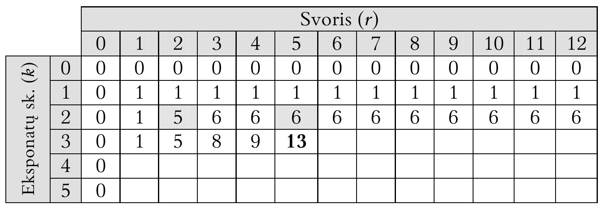

Galimi du variantai: arba įtraukti į rinkinį trečiąjį eksponatą, arba
ne. Pirmuoju atveju gausime vertę
:math:`v_3 + D(2, 5 - s_3) = 8 + D(2, 2) = 8 + 5 = 13`, o
antruoju – :math:`D(2, 5) = 6` (skaičiavimams reikalingos
reikšmės lentelėje pažymėtos pilku fonu). Renkamės didesniąją
iš šių verčių – 13, trečiąjį eksponatą įtraukdami į
optimalų rinkinį.

Taigi reikšmių lentelės užpildymą realizuoti nesudėtinga.
 Programoje einamąją eilutę (eksponatų kiekį) žymėsime raide
:math:`k`, einamąjį stulpelį (nagrinėjamą svorį) – :math:`r`, o
eksponatų svorius ir vertes saugosime masyvuose ``svoris`` ir
``vertė``. Skaičiuodami konkretaus langelio ``[k, r]`` reikšmę, iš
pradžių patikriname, ar :math:`k`-ojo eksponato svoris neviršija
nagrinėjamo svorio, t. y. ar ``svoris[k] <= r``. Jei viršija –
tai ``D[k, r] = D[k - 1, r]``, t. y. :math:`k`-ojo eksponato į
rinkinį įtraukti negalime. Priešingu atveju, ``D[k, r]`` priskiriame
didesnę iš reikšmių ``D[k - 1, r]`` ir
``(vertė[k] + D[k – 1, r – svoris[k]])``.

.. tabs::

  .. tab:: Paskalis

    .. code-block:: unicode_pascal

      const MAXN = ...; { maksimalus eksponatų skaičius }
           MAXS = ...; { maksimalus panešamas svoris }
      type lentelė = array [0..MAXN, 0..MAXS] of integer;
          masyvas = array [1..MAXN] of integer;
      procedure skaičiuok(n, S : integer;
                         var svoris, vertė : masyvas;
                         var D : lentelė);
      var k, r : integer;
      begin
         { užpildomos kraštinės lentelės reikšmės }
         for r := 0 to S do
             D[0, r] := 0;
         for k := 0 to n do
             D[k, 0] := 0;
         { užpildoma visa likusi lentelės dalis }
         for r := 1 to S do
             for k := 1 to n do
                 if svoris[k] <= r then
                     { jei k-asis eksponatas tilptų }
                     D[k, r] := max (
                         D[k - 1, r],
                         vertė[k] + D[k - 1, r - svoris[k]])
                      { Funkcija max randa didesnįjį iš dviejų
                        skaičių, jos teksto nepateikiame. }
                 else
                     { jei k-asis eksponatas netilptų,
                       jo įtraukti negalima }
                     D[k, r] := D[k - 1, r];
      end;

  .. tab:: C++

    .. code-block:: cpp

      const int MAXN = ...; // maksimalus eksponatų skaičius
                MAXS = ...; // maksimalus panešamas svoris

      int n;
      int S;
      int svoris[MAXN+1];
      int verte[MAXN+1];
      int dp[MAXN+1][MAXS+1]; // knygoje šis masyvas žymimas "D", tačiau žymėti "dp" yra labiau įprasta

      void skaiciuok () {
          // užpildomos kraštinės lentelės  reikšmės
          for (int r = 0; r <= S; r++)
              dp[0][r] = 0;
          for (int k = 0; k <= n; k++)
              dp[k][0] = 0;
          // užpildoma visa likusi lentelės dalis
          for (int r = 1; r <= S; r++) {
              for (int k = 1; k <= n; k++) {
                  if (svoris[k] <= r)
                      // jei k-asis eksponatas tilptų
                      dp[k][r] = max(
                          dp[k-1][r],                         // k-ojo daikto neimame - svorį r turime gauti iš pirmų k-1 daiktų
                          verte[k-1] + dp[k-1][r-svoris[k]]   // k-ąjį daiktą imame - tuomet pridedama jo vertė ir iš pirmų k-1 daiktų reikia surinkti svorį r-svoris[k]
                      );
                  else
                      // jei k-asis eksponatas netilptų, jo įtraukti negalima
                      dp[k][r] = dp[k-1][r];
              }
          }
      }

Štai kaip atrodo iki galo užpildyta nagrinėto pavyzdžio lentelė
Pusjuodžiu šriftu pažymėtos reikšmės, gaunamos įtraukiant atitinkamą
eksponatą į rinkinį.

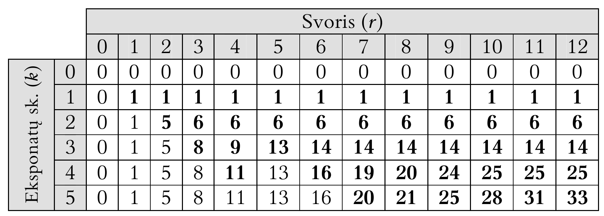

Taigi įvykdėme jau tris iš keturių dinaminio programavimo metodo
žingsnių: nustatę optimalią sprendinio struktūrą, išreiškėme jo
reikšmę rekursyviai ir sudarėme efektyvų algoritmą, kuris,
įsimindamas tarpinius sprendinius, apskaičiuoja šią reikšmę. Duoto
pavyzdžio atveju maksimali vertė lygi 33. Tačiau vagį, be abejo,
domina ne tik vertė, bet ir pats eksponatų rinkinys, kuris sudarytų
tokią vertę. Rinkinį nesudėtinga sukonstruoti iš jau suskaičiuotos
lentelės. Pradėkime nuo langelio ``[n, S]``: jei
``D[n, S] = D[n - 1, S]``, tai :math:`n`-ojo eksponato į rinkinį
įtraukti nereikia (``D[n, S]`` buvo gautas iš ``D[n - 1, S]``,
taigi neįtraukiant :math:`n`-ojo eksponato), o jei
``D[n, S] > D[n - 1, S]`` – įtraukti reikia. Toliau atitinkamai
nagrinėjame langelius ``[n - 1, S]`` arba
``[n - 1, S - svoris[n]]``, ir taip toliau, kol pasiekiame lentelės
kraštą.

.. tabs::

  .. tab:: Paskalis

    .. code-block:: unicode_pascal

      type logmas = array [1..MAXN] of boolean;
      procedure sudaryk_rinkinį(n, S : integer;
                               var svoris : masyvas;
                               var D : lentelė;
                               var imti : logmas);
      { pagal masyvų „D“ ir „svoris“ reikšmes nustatoma,
       kuriuos eksponatus verta imti }
      var k, r : integer;
      begin
         for k := 1 to n do
             imti[k] := false;
          k := n;
         r := S;
         while (k > 0) and (r > 0) do begin
             if D[k, r] > D[k - 1, r] then begin
                 { vadinasi, vertė D[k, r] gauta įtraukus k-ąjį eksponatą }
                 imti[k] := true;
                 r := r - svoris[k];
             end;
             k := k - 1;
         end;
      end;

  .. tab:: C++

    .. code-block:: cpp

      int n;
      int S;
      int svoris[MAXN+1];
      int D[MAXN+1][MAXS+1];
      bool imti[MAXN+1];

      void sudarykRinkini () {
          // pagal masyvų "D" ir "svoris" reikšmes nustatoma, kuriuos eksponatus verta imti
          for (int k = 1; k <= n; k++)
              imti[k] = false;

          int k = n, r = S;
          while (k > 0 && r > 0) {
              if (D[k][r] > D[k-1][r]) {
                  // vadinasi, vertė D[k][r] gauta įtraukus k-ąjį eksponatą
                  imti[k] = true;
                  r -= svoris[k];
              }
              k--;
          }
      }

Šią procedūrą reikia kviesti įvykdžius procedūrą ``skaičiuok``.
Nesudėtinga įvertinti algoritmo sudėtingumą: pildant
:math:`n \times S` dydžio lentelę, kiekvienam langeliui sugaištama
:math:`O(1)` laiko, taigi algoritmo sudėtingumas ir atminties ir laiko
atžvilgiu yra :math:`O(n \cdot S)`. Beje, jei pats rinkinys nedomina,
tai sudėtingumą atminties atžvilgiu galima sumažinti iki
:math:`O(S)`, kadangi skaičiuojant konkrečią reikšmę pakanka
prisiminti tik einamąją ir prieš tai buvusią lentelės eilutes.
Tačiau neapsigaukite: iš tiesų algoritmo sudėtingumas yra
polinominis tik jei iš anksto žinoma, jog dydis :math:`S` pakankamai
nedidelis. Bendru atveju (jei :math:`S` neapribotas),
*Kuprinės uždavinys* yra NP sunkus uždavinys.

Uždavinys *Ilgiausias didėjantis posekis*
=========================================

  Duota :math:`n` skaičių seka :math:`a_1, a_2, \dots, a_n`.

  **Užduotis.** Reikia rasti ilgiausią didėjantį šios sekos
  posekį.

  Pavyzdžiui, jei duota seka (9, 5, 2, 8, 7, 3, 1, 6, 7, 4,
  6, 3), tai ilgiausias didėjantis posekis turi keturis narius. Galimi
  sprendiniai (2, 3, 6, 7) arba (2, 3, 4, 6).

Pradėsime nuo optimalaus sprendinio struktūros nustatymo. Tai pavyks
padaryti pradėjus analizuoti seką nuo pabaigos – tokia strategija
dažnai pasiteisina (prisiminkime, jog *Kuprinės uždavinyje*
ieškodami optimalaus sprendinio struktūros, eksponatus taip pat
pradėjome analizuoti nuo paskutinio).

Tarkime, kad paskutinis sekos narys (skaičius :math:`a_n`) užbaigia
ilgiausią didėjantį posekį. Koks gi sekos narys posekyje eina prieš
:math:`a_n`? Tegu tai :math:`a_k (k < n)`. Be abejo, tam, kad posekis
būtų didėjantis, :math:`a_k` turi būti mažesnis už :math:`a_n`. Be
to, :math:`a_k` turi būti toks sekos narys, kad savo ruožtu sekoje
:math:`a_1, a_2, \dots, a_k` užbaigtų kuo ilgesnį didėjantį
posekį.

Pasitelkę tokius samprotavimus, uždavinio sprendinį išreiškėme
mažesnių uždavinių sprendiniais: jei visiems
:math:`k = 1, 2, \dots, n - 1`, kuriems :math:`a_k < a_n`,
žinotume, koks ilgiausio sekos :math:`a_1, a_2, \dots, a_k` posekio,
užsibaigiančio nariu :math:`a_k`, ilgis, tai iš šių posekių
išrinkę ilgiausią ir prijungę :math:`a_n`, tikrai gautume ilgiausią
didėjantį posekį, užsibaigiantį nariu :math:`a_n` (kadangi būtume
išbandę visus variantus).

Jei kiekvienam sekos nariui suskaičiuotume, kokį ilgiausią
didėjantį posekį šis užbaigia, tai iš jų išrinkę ilgiausią ir
gautume ilgiausią didėjantį visos sekos posekį.

Pažymėję ilgiausio posekio, užsibaigiančio nariu :math:`a_n`, ilgį
:math:`L(n)`, ankstesnius samprotavimus galime užrašyti tokia lygybe:

.. math::
  L(n) = 1 + \max_{1 \leq k < n, a_k < a_n} L(k)

Rekursinis optimalios sprendinio vertės apibrėžimas yra antrasis
dinaminio programavimo metodo žingsnis. Pagal šią formulę sudarysime
efektyvų algoritmą.

Toliau pateikiama procedūra rasti optimaliam sprendiniui iš apačios
į viršų. Iš pradžių randama, kokį ilgiausią posekį užbaigia
sekos narys :math:`a_1`, tuomet :math:`a_2`, ir taip toliau iki
:math:`a_n`. Iš šių išrenkamas ilgiausias visos sekos posekis.
Atskirame masyve ``p`` saugoma informacija, kuri vėliau padės
sukonstruoti optimalų sprendinį: ``p[k]`` rodo ilgiausio sekos
:math:`a_1, a_2, \dots, a_k` posekio, užsibaigiančio nariu
:math:`a_k`, priešpaskutinio nario numerį.

.. tabs::

  .. tab:: Paskalis

    .. code-block:: unicode_pascal

      const MAX = ...; { maksimalus sekos ilgis }
      type masyvas = array [1..MAX] of integer;
      procedure ilg_posekis(a : masyvas; n : integer;
                           var posekis : masyvas;
                           var ilgis : integer);
      var L, p : masyvas;
         k, kmax, m, nr : integer;
      begin
         { optimalaus sprendinio vertė skaičiuojama iš apačios į viršų }
         kmax := 1; { ilgiausio posekio paskutiniojo elemento indeksas }
         for m := 1 to n do begin
             L[m] := 0;
             for k := 1 to m - 1 do
                 if (a[k] < a[m]) and (L[k] > L[m])
                 then begin
                     L[m] := L[k];
                     {pažymimas priešpaskutinis šio posekio elementas}
                     p[m] := k;
                 end;
             { priskaičiuojamas ir m-asis elementas }
             L[m] := L[m] + 1;
             if L[kmax] < L[m] then
                 { tai ilgiausias kol kas rastas posekis }
                 kmax := m;
         end;
         { sukonstruojamas optimalus sprendinys }
         ilgis := L[kmax];
         for k := ilgis downto 1 do begin
             posekis[k] := a[kmax];
             kmax := p[kmax];
         end;
      end;

  .. tab:: C++

    .. code-block:: cpp

      const int MAX = ...; // maksimalus sekos ilgis

      int n;
      int a[MAX+1];
      int posekis[MAX+1];
      int ilgis;

      void ilgPosekis () {
          int L[MAX+1];
          int p[MAX+1];

          // optimalaus sprendinio vertė skaičiuojama iš apačios į viršų
          int kmax = 1;
          for (int m = 1; m <= n; m++) {
              for (int k = 1; k < m; k++) {
                  if (a[k] < a[m] && L[k] > L[m]) {
                      L[m] = L[k];
                      // pažymimas priešpaskutinis šio posekio elementas
                      p[m] = k;
                  }
              }

              // priskaičiuojamas ir m-asis elementas
              L[m]++;
              if (L[kmax] < L[m])
                  // tai ilgiausias kol kas rastas posekis
                  kmax = m;
          }

          // sukonstruojamas optimalus sprendinys
          ilgis = L[kmax];
          for (int k = ilgis; k > 0; k--) {
              posekis[k] = a[kmax];
              kmax = p[kmax];
          }
      }

Šio sprendimo sudėtingumas laiko atžvilgiu yra :math:`O(n^2)`, o
atminties atžvilgiu – :math:`O(n)`.

Parodysime, kaip randamas ilgiausias sąlygoje pateiktos sekos
(9, 5, 2, 8, 7, 3, 1, 6, 7, 4, 6, 3) posekis.

+--------------+-----+-----+-----+-----+-----+-----+-----+-----+-----+------+------+------+
| :math:`k`    | 1   | 2   | 3   | 4   | 5   | 6   | 7   | 8   | 9   | 10   | 11   | 12   |
+--------------+-----+-----+-----+-----+-----+-----+-----+-----+-----+------+------+------+
| :math:`a_k`  | 9   | 5   | 2   | 8   | 7   | 3   | 1   | 6   | 7   | 4    | 6    | 3    |
+--------------+-----+-----+-----+-----+-----+-----+-----+-----+-----+------+------+------+
| :math:`L(k)` | 1   | 1   | 1   | 2   | 2   | 2   | 1   | 3   | 4   | 3    | 4    | 2    |
+--------------+-----+-----+-----+-----+-----+-----+-----+-----+-----+------+------+------+
| :math:`p_k`  | –   | –   | –   | 2   | 2   | 3   | –   | 6   | 8   | 6    | 10   | 3    |
+--------------+-----+-----+-----+-----+-----+-----+-----+-----+-----+------+------+------+

Kaip minėta pavyzdyje, yra du ilgiausi didėjantys posekiai, kurių
ilgis 4 – eilutėje :math:`L(k)` skaičius 4 įrašytas dviejuose
langeliuose. Pasinaudojus masyvo ``p`` reikšmėmis nesunku sukonstruoti
patį posekį. Pavyzdžiui, konstruosime posekį, užsibaigantį
:math:`a_9`.  Paskutinis posekio narys yra :math:`a_9 = 7`,
priešpaskutinio posekio nario numeris lygus :math:`p_9 = 8`, tad šis
narys lygus :math:`a_8 = 6`. Prieš jį eina šeštas
(:math:`p_8 = 6`) sekos narys :math:`a_6 = 3`, o prieš šį
trečias – :math:`a_3 = 2`. Taigi ilgiausias didėjantis
nagrinėtos sekos posekis yra (2, 3, 6, 7).

Uždavinys *Teisingos dalybos* [#f43]_
=====================================

  Dvi draugės – Rusnė ir Emilija – nori pasidalyti :math:`n`
  dovanų rinkinį. Kiekviena dovana turi būti atiduota arba Rusnei,
  arba Emilijai, ir nė viena dovana negali būti padalyta į dvi dalis.
  Kiekviena dovana turi vertę, išreikštą sveikuoju skaičiumi nuo 0
  iki :math:`m`. Pažymėkime :math:`R` ir :math:`E` dovanų, kurias
  atitinkamai gaus Rusnė ir Emilija, verčių sumas.

  **Užduotis.** Reikia rasti, kaip padalyti dovanas Rusnei ir Emilijai,
  kad :math:`|R - E|` būtų minimalus.

Dovanų vertes pažymėkime :math:`v_1, v_2, \dots, v_n`. Bendra šių
dovanų vertė lygi :math:`V = v_1 + v_2 + \dots + v_n`. Atkreipkite
dėmesį, kad :math:`R + E = V`. Taigi, žinodami vieną iš šių
skaičių, galime iš karto apskaičiuoti ir antrą. Taip pat žinant,
kurios dovanos bus atiduotos Rusnei, vienareikšmiškai galima pasakyti,
kurios atiteks Emilijai. Taigi galima spręsti „pusę“ uždavinio:
ieškoti, kaip parinkti dovanas Rusnei, kad jų verčių suma būtų kuo
artimesnė :math:`V/2`.

Šį kartą dinaminį programavimą taikysime netiesiogiai: iš
pradžių dinaminiu programavimu išspręsime kitą uždavinį,
vadinamą *sumos dėstymu*, o pasinaudoję jo sprendimu, nesunkiai
padalysime dovanas mergaitėms teisingiausiu įmanomu būdu.

Tarkime, duota :math:`n` sveikųjų skaičių
:math:`v_1, v_2, \dots, v_n` iš intervalo :math:`[0, m]`. Prašoma
nustatyti, ar (ir kaip) iš jų galima sudaryti tokį skaičių
rinkinį, kad jų suma būtų lygi :math:`A`. Jei taip, tai sakysime,
kad iš skaičių :math:`v_1, v_2, \dots, v_n` galime *sudėti*
skaičių :math:`A`. Šis uždavinys vadinamas **sumos dėstymu**.

Nesunku pastebėti, kad išsprendę sumos dėstymo uždavinį, mokėsime
išspręsti ir *Teisingų dalybų* uždavinį: iš dovanų verčių
paeiliui bandysime sudėti skaičius, kuo artimesnius :math:`V/2`, ir
sustosime, kai tik pavyks.

Galimų rinkinių yra labai daug – :math:`2^n`, jų visų išbandyti
negalima. Kita vertus, sumų, kurias gali sudaryti kuris nors duotųjų
skaičių rinkinys, yra palyginti nedaug – tai skaičiai nuo 0 iki
:math:`V`, kur :math:`V = v_1 + v_2 + \dots + v_n`, taigi jų ne daugiau
negu :math:`n \cdot m + 1`.

Pasinaudoję šia savybe, sudarysime dinaminiu programavimu pagrįstą
algoritmą.

Tarkime, kad iš duotųjų :math:`n` skaičių galima sudėti skaičių
:math:`A`. Skaičius :math:`v_n` gali priklausyti šiam rinkiniui arba
nepriklausyti (kitų variantų nėra):

-  jei skaičius :math:`v_n` rinkiniui nepriklauso, tai skaičių
   :math:`A` turi būti įmanoma sudėti iš pirmųjų :math:`(n - 1)`
   skaičių; 

-  jei :math:`v_n` rinkiniui priklauso, tai iš pirmųjų
   :math:`(n - 1)` skaičių turi būti įmanoma sudėti likusią
   skaičiaus dalį :math:`(A - v_n)`.

Taigi abiem atvejais uždavinį galima išreikšti per analogiškų,
tačiau su mažesniais parametrais, uždavinių sprendimus. Jei teiginį
„skaičių :math:`S` galima sudėti iš pirmųjų :math:`k`
skaičių“ pažymėsime :math:`G(k, S)`, tai būtų teisingos tokios
lygybės [#f44]_:

.. math::
  G(k, S) = \left\{
    \begin{array}{ll}
      true, & \text{ jei } S = 0 \\
      false, & \text{ jei } k = 0 \\
      G(k - 1, S), & \text{ jei } S < v_k \\
      G(k - 1, S) \lor G(k - 1, S - v_k), & \text{ kitais atvejais }
    \end{array}
    \right.

Remiantis šiomis lygybėmis nesunku sudaryti efektyvų *Sumos dėstymo
uždavinio* algoritmą – apskaičiuoti funkcijos :math:`G` reikšmes
iš apačios į viršų, pildant :math:`n \times A` dydžio reikšmių
lentelę, pradedant nuo mažiausių :math:`k` (taip, kaip darėme
spręsdami Kuprinės uždavinį).

Pavyzdžiui, jei duotieji skaičiai yra :math:`v_1 = 3`,
:math:`v_2 = 4`, :math:`v_3 = 5`, :math:`v_4 = 7` ir klausiama, ar iš
jų galima sudėti skaičių :math:`A = 14`, tai reikšmių lentelė,
gauta iš rekurentinių lygybių, būtų tokia (pažymėtos tik
teigiamos funkcijos reikšmės):

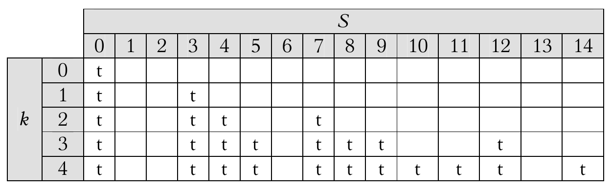

Pildant lentelės langelį :math:`[k, S]`, peržiūrimi langeliai
:math:`[k - 1, S]` ir :math:`[k - 1, S - v_k]`: jei bent viename
iš jų įrašyta reikšmė :math:`true`, tai į :math:`[k,  S]` taip
pat įrašoma :math:`true`:

.. tabs::

  .. tab:: Paskalis

    .. code-block:: unicode_pascal

      const MAXN = ...; { maksimalus dėmenų skaičius }
           MAXM = ...; { maksimali dėmens vertė }
      type masyvas = array [1..MAXN] of integer;
          logmas2 = array [0..MAXN * MAXM,
                           0..MAXN] of boolean;
      procedure dėstyk(var v : masyvas; n, A : integer;
                      var G : logmas2);
      var k, S : integer;
      begin
         { išvalomos masyvo reikšmės }
         for k := 0 to n do
             for S := 0 to A do
                 G[k, S] := false;
         { išdėstomos sumos }
         G[0, 0] := true; { inicializuojama kraštiė reikšmė }
         for k := 1 to n do
             for S := 0 to A do
                 if G[k - 1, S] then
                     G[k, S] := true
                 else if (v[k] <= S) then
                     if (G[k - 1, S - v[k]]) then
                         G[k, S] := true;
      end;

  .. tab:: C++

    .. code-block:: cpp

      const int MAXN = ...; // maksimalus dėmenų skaičius
      const int MAXM = ...; // maksimali dėmens vertė

      int n;
      int A;
      int v[MAXN+1];
      bool G[MAXN*MAXM+1][MAXN+1];

      void destyk () {
          // išvalomos masyvo reikšmės
          for (int k = 0; k <= n; k++)
              for (int S = 0; S <= A; S++)
                  g[k][s] = false;

          // išdėstomos sumos
          G[0][0] = true; // inicializuojama kraštinė reikšmė
          for (int k = 1; k <= n; k++) {
              for (int S = 0; S <= A; S++) {
                  if (G[k-1][S])
                      G[k][S] = true;
                  else if (v[k] <= S) {
                      if (G[k-1][S-v[k]])
                          G[k][S] = true;
                  }
              }
          }
      }

Algoritmo sudėtingumas atminties ir laiko atžvilgiu yra vienodas –
:math:`O(n \cdot A)`.

Dabar galime grįžti prie Teisingų dalybų uždavinio. Pasinaudoję
dinaminiu programavimu pagrįstu sumos dėstymo algoritmu, efektyviai
apskaičiuosime, kokių verčių dovanų rinkinius įmanoma sudaryti.
Iš šių rinkinių pakanka išrinkti tą, kurio vertė artimiausia
:math:`V/2` (visų verčių sumos pusei). Belieka pasinaudoti
apskaičiuotais duomenimis (masyvu :math:`G`) ir pasirinkti, kurias
dovanas reikia skirti Rusnei, o kurias – Emilijai. Sumos dėstymo
uždavinio terminais tai reikštų nustatyti, kuriuos iš :math:`n`
dėmenų reikia sudėti, norint gauti skaičių A. Tad nagrinėjame
lentelės langelį :math:`G[n, A]`: :math:`n`-asis dėmuo
nereikalingas, jei :math:`A` galima sudėti iš likusių :math:`n - 1`
dėmenų, t. y. :math:`G[n - 1, A] = true`. Priešingu atveju,
:math:`n`-asis narys būtinas. Toliau analogiškai tikriname
:math:`n - 1` dėmens reikalingumą, nagrinėdami langelius
:math:`G[n - 1, A]` arba :math:`G[n - 1, A - v_n]`.

.. tabs::

  .. tab:: Paskalis

    .. code-block:: unicode_pascal

      type logmas = array [1..MAXN] of boolean;
      procedure dalybos(var Rusnei : logmas;
                       var v : masyvas; n : integer);
      { rezultatas įrašomas į masyvą „Rusnei“: Rusnei[k] = true,
        jei k-ąją dovaną reikia skirti jai }
      var G : logmas2;
         Vsum : longint;
         i, S : integer;
      begin
         { suskaičiuojama visų verčių suma }
         Vsum := 0;
         for i := 1 to n do
             Vsum := Vsum + v[i];
         dėstyk(v, n, Vsum div 2, G);
         { randama artimiausia V/2 reikšmė, kurią galima išdėstyti }
         S := Vsum div 2;
         while not G[n, S] do
             S := S - 1;
         { nustatoma, kurias iš dovanų skirti Rusnei,
          kad jų bendra vertė būtų lygi S }
         for i := 1 to n do
             Rusnei[i] := false;
         i := n;
         for i := n downto 1 do
            { tikrinama, ar S vertės rinkiniui priklauso i-oji dovana }
            if not G[i - 1, S] then begin
                Rusnei[i] := true;
                S := S - v[i];
            end;
      end;

  .. tab:: C++

    .. code-block:: cpp

      int n;
      int A;
      int v[MAXN+1];
      int G[MAXN*MAXM+1][MAXN+1];
      bool Rusnei[MAXN+1];

      void dalybos () {
          /*
              rezultatas įrašomas į masyvą "Rusnei":
              Rusnei[k] = true, jei k-ąją dovaną reikia skirti jai
          */

          // suskaičiuojama visų verčių suma
          long long Vsum = 0;
          for (int i = 1; i <= n; i++)
              Vsum += v[i];

          A = Vsum/2;
          destyk();

          // randama artimiausia Vsum/2 reikšmė, kurią galima išdėstyti
          int S = Vsum/2;
          while (!G[n][S]) {
              S--;
          }

          // nustatoma, kurias iš dovanų skirti Rusnei, kad jų bendra vertė būtų lygi S
          for (int i = 1; i <= n; i++)
              Rusnei[i] = false;
          for (int i = n; i > 0; i--) {
              // tikrinama, ar S vertės rinkiniui priklauso i-toji dovana
              if (!G[i-1][S]) {
                  Rusnei[i] = true;
                  S -= v[i];
              }
          }
      }

Šio sprendimo sudėtingumas sutampa su sumos dėstymo algoritmo
sudėtingumu, kur dėstoma suma :math:`A` neviršija :math:`n \cdot m`,
taigi yra toks: :math:`O(n^2 \cdot m)`.

Uždavinys *Bibliotekoje* [#f45]_
================================

  :math:`K` bibliotekos darbuotojų buvo paskirta užduotis:
  peržiūrėti visas vienos lentynos knygas ieškant tam tikros
  informacijos. Šioje lentynoje iš viso yra :math:`n` knygų. Darbą
  norima paskirstyti darbuotojams kuo lygesnėmis dalimis, tačiau
  knygos turėtų išlikti savo vietose, todėl buvo nuspręsta
  paprasčiausiai išskaidyti visą lentyną į :math:`k`
  nesikertančių sričių, ir pavesti kiekvienam darbuotojui ieškoti
  informacijos tik vienoje srityje. Vis dėlto vienos knygos puslapių
  skaičiumi gerokai viršija kitas, todėl lentyną į :math:`k`
  sričių norima išskaidyti optimaliai – taip, kad didžiausias
  vienam darbuotojui tenkantis puslapių skaičius būtų kuo mažesnis.

  **Užduotis.** Duoti visų knygų puslapių skaičiai
  :math:`p_1, p_2, \dots, p_n`. Reikia rasti, kaip visą darbą
  darbuotojams paskirstyti optimaliai.

Pradėkime analizuoti uždavinį nuo kelių paprastų pavyzdžių. Tegu
visą darbą reikia padalyti trims darbuotojams, o lentynoje yra
devynios knygos. Be abejo, jei visos knygos turėtų vienodą puslapių
skaičių, tai lentyną galėtume skaidyti į tris lygias dalis:

  | 100 100 100 | 100 100 100 | 100 100 100

Tačiau lentynos dalijimas lygiomis dalimis tikrai netikęs, jei
puslapių skaičius knygose gerokai skiriasi:

  | 100 200 300 | 400 500 600 | 700 800 900

Šiuo atveju pirmam darbuotojui tektų peržiūrėti
:math:`100 + 200 + 300 = 600` puslapių, o trečiajam –
:math:`700 + 800 + 900 = 2400`, taigi net keturis kartus daugiau.
Išbandę įvairius variantus, galime padaryti išvadą, kad geriausias
įmanomas paskirstymas būtų toks:

  | 100 200 300 400 500 | 600 700 | 800 900

Tuomet darbuotojams tektų peržiūrėti atitinkamai 1500, 1300 ir 1700
puslapių.

Ar yra kokia nors strategija, kurios laikydamiesi lentynoje esančias
knygas visuomet padalytume optimaliai? Idealiu atveju visiems
darbuotojams darbas paskirstomas lygiomis dalimis, t. y. kiekvienam
darbuotojui tenkantis puslapių skaičius lygus visų knygų puslapių
skaičių sumai, padalytai iš darbuotojų skaičiaus:
:math:`P_{vid} = (p_1 + p_2 + \dots + p_n) / k`. Todėl būtų
natūralu apskaičiuoti šią reikšmę ir iš eilės parinkinėti
sritis, stengiantis jų dydžius gauti kuo artimesnius :math:`P_{vid}`,
t. y. taikyti godžiąją strategiją.

Vadovaudamiesi šia strategija, gautume optimalų paskirstymą visuose
kol kas nagrinėtuose pavyzdžiuose. Tačiau neskubėkime daryti
išvadų. Bendru atveju galima gauti ir neoptimalų knygų paskirstymą:
jei keliems darbuotojams skiriamas darbas yra šiek tiek mažesnis už
vidurkį, tai paskutiniam gali susikaupti nemažai „papildomo“
darbo.

Tarkime, lentynoje iš eilės sudėtos 6 knygos po 80 puslapių, o
toliau trys knygos, kurių puslapių skaičiai lygūs 100, 30 ir 200, ir
jas reikia paskirstyti trims darbuotojams. Šiuo atveju
:math:`P_{vid} = 270`. Taigi vadovaudamiesi godžiąją strategija,
pirmam darbuotojui skirtume peržiūrėti pirmas tris knygas (240
puslapių yra artimesnė reikšmė :math:`P_{vid}`, negu 320), antram
– taip pat tris knygas, ir galų gale gautume tokį knygų
paskirstymą:

  | 80 80 80 | 80 80 80 | 100 30 200

Daugiausiai darbo – 330 puslapių – tektų trečiajam darbuotojui.
Tačiau optimaliu atveju didžiausias peržiūrimų puslapių skaičius
būtų lygus 320:

  | 80 80 80 80 | 80 80 100 | 30 200

Taigi optimalus paskirstymas gaunamas pirmajam darbuotojui skiriant
keturias knygas. Godžioji strategija šito negalėjo numatyti, kadangi
sprendimai priimami pagal labai paprastą kriterijų, nenumatant jų
padarinių.

Sudarysime dinaminiu programavimu pagrįstą algoritmą šiam dalijimo
uždaviniui spręsti. Jis visuomet ras optimalų paskirstymą, kadangi
išanalizuos visus galimus variantus, tačiau tai atliks efektyviai.

Kad būtų paprasčiau, sutarsime knygų nuo :math:`i`-osios iki
:math:`j`-osios puslapių skaičių sumą žymėti :math:`S(i, j)`,
t. y. :math:`S(i, j) = p_i + p_{i + 1} + \dots + p_j`.
Didžiausią vienam darbuotojui peržiūrėti tenkantį puslapių
skaičių vadinsime paskirstymo įverčiu.

Taigi pradėkime nuo optimalios sprendinio struktūros nustatymo. Bet
kuriame paskirstyme :math:`k`-ajam darbuotojui tenka kažkiek knygų iš
lentynos pabaigos, t. y. knygos nuo :math:`l`-iosios iki
:math:`n`-osios, :math:`l \leq n`. Kad ir koks būtų paskirstymas,
daugiausiai darbo tenka arba :math:`k`-ajam darbuotojui, arba kuriam
nors kitam. Pirmu atveju (jei daugiausia darbo tenka :math:`k`-ajam
darbuotojui), paskirstymo įvertis lygus :math:`S(l, n)`, o antruoju
atveju susiduriame su analogišku, tik mažesniu, uždaviniu –
optimaliu lentynos iki :math:`l`-osios knygos (jos neįtraukiant)
paskirstymu pirmiesiems :math:`k - 1` darbuotojų.

Pažymėkime optimalų :math:`n` knygų paskirstymo :math:`k`
darbuotojų įvertį :math:`M(k, n)`. Jei žinotume, kad optimalu
:math:`k`-ajam darbuotojui skirti knygas nuo :math:`l`-osios iki
:math:`n`-osios (t.y. žinotume, kam lygus :math:`l`), tai

.. math::
  M(k, n) = \max \{ S(l, n), M(k - 1, l - 1) \}

Tačiau mes iš anksto nežinome, kiek knygų optimalu skirti
paskutiniam darbuotojui. Todėl tenka išbandyti visus galimus variantus
ir pasirinkti tą, kurio atveju gaunamo paskirstymo įvertis yra
mažiausias. Taigi iš tiesų :math:`M(k, n)` apibrėžiamas taip:

.. math::
  M(k, n) = \min_{1 \leq l \leq n} \max \{ S(l, n), M(k - 1, l - 1) \}

t. y. minimumas yra skaičiuojamas iš visų maksimumų, gaunamų, kai
:math:`l` kinta nuo 1 iki :math:`n`.

Kad funkcijos reikšmes galėtume skaičiuoti pagal rekursyvų
apibrėžimą, jį būtina papildyti kraštinėmis reikšmėmis:
paskirstymo įvertis visada lygus nuliui, jei lentyna tuščia; jei yra
tik vienas darbuotojas, tai jam atitenka visas darbas, kuris lygus
:math:`S(1, n)`.

.. math::
  M(k, n) = \left\{
    \begin{array}{ll}
      0, & \text{ jei } n = 0; \\
      S(1, n), & \text{ jei } k = 1; \\
      \min_{l = 1}^n \max\{ S(l, n), M(k - 1, l - 1 ) \}, &
        \text{ kitais atvejais.}
    \end{array}
  \right.

Rekursyviai apibrėžę optimalaus sprendinio vertę, jau galime
sudaryti ją efektyviai apskaičiuojantį algoritmą. Tačiau
nepamirškime, jog mus domina ne tik sprendinio vertė, bet ir pats
sprendinys, t. y. optimalus lentynos paskirstymas. Skirtingai nuo ligi
šiol nagrinėtų uždavinių, sprendinį sukonstruoti iš
apskaičiuotos funkcijos reikšmių lentelės būtų per sudėtinga.
Todėl skaičiuodami kaupsime papildomus duomenis: jei skaičiuodami
:math:`M(k, n)` reikšmę nustatysime, kad :math:`k`-ajam darbuotojui
optimalu paskirti knygas nuo :math:`l`-osios iki :math:`n`-osios, tai
dydį :math:`l` pasižymėsime atskirame masyve (``D[k, n] := l``).

Toliau pateikiamas procedūros, apskaičiuojančios, kaip optimaliai
paskirstyti knygų peržiūrėjimo darbą darbuotojams, tekstas.

.. tabs::

  .. tab:: Paskalis

    .. code-block:: unicode_pascal

      const MAXN = ...; { maksimalus knygų skaičius }
           MAXK = ...; { maksimalus darbuotojų skaičius }
           BEGALINIS = MAXINT;
      type masyvas = array [0..MAXN + MAXK] of integer;
          masyvas2 = array [1..MAXK, 0..MAXN] of integer;
      procedure paskirstyk(k, n : integer;
                          p : masyvas; { psl. skaičius }
                          var įvertis : integer;
                          var nuo : masyvas);
         { apskaičiuoja knygų nuo i-osios iki j-osios puslapių skaičių sumą }
         function S(i, j : integer) : integer;
         var h : integer;
         begin
             S := 0;
             for h := i to j do
                 S := S + p[h];
         end;
      var i, j, l, v : integer; { pagalbiniai kintamieji }
         D, M : masyvas2;
      begin
         { užpildomos kraštinės reikšmės }
         for i := 1 to k do
             M[i, 0] := 0;
         for j := 1 to n do begin
             M[1, j] := S(1, j);
             D[1, j] := 1;
         end;
         { apskaičiuojama likusi lentelės dalis }
         for i := 2 to k do
             for j := 1 to n do begin
                 M[i, j] := BEGALINIS;
                 { renkamasis minimumas... }
                 for l := 1 to j do begin
                     { ...iš maksimumų }
                     v := max(S(l, j), M[i - 1, l - 1]);
                      { Funkcija max randa didesnįjį iš dviejų skaičių, jos
                        nepateiksime. }
                     if v < M[i, j] then begin
                         M[i, j] := v;
                         D[i, j] := l;
                     end;
                 end;
             end;
         { sukonstruojamas optimalus sprendinys }
         įvertis := M[k, n];
         j := n;
         for i := k downto 2 do begin
             nuo[i] := D[i, j];
             j := D[i, j] - 1;
             { jei i-ajam darbuotojui skiriamos knygos nuo D[i, j], tai
               likusiems i – 1 darbuotojų reikia paskirstyti D[i, j] – 1 knygų}
         end;
         nuo[1] := 1;
      end;

  .. tab:: C++

    .. code-block:: cpp

      const int MAXN = ...;      // maksimalus knygų skaičius
      const int MAXK = ...;      // maksimalus darbuotojų skaičius
      const int BEGALINIS = ...; // kažkoks kuo didesnis skaičius, pavyzdžiui, 1e9

      int k;
      int n;
      int p; // puslapių skaičius
      int ivertis;
      int nuo[MAXN+MAXK+1];

      int S (int i, int j) {
          // apskaičiuoja knygų nuo i-tosios iki j-tosios puslapių skaičių sumą
          int suma = 0;
          for (int h = i; h <= j; h++)
              suma += p[h];
          return suma;
      }

      void paskristyk () {
          int D[MAXK+1][MAXN+1], M[MAXK+1][MAXN+1];

          // užpildomos kraštinęs reikšmės
          for (int i = 1; i <= k; i++)
              M[i][0] = 0;
          for (int j = 1; j <= n; j++) {
              M[1][j] = S(1, j);
              D[1][j] = 1;
          }

          // apskaičiuojama likusi lentelės dalis
          for (int i = 2; i <= k; i++) {
              for (int j = 1; j <= n; j++) {
                  M[i][j] = BEGALINIS;

                  // renkamas minimumas...
                  for (int l = 1; l <= j; l++) {
                      // ...iš maksimumų
                      v = max(S(l, j), M[i-1][l-1]);
                      if (v < M[i][j]) {
                          M[i][j] = v;
                          D[i][j] = l;
                      }
                  }
              }
          }

          // sukonstruojamas optimalus sprendinys
          ivertis = M[k][n];
          int j = n;
          for (int i = k; i > 1; i--) {
              nuo[i] = D[i][j];
              j = D[i][j]-1;
              /*
                  jei i-tajam darbuotojui skiriamos knygos nuo D[i][j],
                  tai likusiems i-1 darbuotojų reikia paskirti
                  D[i][j]-1 knygų
              */
          }
          nuo[1] = 1;
      }

Procedūra grąžina kelis rezultatus:

-  gautojo (optimalaus) paskirstymo *įvertį*, t. y. kiek daugiausiai
   darbo teks vienam iš darbuotojų; 

-  lentynoje esančių knygų paskirstymą. Šis pateikiamas masyve
   ``nuo``. :math:`j`-ajam (bet kuriam, išskyrus paskutinį)
   darbuotojui paskirtos knygos yra intervalas
   ``[nuo[j], nuo[j + 1])``, o :math:`k`-ajam (paskutiniam) –
   ``[nuo[k], n]``.

Toliau pateikiame lenteles M ir D, gaunamas jau mūsų nagrinėto pavyzdžio
atveju, kai k = 3, n = 9, o puslapių skaičiai pateikti lentelėje:

+-------------+-------------+-------------+-------------+-------------+-------------+-------------+-------------+-------------+
| :math:`p_1` | :math:`p_2` | :math:`p_3` | :math:`p_4` | :math:`p_5` | :math:`p_6` | :math:`p_7` | :math:`p_8` | :math:`p_9` |
+-------------+-------------+-------------+-------------+-------------+-------------+-------------+-------------+-------------+
| 100         | 200         | 300         | 400         | 500         | 600         | 700         | 800         | 900         |
+-------------+-------------+-------------+-------------+-------------+-------------+-------------+-------------+-------------+

Skaičiuojant langelio :math:`[k, n]` reikšmę, išbandomos visos
:math:`l` reikšmės nuo 1 iki :math:`n`, masyve ``M`` įsimenama
mažiausia reiškinio
:math:`\max\{ S(l, n), M(k - 1, l - 1) \}` reikšmė ir
pasižymima masyve ``D``.

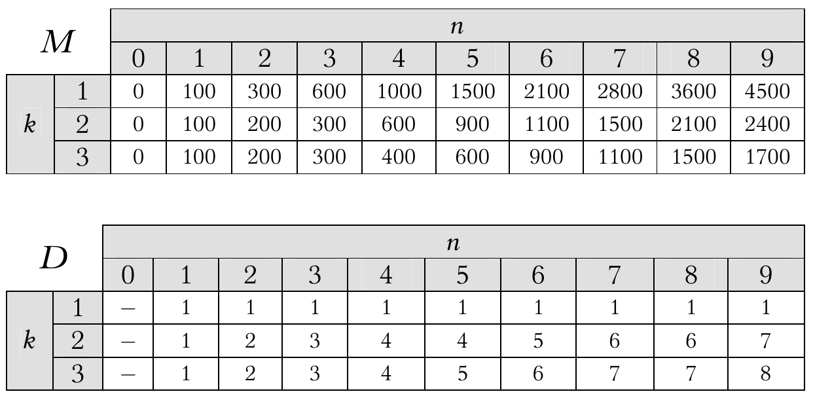
 
Aptarkime procedūros ``paskirstyk`` sudėtingumą. Algoritmas
apskaičiuoja kiekvieną :math:`k \times n` dydžio lentelės
langelį. Kiek gi laiko sugaištama vieno langelio reikšmei
apskaičiuoti? Vidutiniu atveju išbandomų :math:`l` reikšmių
skaičius tiesiškai priklauso nuo :math:`n`, o su kiekviena :math:`l`
reikšme skaičiuojama funkcijos :math:`S`, sumuojančios puslapių
skaičių iš tam tikro intervalo, reikšmė. Pastarosios funkcijos
sudėtingumas taip pat tiesiškai priklauso nuo :math:`n`, t. y. yra
:math:`O(n)`. Taigi:

-   vienam langeliui sugaištama :math:`O(n^2)` laiko; 

-   bendras algoritmo sudėtingumas yra
    :math:`O(n \cdot k \cdot n^2) = O(n^3 \cdot k)`. 

Nors tai palankus (polinominis) sudėtingumas šiam gana sudėtingam
uždaviniui, jį galima pagerinti efektyviau skaičiuojant funkcijos
``S`` reikšmes. Paprasčiausia būtų apskaičiuoti visas galimas jos
reikšmes iš anksto ir įsiminti masyve, vėliau prireikus ``S(i, j)``
reikšmės, tereiktų jos reikšmę paimti iš masyvo, taigi ``S``
sudėtingumas būtų :math:`O(1)`. Visoms reikšmėms apskaičiuoti
prireiktų :math:`O(n^2)` laiko ir tiek pat atminties. Bendro algoritmo
sudėtingumas laiko atžvilgiu būtų
:math:`O(n^2 + n^2 \cdot k) = O(n^2 \cdot k)`.

Tačiau dar efektyvesnis, ir kur kas elegantiškesnis sprendimas yra iš
anksto susiskaičiuoti knygų nuo 1-osios iki :math:`i`-osios puslapių
sumas visiems :math:`i`, t. y. tegu
:math:`r_i = p_1 + p_2 + \dots + p_i`. Jas suskaičiuoti galima
per :math:`O(n)`, pastebėjus, kad :math:`r_i = r_{i-1} + p_i`.
Tuomet, jei mus domina knygų nuo :math:`i`-osios iki :math:`j`-osios
puslapių suma, ją galima apskaičiuoti per :math:`O(1)` (konstantinį
laiką), atliekant vieną aritmetinę operaciją:

.. math::
  p_i + p_{i+1} + \dots + p_j =
    (p_1 + p_2 + \dots + p_j) - (p_1 + p_2 + \dots + p_{i-1}) =
    r_j - r_{i-1}.

Žemiau pateiksime (pažymėdami specialiu komentaru pakeistas eilutes)
efektyviau realizuotą procedūrą ``paskirstyk``, kurios sudėtingumas
yra :math:`O(n^2 \cdot k)` vietoje :math:`O(n^3 \cdot k)`.

.. tabs::

  .. tab:: Paskalis

    .. code-block:: unicode_pascal

      procedure paskirstyk(k, n : integer;
                          p : masyvas; { psl. skaičius }
                          var įvertis : integer;
                          var nuo : masyvas);
      var i, j, l, v : integer; { pagalbiniai kintamieji }
         D, M : masyvas2;
         r : masyvas;          { pagalbinis masyvas}
      begin
         { užpildomas masyvas r }                    // **
         r[0] := 0;                                  // **
         for j := 1 to n do                          // **
             r[j] := r[j - 1] + p[j];                // **
         { užpildomos kraštinės reikšmės }
         for i := 1 to k do
             M[i, 0] := 0;
         for j := 1 to n do begin
             M[1, j] := r[j];                        // **
             D[1, j] := 1;
         end;
         { apskaičiuojama likusi lentelės dalis }
         for i := 2 to k do
             for j := 1 to n do begin
                 M[i, j] := BEGALINIS;
                 { renkamasis minimumas... }
                 for l := 1 to j do begin
                     { ...iš maksimumų }
                     v := max(r[j] - r[l - 1],       // **
                              M[i - 1, l - 1]);      // **
                     if v < M[i, j] then begin
                         M[i, j] := v;
                         D[i, j] := l;
                     end;
                 end;
             end;
         { sukonstruojamas optimalus sprendinys }
         {  }
         ...
      end;

  .. tab:: C++

    .. code-block:: cpp

      const int MAXN = ...;      // maksimalus knygų skaičius
      const int MAXK = ...;      // maksimalus darbuotojų skaičius
      const int BEGALINIS = ...; // kažkoks kuo didesnis skaičius, pavyzdžiui, 1e9

      int k;
      int n;
      int p; // puslapių skaičius
      int ivertis;
      int nuo[MAXN+MAXK+1];

      void paskristyk () {
          int D[MAXK+1][MAXN+1], M[MAXK+1][MAXN+1];
          int r[MAXN+MAXK+1]; // pagalbinis masyvas

          // užpildomas masyvas r                              //**
          r[0] = 0;                                            //**
          for (int j = 1; j <= n; j++)                         //**
              r[j] = r[j-1] + p[j];                            //**

          // užpildomos kraštinęs reikšmės
          for (int i = 1; i <= k; i++)
              M[i][0] = 0;
          for (int j = 1; j <= n; j++) {
              M[1][j] = r[j];                                  //**
              D[1][j] = 1;
          }

          // apskaičiuojama likusi lentelės dalis
          for (int i = 2; i <= k; i++) {
              for (int j = 1; j <= n; j++) {
                  M[i][j] = BEGALINIS;

                  // renkamas minimumas...
                  for (int l = 1; l <= j; l++) {
                      // ...iš maksimumų
                      v = max(r[j] - r[i-1], M[i-1][l-1]);     //**
                      if (v < M[i][j]) {
                          M[i][j] = v;
                          D[i][j] = l;
                      }
                  }
              }
          }

          // sukonstruojamas optimalus sprendinys
          ivertis = M[k][n];
          int j = n;
          for (int i = k; i > 1; i--) {
              nuo[i] = D[i][j];
              j = D[i][j]-1;
              /*
                  jei i-tajam darbuotojui skiriamos knygos nuo D[i][j],
                  tai likusiems i-1 darbuotojų reikia paskirti
                  D[i][j]-1 knygų
              */
          }
          nuo[1] = 1;
      }

Uždavinys *Sodas* [#f47]_
=========================

  Kvadratiniame :math:`m \times m` dydžio sode auga :math:`n`
  medžių. Laikoma, kad medis yra taškas, neturintis ilgio ir pločio.
  Koordinačių sistemos pradžia yra apatinis kairysis sodo kampas, o
  ašys yra lygiagrečios sodo tvoroms. Medžių vietą nusako jų
  koordinatės :math:`(x, y)`,  išreikštos sveikaisiais skaičiais.

  **Užduotis.** Reikia rasti didžiausio stačiakampio, kuriame
  nebūtų medžių, plotą. Stačiakampio kraštinės turi būti
  lygiagrečios atitinkamoms sodo tvoroms (kraštinėms).

  Ieškomo stačiakampio kraštinėse gali augti medžiai, taip pat
  stačiakampio kraštinė gali sutapti su sodo tvora.

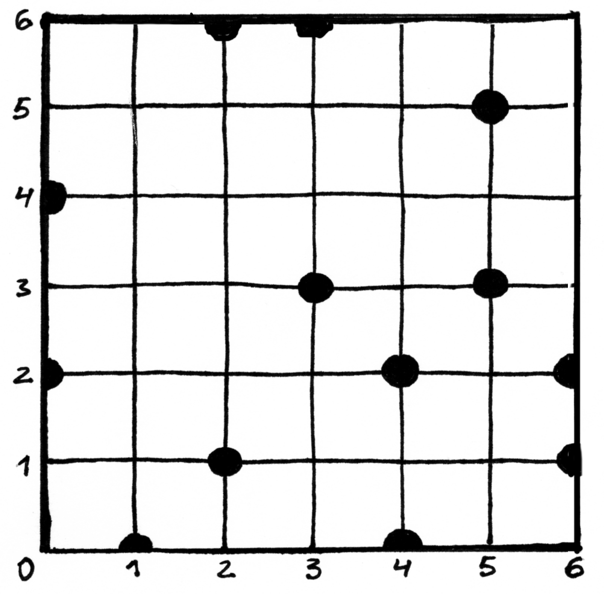

  Sodo pavyzdys; sode auga trylika medžių

Įveskime keletą sąvokų. :math:`P(x, y)` pažymėsime tokį
didžiausią vienetinio pločio stačiakampį, kurio viršutinio
dešiniojo kampo koordinatės yra :math:`(x, y)`, o kairiosios
kraštinės vidiniuose taškuose nėra medžių. Šio stačiakampio
aukštį žymėsime :math:`H_P(x, y)`. Nesunku matyti, kaip efektyviai
apskaičiuoti :math:`H_p` reikšmes:

.. math::
  H_p(x, y) = \left\{
    \begin{array}{ll}
      1, & \text{ jei } y = 1 \text{ arba jei taške } (x-1, y-1)
        \text{ auga medis } \\
      H_p(x, y - 1) + 1, & \text{ kitais atvejais }
    \end{array}
  \right.

Pažymėkime :math:`T(x, y)` didžiausią medžių neturintį
stačiakampį, kuriam priklauso :math:`P(x, y)` ir kurio aukštis
sutampa su :math:`P(x, y)` aukščiu.

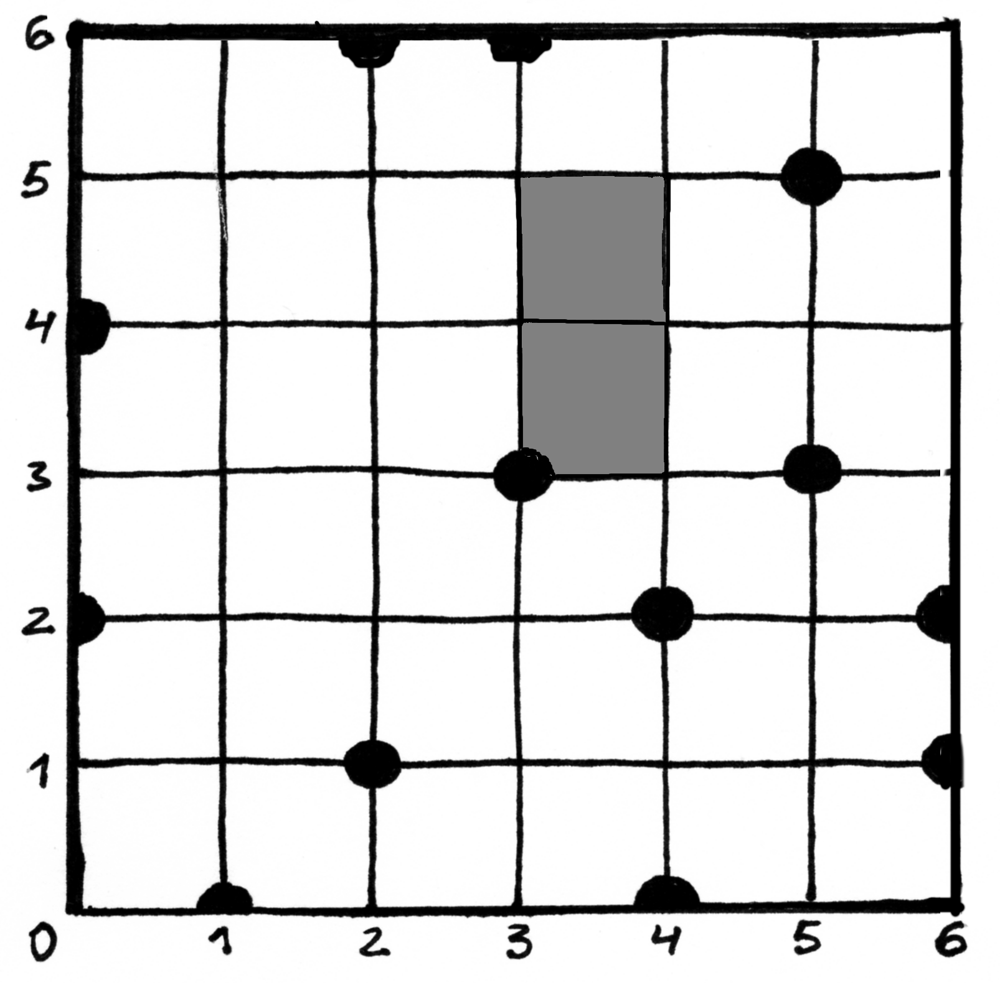

  Stačiakampis :math:`P(4, 5)` pažymėtas pilkai; jo aukštis
  :math:`H_P(4, 5) = 2`

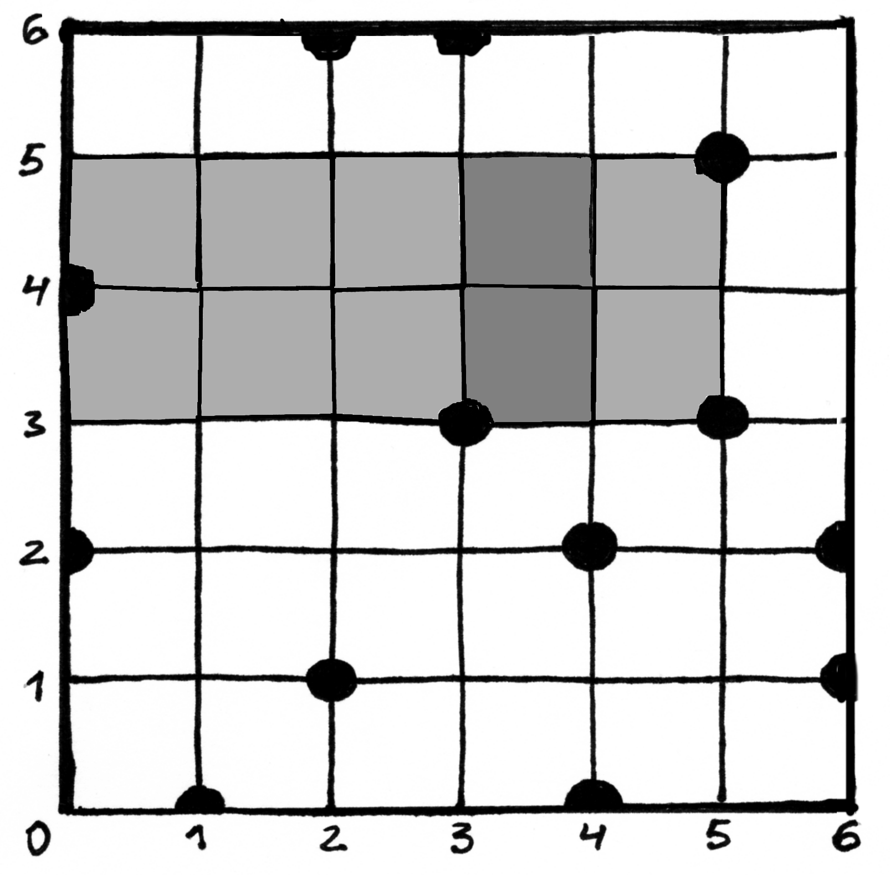

  :math:`T(4, 5)` – maksimalaus ploto stačiakampis, kuriam
  priklauso :math:`P(4, 5)`

Stačiakampio :math:`T(x, y)` kairiojo viršutiniojo kampo koordinatę
:math:`x` pažymėkime :math:`K(x, y)`, o dešiniojo viršutinio –
:math:`D(x, y)`. Žinodami tai, iš karto galėsime apskaičiuoti
:math:`T(x, y)` plotą:

.. math::
  ST(x, y) = (D(x, y) - K(x, y)) \cdot H_P(x, y).

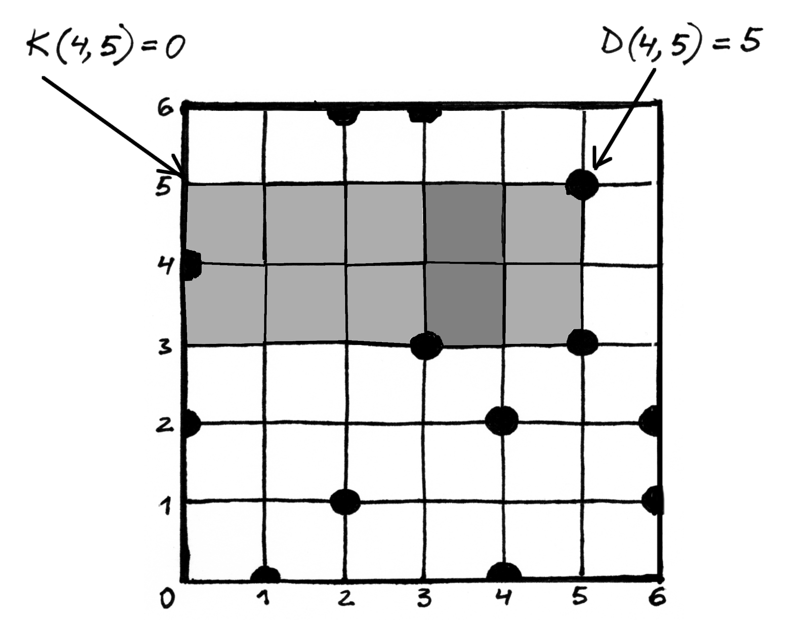

  :math:`S_T(4, 5) = (D(4, 5) - K(4, 5)) \cdot H(4, 5) =`
  :math:`(5 - 0) \cdot 2 = 10`

Tarkime, kad žinome, kaip efektyviai apskaičiuoti funkcijų :math:`K`
ir :math:`D` reikšmes. Tuomet užtenka peržiūrėti visus galimus
stačiakampius :math:`T(x, y)` (t. y. išbandyti visas galimas
:math:`x` ir :math:`y` poras, kurių bus :math:`m^2`) ir išrinkti
didžiausią – jis ir bus ieškomasis sprendinys.  

Toliau pateikta procedūra naudoja dvimatį loginį masyvą ``medis``,
kurio kiekvienas elementas ``medis[x, y]`` rodo, ar taške
:math:`(x, y)` auga medis.

.. tabs::

  .. tab:: Paskalis

    .. code-block:: unicode_pascal

      const MAXM = ...; { maksimalus sodo dydis }
      type lgmasyvas = array [0..MAXM, 0..MAXM] of boolean;
          kvmasyvas = array [1..MAXM, 1..MAXM] of integer;
      function max_sodas(m : integer; { sodo dydis }
                        { medis[x, y] = true, jei (x, y) auga medis }
                        var medis : lgmasyvas) : integer;
      var x, y, plotas : integer;
         Hp, K, D : kvmasyvas;
      begin
         { apskaičiuojame Hp reikšmes }
         for y := 1 to m do
             for x := 1 to m do
                 if y = 1 then
                     Hp[x, y] := 1
                 else if medis[x - 1, y - 1] then
                     Hp[x, y] := 1
                 else
                     Hp[x, y] := Hp[x, y - 1] + 1;
         { apskaičiuojame K ir D reikšmes kiekvienam stačiakampiui T
           (šių procedūrų tekstas bus pateiktas vėliau) }
         skaičiuok_K(m, Hp, K);
         skaičiuok_D(m, Hp, D);
         { belieka peržiūrėti visus stačiakampius ir išrinkti didžiausią }
         max_sodas := 0;
         for y := 1 to m do
             for x := 1 to m do begin
                 plotas := Hp[x, y] * (D[x, y] - K[x, y]);
                 if plotas > max_sodas then
                     max_sodas := plotas;
             end;
      end;

  .. tab:: C++

    .. code-block:: cpp

      const int MAXM = ...; // maksimalus sodo dydis

      int m;                      // sodo dydis
      bool medis[MAXM+1][MAXM+1]; // medis[x][y] = true, jei (x, y) auga medis
      int Hp[MAXM+1][MAXM+1];
      int K[MAXM+1][MAXM+1];
      int D[MAXM+1][MAXM+1];

      int maxSodas () {
          // apskaičiuojame Hp reikšmes
          for (int y = 1; y <= m; y++) {
              for (int x = 1; x <= m; x++) {
                  if (y == 1)
                      Hp[x][y] = 1;
                  else if (medis[x-1][y-1])
                      Hp[x][y] = 1;
                  else
                      Hp[x][y] = Hp[x][y-1] + 1;
              }
          }

          // apskaičiuojame K ir D reikšmes kiekvienam stačiakampiui T
          // šių procedūrų tekstas bus pateiktas vėliau
          skaiciuokK();
          skaiciuokD();

          // belieka peržiūrėti visus stačiakampius ir išrinkti didžiausią
          int maxPlotas = 0;
          for (int y = 1; y <= m; y++) {
              for (int x = 1; x <= m; x++) {
                  int plotas = Hp[x][y] * (D[x][y] - K[x][y]);
                  if (plotas > maxPlotas)
                      maxPlotas = plotas;
              }
          }
          return maxPlotas;
      }

Pagalvokime, kaip efektyviai apskaičiuoti masyvų ``K`` ir ``D``
reikšmes. ``K`` ir ``D`` reikšmės kiekvienai eilutei (t. y.
kiekvienai koordinatei :math:`y`) bus skaičiuojamos atskirai, tad
panagrinėsime, kaip apskaičiuoti ``K`` ir ``D`` reikšmes, kai
koordinatė :math:`y` fiksuota.

Pradėkime nuo masyvo ``D``. Efektyviai reikšmėms apskaičiuoti bus
naudojama dėklo [#f48]_ duomenų struktūra. Dėkle saugomos
tos :math:`x` koordinatės, kurioms :math:`D(x, y)` dar neapskaičiuotas.
Koordinatės :math:`x` peržiūrimos iš kairės į dešinę (t. y. nuo
1 iki :math:`m`) ir paeiliui dedamos į dėklą. Tačiau prieš tai
patikrinama, galbūt :math:`H_P(s, y) > H_P(x, y)`,
kur :math:`s` – paskutinis dėkle esantis elementas. Jei
:math:`H_P(s, y) > H_P(x, y)`, tai stačiakampio, kuriam priklauso
:math:`H_P(s, y)`, daugiau į dešinę pratęsti negalima, taigi rastas
dešinysis stačiakampio :math:`T(s, y)` kraštas:
:math:`D(s, y) = x - 1`. Tokiu atveju iš dėklo pašalinama
koordinatė :math:`s`, nes :math:`D(s, y)` jau apskaičiuota. Jei iš
dėklo pašalinta koordinatė, vėl tikrinama, ar
:math:`H_P(s, y) > H_P(x, y)`, kur :math:`s` – jau atnaujintas
paskutinis dėklo elementas. Galbūt ir šiam elementui bus rastas
:math:`D(s, y)`, o pats elementas – pašalintas iš dėklo.
Koordinatė :math:`x` į dėklą įtraukiama tik tada, kai
:math:`H_P(s, y) \leq H_P(x, y)` arba kai dėklas jau tuščias.

Peržiūrėjus visas :math:`x` koordinates, dėkle liks tik tos
:math:`x` koordinatės, kurių stačiakampio :math:`T(x, y)` dešinysis
kraštas sutampa su kvadrato kraštu.

Pateiktame pavyzdyje parodysime, kaip skaičiuojamos funkcijos :math:`D`
reikšmės, konkrečiu atveju – kai :math:`y = 5`.

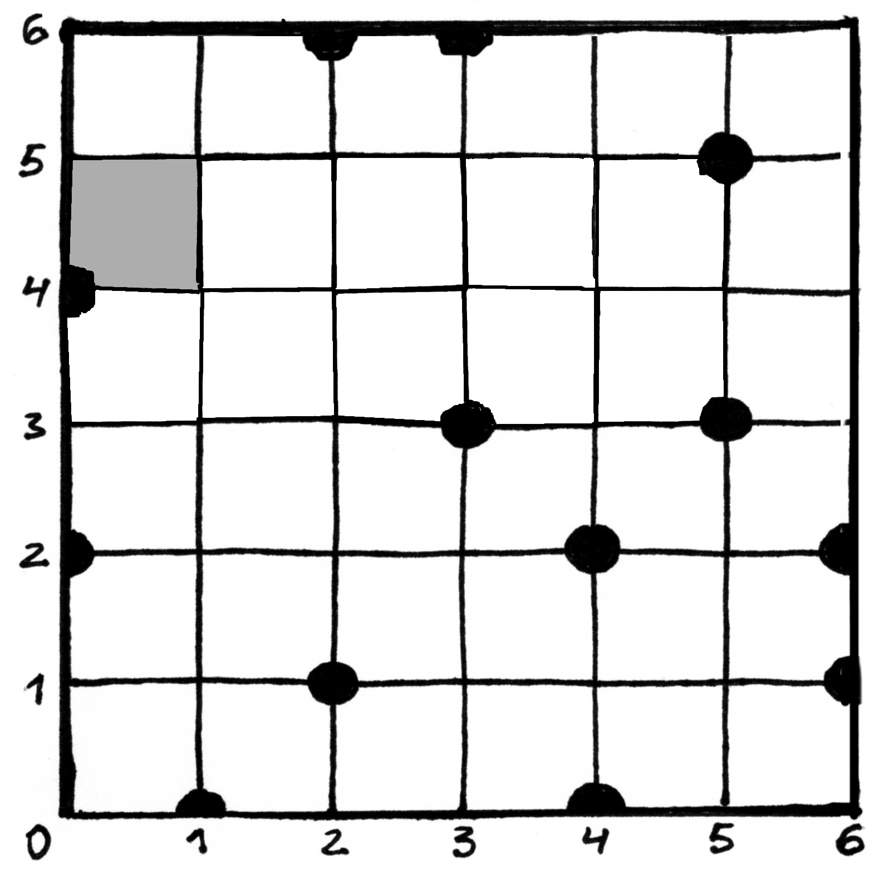
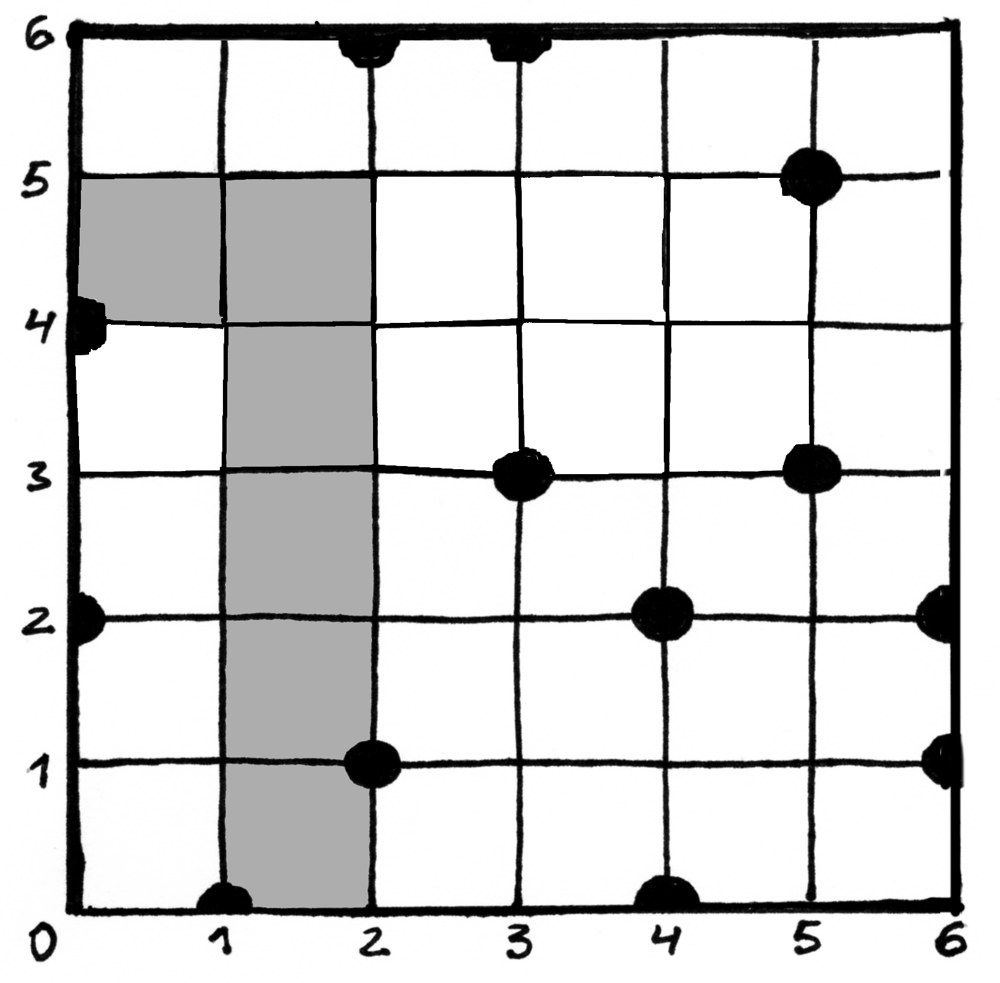
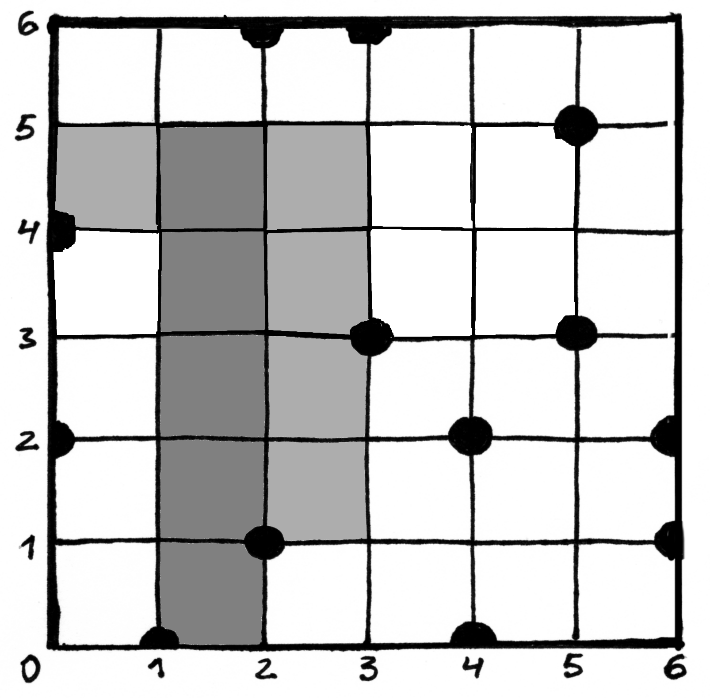
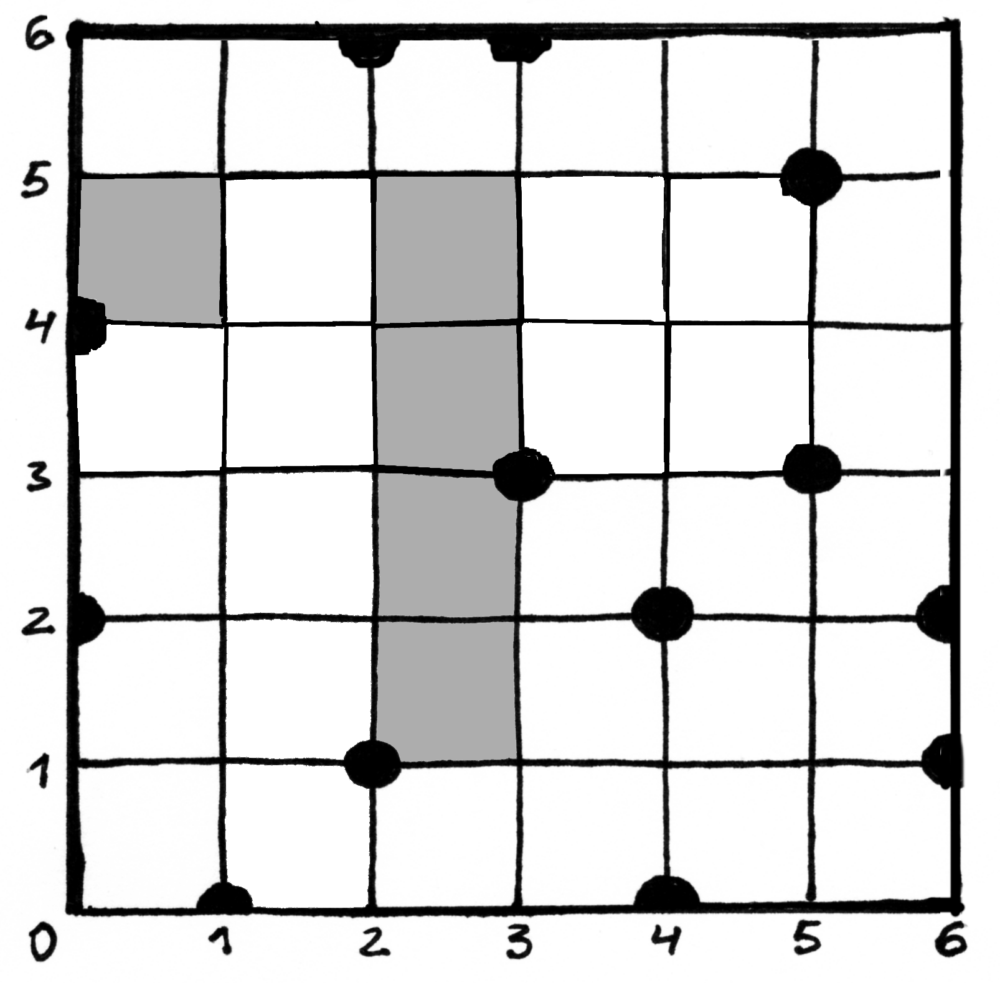
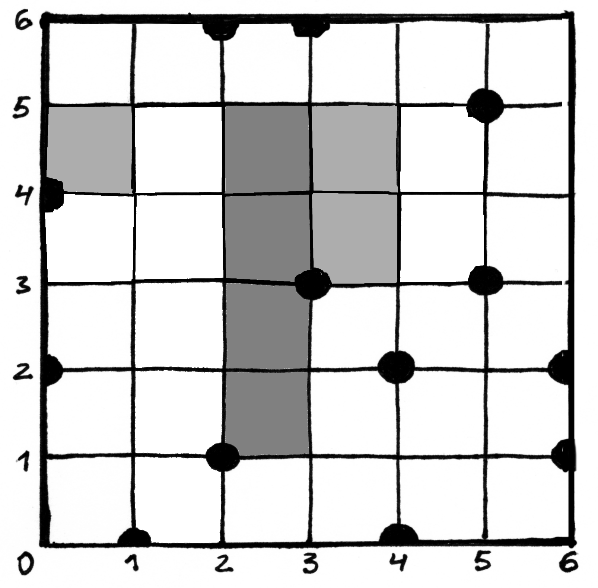
.. |sodas_f| image:: images/12_skyrius/81_sodas_10.png
  :width: 200px
  :alt: Sodas
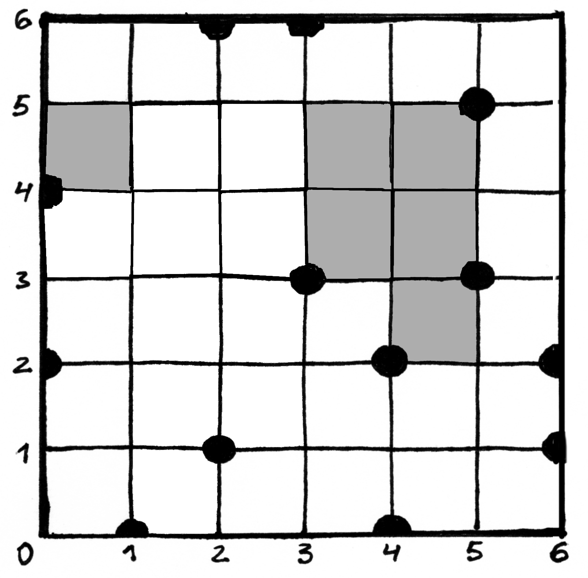
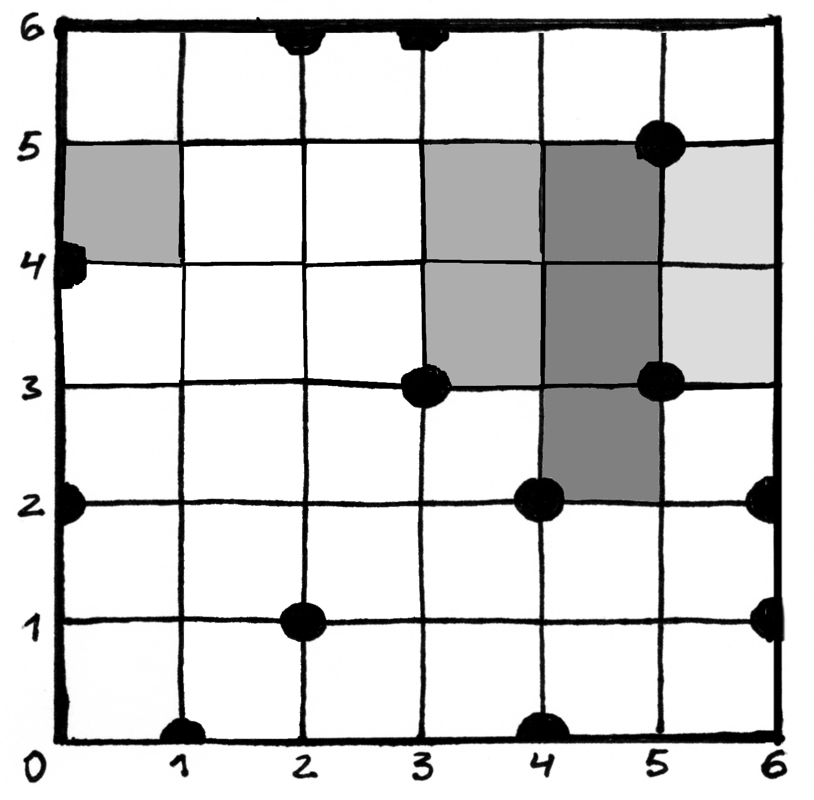
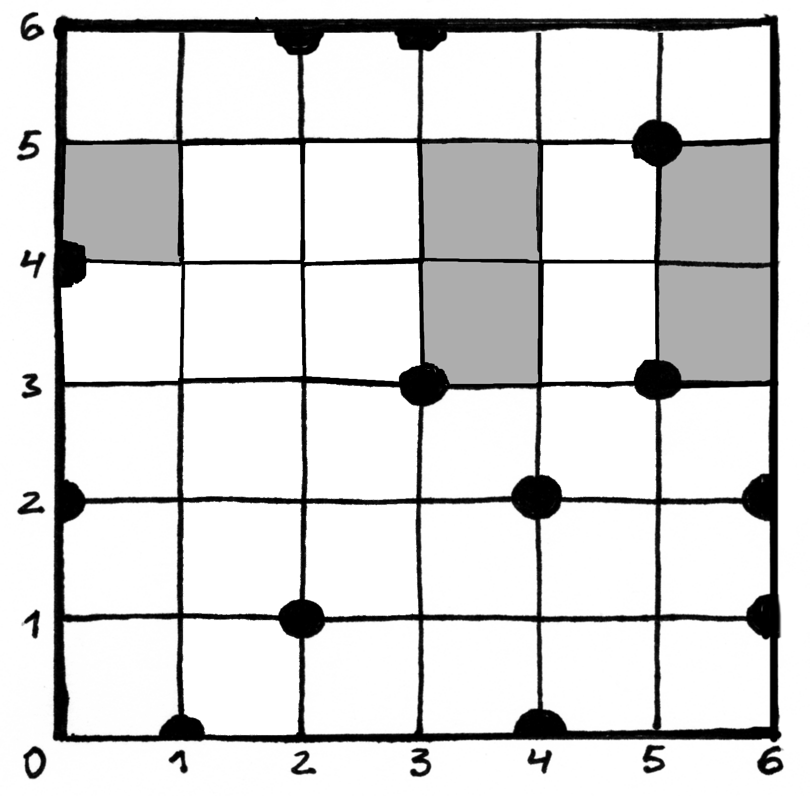

.. table::

  +------------+------------------------------------------------------+
  | |sodas_a|  | :math:`H_P(1, 5) = 1`;                               |
  |            |                                                      |
  |            | ``Dėklas = [1]``                                     |
  +------------+------------------------------------------------------+
  | |sodas_b|  | :math:`H_P(2, 5) = 5`;                               |
  |            | :math:`H_P(1, 5) \leq H_P(2, 5)`;                    |
  |            |                                                      |
  |            | ``Dėklas = [1, 2]``                                  |
  +------------+------------------------------------------------------+
  | |sodas_c|  | :math:`H_P(3, 5) = 4`;                               |
  |            | :math:`H_P(2, 5) > H_P(3, 5)`;                       |
  |            |                                                      |
  |            | radome :math:`D(2, 5) = 2`;                          |
  |            |                                                      |
  |            | ``Dėklas = [1]``                                     |
  +------------+------------------------------------------------------+
  | |sodas_d|  | :math:`H_P(3, 5) = 4`;                               |
  |            | :math:`H_P(1, 5) \leq H_P(3, 5)`;                    |
  |            |                                                      |
  |            | ``Dėklas = [1, 3]``                                  |
  +------------+------------------------------------------------------+
  | |sodas_e|  | :math:`H_P(4, 5) = 2`;                               |
  |            | :math:`H_P(3, 5) > H_P(4, 5)`;                       |
  |            |                                                      |
  |            | radome :math:`D(3, 5) = 3`;                          |
  |            |                                                      |
  |            | ``Dėklas = [1]``                                     |
  +------------+------------------------------------------------------+
  | |sodas_f|  | :math:`H_P(4, 5) = 2`;                               |
  |            | :math:`H_P(1, 5) \leq H_P(4, 5)`;                    |
  |            |                                                      |
  |            | ``Dėklas = [1, 4]``                                  |
  +------------+------------------------------------------------------+
  | |sodas_g|  | :math:`H_P(5, 5) = 3`;                               |
  |            | :math:`H_P(4, 5) \leq H_P(5, 5)`;                    |
  |            |                                                      |
  |            | ``Dėklas = [1, 4, 5]``                               |
  +------------+------------------------------------------------------+
  | |sodas_h|  | :math:`H_P(6, 5) = 2`;                               |
  |            | :math:`H_P(5, 5) > H_P(6, 5)`;                       |
  |            |                                                      |
  |            | radome :math:`D(5, 5) = 5`;                          |
  |            |                                                      |
  |            | ``Dėklas = [1, 4]``                                  |
  +------------+------------------------------------------------------+
  | |sodas_i|  | ``Dėklas = [1, 4, 6]``                               |
  |            |                                                      |
  |            | :math:`D(1, 5) = D(4, 5) = D(6, 5) = m = 6`          |
  +------------+------------------------------------------------------+

:math:`K` reikšmės skaičiuojamos analogiškai, tik koordinatės
peržiūrimos iš dešinės į kairę.

.. tabs::

  .. tab:: Paskalis

    .. code-block:: unicode_pascal

      type masyvas = array [1..MAXM] of integer;
      procedure skaičiuok_D(m : integer;
                           var Hp : kvmasyvas;
                           var D : kvmasyvas);
      var dėklas : masyvas;
         sk, x, y, s : integer;
      begin
         sk := 0; { Elementų skaičius dėkle }
         for y := 1 to m do begin
             for x := 1 to m do begin
                if sk > 0 then begin
                    s := dėklas[sk];
                    while (sk > 0) and
                          (Hp[x, y] < Hp[s, y]) do
                    begin
                        { rastas dešinysis T(s, y) kraštas (x - 1) }
                        D[s, y] := x - 1;
                        sk := sk - 1;
                        if sk > 0 then s := dėklas[sk];
                    end;
                end;
                { koordinatė x dedama į dėklą }
                sk := sk + 1;
                dėklas[sk] := x;
             end;
             { jei dėkle likus koordinatė x, tai T(x, y) tęsiasi
               iki pat dešiniojo sodo krašto }
             while sk > 0 do begin
                 s := dėklas[sk];
                 D[s, y] := m;
                 sk := sk - 1;
             end;
         end;
      end;
      procedure skaičiuok_K(m : integer;
                           var Hp : kvmasyvas;
                           var K : kvmasyvas);
      var dėklas : masyvas;
         sk, x, y, s : integer;
      begin
         sk := 0; { Elementų skaičius dėkle }
         for y := 1 to m do begin
             for x := m downto 1 do begin
                if sk > 0 then begin
                    s := dėklas[sk];
                    while (sk > 0) and
                          (Hp[x, y] < Hp[s, y]) do
                    begin
                        { rastas kairysis T(s, y) kraštas (x) }
                        K[s, y] := x - 1;
                        sk := sk - 1;
                        if sk > 0 then s := dėklas[sk];
                    end;
                end;
                { koordinatė x dedama į dėklą }
                sk := sk + 1;
                dėklas[sk] := x;
             end;
             { jei dėkle likus koordinatė x, tai T(x, y) tęsiasi
               iki pat kairiojo sodo krašto }
             while sk > 0 do begin
                 s := dėklas[sk];
                 K[s, y] := 0;
                 sk := sk - 1;
             end;
         end;
      end;

  .. tab:: C++

    .. code-block:: cpp

      void skaiciuokD () {
          int deklas[MAXM+1];
          int sk = 0; // elementų skaičius dėkle
          for (int y = 1; y <= m; y++) {
              for (int x = 1; x <= m; x++) {
                  if (sk > 0) {
                      int s = deklas[sk];
                      while (sk > 0 && Hp[x][y] < Hp[s][y]) {
                          // rastas dešinysis T(s, y) kraštas (x-1)
                          D[s][y] = x-1;
                          sk--;
                          if (sk > 0) s = deklas[sk];
                      }
                  }

                  // koordinatė x dedama į dėklą
                  sk++;
                  deklas[sk] = x;
              }

              // jei dėkle likus koordinatė x, tai T(x, y) tęsiasi iki pat dešiniojo sodo krašto
              while (sk > 0) {
                  s = deklas[sk];
                  D[s][y] = m;
                  sk--;
              }
          }
      }

      void skaiciuokK () {
          int deklas[MAXM+1];
          int sk = 0; // elementų skaičius dėkle
          for (int y = 1; y <= m; y++) {
              for (int x = m; x > 0; x--) {
                  if (sk > 0) {
                      int s = deklas[sk];
                      while (sk > 0 && Hp[x][y] < Hp[s][y]) {
                          // rastas kairysis T(s, y) kraštas (x-1)
                          K[s][y] = x-1;
                          sk--;
                          if (sk > 0) s = deklas[sk];
                      }
                  }

                  // koordinatė x dedama į dėklą
                  sk++;
                  deklas[sk] = x;
              }

              // jei dėkle likus koordinatė x, tai T(x, y) tęsiasi iki pat kairiojo sodo krašto
              while (sk > 0) {
                  s = deklas[sk];
                  K[s][y] = 0;
                  sk--;
              }
          }
      }

Šio sprendimo sudėtingumas pagal laiką ir atmintį –
:math:`O(m^2)`. Nesunkiai galime modifikuoti sprendimą taip, kad
sudėtingumas pagal atmintį sumažėtų iki :math:`O(m + n)`.
Medžių koordinates galima saugoti vienmačiame :math:`O(n)` įrašų
masyve, o kvadratą nagrinėti po vieną eilutę: apskaičiuoti
:math:`H_P`, :math:`K`, ir :math:`D` einamajai :math:`y` koordinatei,
išrinkti didžiausią iki šiol rastą stačiakampį ir toliau
nagrinėti kitą :math:`y` koordinatę. Skaičiuojant :math:`K(x, y)` ir
:math:`D(x, y)` reikšmes, :math:`K` ir :math:`D` reikšmių su kitomis
:math:`y` koordinatėmis neprireikia, o skaičiuojant :math:`H_P(x, y)`
reikšmę naudojamos tik :math:`H_P(x, y - 1)` reikšmės.

Kada taikyti dinaminį programavimą
==================================

Išsprendėme kelis uždavinius pritaikę dinaminį programavimą.
Bendru atveju sunku įvertinti, ar uždavinį galima spręsti taikant
dinaminį programavimą. Tačiau dažnai tokie uždaviniai pasižymi
bendromis savybėmis. Šiame skyrelyje jas ir apžvelgsime.
Prieš taikant dinaminį programavimą reikėtų užduoti šiuos
klausimus:

**Ar tai optimizavimo uždavinys?** Ar šiam uždaviniui galima rasti
daug sprendinių, iš kurių mus domina tik vienas (ilgiausias,
trumpiausias ar panašiai)? Dauguma dinaminiu programavimų
sprendžiamų uždavinių yra būtent optimizavimo uždaviniai.

**Ar uždavinyje aprašyto objekto elementai yra surikiuoti?** Daugelio
objektų elementai yra surikiuoti iš kairės į dešinę (t. y. tarp
dviejų objektų įvestas santykis *kairiau*), arba apibrėžta kokia nors
kitokia tvarka. Pavyzdžiui, muziejaus eksponatai (*Kuprinės
uždavinyje*), dovanos (*Teisingų dalybų uždavinyje*), medžiai
[#f49]_ (*Sodo uždavinyje*), simbolių eilutės simboliai, iškiliojo
daugiakampio viršūnės, lapai paieškos medyje ir pan. Tikėtina, kad
optimizavimo uždavinį, kuriame objektų elementai yra surikiuoti,
galima efektyviai išspręsti dinaminio programavimo metodu.

Jei objekto elementai nėra surikiuoti, tikriausiai teks atsisakyti
dinaminio programavimo. Mat tokiu atveju uždavinį sprendžiant
dinaminio programavimo metodu, laiko bei atminties sąnaudos būtų
eksponentinės eilės (tai reiškia, kad sprendimas būtų visiškai
neefektyvus).  

**Ar galima suskaidyti uždavinį į smulkesnius uždavinius**, o tuos
į dar smulkesnius, kol pasiekiamos elementarios ribinės situacijos?
Sakykime, uždavinyje aprašytas objektas turi :math:`n` elementų. Ar,
paėmę mažiau nei :math:`n` elementų, gausime tą patį uždavinį,
tik su mažesniais parametrais? Jei ne – pritaikyti dinaminio
programavimo nepavyks.

**Ar smulkesnių uždavinių sprendiniai turi įtakos didesnių
uždavinių sprendimui?** Kokia informacija apie sprendinius mažesniems
nei :math:`n` elementų objektams yra būtina, norint rasti sprendinį
objektui su :math:`n` elementų? Ar turėdami sprendinius visiems
mažesniems nei :math:`n` elementų objektams bei :math:`n`-ąjį
elementą galime, gauti sprendinį objektui iš :math:`n` elementų? Jei
ne – dinaminio programavimo pritaikyti taip pat nepavyks.

**Ar skaidant į smulkesnius uždavinius, tie smulkesni uždaviniai ima
kartotis?** Jei ne – dinaminio programavimo taikyti neverta. Nes
dinaminio programavimo efektyvumas laiko atžvilgiu bus toks pat, kaip
ir pilno perrinkimo atveju, tačiau pareikalaus kur kas daugiau
atminties. Dinaminio programavimo esmę sudaro dalinių uždavinių
sprendinių įsiminimas, kai dėl to nebereikia iš naujo nespręsti tų
pačių uždavinių. Tačiau jei daliniai uždaviniai [#f50]_
nesikartoja, tai nieko nelaimėsime taikydami dinaminį programavimą.

**Ar sprendimui pakaks atminties?** Taikant dinaminį programavimą
dažnai reikia atsižvelgti į atminties sąnaudas. Jos būna kur kas
didesnės nei sprendžiant uždavinį, pavyzdžiui, *grįžimo metodu*.
Reikalingas atminties kiekis kartais gali nulemti, ar tam uždaviniui
pavyks pritaikyti dinaminį programavimą.

Reikėtų atkreipti dėmesį į spręstų uždavinių sudėtingumą
pagal atmintį. Pavyzdžiui, Kuprinės uždavinio sprendimo
sudėtingumas atminties atžvilgiu yra :math:`O(n \cdot S)`. Jei
eksponatų svoriai būtų dideli, dinaminio programavimo pritaikyti
nepavyktų. Tad pradinių duomenų ribojimai yra labai svarbūs
įvertinant, ar uždavinio sprendimui galima taikyti dinaminį
programavimą.

Beje, jei ieškoma tik sprendinio vertė, o ne pats sprendinys, dažnai
galima sutaupyti atminties. Pavyzdžiui, Kuprinės uždavinyje užtektų
saugoti ne visą lentelę, o tik dvi einamąsias lentelės eilutes,
kadangi skaičiuojant :math:`k`-osios lentelės eilutės reikšmes
naudojamos tik reikšmės iš :math:`(k-1)`-osios eilutės.

.. rubric:: Išnašos

.. [#f41]
  Jei reikalinga tik optimalaus sprendinio vertė, tai galima sudaryti
  efektyvesnį atminties atžvilgiu algoritmą. Pavyzdžiui,
  skaičiuojant Fibonačio skaičius iš apačios į viršų, nereikia
  saugoti atmintyje viso masyvo – pakanka įsiminti du paskutinius
  suskaičiuotus narius.

.. [#f43]
  Panašus uždavinys buvo pateiktas Vidurio Europos informatikos
  olimpiadoje, kuri vyko Vengrijoje 1995 m.

.. [#f44]
  Simbolis „:math:`\lor`“ reiškia loginę operaciją „arba“;
  Paskalio kalboje tai atitiktų loginę operaciją ``or``.

.. [#f45]
  Analogiškas uždavinys pateiktas S. Skienos knygoje *The Algorithm
  Design Manual* [S98]_.

.. [#f47]
  Panašus uždavinys buvo pateiktas Vidurio Europos informatikos
  olimpiadoje 1995 metais

.. [#f48]
  Dėklo duomenų struktūra aprašyta skyrelyje
  :ref:`skyrelis-rekursyvios-funkcijos`.

.. [#f49]
  Sodo uždavinyje medis :math:`A(x_1, y_1)` yra kairiau nei medis
  :math:`B(x_2, y_2)`, jei :math:`x_1 < x_2` arba :math:`x_1 = x_2`
  ir :math:`y_1 < y_2`.

.. [#f50]
  Yra tokia uždavinio sprendimo strategija *Skaldyk ir valdyk*, kai
  uždavinys padalijamas į mažesnius uždavinius, visi mažesni
  uždaviniai išsprendžiami taikant rekursiją ir sujungus gautus
  sprendinius gaunamas pradinio uždavinio sprendinys; tik šiuo atveju
  mažesni uždaviniai nesikartoja ir tarpusavyje neturi nieko bendra;
  *Greitojo rikiavimo algoritmas* yra tokios strategijos pavyzdys:
  rikiuojama seka dalijama į dvi dalis ir kiekviena dalis rikiuojama
  atskirai, tačiau vienos sekos dalies rikiavimas neturi įtakos kitos
  dalies rikiavimui.
