====================================
Strateginių stalo žaidimų algoritmai
====================================

  | *I had one item on my agenda today – not to lose.*
  | *Šiandien mano dienotvarkėje buvo tik vienas punktas – nepralaimėti.*
  | Šachmatų čempionas Garis Kasparovas apie žaidimą šachmatais prieš
  | kompiuterinę programą *Deep Junior*

Smagu ir įdomu leisti laisvalaikį žaidžiant šaškėmis,
šachmatais, Go ar net kryžiukais ir nuliukais, turint po ranka tik
languotą popieriaus lapą. Smagiausia žaisti dviese, tačiau ne
mažiau įdomu pabandyti sužaisti stalo žaidimą su kompiuteriu, kai
vieno iš dviejų žaidėjų ėjimus atlieka programa. Galimas ir dar
vienas žaidimo būdas: parašyti programas, atliekančias ėjimus, ir
surengti programų turnyrą.

Kuo daugiau patirties turi žaidėjas ir kuo geresnę žaidimo
strategiją jis sugalvos, tuo daugiau turi šansų laimėti. O kaip gi
su programa, atliekančia žaidėjo ėjimus? Juk kiekvieno žaidimo
taisyklės ir strategijos yra skirtingos. Ar gali būti kokie nors
principai, bendri visiems žaidimams? Ar yra kas bendra tarp,
pavyzdžiui, žaidimo šachmatais ir kryžiukais ir nuliukais? Pasirodo,
yra! Visų strateginių stalo žaidimų algoritmai programuojami
remiantis tais pačiais principais, kuriuos aprašysime šiame
skyrelyje.

**Strateginiai stalo žaidimai** žaidžiami ant žaidimo lentos ar
kitaip pažymėto žaidimo ploto su specialiais žaidimo komponentais
(kauliukais, figūrėlėmis, kortelėmis). Žaidimą žaidžia du
žaidėjai, kurie paeiliui atlieka ėjimus. Žaidimas yra baigtinis,
t. y. jis būtinai baigsis po baigtinio ėjimų skaičiaus.

Strateginių žaidimų algoritmas – tai algoritmas, realizuojantis tam
tikrą žaidimo strategiją, kuria remiantis parenkamas tolesnis
ėjimas. Vartotojo sąsaja ir teisėjavimas neįeina į šią sąvoką.
Tai suprantama – parašyti vartotojo sąsają šachmatų žaidimo
programai galėtų daugelis išmanančių kompiuterinės grafikos
pradmenis. Tačiau sukurti ir realizuoti strategiją, kuria žaidžiant
pavyktų laimėti prieš rimtą varžovą, yra daug sudėtingesnis
uždavinys.

Bendru atveju *strateginių stalo žaidimų* sąvoka gali būti
platesnė, pavyzdžiui, žaidimą gali žaisti ne du, o daugiau
žaidėjų, ėjimus jie gali atlikti ne tik paeiliui, bet ir praleisti
ėjimą ar kelis kartus eiti iš eilės, remdamiesi konkrečiomis
žaidimo taisyklėmis. Vaikams skirtuose žaidimuose ėjimus dažnai
nulemia ir atsitiktinumas (pavyzdžiui, mesto kauliuko atsivertę
taškai). Tačiau šiame skyrelyje nagrinėsime tik strateginius stalo
žaidimus, paremtus klasikine stalo žaidimų samprata.

Trumpa stalo žaidimų istorija
=============================

  Seneto žaidimas

Stalo žaidimai buvo populiarūs jau seovės civilizacijose. Seniausias
žinomas stalo žaidimas rastas senovės Egipte – žaidimas *Senetas*.
Piešiniai, kuriuose žaidžiamas šis žaidimas, buvo rasti ketvirto
tūkstantmečio prieš mūsų erą kapavietėse. Piešiniuose matyti,
kad Senetą galėjo žaisti du žaidėjai, kurie pradiniu momentu
turėjo nuo 5 iki 10 figūrėlių. Deja, tikslių šio žaidimo
taisyklių nėra išlikusių. Manoma, kad žaidimo lenta buvo
:math:`3 \times 10` dydžio, keletas jos langelių turėjo specialius
simbolius. Žaidėjas mesdavo keturias lazdeles (kiekviena kurių
turėjo dvi skirtingas puses) ir priklausomai nuo to, kas atsiversdavo,
atlikdavo ėjimą. Manoma, kad populiarus žaidimas *Trik-trak* (angl.
*Backgammon*) kilo iš Seneto.

Kitas senovės egiptiečių žaidimas yra *Mehenas*. *Mehenas* yra
mitologinės būtybės vardas. Pirmosios nuorodos į šį žaidimą yra
apie 3000 metus prieš mūsų erą. Žaidimo lenta priminė
susirangiusią gyvatę (spiralės formos) ir buvo sudaryta iš
stačiakampiukų. Manoma, kad žaidimas buvo žaidžiamas su liūtus ar
liūtes primenančių figūrėlių rinkiniais iš 3–6 figūrėlių.

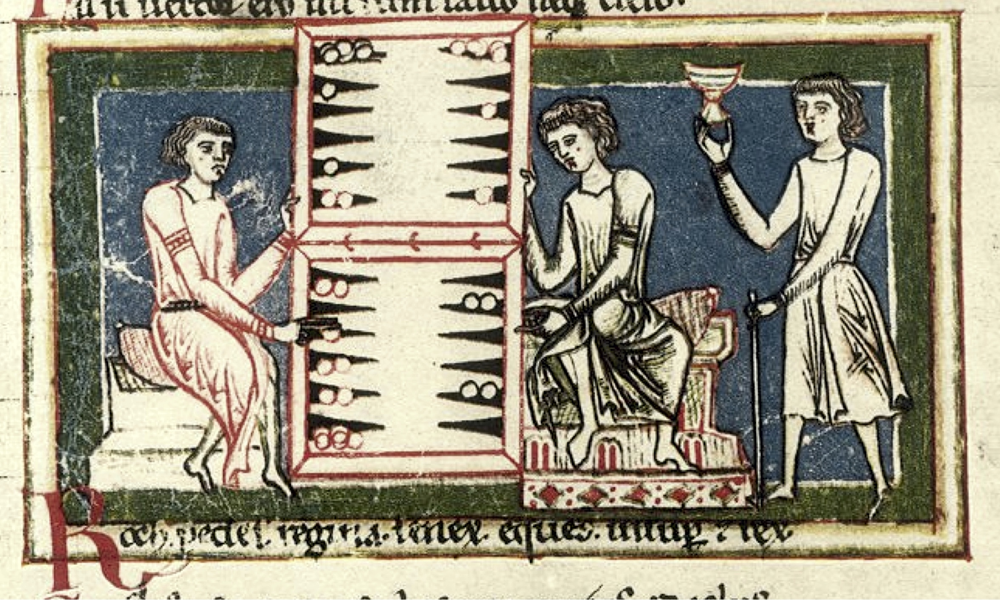

  Žaidžiamas stalo žaidimas Tabula

Viduramžiais išpopuliarėjo žaidimai kauliukais, kurie dažniausiai
buvo gaminami iš elnio ragų, taip pat kortomis. Buvo populiarūs ir
kiti stalo žaidimai. Jų figūrėlės dažnai būdavo pusrutulio
formos, gaminamos iš gintaro, kaulo, stiklo ar net arklio dantų. Vis
didesnį populiarumą ėmė įgauti šachmatai. Stalo žaidimai buvo
žaidžiami ne tik Azijoje, bet ir Europoje, Skandinavijoje. 1732
metais, keliaudamas po Laplandiją, žymus švedų botanikas Karlas
Linėjus (*Carolus Linnaeus*) aprašė žaidimą *Tabula*. Lapiai jį
žaidė :math:`9 \times 9` dydžio lentoje, o žaidimo figūrėles
vadino „Švedais“ ir „Rusais“.

Stalo žaidimai labai išpopuliarėjo XX a. viduryje, ypač po II
pasaulinio karo. O XX a. viduryje susidomėta ir strateginių žaidimų
programavimu. Dar 1950 metais Klodas Elvudas Šenonas (*Claude Elwood
Shannon*) paskelbė novatorišką darbą *Kompiuterio programavimas
žaisti šachmatais* (angl. *Programming a Computer for Playing Chess*),
kuriame aprašė, kaip skaičiavimo mašinai (ar kompiuteriui) galėtų
būti parašyta programa, protingai žaidžianti šachmatais. Šenonas
atkreipė dėmesį, kad teoriškai egzistuoja idealus sprendinys (t. y.
ėjimų seka, kurią atlikdamas žaidėjas pasieks geriausią
rezultatą), tačiau praktiškai jo rasti neįmanoma. Jis pateikė dvi
euristika paremtas strategijas, kuriomis programuojant strateginius
stalo žaidimus remiamasi iki šiol:

1.  Generuoti visus įmanomus ėjimus iki tam tikro gylio (t. y.
    generuoti visus galimus pirmuosius ėjimus, visus galimus antruosius
    ėjimus ir t. t.), tuomet euristiškai įvertinti kiekvieną gautą
    situaciją lentoje, sudaryti žaidimo medį ir išrinkti geriausią
    ėjimą;

2.  Generuoti tik perspektyvius ėjimus (žaidimo medžio šakas)
    ignoruojant ėjimus, kurie laikomi neperspektyviais.  

Pirmoji šachmatais žaidžianti programa buvo parašyta ir įdiegta
1956 m. Taisyklės buvo supaprastintos, žaidžiama
:math:`6 \times 6` lentoje. Kompiuteris buvo tik 11 kHz dažnio ir
turėjo 600 žodžių atminties. Buvo realizuota A tipo Šenono
aprašyta strategija, generuojami 4 lygių ėjimai. Tam prireikdavo net
12 minučių. Ši programa įveikdavo tik silpnus žaidėjus.

Po dvejų metų pirmą kartą buvo panaudotas Alfa-Beta atkirtimas,
kuri leido padvigubinti analizuojamų ėjimų skaičių. Žaidimo
programos buvo nuolat tobulinamos, pradėti rengti šachmatų programų
turnyrai. Septintojo dešimtmečio viduryje (1975 m.) pradėta kurti
*Cray Blitz* programa, kuri ilgą laiką buvo greičiausia šachmatais
žaidžianti programa ir net septynerius metus buvo kompiuterių
programų šachmatų čempionė.

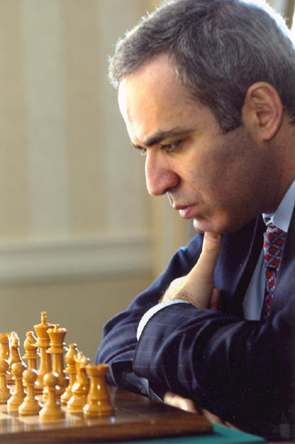

  Garis Kasparovas žaidžia prieš Deep Junior programą, 2003 m.

1988 metais pirmą kartą kompiuterinė sistema *Deep Thought*, skirta
žaisti šachmatais, nugalėjo didmeistrį Bentą Larseną (*Bent
Larsen*). Programa, kurią kūrė studentai, jau sugebėdavo
išanalizuoti iki 750 000 pozicijų per sekundę ir iki dešimties
ėjimų į priekį. Ši sistema pralošė šachmatų čempionui Bobiui
Fišeriui (*Bobby Fischer*). Vis dėlto, kuo toliau, tuo sunkiau
didmeistriams sekėsi įveikti šachmatais žaidžiančias programas.
Pirmoji kompiuterinė sistema, kuriai 1996 metais pralaimėjo partiją
tuometinis pasaulio čempionas Garis Kasparovas, buvo *Deep Blue*.
Tačiau tuomet turnyrą pasaulio čempionui vis tik pavyko laimėti.
*Deep blue* buvo labai atnaujinta, neoficialiai netgi pervadinta į
*Deeper blue*, ir 1997 metais Kasparovas jau pralaimėjo rezultatu
2,5:3,5. Tai buvo pirmas kartas, kai kompiuterinei sistemai pavyko
įveikti pasaulio šachmatų čempioną matuojant žaidimo laiką
įprastu būdu. 2003-iaisiais Gariui Kasparovui nepavyko įveikti ir
*Deep Junior* programos – turnyras baigėsi lygiosiomis.

Šachmatai – tai tik vienas žaidimų, kuriam žaisti kuriamos kompiuterinės
programos. Kasmet vyksta olimpiados [#f51]_, turnyrai, kuriuose
tarpusavyje žaidžia programos ir kuriuose gali dalyvauti visi norintys.

Žaidimų medžiai, *MiniMax* paieška
==================================

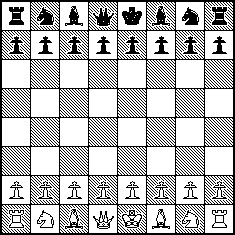

  Pradinė šachmatų žaidimo pozicija

Analizuodami strateginius stalo žaidimus sutarsime, kad abu varžovai
**žaidžia optimaliai**, t. y. kiekvieną kartą renkasi patį
palankiausią sau ėjimą.

Bet kuris stalo žaidimas prasideda nuo **pradinės pozicijos**.
Sutarsime, kad to paties žaidimo pradinė pozicija yra visada ta pati.
Pavyzdžiui, žaidžiant šachmatais, pradinę poziciją sudaro juodos
ir baltos figūros, išdėstytos tam tikra tvarka :math:`8 \times 8`
lentoje, žaidžiant Go arba kryžiukais ir nuliukais, pradinę
poziciją sudaro tuščia lenta.

Iš pradinės pozicijos pirmasis žaidėjas gali atlikti tam tikrus
ėjimus. Visas šiais ėjimais gautas pozicijas vadinsime **pirmojo
lygio pozicijomis**. Pozicijas, gautas atlikus vieną ėjimą iš
pirmojo lygio pozicijų – **antrojo lygio** ir t. t.

Pavyzdžiui, žaidžiant kryžiukais ir nuliukais, pirmasis žaidėjas
(jis būtinai žaidžia kryžiukais) gali atlikti 9 skirtingus
pirmuosius ėjimus: padėti kryžiuką į bet kurį iš 9 langelių.
Antrasis žaidėjas kiekvienu atveju gali pasirinkti vieną iš
aštuonių ėjimų. Toliau pirmasis žaidėjas kiekvienu atveju gali
atlikti septynis skirtingus ėjimus. Taip bus gaunamos trečiojo lygio
pozicijos.

Analogiškai galima toliau generuoti ėjimus kol bus pasiektos
**baigiamosios žaidimo pozicijos**, t. y. pozicijos, kai vienas
žaidėjų laimi arba pasiekiamos lygiosios. Kryžiukų ir nuliukų
atveju daugiausia gali būti 9 lygiai.

Iš žaidimo pozicijų sudaromas **žaidimo medis**, kurio viršūnės
atitinka žaidimo pozicijas. Medžio šaknis atitiks pradinę žaidimo
poziciją, jos antrinės viršūnės – visas pozicijas, kurias galima
pasiekti vienu ėjimu iš startinės pozicijos (pirmojo lygio pozicijas)
ir t. t.

Gali būti, kad tą pačią poziciją galima gauti atlikus kelias
skirtingas ėjimų sekas. Tačiau konstruojant žaidimo medį į tai
neatsižvelgiama: jei ta pati žaidimo pozicija buvo gauta dvejomis
skirtingomis ėjimų sekomis, tai ji žymima dviem medžio
viršūnėmis.

Visų pirmojo lygio pozicijų atstumas iki medžio šaknies bus lygus 1,
antrojo lygio pozicijų – 2, o :math:`k`-ojo lygio pozicijų –
:math:`k`.

Žaidimo pozicija vadinama **laiminčia pozicija žaidėjui X**, jei
žaidėjas X galės taip parinkti tolimesnius savo ėjimus, kad jis
laimės nepriklausomai nuo to, kaip žais jo varžovas arba jeigu tai
yra baigiamoji žaidimo pozicija, kurioje laimi žaidėjas X.
Atkreipsime dėmesį, kad žaidėjo X laiminčioje pozicijoje ėjimo
teisė gali priklausyti bet kuriam iš dviejų žaidėjų.

Žaidimo pozicija vadinama **pralaiminčia pozicija žaidėjui X**, jei
nesvarbu, kaip žaidėjas X žaistų, varžovas gali parinkti tokius
tolimesnius savo ėjimus, kad jis (varžovas) būtinai laimės, arba jei
tai yra baigiamoji žaidimo pozicija, kurioje žaidėjas X pralaimi.
Žaidėjo X pralaiminčioje pozicijoje ėjimo teisė taip pat gali
priklausyti bet kuriam iš dviejų žaidėjų.

Be abejo, kiekvienas žaidėjas stengiasi atlikti tokius ėjimus, kurie
nuvestų į laiminčias žaidimo pozicijas.

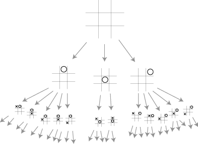

  Kryžiukų ir nuliukų žaidimo medžio pavyzdys; paveiksle
  parodyti tik du medžio lygiai; pateiktas nepilnas medis (atmestos
  simetriškos pozicijos)

Paanalizuokime konkretų uždavinį:

  Lošimas disku [#f52]_: du žaidėjai paeiliui sukioja diską per
  vieną segmentą į kairę arba į dešinę. Žaidėjas, pasukęs
  diską, perskaito jo viršutiniame segmente atsiradusį skaičių
  :math:`n` ir jį prideda prie sumos :math:`s` (bendros abiems
  žaidėjams). Lošimo pradžioje :math:`s = 0`, o diskas atsisukęs
  ties skaičiumi 1. Lošimas baigiamas, kai :math:`s` pasiekia arba
  viršija iš anksto sutartą skaičių :math:`m` (pavyzdžiui,
  :math:`m = 13`). Laimi tas, kas atlieka paskutinį ėjimą, t. y.
  pasiekia arba viršija :math:`m`.

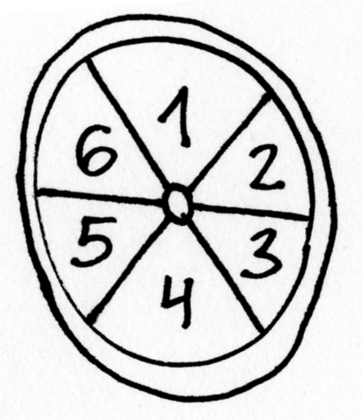

  Disko pozicija pradiniu momentu

Analizuosime žaidimą Lošimas disku, kai, pavyzdžiui, :math:`m = 13`.

:numref:`img-13-medis`
paveiksle pateiktas pilnas žaidimo medis. Medis turi 9 lygius –
tai reiškia, kad galimi ne daugiau kaip 9 ėjimai. Bet kurią žaidimo
poziciją nusako pora :math:`(s, d)`, kur :math:`s` – bendra abiems
žaidėjams suma, o :math:`d` – skaičius, užrašytas ant į viršų
atsisukusio disko segmento. Visas medžio pozicijas bandysime skirstyti
į laiminčias ir pralaiminčias pirmajam žaidėjui (laiminti pirmojo
žaidėjo pozicija tuo pačiu yra pralaiminti antrojo žaidėjo pozicija
ir atvirkščiai).

.. _img-13-medis:

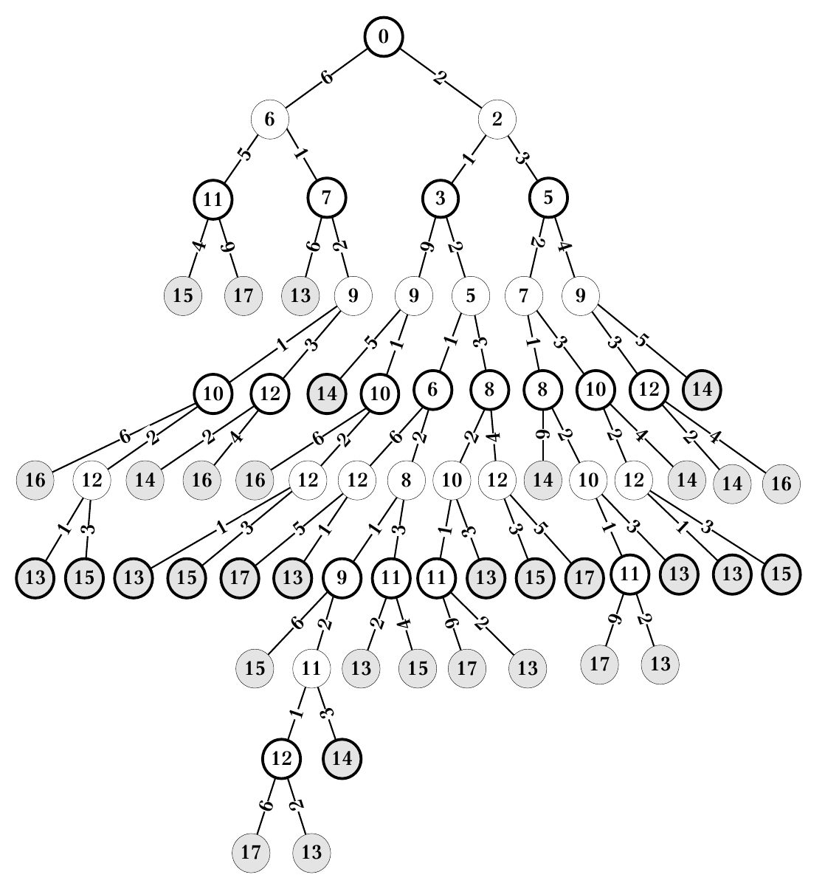

  Pilnas Lošimo disku medis, kai :math:`m = 13`; medžio lapai
  (t. y. baigiamosios žaidimo pozicijos pavaizduotos pilka spalva,
  lyginių lygių pozicijos (iš kurių ėjimus atlieka pirmasis
  žaidėjas), apvestos storesne linija; apskritimo viduje įrašyta s
  reikšmė, o ant ėjimus žyminčių briaunų – žaidėjo ėjimai,
  t. y. atsukamos disko pozicijos.

Pradėkime nuo 9-ojo lygio. Abi pozicijos yra baigiamosios ir
laiminčios tam žaidėjui, kuris atliko ėjimą, t. y. pirmajam.
Lipkime aukštyn į 8-ąjį lygį, kuriame galimos dvi pozicijos. Iš
pirmosios pozicijos (:math:`s = 12`; :math:`d = 1`) pirmasis
žaidėjas gali atlikti tik laiminčius ėjimus, taigi ši pozicija yra
laiminti pirmajam žaidėjui.

Tuo tarpu antroji pozicija (:math:`s = 14`; :math:`d = 3`) yra
baigiamoji žaidimo pozicija ir gaunama ėjimą atlikus antrajam
žaidėjui, taigi ji yra pralaiminti pirmojo žaidėjo pozicija.

7-ajame lygyje yra net 8 žaidimo pozicijos ir tik viena jų
(:math:`s = 11`; :math:`d = 2`) nėra baigiamoji. Visos baigiamosios
pozicijos yra laiminčios pirmajam žaidėjui, nes jos gaunamos pirmajam
žaidėjui atlikus ėjimą. O kaip gi su pozicija (:math:`s = 11`;
:math:`d = 2`)?

Iš šios pozicijos toliau ėjimą atliktų antrasis žaidėjas.
Pasukęs diską, jis gali arba atsukti vienetą ir pakliūti į
laiminčią pirmojo žaidėjo poziciją, arba atsukti trejetą ir
laimėti pats. Žinoma, žaisdamas optimaliai, jis atsuks trejetą.
Taigi ši pozicija yra pralaiminti pirmojo žaidėjo pozicija
(:numref:`img-13-medis2` pav.)

.. _img-13-medis2:

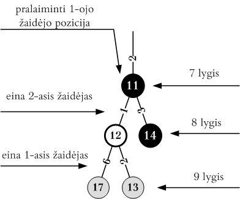

  Žaidimo medžio fragmentas, pralaiminčios pirmojo žaidėjo
  pozicijos pažymėtos juodai

Šis pavyzdys ir paaiškina optimalios žaidimo strategijos esmę: jei
tarp pozicijų, į kurias žaidėjas (nesvarbu kuris) gali pakliūti
atlikęs ėjimą, yra **nors viena laiminti** to žaidėjo atžvilgiu,
tai tas žaidėjas būtinai ją ir rinksis
(:numref:`img-13-medis3` pav.).

.. _img-13-medis3:

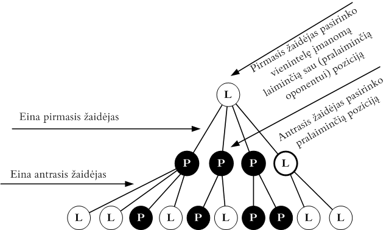

  Medžio pozicijos analizuojamos iš apačios į viršų;
  pirmojo žaidėjo laiminčios pozicijos žymimos *L* raide,
  pralaiminčios – *P* raide; jeigu eina pirmasis žaidėjas ir galima
  nors viena laiminti poziciją, jis ją ir renkasi; jeigu eina antrasis
  žaidėjas ir galima nors viena pralaiminti pirmojo žaidėjo
  pozicija, tai ji ir pasirenkama

Likusios pozicijos lipant medžiu aukštyn analogiškai suskirstomos į
laiminčias ir pralaiminčias pirmojo žaidėjo pozicijas
(žr. :numref:`img-13-medis4` pav.).

.. _img-13-medis4:

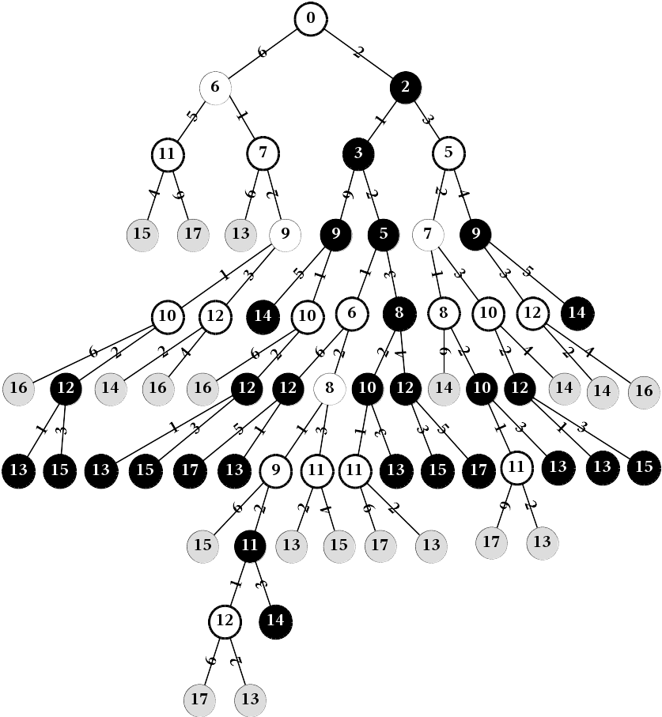

  Tas pats žaidimo medis kaip ir :numref:`img-13-medis` pav., tik
  visos pozicijos
  suskirstytos į laiminčias ir pralaiminčias pirmajam žaidėjui;
  pralaiminčios pirmojo žaidėjo pozicijos pažymėtos juodai; matome,
  kad jei abu žaidėjai žaidžia optimaliai, pirmasis žaidėjas
  būtinai laimės

Užkopę iki pirmojo lygio matome, kad abiems žaidėjams žaidžiant
optimaliai, laimės pirmasis.

Išanalizavę žaidimo medį (t.y. kiekvienai pozicijai priskyrę
atributą, ar ji laiminti, ar pralaiminti) iš kiekvienos pozicijos
galime pasirinkti palankiausią ėjimą. Deja, realybėje pilno žaidimo
medžio dažniausiai suformuoti nepavyksta, tad apsiribojama tam tikru
gyliu, iki kurio bus išskleidžiamas medis.

Pasiekus tą gylį, žaidimo pozicijos (pavadinkime jas ribinėmis),
nors ir nėra baigiamosios, įvertinamos euristiškai. Pozicijos
vertinamos skaičiais pasirinktame intervale *[min_vertė, max_vertė]*.
Sutariama, kad pasirinkto žaidėjo (nevarbu kurio) laiminti pozicija
bus vertinama maksimaliu intervalo skaičiumi *max_vertė*, o
pralaiminti – minimaliu intervalo skaičiumi *min_vertė*. Šis
žaidėjas dar vadinamas *maksimizuojančiu* žaidėju, o jo
priešininkas – *minimizuojančiu* žaidėju.

Tad kuo geresnė yra pozicija maksimizuojančiam žaidėjui, tuo
aukštesnį įvertinimą ji turėtų gauti. Ir atvirkščiai – kuo
mažesnis pozicijos įvertinimas, tuo pozicija palankesnė
minimizuojančiam žaidėjui. *Ėjimo įverčiu* vadinsime pozicijos, į
kurią pakliūnama tuo ėjimu, įvertis.

Kol kas daugiau nesigilinsime į tai, kaip gaunami euristiniai pozicijų
įverčiai [#f53]_, tiesiog laikysime, kad pasiekę ribinę poziciją
galime gauti jos įvertį.

O kaip gi randamas bet kurios (nebūtinai ribinės ar baigiamosios)
žaidimo pozicijos įvertis? Tai atlieka **MiniMax** algoritmas:
rekursiškai iš viršaus į apačią formuojamas žaidimo medis ir
vertinamos pozicijos. Jei pozicija :math:`P` yra baigiamoji arba
ribinė, tai pozicija :math:`P` įvertinama tiksliai (pirmuoju atveju)
arba euristiškai (antruoju atveju). Jei pozicija :math:`P` nėra
baigtinė, ir dar galima rekursiškai vertinti gilesnes pozicijas, tai
išbandomi visi galimi ėjimai ir išrenkamas bei grąžinamas geriausio
ėjimo įvertis.

Jei iš pozicijos :math:`P` atliekant visus įmanomus ėjimus galima
pakliūti į pozicijas :math:`P_1, P_2, \dots, P_k`, o šių pozicijų
įverčiai jau yra žinomi:
:math:`v_{P_1}, v_{P_2}, v_{P_3}, \dots, v_{P_k}`, tuomet pozicijos
:math:`P` įvertis yra toks:

.. math::
  V_P = \left\{
    \begin{array}{ll}
      \max \{v_{P_1}, v_{P_2}, \dots, v_{P_k} \} &
        \text{ jei eis maksimizuojantis žaidėjas} \\
      \min \{v_{P_1}, v_{P_2}, \dots, v_{P_k} \} &
        \text{ jei eis minimizuojantis žaidėjas}
    \end{array}
  \right.

Kadangi šį algoritmą galima taikyti įvairiausiems žaidimas, tai
neprisirišime prie konkretaus žaidimo ir algoritmą pateiksime
**pseudokodu** [#f54]_::

  MiniMax(gylis, pozicija, žaidėjas)
  // „gylis“ nurodo iki kokio lygio skleisime žaidimo medį
  // „pozicija“ parodo nuo kokios pozicijos analizuosime žaidimą

      jei žaidėjas yra maksimizuojantis
          tai grąžink Max(gylis, pozicija)
          kitu atveju grąžink Min(gylis, pozicija)

  Max(gylis, pozicija)
      jei žaidimas baigtas arba (gylis = 0)
          tai grąžink įvertinimas(pozicija, mini\_zaid)
          // įvertinama pozicija, kai paskutinį ėjimą atliko
          // minimizuojantis žaidėjas
      kitu atveju
          geriausias := MIN_VERTĖ
          kiekvienam galimam ėjimui e
              atlik ėjimą(e, pozicija)
              įvertis := Min(gylis - 1, pozicija)
              jei įvertis > geriausias tai
                  geriausias = įvertis
              atšauk ėjimą(e, pozicija)
          grąžink geriausias

  Min(gylis, pozicija)
      // ** pažymėtos tos procedūros Min eilutės, kurios skiriasi
      // nuo procedūros Max.
      jei žaidimas baigtas arba (gylis = 0)
          tai grąžink įvertinimas(pozicija, max_zaid) //**
          // įvertinama pozicija, kai paskutinį ėjimą atliko
          // maksimizuojantis žaidėjas
      kitu atveju
          geriausias := MAX_VERTĖ                   //**
          kiekvienam galimam ėjimui e
              atlik ėjimą(e, pozicija)
              įvertis := Max(gylis - 1, pozicija)   //**
              jei įvertis < geriausias tai          //**
                  geriausias = įvertis
              atšauk ėjimą(e, pozicija)
          grąžink geriausias

Realiose situacijose žaidimo pozicija dažnai nusakoma sudėtinga
duomenų struktūra ir ji neperduodama per parametrus, bet pasiekiama
kaip globalusis kintamasis.

Pritaikysime šį algoritmą *Lošimui su disku*. Kol kas detaliau
nesiaiškinome, kaip euristiškai vertinti pozicijas, tačiau, kaip
matėme, kai :math:`m = 13`, žaidimo medį galima išskleisti pilnai.
Tad realizuodami algoritmą taip pat laikysime, kad žaidimo medį
galima pilnai išskleisti. Žaidžiant šį žaidimą galimi tik du
skirtingi pozicijų įverčiai – laiminti ir pralaiminti (lygiųjų
būti negali), tad pozicijas vertinsime ne skaičiais, o loginėmis
reikšmėmis: „minimali“ pozicijos vertė bus ``false``,
„maksimali“ – ``true``.

.. tabs::

  .. tab:: Paskalis

    .. code-block:: unicode_pascal

      const M = 13; { šį skaičių pasiekęs ar viršijęs, žaidėjas laimi }
      type Tpozicija = record
              s, d : integer;
              { s ir d nusako konkrečią žaidimo poziciją }
          end;
      procedure atlik_ėjimą(sukti_pirmyn : boolean;
                           var p : Tpozicija);
      begin
         if sukti_pirmyn then
             p.d := (p.d + 4) mod 6 + 1
         else
             p.d := p.d mod 6 + 1;
         p.s := p.s + p.d;
      end;
      procedure atšauk_ėjimą(sukti_pirmyn : boolean;
                            var p : Tpozicija);
      begin
         p.s := p.s - p.d;
         if sukti_pirmyn then
             p.d := p.d  mod 6 + 1
         else
             p.d := (p.d + 4) mod 6 + 1;
      end;
      function Min(pozicija : TPozicija) : boolean; forward;
      function Max(pozicija : TPozicija) : boolean;
      { randa pozicijos įvertį (ar tai laiminti pirmojo žaidėjo pozicija),
       jei ėjimą iš jos atlieka pirmasis (maksimizuojantis) žaidėjas }
      var sukti_pirmyn, įvertis : boolean;
      begin
         if pozicija.s >= M then { jei žaidimas baigtas }
             Max := false
             { nes paskutinį ėjimą atliko antrasis žaidėjas }
         else begin
             Max := false;
             for sukti_pirmyn := false to true do begin
                  atlik_ėjimą(sukti_pirmyn, pozicija);
                  įvertis := Min(pozicija);
                  if (Max = false) and (įvertis = true)
                  then { jei Max < įvertis }
                      Max := įvertis;
                  atšauk_ėjimą(sukti_pirmyn, pozicija);
             end;
         end;
      end;

      function Min(pozicija : TPozicija) : boolean;
      { randa pozicijos įvertį (ar tai laiminti pirmojo žaidėjo pozicija),
       jei ėjimą iš jos atlieka antrasis (minimizuojantis) žaidėjas }
      var sukti_pirmyn, įvertis : boolean;
      begin
         if pozicija.s >= M then { jei žaidimas baigtas }
             Min := true
             { nes paskutinį ėjimą atliko pirmasis žaidėjas }
         else begin
             Min := true;
             for sukti_pirmyn := false to true do begin
                 atlik_ėjimą(sukti_pirmyn, pozicija);
                 įvertis := Max(pozicija);
                 if (Min = true) and (įvertis = false)
                 then { jei Min > įvertis }
                     Min := įvertis;
                 atšauk_ėjimą(sukti_pirmyn, pozicija);
              end;
         end;
      end;

      function MiniMax(žaidėjas : integer;
                      pozicija : Tpozicija) : boolean;
      { randa pozicijos įvertį („true“, jei tai laiminti pirmojo žaidėjo pozicija
       ir „false“ priešingu atveju }
      begin
         if žaidėjas = 1 then
             { jei ėjimą atliks pirmasis (maksimizuojantis) žaidėjas }
             MiniMax := Max(pozicija)
         else
             MiniMax := Min(pozicija);
      end;

  .. tab:: C++

    .. code-block:: cpp

      const int M = 13; // šį skaičių pasiekęs ar viršijęs, žaidėjas laimi

      struct tPozicija {
          int s, d; // s ir d nusako konkrečią žaidimo poziciją
      };

      void atlikEjima (bool suktiPirmyn, tPozicija &p) {
          if (suktiPirmyn)
              p.d = (p.d + 4) % 6 + 1;
          else
              p.d = p.d % 6  + 1;
          p.s += p.d;
      }

      void atsaukEjima (bool suktiPirmyn, tPozicija &p) {
          p.s -= p.d;
          if (suktiPirmyn)
              p.d = p.d % 6 + 1;
          else
              p.d = (p.d + 4) % 6 + 1;
      }

      bool minIvertis (tPozicija pozicija);

      bool maxIvertis (tPozicija pozicija) {
          /*
              randa pozicijos įvertį (ar tai laiminti pirmojo žaidėjo pozicija),
              jei ėjimą iš jos atlieka pirmasis (maksimizuojantis) žaidėjas
          */

          if (pozicija.s >= M) // jei žaidimas baigtas
              return false; // nes paskutinį ėjimą atliko antrasis žaidėjas
          else {
              bool grazinamasIvertis = false;
              bool kryptys[] = {false, true};
              for(bool suktiPirmyn : kryptys) { {
                  atlikEjima(suktiPirmyn, pozicija);
                  bool ivertis = minIvertis(pozicija);
                  if (!grazinamasIvertis && ivertis) // jei grazinamasIvertis < ivertis
                      grazinamasIvertis = ivertis;
                  atsaukEjima(suktiPirmyn, pozicija);
              }
          }
      }

      bool minIvertis (tPozicija pozicija) {
          /*
              randa pozicijos įvertį (ar tai laiminti pirmojo žaidėjo pozicija),
              jei ėjimą iš jos atlieka antrasis (minimizuojantis) žaidėjas
          */

          if (pozicija.s >= M) // jei žaidimas baigtas
              return true; // nes paskutinį ėjimą atliko pirmasis žaidėjas
          else {
              bool grazinamasIvertis = true;
              bool kryptys[] = {false, true};
              for(bool suktiPirmyn : kryptys) { {
                  atlikEjima(suktiPirmyn, pozicija);
                  bool ivertis = maxIvertis(pozicija);
                  if (grazinamasIvertis && !ivertis) // jei grazinamasIvertis > ivertis
                      grazinamasIvertis = ivertis;
                  atsaukEjima(suktiPirmyn, pozicija);
              }
          }
      }

      bool miniMax (int zaidejas, tPozicija pozicija) {
          /*
              randa pozicijos įvertį ("true", jei tai laiminti
              pirmojo žaidėjo pozicija ir "false" priešingu atveju
          */

          if (zaidejas == 1) // jei ėjimą atliks pirmasis (maksimizuojantis) žaidėjas
              return maxIvertis(pozicija);
          else
              return minIvertis(pozicija);
      }

.. _skyrelis-euristinis-pozicijų-vertinimas:

Euristinis pozicijų vertinimas bei iteratyvus paieškos gilinimas 
=================================================================

Kaip jau minėta, dažnai pilno žaidimo medžio suformuoti nepavyksta
ir pasiekus ribinį gylį žaidimo pozicijas tenka vertinti
euristiškai. Jeigu medį galima išskleisti pilnai, užtenka trijų
tipų pozicijų: laiminčių, pralaiminčių ir lygiųjų. Tuo tarpu
euristinis pozicijos vertinimas yra kur kas sudėtingesnis. Tai
atliekant reikia panaudoti kuo daugiau žinių apie konkretų žaidimą.

Euristinis pozicijos įvertis gaunamas žaidimo poziciją įvertinant
skaičiumi. Maksimizuojantis ir minimizuojantis žaidėjai turi vertinti
žaidimą analogiškai. Pavyzdžiui, vienas žaidėjas mano, kad yra
geroje pozicijoje, tai jo oponentas turi manyti, kad jis (t. y.
oponentas) yra prastoje pozicijoje.

Euristiškai vertinant pozicijas dažniausiai sudaroma tokio tipo
įvertinimo funkcija:

  *Įvertis(pozicija)* =
  :math:`K_1\breve{Z}_1 + \dots + K_n\breve{Z}_n`

kur :math:`\breve{Z}_i` yra skaičiais išreikštos tam tikros žinios
apie žaidimą, įvertinančios poziciją kažkokiu konkrečiu aspektu,
o :math:`K_i` – koeficientai, suteikiantys žinioms skirtingą svorį.

Euristinės įvertinimo funkcijos dažniausiai turi dėmenis, kuriuose
kaupiamos tokio tipo žinios apie žaidimą:

-  **materialūs įverčiai**; pavyzdžiui, šachmatų ar šaškių
   figūrų skaičius lentoje arba savo ir priešininko figūrų kiekių
   skirtumas (šachmatuose kiekvienos rūšies figūrai dažnai
   suteikiamas svoris); 

-  **erdvė**; kai kuriuose žaidimuose yra labai svarbu, kiek erdvės
   kontroliuoja vienas ar kitas žaidėjas, taigi žaidėjo
   kontroliuojamą erdvę galima išreikšti skaičiumi ir įtraukti į
   įvertinimo funkciją; 

-  **mobilumas**; kiek ėjimų galima atlikti iš esamos pozicijos;
   t. y. tikėtina, kad jei turite daugiau galimybių paeiti, didesnė
   tikimybė, kad bent vienas šių ėjimų nuves į gerą poziciją;
   šis įvertis nepasitvirtino kuriant šachmatų žaidimo algoritmus,
   tačiau pasirodė labai naudingas žaidžiant, pavyzdžiui, *Otelo*;

-  **tempas**; kai kuriuose žaidimuose yra svarbu tai, kuris žaidėjas
   turi iniciatyvą, o kuris tik atsako į priešininko ėjimus
   (pavyzdžiui, galbūt jūsų figūra yra puolama ir jai teks
   trauktis); 

-  **grėsmės**; kiek jūsų figūrų yra puolama, gal gali atsitikti
   dar kažkas negero, pavyzdžiui, pėstininkas taps valdove arba
   oponentas užims dalį jūsų teritorijos; 

-  **forma**; kai kuriuose žaidimuose yra gan svarbu, kaip išsidėstę
   figūros; pavyzdžiui, šachmatuose gretimuose stulpeliuose vienas
   paskui kitą stovintys pėstininkai laikomi stipresne kombinacija,
   nei tame pačiame stulpelyje esantys pėstininkai; 

-  **išskirtinės situacijos**; beveik kiekviename žaidime pasitaiko
   išskirtinių situacijų, kuriose žmogus žino, kaip geriausia
   sužaisti; kartais verta paaukoti figūrą ir taip laimėti dar
   daugiau; tam tikros išskirtinės situacijos taip gali būti
   įtrauktos į euristinį vertinimą. 

Deja, kuo daugiau žinių apie žaidimą įtraukiame į programą, tuo
lėčiau programa veikia. Greitą ir prastai žaidžiančią programą
galima pagerinti į algoritmą įtraukiant daugiau žinių apie
žaidimą. Tačiau šios papildomos žinios gali padaryti programą
lėtesne (per leistiną laiką spėjančią išanalizuoti mažiau
žaidimo lygių) ir tada ji gali žaisti netgi prasčiau nei prieš
tobulinimą. Taigi reikia išlaikyti tinkamą balansą tarp efektyvumo
ir žinių.

O kaip gi apskaičiuoti ribinį gylį, kurį pasiekus reiktų daugiau
nebesiplėsti ir pradėti vertinti pozicijas euristiškai? Programuojant
žaidimų algoritmus taikoma gan paprasta strategija: *MiniMax*
algoritmas įvykdomas analizuojant pozicijas iki pirmojo gylio, po to
(jeigu dar užtenka laiko) – *MiniMax* algoritmas vykdomas iš naujo,
tik pozicijos analizuojamos iki antrojo gylio, tuomet – jei dar
užtenka laiko – iki trečiojo gylio ir taip toliau, kol išnaudojami
laiko ar atminties limitai. Tai ir yra iteratyvus paieškos gilinimas.
Toliau pateiktas algoritmas atlieka iteratyvų paieškos gilinimą
maksimizuojančiam žaidėjui.

:: 

  Rask_ėjimą(pozicija, žaidėjas)
      gylis = 0
      kol neužtrukta daug laiko
          gylis = gylis + 1
          pozicija := PRADINĖ
          geriausias_įvertis := MIN_VERTĖ
          kiekvienam galimam žaidėjo ėjimui e
              atlik ėjimą(e, pozicija)
              įvertis :=
                  Minimax(gylis, pozicija, žaidėjas);
              jei įvertis > geriausias_įvertis
                  tai geriausias_įvertis := įvertis
                      geriausias_ėjimas := e
              atšauk ėjimą(e, pozicija)
      grąžink geriausias_ėjimas

Tai gali pasirodyti labai neefektyvu, mat vykdant kitą iteraciją
ankstesni skaičiavimai nepanaudojami. Iš tiesų tai nėra taip
neefektyvu kaip atrodo iš pirmo žvilgsnio, kadangi nagrinėjamų
pozicijų skaičius didinant gylį auga eksponentiškai. Taigi laikas,
reikalingas algoritmo vykdymui iki gylio :math:`n`, yra dažniausiai
daug didesnis už laiką, reikalingą paieškai iki gylio
:math:`n - 1`. Tarkime, kad kiekviename lygyje iš kiekvienos
pozicijos galima atlikti :math:`m` ėjimų.

Tuomet paieškai iki gylio :math:`n` užtrunkama

.. math::

  O(1 + m + m^2 + m^3 + \dots + m^n) =
    O\left(\frac{m^{n+1} - 1}{m - 1}\right) = O(m^n).

Jei paieška bus gilinama iteratyviai, tuomet bus užtrunkama

.. math::
  O(1 + (1 + m) + (1 + m + m^2) + \dots +
    (1 + m + m^2 + \dots + m^n)) =
    O\left(\frac{m^{n+2} - 1}{(m - 1)^2} - \frac{n - 1}{m - 1}\right) =
    O(m^n).

Alfa-Beta atkirtimas
====================

*Minimax* paieška nėra efektyvi, nes išnagrinėjami visi galimi
ėjimai, o jų kiekis, ieškant gilyn, auga eksponentiškai. Tačiau ar
būtina išanalizuoti visus galimus ėjimus ir rasti kiekvieno ėjimo
(tiksliau pozicijos, į kurią pakliūvama atlikus tą ėjimą)
įvertį? Panagrinėkime :numref:`img-13-medis5` paveiksle pateiktą
situaciją.

.. _img-13-medis5:

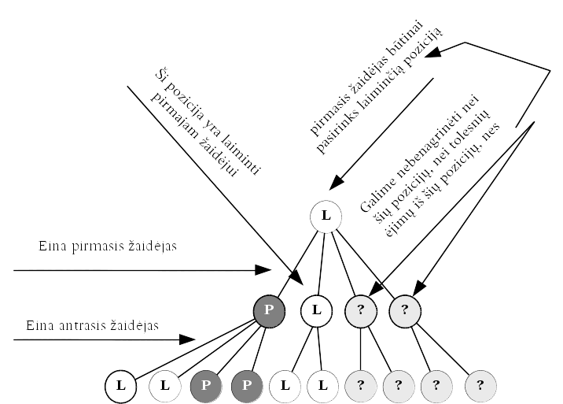

  Pavyzdys, kai nebūtina analizuoti visų žaidimo pozicijų;
  laiminti pirmojo žaidėjo pozicija pažymėta *L* raide, pralaiminti
  – *P* raide

Matome, kad dar neišanalizavus viso žaidimo medžio galima nustatyti,
kurį ėjimą pasirinks vienas ar kitas žaidėjas ir nebeanalizuoti
dalies ėjimų. Kitaip sakant galima *atkirsti* kai kurias žaidimo
medžio šakas. Atkirtimas gali būti taikomas ir tiems žaidimų
medžiams, kuriuos pavyksta pilnai išskleisti, ir tiems, kurių
pozicijos vertinamos euristiškai.

Atkirtimą realizuoja *Alfa-Beta* algoritmas, kuris grindžiamas tokia
idėja: jei jau rastas neblogas ėjimas :math:`e`, ir matosi, kad kitas
šiuo metu analizuojamas ėjimas nuves į blogesnę poziciją, nei
būtų galima pasiekti pasirinkus :math:`e`, tuomet pozicijos, (ir
tolesnių ėjimų iš jos) į kurią pakliūnama tuo kitu ėjimu, galima
nebenagrinėti.

Pastebėsime, kad *Alfa-Beta* algoritmas savo esme yra *Minimax*
algoritmas, papildytas dviem atkirtimo kriterijais. *Minimax* algoritmas
analizuoja visus galimus ėjimus iš konkrečios pozicijos ir parenka
ėjimą su palankiausiu įverčiu, o *Alfa-Beta* atkirtimo algoritmas
neanalizuoja ėjimų, jei mato, kad jų įverčiai bus prastesni už
palankiausią iki šiol rastą įvertį.

Sutarsime sakyti, kad žaidėjas *užsitikrino* vertę :math:`v`, jeigu
jis gali parinkti tokią ėjimų seką, kad nesvarbu kaip žaistų jo
priešininkas, žaidėjas pasieks poziciją, kurios vertė lygi
:math:`v` arba dar palankesnė, t. y. didesnė už :math:`v`, jei tai
maksimizuojantis žaidėjas arba mažesnė už :math:`v`, jei tai
minimizuojantis žaidėjas (:numref:`img-13-medis6` pav.).

.. _img-13-medis6:

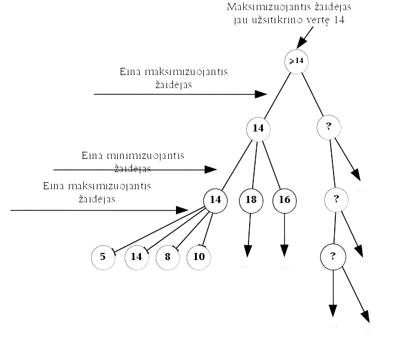

  Maksimizuojantis žaidėjas gali parinkti tokią ėjimų
  seką, kad nesvarbu kaip žaistų jo priešininkas, maksimizuojantis
  žaidėjas pasieks poziciją, kurios vertė lygi :math:`\geq 14`,
  t. y. jis užsitikrino vertę 14

*Alfa-Beta* algoritmas operuoja parametrais *alfa* ir *beta*. Parametre
*alfa* saugoma minimali vertė, kurią jau užsitikrino maksimizuojantis
žaidėjas konkrečiai pozicijai :math:`P`, o parametre *beta* –
maksimali vertė, kurią tai pačiai pozicijai užsitikrino
minimizuojantis žaidėjas. Pradiniu momentu *alfa* reikšmė lygi
``min_vertė``, o *beta* – ``max_vertė``.

Kadangi maksimizuojantis žaidėjas renkasi ėjimus su kuo didesniu
įverčiu, o minimizuojantis – su kuo mažesniu, tai maksimizuojantis
žaidėjas siekia, kad *alfa* reikšmė būtų kuo didesnė, o jo
oponentas – kad *beta* reikšmė būtų kuo mažesnė.

Sakykime, jau išnagrinėta dalis žaidimo medžio ir maksimizuojantis
žaidėjas užsitikrino *alfa* vertę. Tačiau tikintis dar geresnio
rezultato, nagrinėjama ir likusi medžio dalis.

Tarkime, kad bet kur toliau medyje minimizuojančiam žaidėjui atlikus
ėjimą iš pozicijos :math:`P` pakliūta į poziciją :math:`P'`, o
pastarosios vertė :math:`v_{P'}` yra mažesnė už *alfa*. Tuomet
akivaizdu, kad minimizuojantis žaidėjas iš pozicijos :math:`P`
rinkdamasis ėjimą su kuo mažesne verte pasieks, kad
:math:`v_P < alfa`. Taigi pozicija :math:`P` maksimizuojančiam
žaidėjui nebeįdomi ir likusių ėjimų iš :math:`P` galima
nebenagrinėti (:numref:`img-13-medis7` pav.).

.. _img-13-medis7:

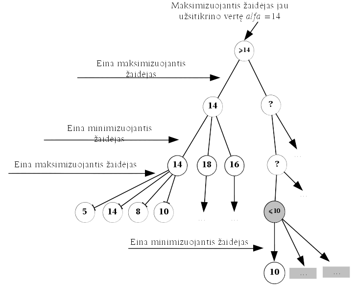

  Maksimizuojantis žaidėjas gali parinkti tokią ėjimų
  seką, kad nesvarbu kaip žaistų jo priešininkas, maksimizuojantis
  žaidėjas pasieks poziciją, kurios vertė lygi :math:`\geq 14`,
  t. y. jis užsitikrino vertę 14

Tarkime, kad bet kur toliau medyje maksimizuojančiam žaidėjui atlikus
ėjimą iš pozicijos :math:`P` pakliūta į poziciją :math:`P'`, o
pastarosios vertė :math:`v_{P'}` yra didesnė už beta, tuomet
akivaizdu, kad maksimizuojantis žaidėjas iš pozicijos :math:`P`
rinkdamasis ėjimą su kuo didesne verte pasieks, kad
:math:`v_P > beta`. Taigi pozicija :math:`P` minimizuojančiam
žaidėjui nebeįdomi ir likusių ėjimų iš :math:`P` galima
nebenagrinėti (:numref:`img-13-medis8` pav.).

.. _img-13-medis8:

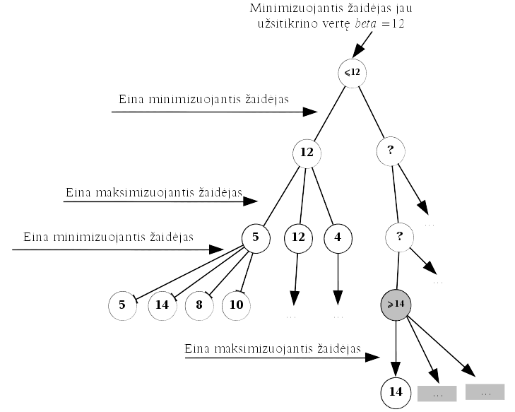

  Minimizuojantis žaidėjas gali parinkti tokią ėjimų
  seką, kad nesvarbu kaip žaistų jo priešininkas, minimizuojantis
  žaidėjas pasieks poziciją, kurios vertė lygi :math:`\leq 12`,
  t. y. jis užsitikrino vertę 12

::

  Alfa-Beta(gylis, pozicija, žaidėjas)
  { „gylis“ nurodo iki kokio lygio skleisime žaidimo medį
    „pozicija“ parodo nuo kokios pozicijos analizuosime žaidimą }
      jei žaidėjas yra maksimizuojantis
          tai grąžink
              Alfa-Beta-Max(gylis, pozicija, MAX\_VERTĖ)
              { perduodama MAX_VERTĖ, taigi šioje pozicijoje nebus
               vykdomas atkirtimas }
          kitu atveju grąžink
              Alfa-Beta-Min(gylis, pozicija, MIN\_VERTĖ)
              { perduodama MIN_VERTĖ, taigi šioje pozicijoje nebus
               vykdomas atkirtimas }
  Alfa-Beta-Max(gylis, pozicija, beta)
      jei žaidimas baigtas arba (gylis = 0)
          tai grąžink įvertinimas(pozicija, mini\_zaid)
      kitu atveju
          alfa = MIN_VERTĖ // alfa – lokalus kintamasis
          kiekvienam galimam ėjimui e
              atlik ėjimą(e, pozicija)
              įvertis := Alfa-Beta-Min(
                  gylis – 1, pozicija, alfa)
              atšauk ėjimą(e, pozicija)
              jei beta <= įvertis
                  tai grąžink alfa // atliekamas atkirtimas
              jei įvertis > alfa
                  tai alfa = įvertis
          grąžink alfa

  Alfa-Beta-Min(gylis, pozicija, alfa)
  { alfa ir beta yra lokalūs kintamieji }
      jei žaidimas baigtas arba (gylis = 0)
         tai grąžink įvertinimas(pozicija, max\_zaid)
      kitu atveju
          beta = MAX_VERTĖ // beta – lokalus kintamasis
          kiekvienam galimam ėjimui e
              atlik ėjimą(e, pozicija)
              įvertis := Alfa-Beta-Max(
                  gylis – 1, pozicija, beta)
              atšauk ėjimą(e, pozicija)
              jei įvertis <= alfa
                  tai grąžink beta // atliekamas atkirtimas
              jei įvertis < beta
                  tai beta = įvertis
          grąžink beta

*Alfa-Beta* atkirtimo efektyvumas labai priklauso nuo to, kokia tvarka
nagrinėjami ėjimai. Jeigu visą laiką pirmiau aptinkami blogiausi
ėjimai, tokiu atveju algoritmas veiks lygiai taip pat, kaip ir
*Minimax* algoritmas ir iš esmės atkirtimas niekada nebus atliktas.
Todėl tvarka, kuria peržiūrimi ėjimai labai svarbi atliekant
*Alfa-Beta* atkirtimą.

.. rubric:: Išnašos

.. [#f51]
  Žaidimų programų olimpiadas kasmet organizuoja ICGA (*International
  Computer Games Association*); Olandijos informatikos olimpiados kasmet
  organizuoja žaidimų programų turnyrą *CodeCup*.

.. [#f52]
  Panašus uždavinys buvo pateiktas Lietuvos informatikos olimpiadoje
  III etape 1998 metais.

.. [#f53]
  Apie euristinį pozicijų vertinimą detaliau kalbama skyrelyje
  :ref:`skyrelis-euristinis-pozicijų-vertinimas`.

.. [#f54]
  Pseudokodas yra algoritmo aprašymas, kai naudojami programavimo
  kalbų struktūriniai elementai, tačiau praleidžiami kalbai būdingi
  sintaksės elementai.
